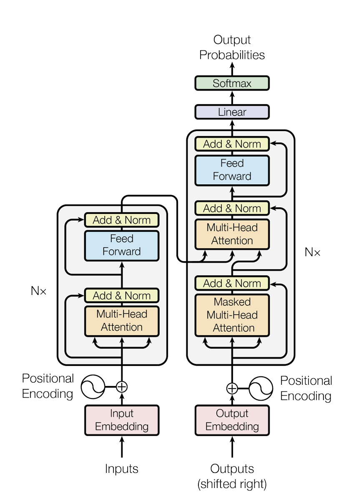

<div align="center">
    <h1>Generative AI Fundamentals for .NET</h1>
    <h2>Lesson 1: Getting Started with AI Development Tools</h2>
    <p><em>Learn the fundamentals of Generative AI and discover the .NET tooling ecosystem</em></p>
</div>

> 💡 **Quick Summary**: Refresh your generative AI knowledge, and understand how .NET can help you to develop and create new and better Generative AI applications.


---

**What you'll achieve:**
- 🌟 Understand fundamental concepts of Generative AI and their applications
- 🔍 Explore the .NET ecosystem for AI development including MEAI, Semantic Kernel, and Azure OpenAI
- 🛠️ Set up and use essential AI development tools in Visual Studio and VS Code
- 🚀 Build practical AI solutions using modern .NET frameworks

**Index**

1. [Introduction to Generative AI Concepts](#introduction-to-generative-ai-concepts)	
2. [AI Development Tools and Libraries](#ai-development-tools-and-libraries-for-net)
3. [Building Real-World AI Solutions](#building-real-world-ai-solutions)


---

## Intro Video

[](https://microsoft-my.sharepoint.com/:v:/p/brunocapuano/ERTkzBSAfKJEiLw2HLnzHnkBMEbpk17hniaVfr8lCm6how?e=gWOr33&nav=eyJyZWZlcnJhbEluZm8iOnsicmVmZXJyYWxBcHAiOiJTdHJlYW1XZWJBcHAiLCJyZWZlcnJhbFZpZXciOiJTaGFyZURpYWxvZy1MaW5rIiwicmVmZXJyYWxBcHBQbGF0Zm9ybSI6IldlYiIsInJlZmVycmFsTW9kZSI6InZpZXcifX0%3D)

## Welcome to Generative AI Fundamentals for .NET

Hello! Welcome to the Generative AI for .NET, We're thrilled to have you join us on this exciting journey into the world of Generative AI, for this course does not matter if you are learning from scratch or if you are a seasoned .NET developer, we are here to help you quickly develop amazing real apps.

In **Generative AI Fundamentals for .NET**, spanning six engaging chapters, we'll refresh fundamental concepts essential for AI development, discover tools like **MEAI** (Microsoft.Extensions.AI), **Semantic Kernel**, and **GitHub Models**, set up and use essential AI development tools, quickly and easily, in **Codespaces**, and build practical AI solutions using modern **.NET 9**. 
 
Get ready to dive in and unlock new possibilities with Generative AI!


## Introduction to Generative AI Concepts

### Understanding the Transformer Framework

Before everything, we need to cover some of the basic points for the Framework empowering all of this. The Transformer architecture, introduced in 2017, has transformed the field of natural language processing. Utilizing self-attention mechanisms, Transformers can process data using attention, allowing models to understand context more effectively.



This approach has paved the way for advanced language models like GPT, enhancing tasks such as translation, summarization, and text generation.

### A quick refresh on Generative AI

Generative AI focuses on creating models that can produce content, understand context in text better than previous techniques, and generate human-like responses. Some of the applications of generative AI include:

- **Text Generation**: Crafting human-like text for chatbots, content, and text completion.
- **Image Generation and Analysis**: Producing realistic images, enhancing photos, and detecting objects.
- **Code Generation**: Writing code snippets or scripts.

Generative AI models are trained on vast datasets, learning patterns and relationships to generate outputs. They can be fine-tuned for specific tasks, making them versatile and adaptable to various applications. Those models have multiple variations, input to text, to embeddings (embeddings are a way to represent text in a numerical format), to images and, even, to video.

However, as a developer, you need to understand that this is not magic, and it is important to understand the limitations and constraints of these models, in the end, these mathematical models are just that, mathematical models. As such, we need to understand how to use them effectively, and that is where prompt engineering comes in.

### Reviewing Prompt Engineering

Prompt engineering is the practice of designing effective inputs to guide AI models toward desired outputs. It involves:

- **Clarity**: Making instructions clear and unambiguous.
- **Context**: Providing necessary background information.
- **Constraints**: Specifying any limitations or formats.

Some best practices for prompt engineering include, prompt design, clear instructions, task breakdown, one shot and few shot learning, and prompt tuning. Plus, trying and testing different prompts to see what works best for your specific use case.

> ⚠️ **Note**: Learn more about prompt engineering in our [Generative AI for Beginners](https://github.com/microsoft/generative-ai-for-beginners/tree/main/04-prompt-engineering-fundamentals)

## AI Development Tools and Libraries for .NET

Generative AI development needs a set of tools and libraries to auxiliate the prototype and development of applications, and the .NET ecosystem offers a range of options for AI development.
Our development journey in .NET starts with understanding the tools and libraries available to us, AI Tooling is a key part of the AI development process, and it is important to understand the tools available to you to decrease the time to market of your AI applications.

### Microsoft.Extensions.AI (MEAI)

As AI development becomes more prevalent, Microsoft has introduced the Microsoft.Extensions.AI (MEAI) library to simplify the integration of AI models into .NET applications. MEAI provides a unified set of libraries for working with various AI services, enabling developers to leverage AI capabilities seamlessly.

These libraries helps interacting with AI services, such as small and large language models (SLMs and LLMs), embeddings, and middleware that can be used to orchestrate AI workflows. MEAI also provides tools for context management, and error handling, streamlining the AI development process.


Using an unified API, MEAI allows developers to work with different AI services, such as Azure AI Inference, Ollama, and OpenAI, in a consistent manner. This simplifies the integration of AI models into .NET applications, adding flexibility for developers to choose the best AI services for their projects and specific requirements.

Making common abstractions for AI services, MEAI provides a consistent way to interact with AI models, reducing the complexity of integrating AI capabilities into .NET applications. For example:

```csharp
public interface IChatClient : IDisposable 
{ 
    Task<ChatCompletion> CompleteAsync(...); 
    IAsyncEnumerable<StreamingChatCompletionUpdate> CompleteStreamingAsync(...); 
    ChatClientMetadata Metadata { get; } 
    TService? GetService<TService>(object? key = null) where TService : class; 
} 
```

This interface defines a chat client that can complete chat prompts asynchronously, stream updates, and provide metadata. It also allows accessing services using a generic method, enabling developers to interact with AI models in a flexible and efficient way.  Plus, you can quickly integrate middleware, test and debug models, prompts, and more. 

> ⚠️ **Note 1**: For a quick start with MEAI, check out the blog post [here](https://devblogs.microsoft.com/dotnet/introducing-microsoft-extensions-ai-preview/). 

> ⚠️ **Note 2**: Learn more about Microsoft.Extensions.AI (MEAI) in our [MEAI documentation](https://learn.microsoft.com/en-us/dotnet/ai/ai-extensions)

### Semantic Kernel (SK)

Semantic Kernel is a lightweight SDK that enables developers to have a quick AI middleware into their .NET applications. It can connect to various AI services, APIs, to perform actions, connecting code with out-of-the-box connectors and services, using the OpenAPI standard, connecting to any application needing Generative services and creating agents.


Semantic Kernel supports Java, Python, and .NET, offering a plethora of connectors, functions and plugins for integration. Some of the key features of Semantic Kernel include:

- **Kernel Core**: Provides the core functionality for the Semantic Kernel, including connectors, functions, and plugins, to interact with AI services and models. The kernel is the heart of the Semantic Kernel, being available to services and plugins, retrieving them when needed, monitoring Agents, and being an active middleware for your application. 


    For example, it can pick the best AI service for a specific task, build plus send the prompt to the service, and return the response to the application. Below, a diagram of the Kernel Core in action:

    

- **AI Service Connectors**: Provides an abstraction layer to expose AI services to multiple providers, with a common and consistent interface, some examples like Chat Completion, Text to Image, Text to Speech, and Audio to Text.

- **Vector Store Connectors**: Exposes vector stores to multiple providers, via a common and consistent interface, allowing developers to work with embeddings, vectors, and other data representations.

- **Functions and Plugins**: Offers a range of functions and plugins for common AI tasks, such as function processing, Prompt Templating, Text Search, and more. Connecting this to the AI Service/Model, creating implementations for RAG, and agents, for example.

- **Prompt Templating**: Provides tools for prompt engineering, including prompt design, testing, and optimization, to enhance AI model performance and accuracy. Allowing developers to create and test prompts, and optimize them for specific tasks.

- **Filters**: Auxiliates to take custom actions on the data, during the chat completion, for example, filtering out unwanted data, or adding custom data to the response.

In Semantic Kernel, a full loop would look like the diagram below:


> ⚠️ **Note**: Learn more about Semantic Kernel in our [Semantic Kernel documentation](https://learn.microsoft.com/en-us/semantic-kernel/overview/)

### Prompty Extension for Visual Studio Code

Prompty is an extension for Visual Studio Code and format for Language Models, aiming to help developers to create and test prompts for AI models. It provides a simple and intuitive interface for designing prompts, testing them, and refining them to optimize AI model performance.


Prompty is composed of three main components, specification, tooling, and runtime. The specification defines the format for prompts, including metadata, prompts, example shots and more. The tooling provides an interface for designing and testing prompts, while the runtime executes prompts and interacts with AI models. 


Prompty is designed to be flexible and adaptable, allowing developers to work with any language, framework, or AI model. It supports multiple AI services, including LangChain, Semantic Kernel, PromptFlow, and Azure AI Studio, enabling developers to choose the best AI service for their projects.


> ⚠️ **Note**: Learn more about Prompty in our [Prompty documentation](https://www.prompty.ai/)

### AI Toolkit Extension for Visual Studio Code

For our course, we are going to use GitHub Models and Codespaces, as such, for Visual Studio Code, we have the AI Toolkit Extension, that allows you to interact with AI models, test prompts, fine-tune and deploy models, running from your local machine or from Codespaces. To test the AI Toolkit Extension, you can install it from the [Visual Studio Code Marketplace](https://marketplace.visualstudio.com/items?itemName=ms-windows-ai-studio.windows-ai-studio), and then, you can start testing prompts, and models, and even test them your local machine.


> **Attention**: For optimized performance, we recommend to have at least one GPU available in your machine, or use a Codespace with GPU enabled. Look at the cheat sheet for more information on what model to select for your machine. 

| Platform(s) | GPU Available | Model Name | Size (GB) |
|-------------|----------------|------------|-----------|
| Windows     | Yes            | Phi-3-mini-4k-directml-int4-awq-block-128-onnx | 2.13 |
| Linux       | Yes            | Phi-3-mini-4k-cuda-int4-onnx | 2.30 |
| Windows, Mac, Linux | No | Phi-3-mini-4k-cpu-int4-rtn-block-32-acc-level-4-onnx | 2.72 |

> ⚠️ **Note**: Learn more about the AI Toolkit Extension in our [AI Toolkit Extension documentation](https://learn.microsoft.com/en-us/windows/ai/toolkit/)

### Ollama and ONNX for Local Models

Ollama and ONNX enable running AI models locally without cloud dependencies. ONNX provides an open format for machine learning models, ensuring interoperability and allowing .NET applications to utilize local AI models efficiently. Ollama is a lightweight SDK that simplifies the integration of ONNX models, enabling developers to run AI models locally without cloud dependencies.

For local applications, Small Language Models (SLMs) are more ideal, as most LLMS require a lot of resources, and are more suitable for bigger applications, and cloud-based applications. 

> ⚠️ **Note**: Learn more about Ollama and ONNX in our [Local Windows AI documentation](https://learn.microsoft.com/en-us/windows/ai/models) 


## Building Real-World AI Solutions

Now that we've covered the fundamentals of Generative AI and explored the .NET ecosystem for AI development, it's time to build real-world AI solutions. In the next chapters, we'll dive into practical examples, use cases, and scenarios, to help you apply your knowledge and skills to create innovative AI applications.

### Scenario 1: Semantic Search

Implement semantic search in .NET applications by leveraging embeddings and vector databases. Enhance search capabilities to return contextually relevant results beyond keyword matching.

- Understanding embeddings and vector representations
- Using MEAI for semantic search
- Integrating with vector databases
- Improving search functionality with context-aware results

### Scenario 2: Document Intelligence with Retrieval Augmented Generation (RAG)

Combine large language models with custom data sources using Retrieval Augmented Generation. Enable applications to retrieve and incorporate relevant information from documents during response generation.

- Introduction to Retrieval Augmented Generation
- Ingesting and indexing documents
- Connecting data sources with Semantic Kernel
- Building AI solutions that utilize custom documents

### Scenario 3: Video Analysis

Analyze video content using AI models in .NET to extract valuable insights. Perform tasks like object recognition and metadata extraction from videos.

- Processing video files in .NET applications
- Utilizing AI models for video analysis
- Extracting frames and performing image recognition
- Generating metadata and summaries from video content

## Conclusion

Generative AI offers a world of possibilities for developers, enabling them to create innovative applications that generate content, understand context, and provide human-like responses. The .NET ecosystem provides a range of tools and libraries to simplify AI development, making it easier to integrate AI capabilities into .NET applications.

### Next Steps

In the next chapters, we'll explore these scenarios in detail, providing hands-on examples, code snippets, and best practices to help you build real-world AI solutions using .NET! 

First, set up your development environment, install the necessary tools, and get ready to dive into the world of Generative AI with .NET! 


<p align="center">
    <a href="../02-SettingUp.NETDev/readme.md">Go to Chapter 2</a>
</p>