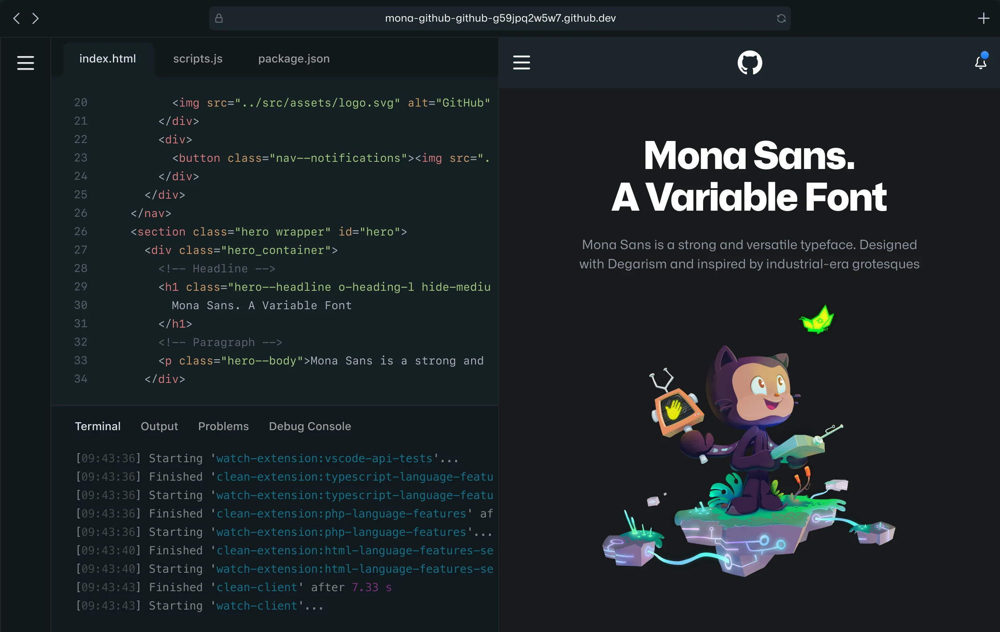
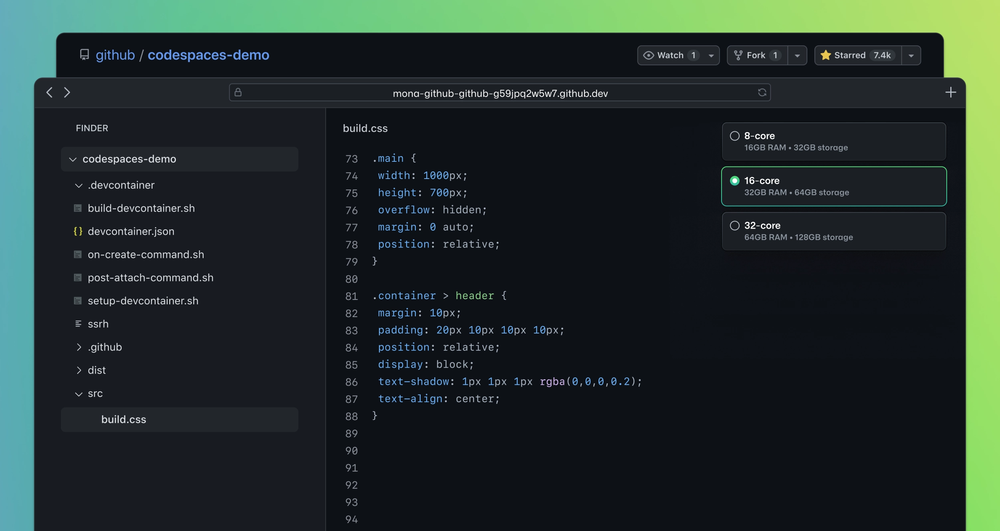

    <h1>Generative AI Fundamentals for .NET</h1>
    <h2>Lesson 2: Setting Up the Environment</h2>
    
<em>Transform GitHub Codespaces into a powerful .NET development machine</em>

> 💡 **Quick Summary**: Follow this comprehensive guide to deploy your ideal .NET + AI development environment. Whether you're a seasoned developer or just starting out, we'll help you build a robust setup for creating amazing applications.

---

**What you'll achieve:**
- ⚡ Lightning-fast development environment with GitHub Codepaces
- 🛠️ Industry-standard tools configuration with .devcontainer
- 🎯 Everything ready for immediate coding

Let's dive in and set up your development environment! 🏃‍♂️

**Index**

1. [Lesson Intro video](#intro-video)
1. [Understanding GitHub Codespaces](#understanding-github-codespaces)
1. [Pre-Flight Check: Setting up GitHub Access Tokens](#pre-flight-check-setting-up-github-access-tokens)
1. [Taking Off with AI 🚀](#taking-off-with-ai-)
1. [Running the Solution in Your Codespace](#running-the-solution-in-your-codespace)
1. [Conclusions and Resources](#conclusions-and-resources)

---

## Intro Video

## Understanding GitHub Codespaces and Models

GitHub is an Platform for Developers, with world-leading tooling, integration, and AI Capabilities, for this course, we are going to use GitHub Codespaces and GitHub Models.

GitHub Codespaces is a cloud-powered development environment that enables developers to code from anywhere. Allowing you to seamlessly integrates with GitHub repositories, providing an effortless way to develop, commit, and deploy code.

GitHub Models is an easy alternative to deploy, integrate, and frictionless way to add Generative Artificial Intelligence into your projects. With multiple families of models, like GPT from OpenAI and Phi Family from Microsoft Research, allowing for quick prototyping for projects in the GitHub ecosystem.

### Infrastructure and Performance

At its core, each codespace operates on a dedicated virtual machine, ensuring isolated and reproducible development environments. These environments are engineered for rapid bootup times and can be extensively customized through devcontainer configurations, allowing developers to maintain their preferred tools and settings.

The platform operates on a transparent pricing model based on compute and storage consumption. For developers using GitHub Free accounts, the service includes [120 core-hours monthly and 15GB of storage](https://github.blog/changelog/2022-11-09-codespaces-for-free-and-pro-accounts/) at no cost. Premium tiers offer expanded resources to match growing development needs.

### Configure any environment with .devcontainer

The **.devcontainer configuration** in GitHub Codespaces acts as your environment's blueprint, defining everything from the base Docker image to Visual Studio Code extensions and settings. This allows that every developer working on your project has identical tools, dependencies, and configurations, effectively eliminating the "it works on my machine" syndrome. Through simple JSON configuration files, you can specify your preferred development environment, including specific versions of .NET, runtime dependencies, and essential VS Code extensions.

A .devcontainer setup involves defining a `devcontainer.json` file and, optionally, a Dockerfile. The configuration file supports a wide range of customization options, from port forwarding rules to post-creation commands, enabling you to automate environment setup tasks and maintain consistency across your development team. This approach not only streamlines the development process but also ensures that your environment remains reproducible and version-controlled alongside your codebase.

> 💡 **Pro Tip**: Configure your devcontainer with your most-used tools and extensions to create a consistent development experience across all your projects. [Learn more about devcontainers here!](https://docs.github.com/en/codespaces/setting-up-your-project-for-codespaces/adding-a-dev-container-configuration/introduction-to-dev-containers)

### Learn and Test AI Models with GitHub Models

**GitHub Models** provides an intuitive way to experiment with various AI models directly within your development environment. This feature allows developers to test and interact with different models, understanding their capabilities and limitations before implementation. Through a simple interface, you can explore model responses, evaluate performance, and determine the best fit for your application requirements. Hosted within GitHub's infrastructure, these models offer reliable access and consistent performance, making them ideal for development and testing phases.

---

## Pre-Flight Check: Setting Up GitHub Access Tokens

Before diving into generative AI development, we need to configure essential security credentials that will enable our Codespace to interact with GitHub Models and execute our applications securely.

### Creating a Personal Access Token

1. Navigate to GitHub Settings:

    - Click your profile picture in the top-right corner
    - Select **Settings** from the dropdown menu

    

2. Access Developer Settings:

    - Scroll down the left sidebar
    - Click on **Developer settings** (usually at the bottom)

    

3. Generate a New Token:

    - Select **Personal access tokens** → **Tokens (classic)**

        

    - Click **Generate new token (classic)**

        

    - Under "Note", provide a descriptive name (e.g., "AI-Development-Token")
    - Set an expiration date (recommended: 7 days for security best practices)
    - There is no need adding any permissions to this token.

> 💡 **Security Tip**: Always use the minimum required scope and shortest practical expiration time for your access tokens. This follows the principle of least privilege and helps maintain your account's tokens safe.

If desired, it is possible to use Azure OpenAi for the demos, in this case, follow the instruction in the guide below:

    <a href="../02-SettingUp.NETDev/usedemoswithAzure.md">Use Azure OpenAi Demos - Guide</a>

## Taking Off with AI 🚀

Let's dive into practical implementations with three powerful AI demonstrations that showcase different approaches to AI integration.

### Demo Overview

1. **AI API Answer with Phi 3.5** 
    - Experience Microsoft's Phi 3.5 language model
    - See real-time AI responses in action and the API integration patterns

    <a href="../02-SettingUp.NETDev/gettingstarted.md">Experiment with Phi-3.5 - Guide</a>

2. **Semantic Kernel Implementation**
    - Learn Microsoft's powerful AI orchestration framework
    - Explore complex AI patterns and workflows in the next lessons

3. **Local Llama Integration**
    - Experience edge computing with AI running in your Codespace
    - Understand local vs. cloud AI tradeoffs

    <a href="../02-SettingUp.NETDev/gettingstartedollama.md">Experiment with Ollama - Guide</a>

### Setting Up Your Development Environment

Let's create your AI-powered workspace using GitHub Codespaces:

1. Navigate to the repository's main page
2. Click the "Code" dropdown button
3. Access "Codespaces"
4. Select "..." (three dots) and choose "New with options"

### Choosing Your Development Container

Select from two optimized configurations:

**Option 1: Standard .NET Environment** : With a Faster startup time and with the core .NET development tools. This environment does not include Ollama capabilities.

**Option 2: .NET with Ollama**: It has a slowet start-up time, five minutes on average, however, you will be able to run all the demos and experiment with Ollama.

> 💡 **Pro Tip**: Choose the Ollama configuration if you plan to experiment with local model execution.

## Running the Solution in Your Codespace

Once your Codespace is fully loaded and configured, follow these steps to execute the demo applications:

1. **Access the Solution Explorer**

    - Locate the Solution Explorer in the left sidebar
    - If collapsed, click the Explorer icon (usually the top icon)
    - The solution structure should be visible, containing all projects

     

2. **Launch the Debug Session**

    - Right-click on the Solution node to be run, in the Explorer
    - Navigate to "Debug" in the context menu
    - Select "Start New Instance"

     

> ⚠️ **Note**: If you encounter any build errors, ensure all required dependencies are properly restored by running `dotnet restore` in the terminal.

## Conclusions and resources

### Additional Resources

> ⚠️ **Note**: If you encounter any issues, open an issue in the repository.

- [GitHub Codespaces Documentation](https://docs.github.com/en/codespaces)
- [GitHub Models Documentation](https://docs.github.com/en/github-models/prototyping-with-ai-models)

### Next Steps

Next, we'll explore how to create your first AI application using these tools. 

    <a href="../03-CoreGenerativeAITechniques/readme.md">Go to Chapter 3</a>

