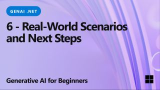

### 7 Lessons teaching everything you need to build Generative AI applications in .NET

# Generative AI for Beginners .NET - A Course

Welcome to **Generative AI for Beginners .NET** (aka **GenAINET**), the ultimate hands-on course for .NET developers diving into the world of Generative AI! This isn’t your typical “here’s some theory, good luck” course. This repository is all about **real-world applications** and **live coding** to empower .NET developers to take full advantage of Generative AI.

This is **hands-on**, **practical**, and designed to be **fun**!

## 🚀 Introduction

Generative AI is transforming software development, and .NET is no exception. **GenAINET** simplifies the journey by offering:

- Short 5-10 minute videos for each lesson.
- Fully functional .NET code samples you can run and explore.
- Integration with tools like **GitHub Codespaces** and **GitHub Models** for seamless setup and fast time-to-code.

You'll learn how to implement Generative AI into .NET projects, from basic text generation to building full-fledged solutions using **GitHub Models**, **Azure OpenAI Services** and **local models with Ollama**.

## 🛠️ Getting Started

To start coding right away:

1. **Clone the Repository**: Start by cloning this repo to your GitHub account.
2. **Run in GitHub Codespaces**: With one click, you'll get a pre-configured environment to test and explore the lessons.
3. **Leverage GitHub Models**: Try out AI-powered demos hosted directly within this repo.

When you're ready to expand:

- Upgrade to **Azure OpenAI Services** for scalable and enterprise-ready solutions.
- Use **Ollama** to run models locally on your hardware for enhanced privacy and control.

Guides for transitioning to Azure or Ollama are included in the repository.

## What You Need

To get started, you'll need:

1. A **GitHub account** (free is fine!) to [fork this entire repo](https://github.com/microsoft/generative-ai-for-beginners/fork) to your own GitHub account

2. **GitHub Codespaces enabled** for instant coding environments.

3. A basic understanding of **.NET development**.

Optional:

- Access to **Azure OpenAI Services** for cloud-based AI.

    [Azure OpenAI Service](https://azure.microsoft.com/products/ai-services/openai-service) - **Lessons:** "aoai-assignment"
- A setup for **local models** using Ollama if you prefer running AI locally.

    [GitHub Marketplace Model Catalog](https://github.com/marketplace/models?WT.mc_id=academic-105485-koreyst) - **Lessons:** "githubmodels"

Don't forget to [star (🌟) this repo](https://docs.github.com/en/get-started/exploring-projects-on-github/saving-repositories-with-stars) to find it easier later.

## 🤝 Want to Help?

Contributions are welcome! Here's how you can help:

- [Report issues](https://aka.ms/genainet/issues) or bugs in the repo.

- Improve existing code samples or add new ones, [creating a pull request](https://aka.ms/genainet/issues)
- Suggest additional lessons or enhancements.
- Do you have suggestions or found spelling or code errors?, [create a pull request](https://aka.ms/genainet/issues)

Check the [CONTRIBUTING.md](CONTRIBUTING.md) file for details on how to get involved.

## 📦 Each Lesson Includes

- **Short Video**: A quick overview of the lesson (5-10 minutes).
- **Complete Code Samples**: Fully functional and ready to run.
- **Step-by-Step Guidance**: Simple instructions to help you learn and implement the concepts.
- **Deep Dive References**: Links to theoretical explanations in [Generative AI for Beginners - A Course](https://github.com/microsoft/generative-ai-for-beginners) when needed.

## 🗃️ Lessons

| #   | **Lesson Link** | **Description** | **Video** | **Extra Learning** |
| --- | --- | --- | --- | --- |
| 01  | [**Intro to Generative AI Basics for .NET Developers**](./01-IntroToGenAI/readme.md) | <ul><li>Overview of generative models and their applications in .NET</li></ul> |  | [Learn More](https://aka.ms/genainet) |
| 02  | [**Setting Up for .NET Development with Generative AI**](./02-SettingUp.NETDev/readme.md) | <ul><li>Using libraries like `Microsoft.Extensions.AI` and `OpenAI .NET`.</li><li>Choosing between GitHub Models API and local models like Ollama.</li></ul> |  | [Learn More](https://aka.ms/genainet) |
| 03  | [**Core Generative AI Techniques with .NET**](./03-CoreGenerativeAITechniques/readme.md) | <ul><li>Text generation, conversational flows, and multimodal capabilities (vision and audio).</li></ul> |  | [Learn More](https://aka.ms/genainet) |
| 04  | [**Practical .NET Generative AI Samples**](./04-Practical.NETGenAISamples/readme.md) | <ul><li>Chatbots using libraries like `Microsoft.Extensions.AI`, `Semantic Kernel` and `OpenAI .NET`.</li><li>Video analyzers</li><li>Document Automation.</li></ul> |  | [Learn More](https://aka.ms/genainet) |
| 05  | [**Responsible Use of Generative AI in .NET Apps**](./05-ResponsibleGenAI/readme.md) | <ul><li>Ethical considerations, bias mitigation, and secure implementations.</li></ul> |  | [Learn More](https://aka.ms/genainet) |
| 06  | [**Real-World Scenarios and Next Steps**](./06-Real-WorldScenarios/readme.md) | <ul><li>Industry examples and paths for expanding your knowledge.</li></ul> |  | [Learn More](https://aka.ms/genainet) |

## 🌐 Other Courses

Our team produces other courses! Check out:

- [ML for Beginners](https://aka.ms/ml-beginners?WT.mc_id=academic-105485-koreyst)
- [Data Science for Beginners](https://aka.ms/datascience-beginners?WT.mc_id=academic-105485-koreyst)
- [AI for Beginners](https://aka.ms/ai-beginners?WT.mc_id=academic-105485-koreyst)
- [**NEW** Cybersecurity for Beginners](https://github.com/microsoft/Security-101??WT.mc_id=academic-96948-sayoung)
- [Web Dev for Beginners](https://aka.ms/webdev-beginners?WT.mc_id=academic-105485-koreyst)
- [IoT for Beginners](https://aka.ms/iot-beginners?WT.mc_id=academic-105485-koreyst)
- [XR Development for Beginners](https://github.com/microsoft/xr-development-for-beginners?WT.mc_id=academic-105485-koreyst)
- [Mastering GitHub Copilot for AI Paired Programming](https://aka.ms/GitHubCopilotAI?WT.mc_id=academic-105485-koreyst)

Start coding and build the future with Generative AI and .NET! 🚀
