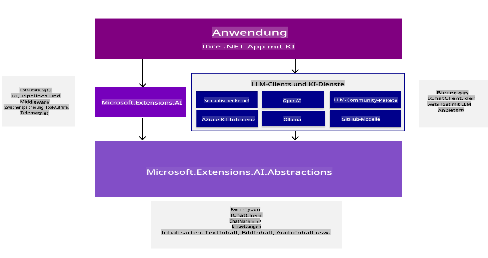
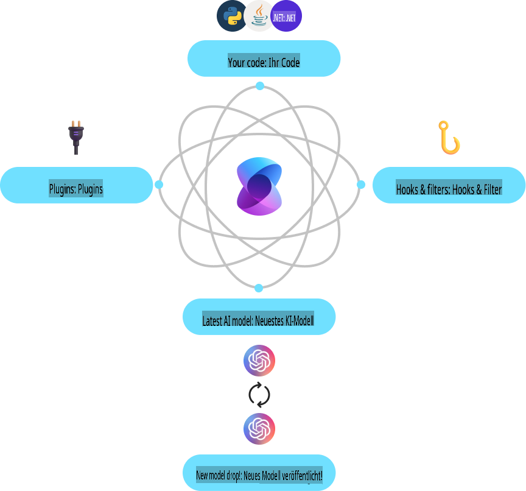
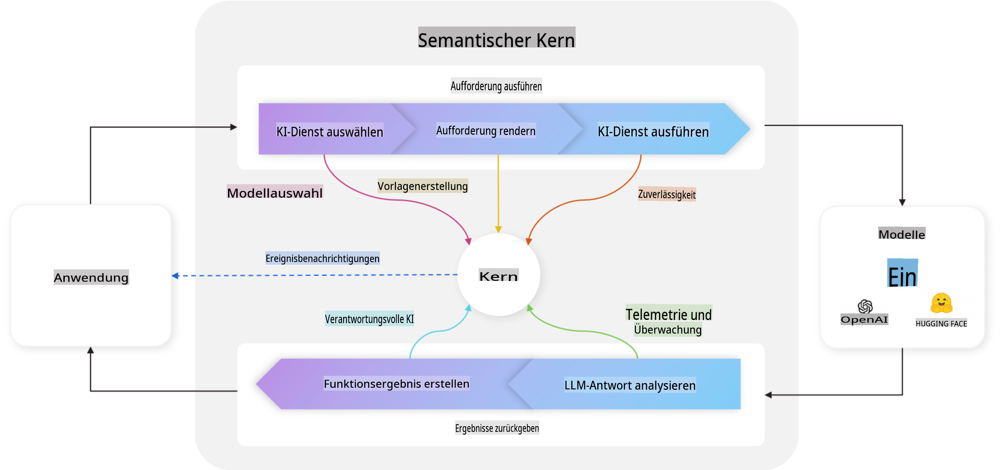

# Einstieg in die Entwicklung von KI-Tools

Auffrischen Ihres Wissens über generative KI und Verstehen der .NET-Tools, die Ihnen bei der Entwicklung generativer KI-Anwendungen helfen.

---

[](http://www.youtube.com/watch?v=SZvE_meBdvg)

_⬆️Klicken Sie auf das Bild, um das Video anzusehen⬆️_

## Was Sie in dieser Lektion lernen werden:

- 🌟 Grundlegende Konzepte der generativen KI und deren Anwendungen verstehen
- 🔍 Erkunden der .NET-Tools für die KI-Entwicklung, einschließlich MEAI, Semantic Kernel und Azure OpenAI

## Grundlagen der generativen KI für .NET

Bevor wir uns in den Code stürzen, nehmen wir uns eine Minute Zeit, um einige Konzepte der generativen KI (GenAI) zu wiederholen. In dieser Lektion, **Grundlagen der generativen KI für .NET**, frischen wir einige grundlegende GenAI-Konzepte auf, damit Sie verstehen, warum bestimmte Dinge so gemacht werden, wie sie sind. Außerdem stellen wir die Tools und SDKs vor, die Sie zum Erstellen von Anwendungen verwenden, wie **MEAI** (Microsoft.Extensions.AI), **Semantic Kernel** und die **AI Toolkit Extension für VS Code**.

### Eine kurze Auffrischung der Konzepte der generativen KI

Generative KI ist eine Art von künstlicher Intelligenz, die neue Inhalte wie Texte, Bilder oder Code erstellt, basierend auf Mustern und Beziehungen, die aus Daten gelernt wurden. Generative KI-Modelle können menschenähnliche Antworten generieren, Kontext verstehen und manchmal sogar Inhalte erstellen, die menschlich wirken.

Während Sie Ihre .NET-KI-Anwendungen entwickeln, arbeiten Sie mit **generativen KI-Modellen**, um Inhalte zu erstellen. Einige Fähigkeiten generativer KI-Modelle umfassen:

- **Textgenerierung**: Erstellen menschenähnlicher Texte für Chatbots, Inhalte und Textvervollständigungen.
- **Bildgenerierung und -analyse**: Erstellen realistischer Bilder, Verbessern von Fotos und Erkennen von Objekten.
- **Codegenerierung**: Schreiben von Code-Snippets oder Skripten.

Es gibt spezifische Typen von Modellen, die für verschiedene Aufgaben optimiert sind. Zum Beispiel sind **Small Language Models (SLMs)** ideal für die Textgenerierung, während **Large Language Models (LLMs)** besser für komplexe Aufgaben wie Codegenerierung oder Bildanalyse geeignet sind. Verschiedene Unternehmen und Gruppen entwickeln Modelle, wie Microsoft, OpenAI oder Anthropic. Das spezifische Modell, das Sie verwenden, hängt von Ihrem Anwendungsfall und den benötigten Fähigkeiten ab.

Natürlich sind die Antworten dieser Modelle nicht immer perfekt. Sie haben wahrscheinlich schon von Modellen gehört, die "halluzinieren" oder falsche Informationen auf eine überzeugende Weise generieren. Sie können jedoch das Modell durch klare Anweisungen und Kontext dabei unterstützen, bessere Antworten zu liefern. Hier kommt das **Prompt Engineering** ins Spiel.

#### Auffrischung zu Prompt Engineering

Prompt Engineering ist die Praxis, effektive Eingaben zu entwerfen, um KI-Modelle in Richtung gewünschter Ausgaben zu leiten. Es umfasst:

- **Klarheit**: Klare und eindeutige Anweisungen geben.
- **Kontext**: Bereitstellung der notwendigen Hintergrundinformationen.
- **Einschränkungen**: Festlegen von Begrenzungen oder Formaten.

Einige Best Practices für Prompt Engineering umfassen Prompt-Design, klare Anweisungen, Aufgabenzerlegung, One-Shot- und Few-Shot-Learning sowie Prompt-Tuning. Außerdem ist es wichtig, verschiedene Prompts auszuprobieren und zu testen, um herauszufinden, was für Ihren spezifischen Anwendungsfall am besten funktioniert.

Es ist wichtig zu beachten, dass es beim Entwickeln von Anwendungen verschiedene Arten von Prompts gibt. Zum Beispiel sind Sie dafür verantwortlich, **System-Prompts** festzulegen, die die Grundregeln und den Kontext für die Antwort des Modells setzen. Die Daten, die der Benutzer Ihrer Anwendung in das Modell einspeist, werden als **User-Prompts** bezeichnet. Und **Assistant-Prompts** sind die Antworten, die das Modell basierend auf den System- und User-Prompts generiert.

> 🧑‍🏫 **Mehr erfahren**: Erfahren Sie mehr über Prompt Engineering im [Kapitel Prompt Engineering des GenAI for Beginners-Kurses](https://github.com/microsoft/generative-ai-for-beginners/tree/main/04-prompt-engineering-fundamentals)

#### Tokens, Embeddings und Agents – was steckt dahinter?

Beim Arbeiten mit generativen KI-Modellen stoßen Sie auf Begriffe wie **Tokens**, **Embeddings** und **Agents**. Hier ein kurzer Überblick über diese Konzepte:

- **Tokens**: Tokens sind die kleinste Einheit von Text in einem Modell. Sie können Wörter, Zeichen oder Teilwörter sein. Tokens werden verwendet, um Textdaten in einem Format darzustellen, das das Modell verstehen kann.
- **Embeddings**: Embeddings sind Vektorrepräsentationen von Tokens. Sie erfassen die semantische Bedeutung von Wörtern und Phrasen, sodass Modelle Beziehungen zwischen Wörtern verstehen und kontextuell relevante Antworten generieren können.
- **Vektordatenbanken**: Vektordatenbanken sind Sammlungen von Embeddings, die verwendet werden können, um Textdaten zu vergleichen und zu analysieren. Sie ermöglichen es Modellen, Antworten basierend auf dem Kontext der Eingabedaten zu generieren.
- **Agents**: Agents sind KI-Komponenten, die mit Modellen interagieren, um Antworten zu generieren. Sie können Chatbots, virtuelle Assistenten oder andere Anwendungen sein, die generative KI-Modelle zur Inhaltserstellung nutzen.

Beim Entwickeln von .NET-KI-Anwendungen arbeiten Sie mit Tokens, Embeddings und Agents, um Chatbots, Inhaltsgeneratoren und andere KI-gestützte Anwendungen zu erstellen. Das Verständnis dieser Konzepte hilft Ihnen dabei, effektivere und effizientere KI-Anwendungen zu entwickeln.

### Tools und Bibliotheken für die KI-Entwicklung mit .NET

.NET bietet eine Vielzahl von Tools für die KI-Entwicklung. Lassen Sie uns kurz einige der verfügbaren Tools und Bibliotheken verstehen.

#### Microsoft.Extensions.AI (MEAI)

Die Microsoft.Extensions.AI (MEAI)-Bibliothek bietet einheitliche Abstraktionen und Middleware, um die Integration von KI-Diensten in .NET-Anwendungen zu vereinfachen.

Durch die Bereitstellung einer konsistenten API ermöglicht MEAI Entwicklern die Interaktion mit verschiedenen KI-Diensten, wie kleinen und großen Sprachmodellen, Embeddings und sogar Middleware über eine gemeinsame Schnittstelle. Dies reduziert die Komplexität bei der Entwicklung einer .NET-KI-Anwendung, da Sie für verschiedene Dienste gegen dieselbe API entwickeln.

Zum Beispiel ist hier die Schnittstelle, die Sie verwenden würden, um einen Chat-Client mit MEAI zu erstellen, unabhängig davon, welchen KI-Dienst Sie nutzen:

```csharp
public interface IChatClient : IDisposable 
{ 
    Task<ChatCompletion> CompleteAsync(...); 
    IAsyncEnumerable<StreamingChatCompletionUpdate> CompleteStreamingAsync(...); 
    ChatClientMetadata Metadata { get; } 
    TService? GetService<TService>(object? key = null) where TService : class; 
}
```

Auf diese Weise entwickeln Sie bei der Nutzung von MEAI für den Aufbau einer Chat-Anwendung gegen dieselbe API-Oberfläche, um eine Chat-Vervollständigung zu erhalten oder zu streamen, Metadaten abzurufen oder auf den zugrunde liegenden KI-Dienst zuzugreifen. Dies erleichtert es, KI-Dienste auszutauschen oder bei Bedarf neue hinzuzufügen.

Zusätzlich unterstützt die Bibliothek Middleware-Komponenten für Funktionen wie Logging, Caching und Telemetrie, was die Entwicklung robuster KI-Anwendungen erleichtert.



Durch die Verwendung einer einheitlichen API ermöglicht MEAI Entwicklern, mit verschiedenen KI-Diensten wie Azure AI Inference, Ollama und OpenAI auf konsistente Weise zu arbeiten. Dies vereinfacht die Integration von KI-Modellen in .NET-Anwendungen und bietet Entwicklern Flexibilität bei der Auswahl der besten KI-Dienste für ihre Projekte und spezifischen Anforderungen.

> 🏎️ **Schnellstart**: Für einen Schnellstart mit MEAI [lesen Sie den Blogbeitrag](https://devblogs.microsoft.com/dotnet/introducing-microsoft-extensions-ai-preview/).
>
> 📖 **Dokumentation**: Erfahren Sie mehr über Microsoft.Extensions.AI (MEAI) in der [MEAI-Dokumentation](https://learn.microsoft.com/dotnet/ai/ai-extensions)
 

#### Semantic Kernel (SK)

Semantic Kernel ist ein Open-Source-SDK, das Entwicklern ermöglicht, generative KI-Sprachmodelle in ihre .NET-Anwendungen zu integrieren. Es bietet Abstraktionen für KI-Dienste und Memory (Vektor)-Speicher, sodass Plugins erstellt werden können, die automatisch von KI orchestriert werden. Es nutzt sogar den OpenAPI-Standard, sodass Entwickler KI-Agents erstellen können, die mit externen APIs interagieren.



Semantic Kernel unterstützt .NET sowie andere Sprachen wie Java und Python und bietet eine Vielzahl von Konnektoren, Funktionen und Plugins zur Integration. Zu den wichtigsten Funktionen von Semantic Kernel gehören:

- **Kernel Core**: Bietet die Kernfunktionalität für Semantic Kernel, einschließlich Konnektoren, Funktionen und Plugins, um mit KI-Diensten und Modellen zu interagieren. Der Kernel ist das Herzstück des Semantic Kernel und steht Diensten und Plugins zur Verfügung, ruft sie bei Bedarf ab, überwacht Agents und fungiert als aktives Middleware für Ihre Anwendung.

    Zum Beispiel kann er den besten KI-Dienst für eine bestimmte Aufgabe auswählen, den Prompt an den Dienst senden und die Antwort an die Anwendung zurückgeben. Nachfolgend eine Darstellung des Kernel Core in Aktion:

    

- **KI-Dienst-Konnektoren**: Bietet eine Abstraktionsschicht, um KI-Dienste für mehrere Anbieter mit einer gemeinsamen und konsistenten Schnittstelle verfügbar zu machen, z. B. Chat Completion, Text to Image, Text to Speech und Audio to Text.

- **Vektor-Speicher-Konnektoren**: Stellt Vektor-Speicher für mehrere Anbieter über eine gemeinsame und konsistente Schnittstelle bereit und ermöglicht es Entwicklern, mit Embeddings, Vektoren und anderen Datenrepräsentationen zu arbeiten.

- **Funktionen und Plugins**: Bietet eine Vielzahl von Funktionen und Plugins für gängige KI-Aufgaben, wie Funktionsverarbeitung, Prompt-Templating, Textsuche und mehr. Dies ermöglicht die Verbindung mit dem KI-Dienst/Modell und die Implementierung von RAG und Agents.

- **Prompt-Templating**: Bietet Tools für Prompt Engineering, einschließlich Prompt-Design, Testen und Optimierung, um die Leistung und Genauigkeit von KI-Modellen zu verbessern. Entwicklern wird ermöglicht, Prompts zu erstellen, zu testen und für spezifische Aufgaben zu optimieren.

- **Filter**: Kontrollmechanismen, wann und wie Funktionen ausgeführt werden, um die Sicherheit und verantwortungsvolle KI-Praktiken zu verbessern.

Ein vollständiger Ablauf in Semantic Kernel würde wie folgt aussehen:


> 📖 **Dokumentation**: Erfahren Sie mehr über Semantic Kernel in der [Semantic Kernel-Dokumentation](https://learn.microsoft.com/semantic-kernel/overview/)

## Fazit

Generative KI bietet Entwicklern eine Welt voller Möglichkeiten, innovative Anwendungen zu erstellen, die Inhalte generieren, Kontext verstehen und menschenähnliche Antworten liefern. Das .NET-Ökosystem stellt eine Reihe von Tools und Bibliotheken bereit, die die KI-Entwicklung vereinfachen und die Integration von KI-Funktionen in .NET-Anwendungen erleichtern.

## Nächste Schritte

In den nächsten Kapiteln werden wir diese Szenarien detaillierter untersuchen und praktische Beispiele, Code-Snippets und Best Practices bereitstellen, um Ihnen zu helfen, reale KI-Lösungen mit .NET zu entwickeln!

Als Nächstes richten wir Ihre Entwicklungsumgebung ein, damit Sie bereit sind, in die Welt der generativen KI mit .NET einzutauchen!

👉 [Richten Sie Ihre KI-Entwicklungsumgebung ein](/02-SetupDevEnvironment/readme.md)

**Haftungsausschluss**:  
Dieses Dokument wurde mit KI-gestützten maschinellen Übersetzungsdiensten übersetzt. Obwohl wir uns um Genauigkeit bemühen, weisen wir darauf hin, dass automatisierte Übersetzungen Fehler oder Ungenauigkeiten enthalten können. Das Originaldokument in seiner ursprünglichen Sprache sollte als maßgebliche Quelle betrachtet werden. Für kritische Informationen wird eine professionelle menschliche Übersetzung empfohlen. Wir übernehmen keine Haftung für Missverständnisse oder Fehlinterpretationen, die sich aus der Nutzung dieser Übersetzung ergeben.