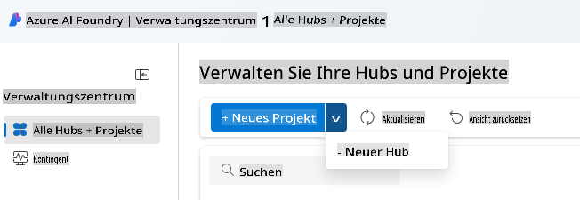
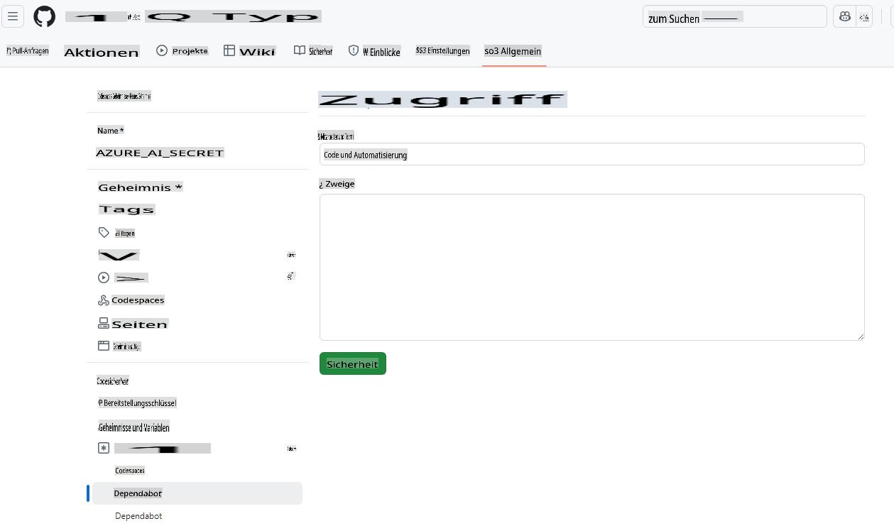
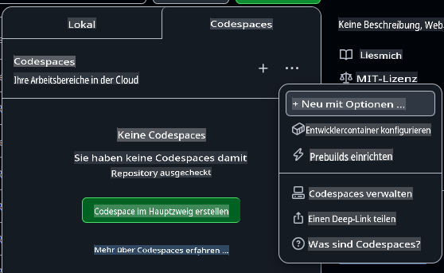
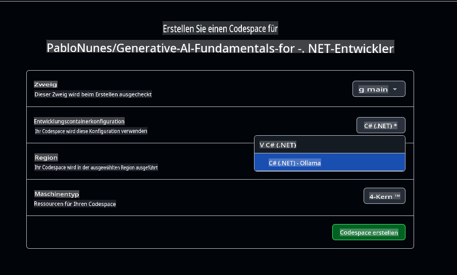

# Einrichten der Entwicklungsumgebung für Azure OpenAI

Wenn du die Azure AI Foundry-Modelle für deine .NET-KI-Anwendungen in diesem Kurs nutzen möchtest, befolge die Schritte in dieser Anleitung.

Möchtest du Azure OpenAI nicht verwenden?

👉 [Hier ist die Anleitung für GitHub-Modelle](README.md)  
👉 [Hier sind die Schritte für Ollama](getting-started-ollama.md)

## Erstellen der Azure AI Foundry-Ressourcen

Um Azure AI Foundry-Modelle zu verwenden, musst du ein Hub und ein Projekt im Azure AI Foundry-Portal erstellen. Danach musst du ein Modell bereitstellen. In diesem Abschnitt erfährst du, wie das geht.

### Erstellen eines Hubs und Projekts in Azure AI Foundry

1. Gehe zum [Azure AI Foundry-Portal](https://ai.azure.com/).
1. Melde dich mit deinem Azure-Konto an.
1. Wähle **Alle Hubs + Projekte** aus dem Menü auf der linken Seite und klicke dann im Dropdown-Menü auf **+ Neuer Hub**. (Hinweis: Möglicherweise musst du zuerst auf **+ Neues Projekt** klicken, um die Option **+ Neuer Hub** zu sehen).  
    
1. Ein neues Fenster wird geöffnet. Fülle die Details für deinen Hub aus:
    - Gib deinem Hub einen Namen (z. B. "MyAIHub").
    - Wähle eine Region, die dir am nächsten liegt.
    - Wähle das passende Abonnement und die Ressourcengruppe aus.
    - Du kannst die restlichen Einstellungen so lassen, wie sie sind.
    - Klicke auf **Weiter**.
    - Überprüfe die Details und klicke auf **Erstellen**.
1. Sobald dein Hub erstellt wurde, öffnet das Portal die Detailseite. Klicke auf die Schaltfläche **Projekt erstellen**.
    - Gib deinem Projekt einen Namen (z. B. "GenAINET") oder akzeptiere den Standardnamen.
    - Klicke auf **Erstellen**.

🎉 **Geschafft!** Du hast gerade dein erstes Projekt in Azure AI Foundry erstellt.

### Bereitstellen eines Sprachmodells in Azure AI Foundry

Jetzt stellen wir ein **gpt-4o-mini**-Modell in deinem Projekt bereit:

1. Navigiere im Azure AI Foundry-Portal zu deinem Projekt (es sollte sich nach der Erstellung automatisch öffnen).
1. Klicke im Menü auf der linken Seite auf **Modelle und Endpunkte** und dann auf die Schaltfläche **Modell bereitstellen**.
1. Wähle **Basis-Modell bereitstellen** aus dem Dropdown-Menü.
1. Suche im Modellkatalog nach **gpt-4o-mini**.
1. Wähle das Modell aus und klicke auf die Schaltfläche **Bestätigen**.
1. Gib einen Bereitstellungsnamen ein (z. B. "gpt-4o-mini"). Du kannst die restlichen Optionen so lassen, wie sie sind.
1. Klicke auf **Bereitstellen** und warte, bis das Modell bereitgestellt ist.
1. Sobald das Modell bereitgestellt wurde, notiere dir den **Modellnamen**, die **Ziel-URI** und den **API-Schlüssel** auf der Detailseite des Modells.

🎉 **Geschafft!** Du hast dein erstes Large Language Model in Azure AI Foundry bereitgestellt.


> 📝 **Hinweis:** Der Endpunkt könnte ähnlich wie `https://< your hub name>.openai.azure.com/openai/deployments/gpt-4o-mini/chat/completions?api-version=2024-08-01-preview` aussehen. Der benötigte Endpunktname ist nur `https://< your hub name >.openai.azure.com/`*.

## Hinzufügen des Azure AI API-Schlüssels zu den Secrets deiner Codespace-Umgebung

Um sicher zu sein, fügen wir den gerade erstellten API-Schlüssel zu den Secrets deiner Codespace-Umgebung hinzu.

1. Stelle sicher, dass du dieses Repository in deinem GitHub-Konto geforkt hast.
1. Gehe zum Tab **Settings** deines geforkten Repositories, erweitere **Secrets and variables** im Menü auf der linken Seite und wähle **Codespaces**.

    
1. Benenne dein Secret **AZURE_AI_KEY**.
1. Füge den API-Schlüssel, den du aus dem Azure AI Foundry-Portal kopiert hast, in das Feld **Secret** ein.

## Erstellen eines GitHub Codespace

Erstellen wir einen GitHub Codespace, um die Entwicklung für den Rest des Kurses fortzusetzen.

1. Öffne die Hauptseite dieses Repositories in einem neuen Fenster, indem du [hier rechtsklickst](https://github.com/microsoft/Generative-AI-for-beginners-dotnet) und **In neuem Fenster öffnen** aus dem Kontextmenü auswählst.
1. Forke dieses Repository in dein GitHub-Konto, indem du oben rechts auf die Schaltfläche **Fork** klickst.
1. Klicke auf die Schaltfläche **Code** und wähle dann den Tab **Codespaces** aus.
1. Wähle die Option **...** (die drei Punkte) und dann **New with options...**.



### Auswahl deines Entwicklungscontainers

Wähle im Dropdown-Menü **Dev container configuration** eine der folgenden Optionen aus:

**Option 1: C# (.NET)**: Diese Option solltest du wählen, wenn du GitHub-Modelle oder Azure OpenAI verwenden möchtest. Sie enthält alle grundlegenden .NET-Entwicklungstools, die für den Rest des Kurses benötigt werden, und hat eine schnelle Startzeit.

**Option 2: C# (.NET) - Ollama**: Mit Ollama kannst du die Demos ausführen, ohne eine Verbindung zu GitHub-Modellen oder Azure OpenAI herstellen zu müssen. Es enthält alle grundlegenden .NET-Entwicklungstools zusätzlich zu Ollama, hat jedoch eine langsamere Startzeit, durchschnittlich fünf Minuten. [Folge dieser Anleitung](getting-started-ollama.md), wenn du Ollama verwenden möchtest.

Du kannst die restlichen Einstellungen so lassen, wie sie sind. Klicke auf die Schaltfläche **Create codespace**, um den Codespace-Erstellungsprozess zu starten.



## Aktualisieren des Beispielcodes zur Verwendung von Azure OpenAI und deinem neuen Modell

Aktualisieren wir nun den Code, um das neu bereitgestellte Modell zu verwenden. Zuerst müssen wir einige NuGet-Pakete hinzufügen, um mit Azure OpenAI zu arbeiten.

1. Öffne das Terminal und wechsle in das Projektverzeichnis:

    ```bash
    cd 02-SetupDevEnvironment/src/BasicChat-01MEAI/
    ```

1. Führe die folgenden Befehle aus, um das erforderliche Paket hinzuzufügen:

    ```bash
    dotnet add package Azure.AI.OpenAI
    dotnet add package Microsoft.Extensions.AI.OpenAI --version 9.1.0-preview.1.25064.3
    ```

[Weitere Informationen über Azure.AI.OpenAI](https://www.nuget.org/packages/Azure.AI.OpenAI/2.1.0#show-readme-container).

1. Öffne `/workspaces/Generative-AI-for-beginners-dotnet/02-SettingUp.NETDev/src/BasicChat-01MEAI/Program.cs`.

    Füge die folgenden `using`-Anweisungen am Anfang der Datei hinzu:

    ```csharp
    using System.ClientModel;
    using Azure.AI.OpenAI;
    using Microsoft.Extensions.AI;

1. Create new variables to hold the model name, endpoint, and API key:

    ```csharp
    var deploymentName = "< deployment name > "; // z. B. "gpt-4o-mini"
    var endpoint = new Uri("< endpoint >"); // z. B. "https://< your hub name >.openai.azure.com/"
    var apiKey = new ApiKeyCredential(Environment.GetEnvironmentVariable("AZURE_AI_SECRET"));
    ```

    Making sure to replace `< deployment name >`, and `< endpoint >` with the values you noted above.

1. Replace the `IChatClient` creation with the following code:

    ```csharp
    IChatClient client = new AzureOpenAIClient(
        endpoint,
        apiKey)
    .AsChatClient(deploymentName);
    ```

1. Run the following command in the terminal:

    ```bash
    dotnet run
    ```

1. You should see output similar to the following:

    ```bash
    Künstliche Intelligenz (KI) bezieht sich auf die Simulation menschlicher Intelligenz in Maschinen, die programmiert sind, wie Menschen zu denken und zu lernen. KI umfasst eine Vielzahl von Technologien und Ansätzen, die es Computern und Systemen ermöglichen, Aufgaben auszuführen, die normalerweise menschliche Intelligenz erfordern. Zu diesen Aufgaben gehören:

    1. **Lernen**: Die Fähigkeit, die Leistung basierend auf Erfahrungen zu verbessern, oft durch Algorithmen, die Daten analysieren.
    
    ...
    ```

> 🙋 **Hilfe benötigt?**: Funktioniert etwas nicht? [Öffne ein Issue](https://github.com/microsoft/Generative-AI-for-beginners-dotnet/issues/new?template=Blank+issue) und wir helfen dir weiter.

## Zusammenfassung

In dieser Lektion hast du gelernt, wie du deine Entwicklungsumgebung für den Rest des Kurses einrichtest. Du hast einen GitHub Codespace erstellt und ihn so konfiguriert, dass er Azure OpenAI verwendet. Außerdem hast du den Beispielcode aktualisiert, um das neu bereitgestellte Modell in Azure AI Foundry zu verwenden.

### Zusätzliche Ressourcen

- [Azure AI Foundry-Dokumentation](https://learn.microsoft.com/azure/ai-services/)  
- [Arbeiten mit GitHub Codespaces](https://docs.github.com/en/codespaces/getting-started)  
- [Wie man Modelle in Azure AI Foundry bereitstellt](https://learn.microsoft.com/azure/ai-services/deploy/)  
- [Azure.AI.OpenAI NuGet-Paket](https://www.nuget.org/packages/Azure.AI.OpenAI)

## Nächste Schritte

Als Nächstes erkunden wir, wie du deine erste KI-Anwendung erstellen kannst! 🚀

👉 [Kerntechniken der Generativen KI](../03-CoreGenerativeAITechniques/readme.md)

**Haftungsausschluss**:  
Dieses Dokument wurde mithilfe von KI-gestützten maschinellen Übersetzungsdiensten übersetzt. Obwohl wir uns um Genauigkeit bemühen, weisen wir darauf hin, dass automatisierte Übersetzungen Fehler oder Ungenauigkeiten enthalten können. Das Originaldokument in seiner ursprünglichen Sprache sollte als maßgebliche Quelle betrachtet werden. Für kritische Informationen wird eine professionelle menschliche Übersetzung empfohlen. Wir übernehmen keine Haftung für Missverständnisse oder Fehlinterpretationen, die aus der Nutzung dieser Übersetzung entstehen.