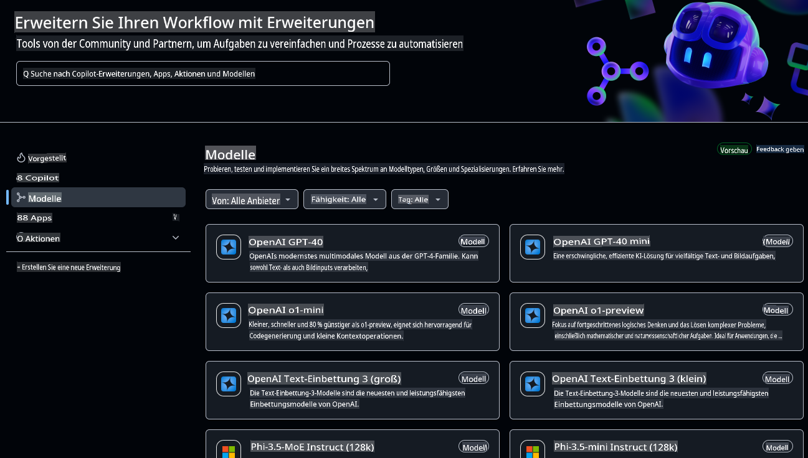
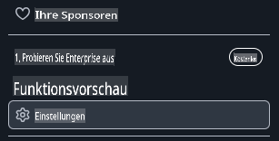
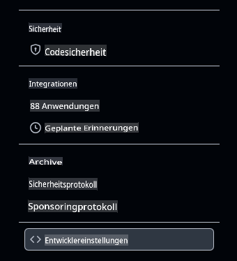
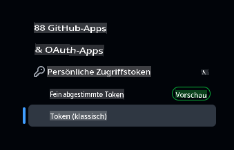
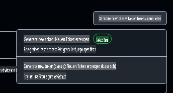

# Einrichten der Entwicklungsumgebung für diesen Kurs

Diese Lektion führt Sie durch das Einrichten Ihrer Entwicklungsumgebung für diesen Kurs. Um Ihren Erfolg sicherzustellen, haben wir eine Devcontainer-Konfiguration vorbereitet, die Ihnen alle Werkzeuge bereitstellt, die Sie benötigen, um den Kurs abzuschließen. Sie können den Devcontainer in GitHub Codespaces (empfohlen) oder lokal auf Ihrem Rechner ausführen. Außerdem zeigen wir Ihnen, wie Sie Ihre GitHub-Zugriffstokens einrichten, um mit GitHub Models zu interagieren.

*Wir haben auch Anleitungen für die Einrichtung von [Azure OpenAI](getting-started-azure-openai.md) und [Ollama](getting-started-ollama.md) vorbereitet, falls gewünscht.*

---

## Was Sie in dieser Lektion lernen werden:

- ⚡ Wie Sie eine Entwicklungsumgebung mit GitHub Codespaces einrichten
- 🤖 Konfigurieren Ihrer Entwicklungsumgebung, um über GitHub Models, Azure OpenAI oder Ollama auf LLMs zuzugreifen
- 🛠️ Konfiguration von branchenüblichen Tools mit .devcontainer
- 🎯 Schließlich ist alles bereit, um den Rest des Kurses abzuschließen

Legen wir los und richten Ihre Entwicklungsumgebung ein! 🏃‍♂️

[](https://youtu.be/7kYoVRNQXyA?feature=shared)

_⬆️Klicken Sie auf das Bild, um das Video anzusehen⬆️_

## Welchen KI-Dienst sollte ich für diesen Kurs verwenden?

Wir bieten Anleitungen zum Einrichten Ihrer Entwicklungsumgebung mit GitHub Models, Azure OpenAI und Ollama. Sie können den Dienst wählen, der am besten zu Ihren Anforderungen passt. Für diesen Kurs empfehlen wir die Verwendung von GitHub Models, aber Sie können jeden der drei Dienste nutzen.

Hier ein kurzer Überblick über die Dienste:

- **GitHub Models**: Ein kostenloser Dienst, mit dem Sie starten können und der es Ihnen ermöglicht, verschiedene KI-Modelle direkt in Ihrer Entwicklungsumgebung zu testen und zu nutzen. Er ist einfach in Codespaces zu verwenden und eine großartige Möglichkeit, mit verschiedenen Modellen zu experimentieren und deren Fähigkeiten vor der Implementierung zu verstehen.
- **Azure OpenAI**: Ein kostenpflichtiger Dienst, der Zugriff auf eine Vielzahl von KI-Modellen bietet. Er umfasst alle Vorteile, die Sie von Azure erwarten, einschließlich robuster Sicherheit und Skalierbarkeit. Dies ist eine großartige Option für diesen Kurs, wenn Sie bereits Zugriff auf ein Azure-Abonnement haben.
- **Ollama**: Ollama ermöglicht es Ihnen, KI-Modelle lokal auf Ihrem Rechner oder innerhalb eines Codespaces oder Devcontainers kostenlos auszuführen. Es ist eine großartige Option, wenn Sie die Modelle lokal ausführen möchten, aber es erfordert mehr Hardware-Ressourcen und kann langsamer sein als die cloudbasierten Optionen.

> Wenn **GitHub Models** Ihre Wahl ist, folgen Sie dem Rest dieses Dokuments, um Ihre Entwicklungsumgebung mit GitHub Models einzurichten.
> - Interessiert an **Azure OpenAI**? [Hier ist das Dokument für Sie](getting-started-azure-openai.md).
> - Haben Sie sich für **Ollama** entschieden? [Dieser Leitfaden enthält die Informationen, die Sie benötigen](getting-started-ollama.md).

## Lernen und Testen von KI-Modellen mit GitHub Models

**GitHub Models** bietet eine intuitive Möglichkeit, verschiedene KI-Modelle direkt in Ihrer Entwicklungsumgebung zu testen. Diese Funktion ermöglicht es Entwicklern, mit verschiedenen Modellen zu interagieren, deren Fähigkeiten und Einschränkungen zu verstehen, bevor sie implementiert werden. Über eine einfache Benutzeroberfläche können Sie Modellantworten erkunden, die Leistung bewerten und die beste Lösung für Ihre Anwendungsanforderungen ermitteln. Gehostet in der Infrastruktur von GitHub bieten diese Modelle zuverlässigen Zugriff und konsistente Leistung, was sie ideal für Entwicklungs- und Testphasen macht. Das Beste daran: Es gibt eine kostenlose Einstiegsebene, um ohne Kosten loszulegen.



## Pre-Flight-Check: Einrichten von GitHub-Zugriffstokens

Bevor wir irgendetwas anderes tun, müssen wir wichtige Sicherheitsanmeldedaten konfigurieren, die es unserem Codespace ermöglichen, mit GitHub Models zu interagieren und unsere Anwendungen sicher auszuführen.

### Erstellen eines Personal Access Tokens für den Zugriff auf GitHub Models

1. Navigieren Sie zu [GitHub Settings](https://github.com/settings/profile):

    - Klicken Sie auf Ihr Profilbild in der oberen rechten Ecke
    - Wählen Sie **Settings** aus dem Dropdown-Menü

    

1. Gehen Sie zu [Developer Settings](https://github.com/settings/apps):

    - Scrollen Sie in der linken Seitenleiste nach unten
    - Klicken Sie auf **Developer settings** (normalerweise ganz unten)

    

1. Erstellen Sie ein neues Token:

    - Wählen Sie **Personal access tokens** → **Tokens (classic)**

        

    - Klicken Sie im Dropdown-Menü in der Mitte der Seite auf **Generate new token (classic)**

        

    - Geben Sie unter "Note" einen beschreibenden Namen an (z. B. `GenAI-DotNet-Course-Token`)
    - Legen Sie ein Ablaufdatum fest (empfohlen: 7 Tage für optimale Sicherheitspraktiken)
    - Es ist nicht notwendig, diesem Token Berechtigungen hinzuzufügen.

> 💡 **Sicherheitstipp**: Verwenden Sie immer den minimal erforderlichen Umfang und die kürzest mögliche Ablaufzeit für Ihre Zugriffstokens. Dies folgt dem Prinzip der minimalen Berechtigung und hilft, die Sicherheit Ihrer Kontotokens zu gewährleisten.

## Erstellen eines GitHub Codespaces

Lassen Sie uns einen GitHub Codespace erstellen, den Sie für den Rest dieses Kurses verwenden können.

1. Öffnen Sie die Hauptseite dieses Repositorys in einem neuen Fenster, indem Sie [hier mit der rechten Maustaste klicken](https://github.com/microsoft/Generative-AI-for-beginners-dotnet) und **Open in new window** aus dem Kontextmenü auswählen.
1. Forken Sie dieses Repository in Ihr GitHub-Konto, indem Sie auf die **Fork**-Schaltfläche in der oberen rechten Ecke der Seite klicken.
1. Klicken Sie auf die **Code**-Dropdown-Schaltfläche und wählen Sie dann die Registerkarte **Codespaces** aus.
1. Wählen Sie die Option **...** (die drei Punkte) und dann **New with options...** aus.


### Auswahl Ihres Entwicklungscontainers

Wählen Sie im Dropdown-Menü **Dev container configuration** eine der folgenden Optionen aus:

**Option 1: C# (.NET)** : Dies ist die Option, die Sie verwenden sollten, wenn Sie GitHub Models verwenden möchten, und es ist unsere empfohlene Methode, um diesen Kurs abzuschließen. Es enthält alle wichtigen .NET-Entwicklungstools, die für den Rest des Kurses benötigt werden, und bietet eine schnelle Startzeit.

**Option 2: C# (.NET) - Ollama**: Ollama ermöglicht es Ihnen, die Demos auszuführen, ohne sich mit GitHub Models oder Azure OpenAI verbinden zu müssen. Es enthält alle wichtigen .NET-Entwicklungstools zusätzlich zu Ollama, hat jedoch eine langsamere Startzeit, durchschnittlich fünf Minuten. [Folgen Sie diesem Leitfaden](getting-started-ollama.md), wenn Sie Ollama verwenden möchten.

> 💡**Tipp**: Wählen Sie beim Erstellen Ihres Codespaces die Region, die Ihnen am nächsten liegt, wenn diese Option im Menü verfügbar ist. Die Verwendung einer weit entfernten Region kann Fehler bei der Erstellung verursachen.

Klicken Sie auf die Schaltfläche **Create codespace**, um den Erstellungsprozess des Codespaces zu starten.


## Überprüfen, ob Ihr Codespace mit GitHub Models korrekt läuft

Sobald Ihr Codespace vollständig geladen und konfiguriert ist, führen wir eine Beispielanwendung aus, um zu überprüfen, ob alles korrekt funktioniert:

1. Öffnen Sie das Terminal. Sie können ein Terminalfenster öffnen, indem Sie **Ctrl+\`** (backtick) on Windows or **Cmd+`** auf macOS eingeben.

1. Wechseln Sie mit dem folgenden Befehl in das richtige Verzeichnis:

    ```bash
    cd 02-SetupDevEnvironment\src\BasicChat-01MEAI
    ```

1. Führen Sie die Anwendung dann mit dem folgenden Befehl aus:

    ```bash
    dotnet run
    ```

1. Es kann ein paar Sekunden dauern, aber schließlich sollte die Anwendung eine Nachricht ähnlich der folgenden ausgeben:

    ```bash
    AI, or artificial intelligence, refers to the simulation of human intelligence in machines that are programmed to think and learn like humans. It is a broad field of computer science that focuses on creating systems and algorithms capable of performing tasks that typically require human intelligence. These tasks include problem-solving,

    ...
    ```

> 🙋 **Brauchen Sie Hilfe?**: Funktioniert etwas nicht? [Öffnen Sie ein Issue](https://github.com/microsoft/Generative-AI-for-beginners-dotnet/issues/new?template=Blank+issue) und wir helfen Ihnen weiter.

## Zusammenfassung

In dieser Lektion haben Sie gelernt, wie Sie Ihre Entwicklungsumgebung für den Rest des Kurses einrichten. Sie haben einen GitHub Codespace erstellt und ihn für die Nutzung von GitHub Models, Azure OpenAI oder Ollama konfiguriert. Außerdem haben Sie gelernt, wie Sie ein Personal Access Token für GitHub Models erstellen und eine Beispielanwendung ausführen, um zu überprüfen, ob alles korrekt funktioniert.

### Zusätzliche Ressourcen

- Testen Sie diese Anleitung mit anderen Hosting-Anbietern!
    - [Azure OpenAI](getting-started-azure-openai.md)
    - [Ollama](getting-started-ollama.md)
- [GitHub Codespaces Dokumentation](https://docs.github.com/en/codespaces)
- [GitHub Models Dokumentation](https://docs.github.com/en/github-models/prototyping-with-ai-models)

## Nächste Schritte

Als Nächstes erkunden wir, wie Sie Ihre erste KI-Anwendung erstellen können! 🚀

👉 [Kerntechniken der generativen KI](../03-CoreGenerativeAITechniques/readme.md)

**Haftungsausschluss**:  
Dieses Dokument wurde mit KI-gestützten maschinellen Übersetzungsdiensten übersetzt. Obwohl wir uns um Genauigkeit bemühen, weisen wir darauf hin, dass automatisierte Übersetzungen Fehler oder Ungenauigkeiten enthalten können. Das Originaldokument in seiner ursprünglichen Sprache sollte als maßgebliche Quelle betrachtet werden. Für kritische Informationen wird eine professionelle menschliche Übersetzung empfohlen. Wir übernehmen keine Haftung für Missverständnisse oder Fehlinterpretationen, die sich aus der Nutzung dieser Übersetzung ergeben.