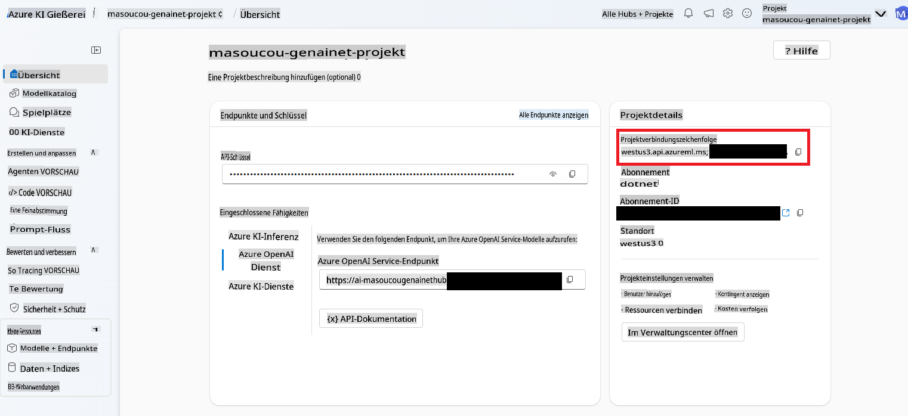

# KI-Agenten

In dieser Lektion lernen Sie, wie Sie eine KI-Entität erstellen, die... Entscheidungen trifft und Aktionen ausführt, ohne dass eine kontinuierliche menschliche Interaktion erforderlich ist? Genau, KI-Agenten sind in der Lage, spezifische Aufgaben eigenständig auszuführen.

---

[](https://youtu.be/Btkmw1Bosh0?feature=shared)

_⬆️Klicken Sie auf das Bild, um das Video anzusehen⬆️_

KI-Agenten ermöglichen es LLMs, sich von Assistenten zu eigenständigen Einheiten zu entwickeln, die im Namen der Benutzer handeln können. Agenten können sogar mit anderen Agenten interagieren, um Aufgaben auszuführen. Zu den wichtigsten Merkmalen eines Agenten gehören ein gewisses Maß an **Autonomie**, das es dem Agenten ermöglicht, basierend auf seiner Programmierung Aktionen zu initiieren. Dies führt zur Fähigkeit der **Entscheidungsfindung** basierend auf vordefinierten Zielen. Sie sind außerdem **anpassungsfähig**, da sie lernen und sich anpassen, um ihre Leistung im Laufe der Zeit zu verbessern.

Ein wichtiger Punkt, den Sie beim Erstellen von Agenten beachten sollten, ist, dass sie sich auf eine einzige Aufgabe konzentrieren. Sie sollten ihren Zweck so eng wie möglich definieren.

> 🧑‍🏫**Mehr erfahren**: Erfahren Sie mehr über die Grundlagen von KI-Agenten [Generative AI for Beginners: AI Agents](https://github.com/microsoft/generative-ai-for-beginners/tree/main/17-ai-agents).

## Erstellen eines KI-Agenten

Um einen KI-Agenten in .NET zu erstellen, arbeiten wir mit einigen neuen Konzepten. Wir verwenden ein neues SDK und müssen in Azure AI Foundry einige zusätzliche Konfigurationen vornehmen, um loszulegen.

> 🧑‍💻**Beispielcode**: Für diese Lektion arbeiten wir mit dem [AgentLabs-01-Simple Beispiel](../../../03-CoreGenerativeAITechniques/src/AgentLabs-01-Simple).
>
> Es gibt auch einige fortgeschrittenere Beispiele im `/src/`-Ordner. Sie können die README-Dateien von [AgentLabs-02-Functions](../../../03-CoreGenerativeAITechniques/src/AgentLabs-02-Functions), [AgentLabs-03-OpenAPIs](../../../03-CoreGenerativeAITechniques/src/AgentLabs-03-OpenAPIs) oder [AgentLabs-03-PythonParksInformationServer](../../../03-CoreGenerativeAITechniques/src/AgentLabs-03-PythonParksInformationServer) ansehen, um mehr über diese zu erfahren.

### Azure AI Agent Service

Wir stellen einen neuen Azure-Dienst vor, der uns beim Erstellen von Agenten unterstützt, den passend benannten [Azure AI Agent Service](https://learn.microsoft.com/azure/ai-services/agents/overview).

Um die in dieser Lektion enthaltenen Codebeispiele auszuführen, müssen Sie in Azure AI Foundry einige zusätzliche Konfigurationen vornehmen. Sie können [diese Anleitung zum Einrichten eines **Basic Agent**](https://learn.microsoft.com/azure/ai-services/agents/quickstart?pivots=programming-language-csharp) befolgen.

### Azure AI Projects-Bibliothek

Agenten bestehen aus drei Teilen. Dem **LLM** oder Modell. **State** oder Kontext (ähnlich wie ein Gespräch), der Entscheidungen auf der Grundlage früherer Ergebnisse leitet. Und **Tools**, die wie [Funktionen, die wir zuvor gelernt haben](./01-lm-completions-functions.md#function-calling), eine Brücke zwischen dem Modell und externen Systemen darstellen.

Theoretisch könnten Sie KI-Agenten mit dem, was Sie bereits gelernt haben, erstellen. Aber die **Azure AI Projects for .NET**-Bibliothek erleichtert die Entwicklung von Agenten, indem sie eine API bereitstellt, die viele typische Aufgaben für Sie vereinfacht.

Es gibt einige Konzepte (die Klassen entsprechen), die Sie verstehen müssen, wenn Sie mit der Azure AI Projects-Bibliothek arbeiten.

- `AgentClient`: Der übergeordnete Client, der die Agenten erstellt und hostet, Threads verwaltet, auf denen sie ausgeführt werden, und die Verbindung zur Cloud herstellt.
- `Agent`: Der Agent, der Anweisungen enthält, was er tun soll, sowie Definitionen für Tools, auf die er zugreifen kann.
- `ThreadMessage`: Diese sind Nachrichten – fast wie Eingabeaufforderungen, die wir zuvor gelernt haben – die an den Agenten weitergegeben werden. Agenten erstellen auch `ThreadMessage`-Objekte, um zu kommunizieren.
- `ThreadRun`: Ein Thread, auf dem Nachrichten an den Agenten weitergegeben werden. Der Thread wird gestartet und kann mit zusätzlichen Anweisungen versehen werden und wird dann nach seinem Status abgefragt.

Schauen wir uns ein einfaches Beispiel an, wie das funktioniert!

### Erstellen eines Mathematik-Agenten

Wir erstellen einen Agenten mit einer einzigen Aufgabe, der als Tutor für Mathematikschüler fungiert. Seine einzige Aufgabe ist es, mathematische Probleme zu lösen und sie dem Benutzer zu erklären.

1. Zuerst müssen wir ein `AgentsClient`-Objekt erstellen, das für die Verwaltung der Verbindung zu Azure, des Agenten selbst, der Threads, der Nachrichten usw. verantwortlich ist.

    ```csharp
    string projectConnectionString = "< YOU GET THIS FROM THE PROJECT IN AI FOUNDRY >";
    AgentsClient client = new(projectConnectionString, new DefaultAzureCredential());
    ```

    Sie finden den Verbindungsstring des Projekts in AI Foundry, indem Sie den erstellten Hub und dann das Projekt öffnen. Er wird auf der rechten Seite angezeigt.

    

1. Als Nächstes möchten wir den Tutor-Agenten erstellen. Denken Sie daran, er sollte sich nur auf eine einzige Aufgabe konzentrieren.
   
    ```csharp
    Agent tutorAgent = (await client.CreateAgentAsync(
    model: "gpt-4o",
    name: "Math Tutor",
    instructions: "You are a personal math tutor. Write and run code to answer math questions.",
    tools: [new CodeInterpreterToolDefinition()])).Value;
    ```

    Ein paar Dinge sind hier zu beachten. Das erste ist `tools` parameter. We're creating a `CodeInterpreterToolDefinition` object (that is apart of the **Azure.AI.Projects** SDK) that will allow the agent to create and execute code.

    > 🗒️**Note**: You can create your own tools too. See the [Functions](../../../03-CoreGenerativeAITechniques/src/AgentLabs-02-Functions) to learn more.

    Second note the `instructions` that are being sent along. It's a prompt and we're limiting it to answer math questions. Then last creating the agent is an async operation. That's because it's creating an object within Azure AI Foundry Agents service. So we both `await` the `CreateAgentAsync` function and then grab the `Value`, um auf das tatsächliche `Agent`-Objekt zuzugreifen. Dieses Muster wird immer wieder auftreten, wenn Sie Objekte mit dem **Azure.AI.Projects**-SDK erstellen.

1. Ein `AgentThread` ist ein Objekt, das die Kommunikation zwischen einzelnen Agenten, dem Benutzer usw. verwaltet. Wir müssen diesen erstellen, damit wir eine `ThreadMessage` hinzufügen können. In diesem Fall ist es die erste Frage des Benutzers.

    ```csharp
    AgentThread thread = (await client.CreateThreadAsync()).Value;

    // Creating the first user message to AN agent - notice how we're putting it on a thread
    ThreadMessage userMessage = (await client.CreateMessageAsync(
        thread.Id,
        MessageRole.User,
        "Hello, I need to solve the equation `3x + 11 = 14`. Can you help me?")
    ).Value;
    ```

    Beachten Sie, dass `ThreadMessage` den Typ `MessageRole.User` hat. Und beachten Sie, dass wir die Nachricht nicht an einen bestimmten Agenten senden, sondern sie einfach auf einen Thread setzen.

1. Als Nächstes bringen wir den Agenten dazu, eine erste Antwort zu geben, diese auf den Thread zu setzen und dann den Thread zu starten. Beim Start des Threads geben wir die ID des initialen Agenten an, der ausgeführt werden soll, sowie zusätzliche Anweisungen.

    ```csharp
    ThreadMessage agentMessage =  await client.CreateMessageAsync(
        thread.Id,
        MessageRole.Agent,
        "Please address the user as their name. The user has a basic account, so just share the answer to the question.")
    ).Value;

    ThreadRun run = (await client.CreateRunAsync(
        thread.Id,
        assistantId: agentMathTutor.Id, 
        additionalInstructions: "You are working in FREE TIER EXPERIENCE mode`, every user has premium account for a short period of time. Explain detailed the steps to answer the user questions")
    ).Value;
    ```

1. Alles, was noch zu tun bleibt, ist den Status des Threads abzufragen.

    ```csharp
    do
    {
        await Task.Delay(Timespan.FromMilliseconds(100));
        run = (await client.GetRunAsync(thread.Id, run.Id)).Value;

        Console.WriteLine($"Run Status: {run.Status}");
    }
    while (run.Status == RunStatus.Queued || run.Status == RunStatus.InProgress);
    ```

1. Und schließlich die Nachrichten aus den Ergebnissen anzuzeigen.

    ```csharp
    Response<PageableList<ThreadMessage>> afterRunMessagesResponse = await client.GetMessagesAsync(thread.Id);
    IReadOnlyList<ThreadMessage> messages = afterRunMessagesResponse.Value.Data;

    // sort by creation date
    messages = messages.OrderBy(m => m.CreatedAt).ToList();

    foreach (ThreadMessage msg in messages)
    {
        Console.Write($"{msg.CreatedAt:yyyy-MM-dd HH:mm:ss} - {msg.Role,10}: ");

        foreach (MessageContent contentItem in msg.ContentItems)
        {
            if (contentItem is MessageTextContent textItem)
                Console.Write(textItem.Text);
        }
        Console.WriteLine();
    }
    ```

> 🙋 **Hilfe benötigt?**: Wenn Sie auf Probleme stoßen, [öffnen Sie ein Issue im Repository](https://github.com/microsoft/Generative-AI-for-beginners-dotnet/issues/new).

Der logische nächste Schritt besteht darin, mehrere Agenten zu verwenden, um ein autonomes System zu erstellen. Ein nächster Schritt könnte beispielsweise ein Agent sein, der überprüft, ob der Benutzer ein Premium-Konto hat oder nicht.

## Zusammenfassung

KI-Agenten sind autonome KI-Entitäten, die über einfache Chat-Interaktionen hinausgehen – sie können:

- Unabhängige Entscheidungen treffen: Aufgaben ausführen, ohne ständige menschliche Eingaben
- Kontext beibehalten: Zustand halten und frühere Interaktionen erinnern
- Tools nutzen: Auf externe Systeme und APIs zugreifen, um Aufgaben zu erledigen
- Zusammenarbeiten: Mit anderen Agenten zusammenarbeiten, um komplexe Probleme zu lösen

Und Sie haben gelernt, wie Sie den **Azure AI Agents**-Dienst mit dem **Azure AI Project**-SDK verwenden, um einen rudimentären Agenten zu erstellen.

Denken Sie an Agenten als KI-Assistenten mit Handlungsspielraum – sie reagieren nicht nur, sondern handeln basierend auf ihrer Programmierung und ihren Zielen.

## Weitere Ressourcen

- [Erstellen eines minimalen Agenten mit .NET](https://learn.microsoft.com/dotnet/ai/quickstarts/quickstart-assistants?pivots=openai)
- [Orchestrierung mit mehreren Agenten](https://techcommunity.microsoft.com/blog/educatordeveloperblog/using-azure-ai-agent-service-with-autogen--semantic-kernel-to-build-a-multi-agen/4363121)
- [Semantic Kernel Agent Framework](https://learn.microsoft.com/semantic-kernel/frameworks/agent/?pivots=programming-language-csharp)
- [KI-Agenten - Einsteigerreihe zu GenAI](https://github.com/microsoft/generative-ai-for-beginners/tree/main/17-ai-agents)

## Nächste Schritte

Sie haben einen weiten Weg zurückgelegt! Vom Erlernen einfacher Textvervollständigungen bis hin zur Erstellung von Agenten!

👉 [In der nächsten Lektion sehen Sie einige praktische Beispiele](../04-PracticalSamples/readme.md) für die Anwendung all dessen zusammen.

**Haftungsausschluss**:  
Dieses Dokument wurde mit KI-gestützten maschinellen Übersetzungsdiensten übersetzt. Obwohl wir uns um Genauigkeit bemühen, beachten Sie bitte, dass automatisierte Übersetzungen Fehler oder Ungenauigkeiten enthalten können. Das Originaldokument in seiner ursprünglichen Sprache sollte als maßgebliche Quelle betrachtet werden. Für kritische Informationen wird eine professionelle menschliche Übersetzung empfohlen. Wir übernehmen keine Haftung für Missverständnisse oder Fehlinterpretationen, die sich aus der Nutzung dieser Übersetzung ergeben.