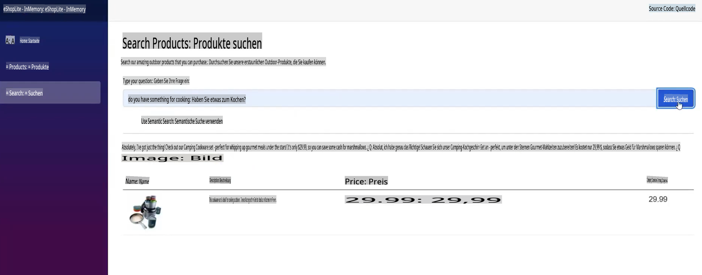
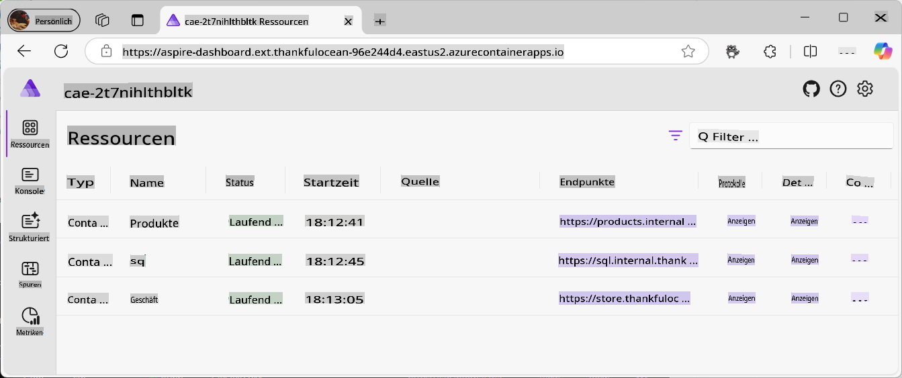
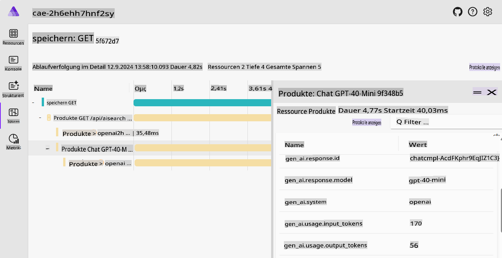
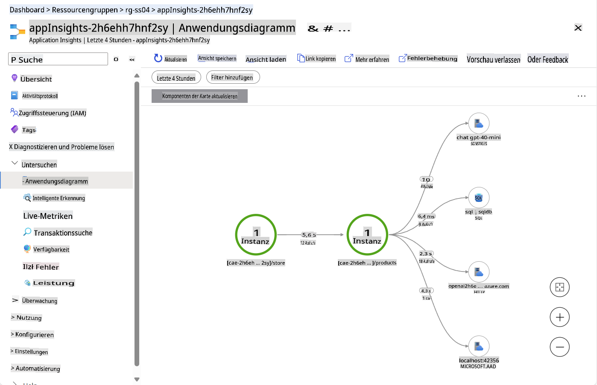
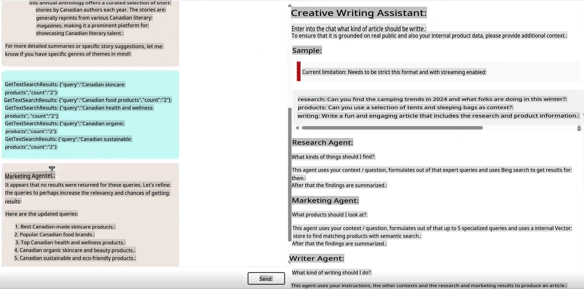
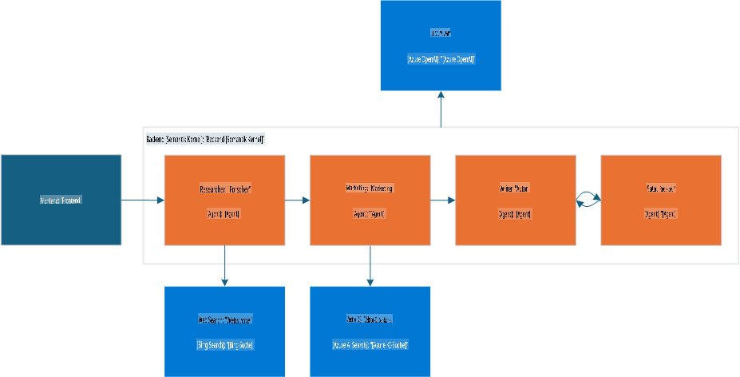
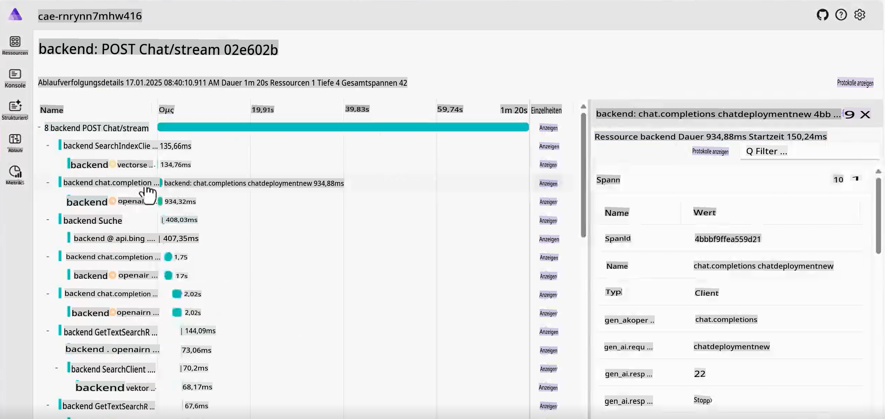
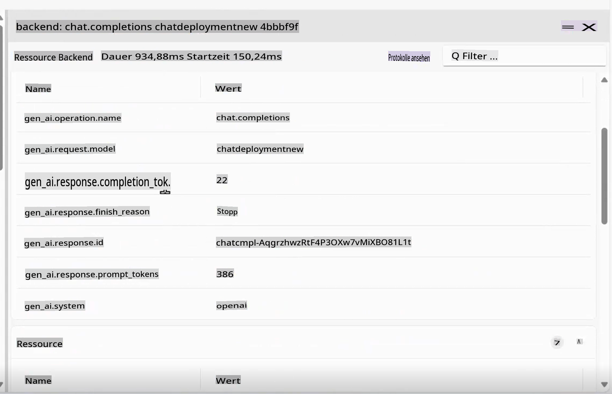

# Kanonische Generative KI-Beispiele

Sehen Sie alle Konzepte, die Sie gelernt haben, in Aktion in diesen praxisnahen und realen Beispielen.

---

## Was Sie erreichen werden

- Erfahren Sie, wie GenAI in bestehende Anwendungen integriert werden kann.
- Verstehen Sie, wie Agenten in komplexen Szenarien arbeiten.

## Enthaltene Beispiele
- [Kanonische Generative KI-Beispiele](../../../04-PracticalSamples)
  - [Was Sie erreichen werden](../../../04-PracticalSamples)
  - [Enthaltene Beispiele](../../../04-PracticalSamples)
  - [eShopLite-Demos](../../../04-PracticalSamples)
    - [eShopLite mit semantischer Suche - In Memory](../../../04-PracticalSamples)
    - [eShopLite mit semantischer Suche - Azure AI Search](../../../04-PracticalSamples)
    - [eShopLite mit Echtzeit-Audio](../../../04-PracticalSamples)
  - [Creative Writer Agent](../../../04-PracticalSamples)
  - [Zusammenfassung](../../../04-PracticalSamples)
    - [Zusätzliche Ressourcen](../../../04-PracticalSamples)
    - [Nächste Schritte](../../../04-PracticalSamples)


[](https://youtu.be/Ky4CACXJqR8?feature=shared)

_⬆️Klicken Sie auf das Bild, um das Video anzusehen⬆️_

## eShopLite-Demos

In unseren ersten Demos erkunden wir die **eShopLite**-Projekte. **eShopLite** ist eine einfache E-Commerce-Anwendung für Outdoor- und Camping-Enthusiasten, die mit generativen KI-Funktionen erweitert wurde, wie z. B. Optimierung der Suchfunktionen, Kundenbetreuung und Echtzeit-Audioanalyse.

Diese Demos nutzen [Azure OpenAI](https://azure.microsoft.com/products/ai-services/openai-service) und [Azure AI Foundry Models](https://ai.azure.com/), um die Inferenzprozesse (den generativen KI-Teil) für die Anwendungen durchzuführen.

Im ersten Demo zeigen wir, wie der Semantic Kernel verwendet wird, um die Suchfunktionen zu verbessern. Dieser versteht den Kontext der Benutzeranfragen und liefert präzise Ergebnisse.

### eShopLite mit semantischer Suche

[](https://youtu.be/FlkruF6USro?feature=shared)

_⬆️Klicken Sie auf das Bild, um das Video anzusehen⬆️_

In eShopLite mit semantischer Suche nutzen wir den Semantic Kernel, um die Suchfunktionen der E-Commerce-Anwendung zu verbessern. Der Semantic Kernel hilft uns, eine robustere Suchmaschine zu erstellen, die den Kontext der Benutzeranfragen versteht und präzisere Ergebnisse liefert.

Zum Beispiel: Wenn ein Benutzer nach "Haben Sie etwas zum Kochen?" sucht, kann die Suchmaschine verstehen, dass der Benutzer nach Küchenutensilien sucht, und die relevantesten Produkte anzeigen. In unserem Beispiel werden Camping-Kochgeschirr-Produkte zurückgegeben.

> 🧑‍💻**Beispiel**: Sehen Sie sich das [eShopLite-Beispiel für semantische Suche](https://aka.ms/netaieshoplitesemanticsearch) an.



Die semantische Suche kann Benutzern helfen, die benötigten Produkte leichter zu finden, was zu einem besseren Einkaufserlebnis und höheren Verkaufszahlen führt. Um diese Funktion zu implementieren, benötigen wir einen Vektorspeicher mit den Produkten, einen Suchindex und ein Sprachmodell. Das [.NET Aspire](https://learn.microsoft.com/dotnet/aspire/get-started/aspire-overview)-Tooling hilft, alle Prozesse im Backend zu koordinieren.



Im .NET Aspire-Dashboard können wir die Produkte, SQL- und Speichercontainer sehen, die mit dem Sprachmodell interagieren können. Ein genauerer Blick auf den Aspire App Host zeigt Folgendes:

```csharp
if (builder.ExecutionContext.IsPublishMode)
{
    // Add the Azure Application Insights for monitoring
    var appInsights = builder.AddAzureApplicationInsights("appInsights");
    // Add the Azure OpenAI for the chat and embeddings deployments, the embedding is used for the vector entities
    var chatDeploymentName = "gpt-4o-mini";
    var embeddingsDeploymentName = "text-embedding-ada-002";
    var aoai = builder.AddAzureOpenAI("openai")
        .AddDeployment(new AzureOpenAIDeployment(chatDeploymentName,
        "gpt-4o-mini",
        "2024-07-18",
        "GlobalStandard",
        10))
        .AddDeployment(new AzureOpenAIDeployment(embeddingsDeploymentName,
        "text-embedding-ada-002",
        "2"));

    products.WithReference(appInsights)
        .WithReference(aoai)
        .WithEnvironment("AI_ChatDeploymentName", chatDeploymentName)
        .WithEnvironment("AI_embeddingsDeploymentName", embeddingsDeploymentName);

    store.WithReference(appInsights)
        .WithExternalHttpEndpoints();
}
```

Der obige Code zeigt, wie Azure Application Insights für die Überwachung, Azure OpenAI für Chat- und Embedding-Bereitstellungen und die Embedding-Funktion für die Vektoreinheiten hinzugefügt werden.

Für die Erstellung von Embeddings und AOAI kann dies im Produktcontainer wie folgt gefunden werden:

```csharp
var azureOpenAiClientName = "openai";
builder.AddAzureOpenAIClient(azureOpenAiClientName);

// get azure openai client and create Chat client from aspire hosting configuration
builder.Services.AddSingleton<ChatClient>(serviceProvider =>
{
    var chatDeploymentName = "gpt-4o-mini";
    var logger = serviceProvider.GetService<ILogger<Program>>()!;
    logger.LogInformation($"Chat client configuration, modelId: {chatDeploymentName}");
    ChatClient chatClient = null;
    try
    {
        OpenAIClient client = serviceProvider.GetRequiredService<OpenAIClient>();
        chatClient = client.GetChatClient(chatDeploymentName);
    }...
}
```

Der obige Code zeigt, wie der Azure OpenAI-Client abgerufen und der Chat-Client aus der Aspire-Hosting-Konfiguration erstellt wird. Der `chatDeploymentName` ist der Name der Bereitstellung, die in der Anwendung verwendet wird. Der gleiche Prozess wird verwendet, um den Embedding-Client zu erstellen, wie folgt:

```csharp
// get azure openai client and create embedding client from aspire hosting configuration
builder.Services.AddSingleton<EmbeddingClient>(serviceProvider =>
{
    var embeddingsDeploymentName = "text-embedding-ada-002";
    var logger = serviceProvider.GetService<ILogger<Program>>()!;
    logger.LogInformation($"Embeddings client configuration, modelId: {embeddingsDeploymentName}");
    EmbeddingClient embeddingsClient = null;
    try
    {
        OpenAIClient client = serviceProvider.GetRequiredService<OpenAIClient>();
        embeddingsClient = client.GetEmbeddingClient(embeddingsDeploymentName);
    }...
});
```

Damit können wir den `MemoryContext` als unseren Vektorspeicher erstellen, um die Benutzeranfrage zu vergleichen und die relevantesten Produkte zurückzugeben, wie folgt:

```csharp
// Iterate over the products and add them to the memory
_logger.LogInformation("Adding product to memory: {Product}", product.Name);
var productInfo = $"[{product.Name}] is a product that costs [{product.Price}] and is described as [{product.Description}]";

// Create a new product vector
var productVector = new ProductVector
{
    Id = product.Id,
    Name = product.Name,
    Description = product.Description,
    Price = product.Price,
    ImageUrl = product.ImageUrl
};

// Generate the embedding for the product information
var result = await _embeddingClient.GenerateEmbeddingAsync(productInfo);

// Convert the embedding result to a float array and assign it to the product vector
productVector.Vector = result.Value.ToFloats();
var recordId = await _productsCollection.UpsertAsync(productVector);
_logger.LogInformation("Product added to memory: {Product} with recordId: {RecordId}", product.Name, recordId);
```

Der obige Code zeigt, wie die Produkte iteriert und dem Speicher hinzugefügt werden.

Nachdem wir einen neuen Produktvektor erstellt haben, verwenden wir ihn, um Embeddings für die Produktinformationen zu generieren, das Embedding-Ergebnis in ein Float-Array zu konvertieren und es dem Produktvektor zuzuweisen.

Schauen Sie sich `_productsCollection` an. Es handelt sich um eine Referenz auf den Container, in dem die Produkte gespeichert sind, wobei ein CosmosDB-Aufruf verwendet wird, um die Antwort für die `recordId` zu erhalten. Dies dient in diesem Fall der Protokollierung.

Das Produkt wird dann dem Speicher hinzugefügt, und der Prozess wird für jedes Produkt in der Sammlung wiederholt.

Wenn der Benutzer nach einem Produkt sucht, können wir die Benutzeranfrage mit den Produktvektoren vergleichen und die relevantesten Produkte zurückgeben.

```csharp
try
{
    // Generate embedding for the search query
    var result = await _embeddingClient.GenerateEmbeddingAsync(search);
    var vectorSearchQuery = result.Value.ToFloats();

    var searchOptions = new VectorSearchOptions()
    {
        Top = 1, // Retrieve the top 1 result
        VectorPropertyName = "Vector"
    };

    // Search the vector database for the most similar product
    var searchResults = await _productsCollection.VectorizedSearchAsync(vectorSearchQuery, searchOptions);
    double searchScore = 0.0;
    await foreach (var searchItem in searchResults.Results)
    {
        if (searchItem.Score > 0.5)
        {
            // Product found, retrieve the product details
            firstProduct = new Product
            {
                Id = searchItem.Record.Id,
                Name = searchItem.Record.Name,
                Description = searchItem.Record.Description,
                Price = searchItem.Record.Price,
                ImageUrl = searchItem.Record.ImageUrl
            };

            searchScore = searchItem.Score.Value;
            responseText = $"The product [{firstProduct.Name}] fits with the search criteria [{search}][{searchItem.Score.Value.ToString("0.00")}]";
            _logger.LogInformation($"Search Response: {responseText}");
        }
    }

    // Generate a friendly response message using the found product information
    var prompt = @$"You are an intelligent assistant helping clients with their search about outdoor products. Generate a catchy and friendly message using the following information:
    - User Question: {search}
    - Found Product Name: {firstProduct.Name}
    - Found Product Description: {firstProduct.Description}
    - Found Product Price: {firstProduct.Price}
    Include the found product information in the response to the user question.";

    var messages = new List<ChatMessage>
    {
        new SystemChatMessage(_systemPrompt),
        new UserChatMessage(prompt)
    };

    _logger.LogInformation("{ChatHistory}", JsonConvert.SerializeObject(messages));

    var resultPrompt = await _chatClient.CompleteChatAsync(messages);
}
```

Mit dem obigen Code generieren wir das Embedding für die Suchanfrage, durchsuchen die Vektordatenbank nach dem ähnlichsten Produkt und erhalten eine Antwortnachricht mit den Informationen des gefundenen Produkts.

So können Benutzer die benötigten Produkte leichter finden, was zu einem besseren Einkaufserlebnis und höheren Verkaufszahlen führt.

Da sich die generative KI weiterentwickelt, benötigen wir Telemetrie und Überwachung, um das Benutzerverhalten zu verstehen und die Suchmaschine zu verbessern. Hier kommen Azure Application Insights und .NET Aspire ins Spiel.



.NET Aspire bietet ein leistungsstarkes Set an Tools, um das Verhalten der Anwendung zu überwachen und nachzuverfolgen, einschließlich der Benutzerinteraktionen mit der Suchmaschine, Backend-Diensten und den KI-Modellen. Die Tracing-Funktionen können uns helfen, mögliche Engpässe, Fehler und Leistungsprobleme zu verstehen, sodass wir die Anwendung optimieren und ein besseres Benutzererlebnis bieten können.



Da Telemetrie entscheidend ist, um das Benutzerverhalten zu verstehen und Dienstleistungen zu verbessern, führen wir Azure Application Insights ein, um die Leistung der Anwendung und Benutzerinteraktionen zu überwachen.

Application Insights bietet eine umfassende Palette an Telemetriedaten, die uns helfen zu verstehen, wie unsere Dienste funktionieren und wie Benutzer mit der Anwendung und der Cloud-Umgebung interagieren.

Im Bild sehen wir das Application Insights-Dashboard, das zeigt, wie die Dienste funktionieren, z. B. die Datenbankaufrufe, die Anzahl der Anfragen und die Antwortzeit.

> 💡 **Tipp**: Weitere Informationen zu eShopLite mit semantischer Suche finden Sie im Repository: https://aka.ms/netaieshoplitesemanticsearch

### eShopLite mit semantischer Suche mit Azure AI Search

Im End-to-End-Demo von eShopLite nutzen wir **Azure AI Search**, um die Suchfunktionen der E-Commerce-Anwendung zu verbessern. Azure AI Search hilft uns, eine robustere Suchmaschine zu erstellen, die den Kontext der Benutzeranfragen versteht und präzisere Ergebnisse liefert.

Es bietet auch eine skalierbarere und zuverlässigere Suchmaschine, die große Datenmengen und Benutzeranfragen bewältigen kann. Azure AI Search ermöglicht es der Lösung, Suchindizes beizubehalten, sodass die Informationen auch nach einem Neustart der Anwendung verfügbar sind.

- [eShopLite mit Azure AI Search](https://aka.ms/netaieshoplitesemanticsearchazureaisearch)

### eShopLite mit Echtzeit-Audio

[](https://youtu.be/bx0hRNdr_bQ?feature=shared)

_⬆️Klicken Sie auf das Bild, um das Video anzusehen⬆️_

In eShopLite mit Echtzeit-Audio nutzen wir die Echtzeit-Audiofähigkeiten von GPT-4o, um die Gespräche zwischen dem Kunden und dem Chatbot zu analysieren und so ein personalisierteres und ansprechenderes Erlebnis zu schaffen. Zum Beispiel kann der Chatbot, wenn ein Kunde nach einer Produktempfehlung fragt, die Anfrage in Echtzeit analysieren und eine präzisere und relevantere Antwort geben.

> 🧑‍💻**Beispiel**: Sehen Sie sich das [eShopLite-Beispiel für Echtzeit-Chat](https://aka.ms/netaieshopliterealtimechat) an.


Um diese Funktion zu implementieren, müssen wir neue Funktionen hinzufügen, um die Endpunkte für die Echtzeitanalyse zu erstellen. Dies ist in der Implementierung von `StoreRealtime\ConversationManager.cs` für die Echtzeitanalyse zu finden.

```csharp
public async Task RunAsync(
    Stream audioInput, 
    Speaker audioOutput, 
    Func<string, Task> addMessageAsync, 
    Func<string, bool, Task> addChatMessageAsync, 
    CancellationToken cancellationToken)
{
    // Define the initial prompt for the assistant
    var prompt = $"""
        You are a useful assistant.
        Respond as succinctly as possible, in just a few words.
        Check the product database and external sources for information.
        The current date is {DateTime.Now.ToLongDateString()}
        """;
```

Zuerst definieren wir den initialen Prompt für den Assistenten, um dem Benutzer Anweisungen zur Interaktion mit dem Chatbot zu geben. Denken Sie daran, klare und prägnante Prompts zu verwenden, da Prompt-Engineering entscheidend ist, um präzise Ergebnisse von den KI-Modellen zu erhalten.

```csharp
// Notify the user that the connection is being established
await addMessageAsync("Connecting...");

// Send an initial greeting message
await addChatMessageAsync("Hello, how can I help?", false);

// Create AI functions for semantic search and product name search
var contosoSemanticSearchTool = AIFunctionFactory.Create(_contosoProductContext.SemanticSearchOutdoorProductsAsync);
var contosoSearchByProductNameTool = AIFunctionFactory.Create(_contosoProductContext.SearchOutdoorProductsByNameAsync);

// Add the AI functions to a list of tools
List<AIFunction> tools = new List<AIFunction> { contosoSemanticSearchTool, contosoSearchByProductNameTool };
```

Dann benachrichtigen wir den Benutzer, dass der Chat bereit ist, und senden eine Begrüßungsnachricht. Anschließend werden KI-Funktionen zum Suchen von Produkten, zur semantischen Suche und zur Suche nach Produktnamen erstellt und zu einer Liste von Tools hinzugefügt. Diese können verwendet werden, um dem Benutzer relevante Informationen zu seinen Anfragen bereitzustellen.

```csharp
// Configure the conversation session options
var sessionOptions = new ConversationSessionOptions()
{
    Instructions = prompt,
    Voice = ConversationVoice.Shimmer,
    InputTranscriptionOptions = new() { Model = "whisper-1" },
};

// Add each tool to the session options
foreach (var tool in tools)
{
    sessionOptions.Tools.Add(tool.ToConversationFunctionTool());
}

// Start the conversation session with the configured options
session = await client.StartConversationSessionAsync(cancellationToken);
await session.ConfigureSessionAsync(sessionOptions);

// Initialize a StringBuilder to store the output transcription
var outputTranscription = new StringBuilder();
```

Die Optionen für die Gesprächssitzung werden konfiguriert, einschließlich der Anweisungen, der Stimme und der Eingabetranskriptionsoptionen. Für die Eingabetranskription wird das Modell `Whisper-1` verwendet.

Jedes Tool wird zu den Sitzungsoptionen hinzugefügt, und die Gesprächssitzung wird mit den konfigurierten Optionen gestartet. Diese können angepasst werden, um den Bedürfnissen der Benutzer zu entsprechen.

> 🧑‍💻**Beispiel**: Sehen Sie sich das [eShopLite-Beispiel für Echtzeit-Chat](https://aka.ms/netaieshopliterealtimechat) an.

## Creative Writer Agent

[](https://youtu.be/ZjZWilI_5z8?feature=shared)

_⬆️Klicken Sie auf das Bild, um das Video anzusehen⬆️_

Agenten sind ein großes Thema in der aktuellen KI-Landschaft. Um ihre Fähigkeiten zu demonstrieren, verwenden wir den Creative Writer Agent, ein Tool, das kreative und ansprechende Texte basierend auf Benutzereingaben generieren kann. Dies hilft, recherchierte, spezifische und ansprechende Inhalte zu schreiben.

> 🧑‍💻**Beispiel**: Sehen Sie sich den [Creative Writing Agent-Beispielcode](https://aka.ms/netaicreativewriter) an.



Diese Lösung basiert auf vier speziellen Modulen, die zusammenarbeiten, um qualitativ hochwertige Inhalte zu erstellen:

- Researcher: Nutzt Bing-Suche, um Kontext, Themen und Daten zu sammeln, und fasst diese dann prägnant zusammen.
- Marketing: Interpretiert die Benutzerabsicht, stellt relevante Fragen und greift auf die Vector-Datenbank für präzise Ergebnisse zu.
- Writer: Synthetisiert die Ergebnisse von Researcher und Marketing und erstellt einen kohärenten Artikelentwurf.
- Editor: Bewertet den Entwurf, schlägt Korrekturen vor und entscheidet, ob er veröffentlichungsbereit ist.

Der Workflow integriert relevante Daten, effektive Botschaften und Überprüfung, orchestriert durch Semantic Kernel, Microsoft AI Extension und .NET Aspire.



Das Verständnis, wie die Komponenten miteinander interagieren, kann als Referenz für die Erstellung eigener Agentenanwendungen dienen. Schauen Sie sich den Code unten an, um zu verstehen, wie die Komponenten miteinander interagieren. Sehen Sie sich zuerst den Aufruf von `ChatController.cs` an den Creative Writer an:

```csharp
var userInput = request.Messages.Last();

// Deserialize the user input content into a CreateWriterRequest object
CreateWriterRequest createWriterRequest = _yamlDeserializer.Deserialize<CreateWriterRequest>(userInput.Content);

// Create a new session for the Creative Writer application
var session = await _creativeWriterApp.CreateSessionAsync(Response);

// Process the streaming request and write the response in real-time
await foreach (var delta in session.ProcessStreamingRequest(createWriterRequest))
{
    // Serialize the delta and write it to the response stream and flush
    await response.WriteAsync($"{JsonSerializer.Serialize(delta)}\r\n");
    await response.Body.FlushAsync();
}
```

Der Typ `CreateWriterRequest` needs to have three properties: `Research`, `Products`, and `Writing`. After getting them setted by processing the request, it calls the `CreateSessionAsync`-Methode sieht folgendermaßen aus:

```csharp
internal async Task<CreativeWriterSession> CreateSessionAsync(HttpResponse response)
{
    // Add custom function invocation filters to handle response modifications
    defaultKernel.FunctionInvocationFilters.Add(new FunctionInvocationFilter(response));

    // Create a separate kernel for Bing search integration and intialize the Bing service, and create a plugin for Bing search
    Kernel bingKernel = defaultKernel.Clone();
    BingTextSearch textSearch = new(apiKey: configuration["BingAPIKey"]!);
    KernelPlugin searchPlugin = textSearch.CreateWithSearch("BingSearchPlugin");
    bingKernel.Plugins.Add(searchPlugin);

    // Clone the default kernel to set up the vector search capabilities, and create the vector search kernel
    Kernel vectorSearchKernel = defaultKernel.Clone();
    await ConfigureVectorSearchKernel(vectorSearchKernel);

    // Return a new session encapsulating all configured kernels for comprehensive AI functionalities
    return new CreativeWriterSession(defaultKernel, bingKernel, vectorSearchKernel);
}
```

Nun können wir die `CreativeWriterSession` class for the `ProcessStreamingRequest` function, to understand how the components interact with each other, first look at the `Research` and `Marketing`-Komponenten sehen:

```csharp
// Initialize the Researcher Agent with a specific prompt template.
// This agent leverages the Bing Kernel for enhanced semantic search capabilities.
ChatCompletionAgent researcherAgent = new(ReadFileForPromptTemplateConfig("./Agents/Prompts/researcher.yaml"))
{
    Name = ResearcherName,
    Kernel = bingKernel,
    Arguments = CreateFunctionChoiceAutoBehavior(),
    LoggerFactory = bingKernel.LoggerFactory
};

// Initialize the Marketing Agent with its own prompt template.
// This agent utilizes the Vector Search Kernel to handle product-related queries efficiently.
ChatCompletionAgent marketingAgent = new(ReadFileForPromptTemplateConfig("./Agents/Prompts/marketing.yaml"))
{
    Name = MarketingName,
    Kernel = vectorSearchKernel,
    Arguments = CreateFunctionChoiceAutoBehavior(),
    LoggerFactory = vectorSearchKernel.LoggerFactory
};

// ...

// Invoke the Researcher Agent asynchronously with the provided research context.
await foreach (ChatMessageContent response in researcherAgent.InvokeAsync(
    new object[] { }, 
    new Dictionary<string, string> { { "research_context", createWriterRequest.Research } }))
{
    // Aggregate the research results for further processing or display.
    sbResearchResults.AppendLine(response.Content);
    
    yield return new AIChatCompletionDelta(Delta: new AIChatMessageDelta
    {
        Role = AIChatRole.Assistant,
        Context = new AIChatAgentInfo(ResearcherName),
        Content = response.Content,
    });
}

// ...

// Invoke the Marketing Agent with the provided product context.
await foreach (ChatMessageContent response in marketingAgent.InvokeAsync(
    new object[] { },
    new Dictionary<string, string> { { "product_context", createWriterRequest.Products } }))
{
    // Consolidate the product-related results for use in marketing strategies or user feedback.
    sbProductResults.AppendLine(response.Content);
    
    yield return new AIChatCompletionDelta(Delta: new AIChatMessageDelta
    {
        Role = AIChatRole.Assistant,
        Context = new AIChatAgentInfo(MarketingName),
        Content = response.Content,
    });
}
```

Jetzt initialisieren und konfigurieren wir die `Writer` and `Editor`-Agenten. Schauen Sie sich den Code an:

```csharp
// Initialize the Writer Agent with its specific prompt configuration
ChatCompletionAgent writerAgent = new(ReadFileForPromptTemplateConfig("./Agents/Prompts/writer.yaml"))
{
    Name = WriterName, 
    Kernel = kernel, /
    Arguments = new Dictionary<string, string>(), 
    LoggerFactory = kernel.LoggerFactory 
};

// Initialize the Editor Agent with its specific prompt configuration
ChatCompletionAgent editorAgent = new(ReadFileForPromptTemplateConfig("./Agents/Prompts/editor.yaml"))
{
    Name = EditorName, 
    Kernel = kernel, 
    LoggerFactory = kernel.LoggerFactory
};

// Populate the Writer Agent with contextual data required for generating content, gathered from the User, Researcher and Marketing Agents
writerAgent.Arguments["research_context"] = createWriterRequest.Research;
writerAgent.Arguments["research_results"] = sbResearchResults.ToString();
writerAgent.Arguments["product_context"] = createWriterRequest.Products;
writerAgent.Arguments["product_results"] = sbProductResults.ToString();
writerAgent.Arguments["assignment"] = createWriterRequest.Writing;

// Configure the Agent Group Chat to manage interactions between Writer and Editor
AgentGroupChat chat = new(writerAgent, editorAgent)
{
    LoggerFactory = kernel.LoggerFactory,
    ExecutionSettings = new AgentGroupChatSettings
    {
        // Define the strategy for selecting which agent interacts next
        SelectionStrategy = new SequentialSelectionStrategy() 
        { 
            InitialAgent = writerAgent // Start the conversation with the Writer Agent
        },
        // Define the termination condition for the agent interactions, in this case, the Editor Agent will terminate the conversation
        TerminationStrategy = new NoFeedbackLeftTerminationStrategy()
    }
};
```

In .NET Aspire sehen wir, wie die Komponenten orchestriert werden, um ein nahtloses Benutzererlebnis zu schaffen. Die Tracing-Funktion ermöglicht es uns, die Interaktionen zwischen den Agenten zu überwachen, und die Telemetrie-Funktion liefert Einblicke in das Benutzerverhalten und die Leistung der KI-Modelle.





> 🧑‍💻**Beispiel**: Schau dir den [Beispielcode für den Creative Writing Agent](https://aka.ms/netaicreativewriter) an.

## Zusammenfassung

Dies sind nur einige Beispiele dafür, wie du GenAI in deinen Anwendungen einsetzen kannst. Die Möglichkeiten sind nahezu unbegrenzt, und die Technologie entwickelt sich rasant weiter. Sieh dir einige unserer Ressourcen an, um mehr über GenAI zu erfahren und wie du es in deinen Projekten einsetzen kannst.

> 🙋 **Brauchen Sie Hilfe?**: Falls du auf Probleme stößt, eröffne ein Issue im Repository.

### Zusätzliche Ressourcen

- [eShopLite mit DeepSeek](https://aka.ms/netaieshoplitedeepseekr1)
- [eShopLite mit Azure AI Search](https://aka.ms/netaieshoplitesemanticsearchazureaisearch)

### Nächste Schritte

Erfahre mehr über verantwortungsvolle KI-Praktiken und wie du sicherstellen kannst, dass deine KI-Modelle ethisch sind und einen positiven Einfluss haben!

👉 [Verantwortungsvolle KI](../05-ResponsibleGenAI/readme.md)

**Haftungsausschluss**:  
Dieses Dokument wurde mit KI-gestützten maschinellen Übersetzungsdiensten übersetzt. Obwohl wir uns um Genauigkeit bemühen, beachten Sie bitte, dass automatisierte Übersetzungen Fehler oder Ungenauigkeiten enthalten können. Das Originaldokument in seiner ursprünglichen Sprache sollte als maßgebliche Quelle betrachtet werden. Für kritische Informationen wird eine professionelle menschliche Übersetzung empfohlen. Wir übernehmen keine Haftung für Missverständnisse oder Fehlinterpretationen, die aus der Nutzung dieser Übersetzung entstehen.