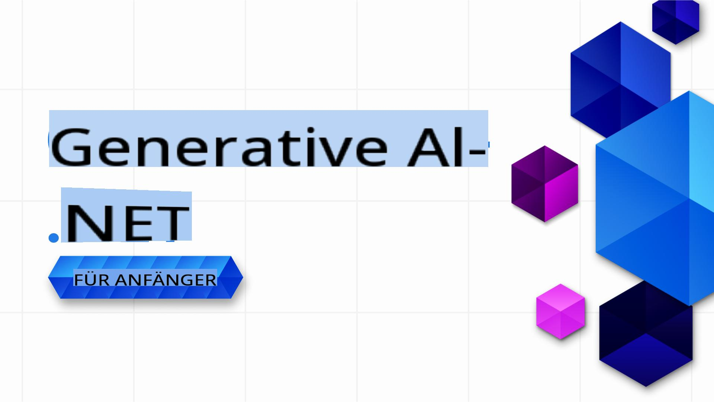

# Generative AI für Anfänger .NET - Ein Kurs

### Praktische Lektionen, die Ihnen zeigen, wie Sie Generative AI-Anwendungen in .NET entwickeln können

Willkommen bei **Generative AI für Anfänger .NET**, dem praxisorientierten Kurs für .NET-Entwickler, die in die Welt der Generativen KI eintauchen möchten!

Dies ist kein typischer „Hier ist etwas Theorie, viel Glück“-Kurs. Dieses Repository dreht sich um **praxisnahe Anwendungen** und **Live-Coding**, um .NET-Entwicklern die Möglichkeit zu geben, das volle Potenzial von Generativer KI auszuschöpfen.

Der Kurs ist **hands-on**, **praktisch** und darauf ausgelegt, **Spaß zu machen**!

Vergessen Sie nicht, [dieses Repository zu favorisieren (🌟)](https://docs.github.com/en/get-started/exploring-projects-on-github/saving-repositories-with-stars), damit Sie es später leichter finden.

➡️ Erstellen Sie Ihre eigene Kopie, indem Sie [dieses Repository forken](https://github.com/microsoft/Generative-AI-for-beginners-dotnet/fork) und es anschließend in Ihren eigenen Repositories wiederfinden.

## ✨ Was ist neu!

Wir verbessern diesen Kurs kontinuierlich mit den neuesten KI-Tools, Modellen und praktischen Beispielen:

- **Neu: Azure OpenAI Sora Video-Generierungs-Demo!**
  - Lektion 3 bietet jetzt eine praktische Demonstration, die zeigt, wie man Videos aus Text-Prompts mit dem neuen [Sora Video-Generierungsmodell](https://learn.microsoft.com/azure/ai-services/openai/concepts/video-generation) in Azure OpenAI generiert.
  - Das Beispiel demonstriert, wie man:
    - Einen Video-Generierungsauftrag mit einem kreativen Prompt einreicht.
    - Den Auftragsstatus abfragt und die resultierende Videodatei automatisch herunterlädt.
    - Das generierte Video auf dem Desktop zur einfachen Anzeige speichert.
  - Siehe die offizielle Dokumentation: [Azure OpenAI Sora Video-Generierung](https://learn.microsoft.com/azure/ai-services/openai/concepts/video-generation)
  - Finden Sie das Beispiel unter [Lektion 3: Grundlegende Generative KI-Techniken /src/VideoGeneration-AzureSora-01/Program.cs](../03-CoreGenerativeAITechniques/src/VideoGeneration-AzureSora-01/Program.cs)

- **Neu: Azure OpenAI Bild-Generierungsmodell (`gpt-image-1`)**: Lektion 3 bietet jetzt Codebeispiele für die Verwendung des neuen Azure OpenAI Bild-Generierungsmodells `gpt-image-1`. Lernen Sie, wie Sie Bilder aus .NET mit den neuesten Azure OpenAI-Funktionen generieren.
  - Siehe die offizielle Dokumentation: [Wie man Azure OpenAI Bild-Generierungsmodelle verwendet](https://learn.microsoft.com/azure/ai-services/openai/how-to/dall-e?tabs=gpt-image-1) und den [openai-dotnet Bild-Generierungsleitfaden](https://github.com/openai/openai-dotnet?tab=readme-ov-file#how-to-generate-images) für weitere Details.
  - Finden Sie das Beispiel unter [Lektion 3: Grundlegende Generative KI-Techniken .. /src/ImageGeneration-01.csproj](../03-CoreGenerativeAITechniques/src/ImageGeneration-01/ImageGeneration-01.csproj).

- **Neues Szenario: Parallele Agent-Orchestrierung in eShopLite**: Das [eShopLite Repository](https://github.com/Azure-Samples/eShopLite/tree/main/scenarios/07-AgentsConcurrent) bietet jetzt ein Szenario, das parallele Agent-Orchestrierung mit Semantic Kernel demonstriert. Dieses Szenario zeigt, wie mehrere Agenten parallel arbeiten können, um Benutzeranfragen zu analysieren und wertvolle Erkenntnisse für zukünftige Analysen zu liefern.

[Alle vorherigen Updates in unserem Was ist neu-Bereich anzeigen](./10-WhatsNew/readme.md)

## 🚀 Einführung

Generative KI revolutioniert die Softwareentwicklung, und .NET bildet da keine Ausnahme. Ziel dieses Kurses ist es, den Einstieg zu erleichtern, indem er Folgendes bietet:

- Kurze Videos von 5-10 Minuten für jede Lektion.
- Voll funktionsfähige .NET-Codebeispiele, die Sie ausführen und erkunden können.
- Integration mit Tools wie **GitHub Codespaces** und **GitHub Models** für eine nahtlose Einrichtung und schnellen Einstieg ins Programmieren. Wenn Sie die Beispiele lieber lokal mit Ihren eigenen Modellen ausführen möchten, ist das ebenfalls möglich.

Sie lernen, wie Sie Generative KI in .NET-Projekte implementieren, von grundlegender Textgenerierung bis hin zum Aufbau vollständiger Lösungen mit **GitHub Models**, **Azure OpenAI Services** und **lokalen Modellen mit Ollama**.

## 📦 Jede Lektion enthält

- **Kurzes Video**: Eine schnelle Übersicht zur Lektion (5-10 Minuten).
- **Vollständige Codebeispiele**: Voll funktionsfähig und bereit zur Ausführung.
- **Schritt-für-Schritt-Anleitung**: Einfache Anweisungen, um die Konzepte zu verstehen und umzusetzen.
- **Vertiefende Referenzen**: Dieser Kurs konzentriert sich auf die praktische Umsetzung von Generativer KI. Für tiefergehende theoretische Erklärungen bieten wir Links zu [Generative AI for Beginners - A Course](https://github.com/microsoft/generative-ai-for-beginners) an, wenn nötig.

## 🗃️ Lektionen

| #   | **Lektionslink** | **Beschreibung** |
| --- | --- | --- |
| 01  | [**Einführung in die Grundlagen der Generativen KI für .NET-Entwickler**](./01-IntroToGenAI/readme.md) | <ul><li>Überblick über generative Modelle und ihre Anwendungen in .NET</li></ul> |
| 02  | [**Einrichtung der Entwicklungsumgebung für Generative KI mit .NET**](./02-SetupDevEnvironment/readme.md) | <ul><li>Verwendung von Bibliotheken wie **Microsoft.Extensions.AI** und **Semantic Kernel**.</li><li>Einrichtung von Anbietern wie GitHub Models, Azure AI Foundry und lokaler Entwicklung mit Ollama.</li></ul> |
| 03  | [**Kerntechniken der Generativen KI mit .NET**](./03-CoreGenerativeAITechniques/readme.md) | <ul><li>Textgenerierung und Konversationsflüsse.</li><li>Multimodale Fähigkeiten (Vision und Audio).</li><li>Agenten</li></ul> |
| 04  | [**Praktische Beispiele für Generative KI mit .NET**](./04-PracticalSamples/readme.md) | <ul><li>Komplette Beispiele, die Generative KI in realen Szenarien demonstrieren</li><li>Anwendungen für semantische Suche.</li><li>Anwendungen mit mehreren Agenten</li></ul> |
| 05  | [**Verantwortungsvoller Einsatz von Generativer KI in .NET-Anwendungen**](./05-ResponsibleGenAI/readme.md) | <ul><li>Ethische Überlegungen, Vermeidung von Verzerrungen und sichere Implementierungen.</li></ul> |

## 🌐 Mehrsprachige Unterstützung

| Sprache              | Code | Link zur übersetzten README                              | Letzte Aktualisierung |
|----------------------|------|---------------------------------------------------------|-----------------------|
| Chinesisch (vereinfacht) | zh   | [Chinesische Übersetzung](../zh/README.md)  | 2025-02-19           |
| Chinesisch (traditionell)| tw   | [Chinesische Übersetzung](../tw/README.md)  | 2025-02-19           |
| Französisch          | fr   | [Französische Übersetzung](../fr/README.md)  | 2025-02-19           |
| Japanisch            | ja   | [Japanische Übersetzung](../ja/README.md)    | 2025-02-19           |
| Koreanisch           | ko   | [Koreanische Übersetzung](../ko/README.md)   | 2025-02-19           |
| Portugiesisch        | pt   | [Portugiesische Übersetzung](../pt/README.md)| 2025-02-19           |
| Spanisch             | es   | [Spanische Übersetzung](../es/README.md)     | 2025-02-19           |
| Deutsch              | de   | [Deutsche Übersetzung](./README.md)      | 2025-02-19           |

## 🛠️ Was Sie benötigen

Um loszulegen, benötigen Sie:

1. Ein **GitHub-Konto** (ein kostenloses reicht aus!), um [dieses Repository zu forken](https://github.com/microsoft/generative-ai-for-beginners-dotnet/fork) und es in Ihrem eigenen GitHub-Konto zu speichern.

1. **GitHub Codespaces aktiviert**, um sofortige Entwicklungsumgebungen nutzen zu können. Sie können GitHub Codespaces in den Repository-Einstellungen aktivieren. Erfahren Sie mehr über GitHub Codespaces [hier](https://docs.github.com/en/codespaces).

1. Erstellen Sie Ihre Kopie, indem Sie [dieses Repository forken](https://github.com/microsoft/Generative-AI-for-beginners-dotnet/fork), oder nutzen Sie die `Fork`-Schaltfläche oben auf dieser Seite.

1. Grundkenntnisse in **.NET-Entwicklung**. Erfahren Sie mehr über .NET [hier](https://dotnet.microsoft.com/learn/dotnet/what-is-dotnet).

Das war's.

Wir haben diesen Kurs so gestaltet, dass er möglichst reibungslos abläuft. Wir nutzen Folgendes, um Ihnen den Einstieg zu erleichtern:

- **Ausführung in GitHub Codespaces**: Mit einem Klick erhalten Sie eine vorkonfigurierte Umgebung, um die Lektionen zu testen und zu erkunden.
- **Nutzen Sie GitHub-Modelle**: Probieren Sie KI-gestützte Demos aus, die direkt in diesem Repository gehostet werden. Wir erklären mehr in den Lektionen, während wir fortschreiten. *(Wenn Sie mehr über GitHub-Modelle erfahren möchten, klicken Sie [hier](https://docs.github.com/github-models))*

Wenn Sie bereit sind, weiter zu expandieren, haben wir auch Anleitungen für:

- Ein Upgrade auf **Azure OpenAI Services** für skalierbare und unternehmensgerechte Lösungen.
- Die Nutzung von **Ollama**, um Modelle lokal auf Ihrer Hardware auszuführen und so Datenschutz und Kontrolle zu verbessern.

## 🤝 Möchten Sie helfen?

Beiträge sind willkommen! So können Sie unterstützen:

- [Melden Sie Probleme](https://github.com/microsoft/Generative-AI-for-beginners-dotnet/issues/new) oder Fehler in diesem Repository.

- Verbessern Sie vorhandene Codebeispiele oder fügen Sie neue hinzu, indem Sie dieses Repository forken und Änderungen vorschlagen!
- Schlagen Sie zusätzliche Lektionen oder Verbesserungen vor.
- Haben Sie Vorschläge oder Rechtschreib- oder Codefehler gefunden? [Erstellen Sie einen Pull Request](https://github.com/microsoft/Generative-AI-for-beginners-dotnet/compare)

Schauen Sie sich die Datei [CONTRIBUTING.md](CONTRIBUTING.md) an, um Details darüber zu erfahren, wie Sie sich einbringen können.

## 📄 Lizenz

Dieses Projekt ist unter der MIT-Lizenz lizenziert – sehen Sie sich die Datei [LICENSE](../../LICENSE) für Details an.

## 🌐 Andere Kurse

Wir haben viele weitere Inhalte, die Ihnen auf Ihrer Lernreise helfen können. Schauen Sie sich folgende an:

- [Generative KI für Anfänger](https://aka.ms/genai-beginners)
- [Generative KI für Anfänger .NET](https://github.com/microsoft/Generative-AI-for-beginners-dotnet)
- [Generative KI mit JavaScript](https://github.com/microsoft/generative-ai-with-javascript)
- [KI für Anfänger](https://aka.ms/ai-beginners)
- [KI-Agenten für Anfänger – Ein Kurs](https://github.com/microsoft/ai-agents-for-beginners)
- [Datenwissenschaft für Anfänger](https://aka.ms/datascience-beginners)
- [ML für Anfänger](https://aka.ms/ml-beginners)
- [Cybersicherheit für Anfänger](https://github.com/microsoft/Security-101) 
- [Webentwicklung für Anfänger](https://aka.ms/webdev-beginners)
- [IoT für Anfänger](https://aka.ms/iot-beginners)
- [XR-Entwicklung für Anfänger](https://github.com/microsoft/xr-development-for-beginners)
- [GitHub Copilot für Pair Programming meistern](https://github.com/microsoft/Mastering-GitHub-Copilot-for-Paired-Programming)
- [GitHub Copilot für C#/.NET-Entwickler meistern](https://github.com/microsoft/mastering-github-copilot-for-dotnet-csharp-developers)
- [Wählen Sie Ihr eigenes Copilot-Abenteuer](https://github.com/microsoft/CopilotAdventures)

[Beginnen wir mit dem Lernen von Generativer KI und .NET!](02-SetupDevEnvironment/readme.md) 🚀

**Haftungsausschluss**:  
Dieses Dokument wurde mithilfe von KI-gestützten maschinellen Übersetzungsdiensten übersetzt. Obwohl wir uns um Genauigkeit bemühen, weisen wir darauf hin, dass automatisierte Übersetzungen Fehler oder Ungenauigkeiten enthalten können. Das Originaldokument in seiner ursprünglichen Sprache sollte als maßgebliche Quelle betrachtet werden. Für kritische Informationen wird eine professionelle menschliche Übersetzung empfohlen. Wir übernehmen keine Haftung für Missverständnisse oder Fehlinterpretationen, die sich aus der Nutzung dieser Übersetzung ergeben.