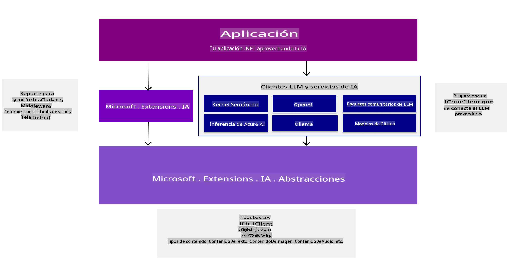
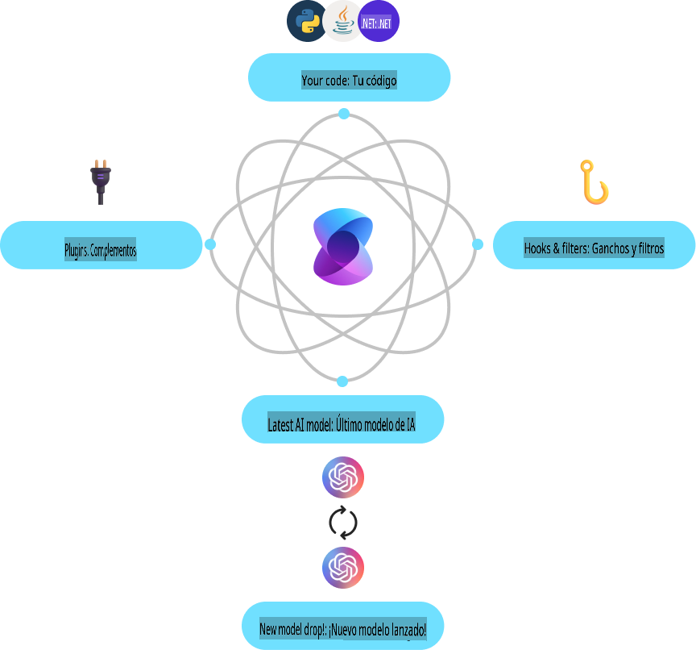
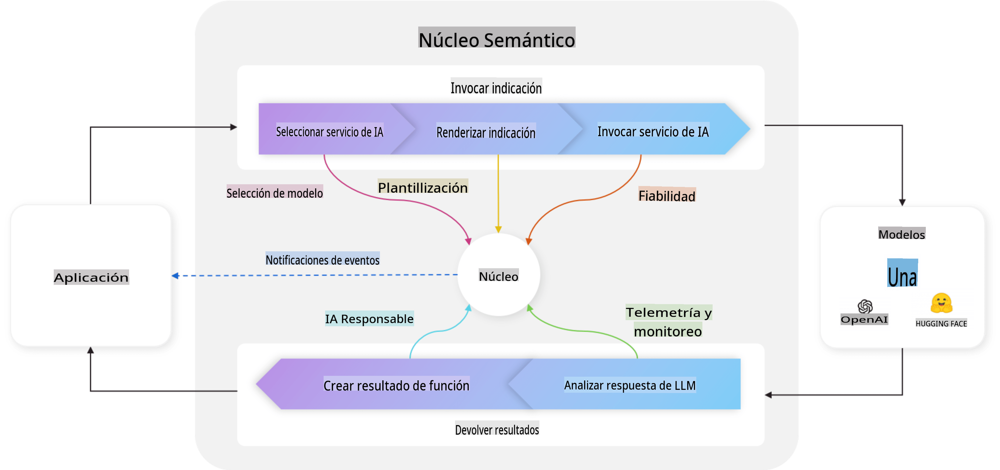
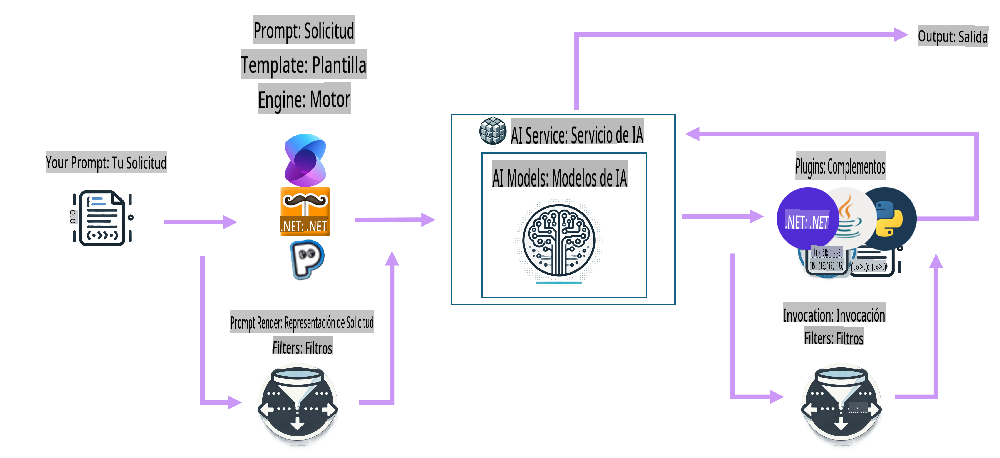

# Introducción a las herramientas de desarrollo de IA

Refresca tus conocimientos sobre IA generativa y comprende las herramientas de .NET disponibles para ayudarte a desarrollar aplicaciones de IA generativa.

---

[](http://www.youtube.com/watch?v=SZvE_meBdvg)

_⬆️Haz clic en la imagen para ver el video⬆️_

## Lo que aprenderás en esta lección:

- 🌟 Comprender los conceptos fundamentales de la IA generativa y sus aplicaciones.
- 🔍 Explorar las herramientas de .NET para el desarrollo de IA, incluyendo MEAI, Semantic Kernel y Azure OpenAI.

## Fundamentos de la IA Generativa para .NET

Antes de sumergirnos en el código, tomemos un momento para repasar algunos conceptos de IA generativa (GenAI). En esta lección, **Fundamentos de la IA Generativa para .NET**, refrescaremos algunos conceptos clave de GenAI para que puedas entender por qué se hacen las cosas de cierta manera. También presentaremos las herramientas y SDKs que usarás para construir aplicaciones, como **MEAI** (Microsoft.Extensions.AI), **Semantic Kernel** y la **Extensión de AI Toolkit para VS Code**.

### Un repaso rápido de los conceptos de IA Generativa

La IA generativa es un tipo de inteligencia artificial que crea contenido nuevo, como texto, imágenes o código, basado en patrones y relaciones aprendidas de datos. Los modelos de IA generativa pueden generar respuestas similares a las humanas, entender el contexto e incluso, a veces, crear contenido que parece humano.

Mientras desarrollas tus aplicaciones de IA con .NET, trabajarás con **modelos de IA generativa** para crear contenido. Algunas capacidades de estos modelos incluyen:

- **Generación de texto**: Crear texto similar al humano para chatbots, contenido y autocompletado.
- **Generación y análisis de imágenes**: Producir imágenes realistas, mejorar fotos y detectar objetos.
- **Generación de código**: Escribir fragmentos de código o scripts.

Existen tipos específicos de modelos optimizados para diferentes tareas. Por ejemplo, los **Modelos de Lenguaje Pequeños (SLMs)** son ideales para la generación de texto, mientras que los **Modelos de Lenguaje Grandes (LLMs)** son más adecuados para tareas complejas como la generación de código o el análisis de imágenes. A partir de ahí, diferentes empresas y grupos desarrollan modelos, como Microsoft, OpenAI o Anthropic. El modelo específico que uses dependerá de tu caso de uso y las capacidades que necesites.

Por supuesto, las respuestas de estos modelos no son perfectas todo el tiempo. Probablemente hayas escuchado sobre modelos que "alucinan" o generan información incorrecta de manera convincente. Pero puedes ayudar a guiar al modelo para que genere mejores respuestas proporcionándole instrucciones claras y contexto. Aquí es donde entra en juego la **ingeniería de prompts**.

#### Revisión de ingeniería de prompts

La ingeniería de prompts es la práctica de diseñar entradas efectivas para guiar a los modelos de IA hacia los resultados deseados. Esto implica:

- **Claridad**: Hacer que las instrucciones sean claras y sin ambigüedades.
- **Contexto**: Proporcionar la información de fondo necesaria.
- **Restricciones**: Especificar limitaciones o formatos.

Algunas de las mejores prácticas para la ingeniería de prompts incluyen el diseño de prompts, instrucciones claras, descomposición de tareas, aprendizaje de uno y pocos ejemplos, y ajuste de prompts. Además, probar y experimentar con diferentes prompts para ver qué funciona mejor para tu caso específico.

Es importante mencionar que existen diferentes tipos de prompts al desarrollar aplicaciones. Por ejemplo, serás responsable de configurar los **prompts del sistema**, que establecen las reglas base y el contexto para la respuesta del modelo. Los datos que el usuario de tu aplicación introduce en el modelo se conocen como **prompts de usuario**. Y los **prompts del asistente** son las respuestas que el modelo genera basándose en los prompts del sistema y del usuario.

> 🧑‍🏫 **Aprende más**: Aprende más sobre ingeniería de prompts en el [capítulo de Ingeniería de Prompts del curso GenAI para Principiantes](https://github.com/microsoft/generative-ai-for-beginners/tree/main/04-prompt-engineering-fundamentals)

#### Tokens, embeddings y agentes: ¡Oh, vaya!

Al trabajar con modelos de IA generativa, encontrarás términos como **tokens**, **embeddings** y **agentes**. Aquí tienes un resumen rápido de estos conceptos:

- **Tokens**: Los tokens son la unidad más pequeña de texto en un modelo. Pueden ser palabras, caracteres o subpalabras. Los tokens se utilizan para representar datos de texto en un formato que el modelo puede entender.
- **Embeddings**: Los embeddings son representaciones vectoriales de tokens. Capturan el significado semántico de palabras y frases, permitiendo que los modelos comprendan las relaciones entre palabras y generen respuestas contextualmente relevantes.
- **Bases de datos vectoriales**: Son colecciones de embeddings que se pueden usar para comparar y analizar datos de texto. Permiten que los modelos generen respuestas basadas en el contexto de los datos de entrada.
- **Agentes**: Los agentes son componentes de IA que interactúan con los modelos para generar respuestas. Pueden ser chatbots, asistentes virtuales u otras aplicaciones que utilicen modelos de IA generativa para crear contenido.

Al desarrollar aplicaciones de IA con .NET, trabajarás con tokens, embeddings y agentes para crear chatbots, generadores de contenido y otras aplicaciones potenciadas por IA. Comprender estos conceptos te ayudará a construir aplicaciones de IA más efectivas y eficientes.

### Herramientas y bibliotecas de desarrollo de IA para .NET

.NET ofrece una variedad de herramientas para el desarrollo de IA. Tomemos un momento para comprender algunas de las herramientas y bibliotecas disponibles.

#### Microsoft.Extensions.AI (MEAI)

La biblioteca Microsoft.Extensions.AI (MEAI) proporciona abstracciones unificadas y middleware para simplificar la integración de servicios de IA en aplicaciones .NET.

Al proporcionar una API consistente, MEAI permite a los desarrolladores interactuar con diferentes servicios de IA, como modelos de lenguaje pequeños y grandes, embeddings e incluso middleware a través de una interfaz común. Esto reduce la complejidad de construir una aplicación de IA en .NET, ya que desarrollarás contra la misma API para diferentes servicios.

Por ejemplo, esta es la interfaz que usarías para crear un cliente de chat con MEAI, independientemente del servicio de IA que estés utilizando:

```csharp
public interface IChatClient : IDisposable 
{ 
    Task<ChatCompletion> CompleteAsync(...); 
    IAsyncEnumerable<StreamingChatCompletionUpdate> CompleteStreamingAsync(...); 
    ChatClientMetadata Metadata { get; } 
    TService? GetService<TService>(object? key = null) where TService : class; 
}
```

De esta manera, al usar MEAI para construir una aplicación de chat, desarrollarás contra la misma superficie de API para obtener una respuesta de chat, transmitir la respuesta, obtener metadatos o acceder al servicio de IA subyacente. Esto facilita cambiar servicios de IA o agregar nuevos según sea necesario.

Además, la biblioteca admite componentes de middleware para funcionalidades como registro, almacenamiento en caché y telemetría, lo que facilita el desarrollo de aplicaciones de IA robustas.



Al usar una API unificada, MEAI permite a los desarrolladores trabajar con diferentes servicios de IA, como Azure AI Inference, Ollama y OpenAI, de manera consistente. Esto simplifica la integración de modelos de IA en aplicaciones .NET, agregando flexibilidad para que los desarrolladores elijan los mejores servicios de IA para sus proyectos y requisitos específicos.

> 🏎️ **Inicio rápido**: Para un inicio rápido con MEAI, [consulta la publicación del blog](https://devblogs.microsoft.com/dotnet/introducing-microsoft-extensions-ai-preview/).
>
> 📖 **Documentación**: Aprende más sobre Microsoft.Extensions.AI (MEAI) en la [documentación de MEAI](https://learn.microsoft.com/dotnet/ai/ai-extensions)
 

#### Semantic Kernel (SK)

Semantic Kernel es un SDK de código abierto que permite a los desarrolladores integrar modelos de lenguaje de IA generativa en sus aplicaciones .NET. Proporciona abstracciones para servicios de IA y almacenes de memoria (vectores), permitiendo la creación de complementos que pueden ser orquestados automáticamente por IA. Incluso utiliza el estándar OpenAPI, lo que permite a los desarrolladores crear agentes de IA para interactuar con APIs externas.



Semantic Kernel admite .NET, así como otros lenguajes como Java y Python, ofreciendo una gran cantidad de conectores, funciones y complementos para la integración. Algunas de las características clave de Semantic Kernel incluyen:

- **Kernel Core**: Proporciona la funcionalidad principal para Semantic Kernel, incluyendo conectores, funciones y complementos para interactuar con servicios y modelos de IA. Es el núcleo del sistema, disponible para servicios y complementos, supervisando agentes y actuando como middleware activo para tu aplicación.

    Por ejemplo, puede elegir el mejor servicio de IA para una tarea específica, construir y enviar el prompt al servicio, y devolver la respuesta a la aplicación. A continuación, un diagrama del Kernel Core en acción:

    

- **Conectores de servicios de IA**: Proporciona una capa de abstracción para exponer servicios de IA a múltiples proveedores con una interfaz común y consistente. Ejemplos incluyen Chat Completion, Text to Image, Text to Speech y Audio to Text.

- **Conectores de bases de datos vectoriales**: Exponen almacenes de vectores a múltiples proveedores a través de una interfaz común, permitiendo a los desarrolladores trabajar con embeddings, vectores y otras representaciones de datos.

- **Funciones y complementos**: Ofrecen una gama de funciones y complementos para tareas comunes de IA, como procesamiento de funciones, diseño de prompts, búsqueda de texto y más.

- **Diseño de prompts**: Proporciona herramientas para la ingeniería de prompts, incluyendo diseño, pruebas y optimización de prompts para mejorar el rendimiento y la precisión de los modelos de IA.

- **Filtros**: Controles sobre cuándo y cómo se ejecutan las funciones para mejorar la seguridad y las prácticas de IA responsable.

En Semantic Kernel, un ciclo completo se vería como el diagrama a continuación:



> 📖 **Documentación**: Aprende más sobre Semantic Kernel en la [documentación de Semantic Kernel](https://learn.microsoft.com/semantic-kernel/overview/)

## Conclusión

La IA generativa ofrece un mundo de posibilidades para los desarrolladores, permitiéndoles crear aplicaciones innovadoras que generen contenido, comprendan el contexto y proporcionen respuestas similares a las humanas. El ecosistema .NET proporciona una variedad de herramientas y bibliotecas para simplificar el desarrollo de IA, haciendo más fácil integrar capacidades de IA en aplicaciones .NET.

## Próximos pasos

En los próximos capítulos, exploraremos estos escenarios en detalle, proporcionando ejemplos prácticos, fragmentos de código y mejores prácticas para ayudarte a construir soluciones de IA del mundo real utilizando .NET.

¡A continuación, configuraremos tu entorno de desarrollo! Así estarás listo para sumergirte en el mundo de la IA generativa con .NET.

👉 [Configura tu entorno de desarrollo de IA](/02-SetupDevEnvironment/readme.md)

**Descargo de responsabilidad**:  
Este documento ha sido traducido utilizando servicios de traducción automática basados en inteligencia artificial. Si bien nos esforzamos por garantizar la precisión, tenga en cuenta que las traducciones automáticas pueden contener errores o inexactitudes. El documento original en su idioma nativo debe considerarse la fuente autorizada. Para información crítica, se recomienda una traducción profesional realizada por humanos. No nos hacemos responsables de malentendidos o interpretaciones erróneas que puedan surgir del uso de esta traducción.