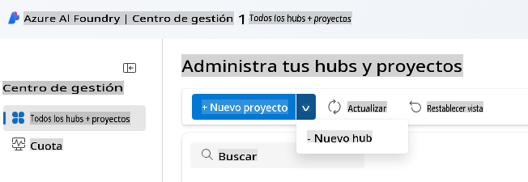
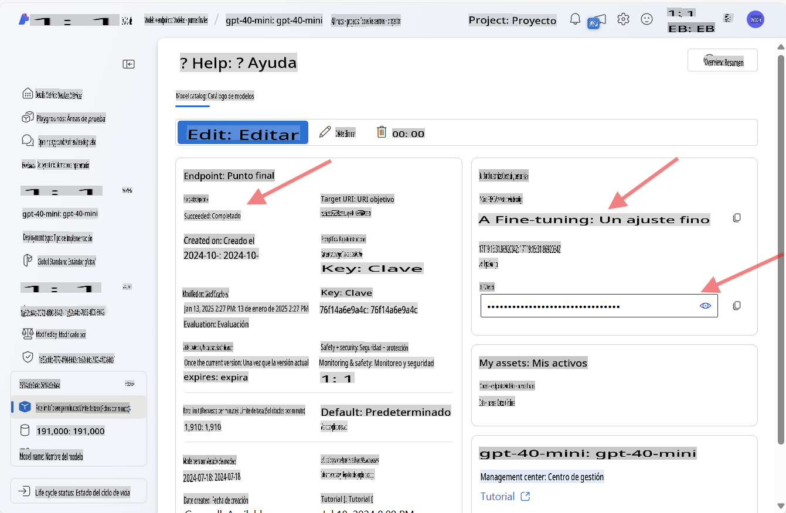
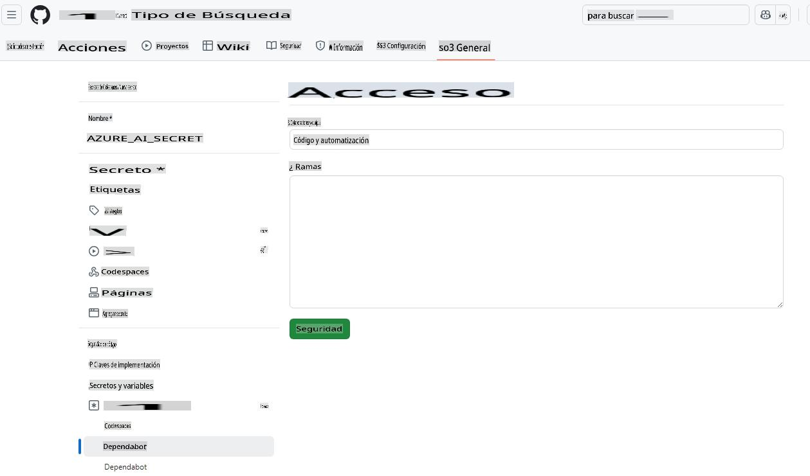
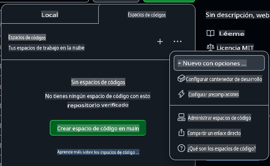

# Configuración del Entorno de Desarrollo para Azure OpenAI

Si deseas usar los modelos de Azure AI Foundry en tus aplicaciones de IA con .NET para este curso, sigue los pasos de esta guía.

¿No quieres usar Azure OpenAI?

👉 [Esta es la guía para usar los modelos de GitHub](README.md)  
👉 [Aquí están los pasos para usar Ollama](getting-started-ollama.md)

## Crear los recursos de Azure AI Foundry

Para usar los modelos de Azure AI Foundry, necesitas crear un hub y un proyecto en el portal de Azure AI Foundry. Luego, tendrás que desplegar un modelo. En esta sección, te mostraremos cómo hacerlo.

### Crear un Hub y un Proyecto en Azure AI Foundry

1. Ve al [Portal de Azure AI Foundry](https://ai.azure.com/).
1. Inicia sesión con tu cuenta de Azure.
1. Selecciona **All hubs + projects** en el menú de la izquierda y luego haz clic en **+ New hub** en el desplegable. (Nota: Es posible que primero debas hacer clic en **+ New project** para ver la opción **+ New hub**).  
    
1. Se abrirá una nueva ventana. Completa los detalles de tu hub:
    - Dale un nombre a tu hub (por ejemplo, "MyAIHub").
    - Elige la región más cercana a ti.
    - Selecciona la suscripción y el grupo de recursos apropiados.
    - Puedes dejar el resto de las configuraciones como están.
    - Haz clic en **Next**.
    - Revisa los detalles y haz clic en **Create**.
1. Una vez que se haya creado tu hub, el portal abrirá la página de detalles. Haz clic en el botón **Create Project**.
    - Dale un nombre a tu proyecto (por ejemplo, "GenAINET") o acepta el valor predeterminado.
    - Haz clic en **Create**.

🎉 **¡Listo!** Acabas de crear tu primer proyecto en Azure AI Foundry.

### Desplegar un Modelo de Lenguaje en Azure AI Foundry

Ahora, vamos a desplegar un modelo **gpt-4o-mini** en tu proyecto:

1. En el portal de Azure AI Foundry, navega hasta tu proyecto (debería abrirse automáticamente después de crearlo).
1. Haz clic en **Models and Endpoints** en el menú de la izquierda y luego en el botón **Deploy Model**.
1. Selecciona **Deploy base model** en el desplegable.
1. Busca **gpt-4o-mini** en el catálogo de modelos.
1. Selecciona el modelo y haz clic en el botón **Confirm**.
1. Especifica un nombre para el despliegue (por ejemplo, "gpt-4o-mini"). Puedes dejar el resto de las opciones como están.
1. Haz clic en **Deploy** y espera a que el modelo sea aprovisionado.
1. Una vez desplegado, toma nota del **Model Name**, **Target URI**, y **API Key** en la página de detalles del modelo.

🎉 **¡Listo!** Has desplegado tu primer modelo de lenguaje en Azure AI Foundry.



> 📝 **Nota:** El endpoint podría ser similar a `https://< your hub name>.openai.azure.com/openai/deployments/gpt-4o-mini/chat/completions?api-version=2024-08-01-preview`. El nombre del endpoint que necesitamos es solo `https://< your hub name >.openai.azure.com/`*.

## Agregar la Clave API de Azure AI a los Secretos de tu Codespace

Para mantener la seguridad, vamos a agregar la clave API que acabas de crear a los secretos de tu Codespace.

1. Asegúrate de haber hecho un fork de este repositorio en tu cuenta de GitHub.
1. Ve a la pestaña **Settings** de tu repositorio bifurcado, luego expande **Secrets and variables** en el menú de la izquierda y selecciona **Codespaces**.

    
1. Nombra tu secreto **AZURE_AI_KEY**.
1. Pega la clave API que copiaste del portal de Azure AI Foundry en el campo **Secret**.

## Crear un Codespace en GitHub

Vamos a crear un Codespace en GitHub para desarrollar durante el resto del curso.

1. Abre la página principal de este repositorio en una nueva ventana haciendo [clic derecho aquí](https://github.com/microsoft/Generative-AI-for-beginners-dotnet) y seleccionando **Abrir en una nueva ventana** desde el menú contextual.
1. Haz un fork de este repositorio en tu cuenta de GitHub haciendo clic en el botón **Fork** en la esquina superior derecha de la página.
1. Haz clic en el botón desplegable **Code** y luego selecciona la pestaña **Codespaces**.
1. Selecciona la opción **...** (los tres puntos) y elige **New with options...**.



### Elegir tu contenedor de desarrollo

En el desplegable **Dev container configuration**, selecciona una de las siguientes opciones:

**Opción 1: C# (.NET)**: Esta es la opción que debes usar si planeas utilizar los modelos de GitHub o Azure OpenAI. Incluye todas las herramientas principales de desarrollo con .NET necesarias para el curso y tiene un tiempo de inicio rápido.

**Opción 2: C# (.NET) - Ollama**: Ollama te permite ejecutar los demos sin necesidad de conectarte a los modelos de GitHub o Azure OpenAI. Incluye todas las herramientas principales de desarrollo con .NET además de Ollama, pero tiene un tiempo de inicio más lento, en promedio cinco minutos. [Sigue esta guía](getting-started-ollama.md) si deseas usar Ollama.

Puedes dejar el resto de las configuraciones como están. Haz clic en el botón **Create codespace** para iniciar el proceso de creación del Codespace.


## Actualizar el código de ejemplo para usar Azure OpenAI y tu nuevo modelo

Ahora actualizaremos el código para usar el modelo recién desplegado. Primero, necesitaremos agregar algunos paquetes NuGet para trabajar con Azure OpenAI.

1. Abre la terminal y cambia al directorio del proyecto:

    ```bash
    cd 02-SetupDevEnvironment/src/BasicChat-01MEAI/
    ```

1. Ejecuta los siguientes comandos para agregar el paquete requerido:

    ```bash
    dotnet add package Azure.AI.OpenAI
    dotnet add package Microsoft.Extensions.AI.OpenAI --version 9.1.0-preview.1.25064.3
    ```

[Más información sobre Azure.AI.OpenAI](https://www.nuget.org/packages/Azure.AI.OpenAI/2.1.0#show-readme-container).

1. Abre `/workspaces/Generative-AI-for-beginners-dotnet/02-SettingUp.NETDev/src/BasicChat-01MEAI/Program.cs`.

    Agrega las siguientes declaraciones `using` al principio del archivo:

    ```csharp
    using System.ClientModel;
    using Azure.AI.OpenAI;
    using Microsoft.Extensions.AI;

1. Create new variables to hold the model name, endpoint, and API key:

    ```csharp
    var deploymentName = "< deployment name > "; // por ejemplo, "gpt-4o-mini"
    var endpoint = new Uri("< endpoint >"); // por ejemplo, "https://< your hub name >.openai.azure.com/"
    var apiKey = new ApiKeyCredential(Environment.GetEnvironmentVariable("AZURE_AI_SECRET"));
    ```

    Making sure to replace `< deployment name >`, and `< endpoint >` with the values you noted above.

1. Replace the `IChatClient` creation with the following code:

    ```csharp
    IChatClient client = new AzureOpenAIClient(
        endpoint,
        apiKey)
    .AsChatClient(deploymentName);
    ```

1. Run the following command in the terminal:

    ```bash
    dotnet run
    ```

1. You should see output similar to the following:

    ```bash
    La Inteligencia Artificial (IA) se refiere a la simulación de la inteligencia humana en máquinas que están programadas para pensar y aprender como humanos. La IA abarca una variedad de tecnologías y enfoques que permiten a las computadoras y sistemas realizar tareas que normalmente requieren inteligencia humana. Estas tareas incluyen:

    1. **Aprendizaje**: La capacidad de mejorar el rendimiento en función de la experiencia, a menudo a través de algoritmos que analizan datos.
    
    ...
    ```

> 🙋 **¿Necesitas ayuda?**: ¿Algo no está funcionando? [Abre un issue](https://github.com/microsoft/Generative-AI-for-beginners-dotnet/issues/new?template=Blank+issue) y te ayudaremos.

## Resumen

En esta lección, aprendiste cómo configurar tu entorno de desarrollo para el resto del curso. Creaste un Codespace en GitHub y lo configuraste para usar Azure OpenAI. También actualizaste el código de ejemplo para usar el modelo recién desplegado en Azure AI Foundry.

### Recursos Adicionales

- [Documentación de Azure AI Foundry](https://learn.microsoft.com/azure/ai-services/)  
- [Trabajar con Codespaces en GitHub](https://docs.github.com/en/codespaces/getting-started)  
- [Cómo desplegar modelos en Azure AI Foundry](https://learn.microsoft.com/azure/ai-services/deploy/)  
- [Paquete NuGet Azure.AI.OpenAI](https://www.nuget.org/packages/Azure.AI.OpenAI)

## Próximos Pasos

A continuación, exploraremos cómo crear tu primera aplicación de IA. 🚀

👉 [Técnicas básicas de IA generativa](../03-CoreGenerativeAITechniques/readme.md)

**Descargo de responsabilidad**:  
Este documento ha sido traducido utilizando servicios de traducción basados en inteligencia artificial. Si bien nos esforzamos por lograr precisión, tenga en cuenta que las traducciones automatizadas pueden contener errores o imprecisiones. El documento original en su idioma nativo debe considerarse como la fuente autorizada. Para información crítica, se recomienda una traducción profesional realizada por humanos. No nos hacemos responsables por malentendidos o interpretaciones erróneas que surjan del uso de esta traducción.