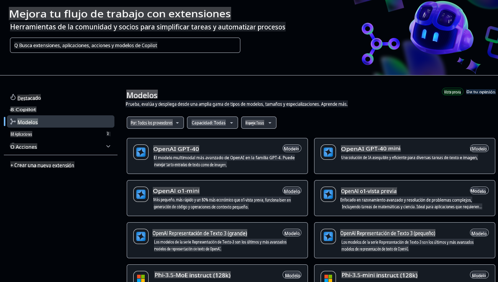
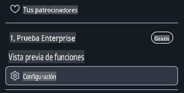
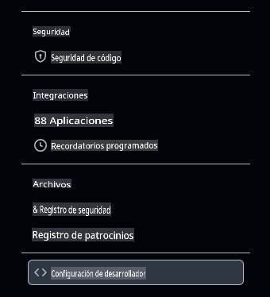
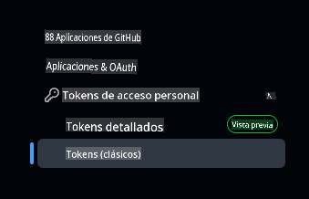
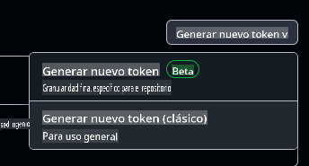

# Configuración del Entorno de Desarrollo para Este Curso

Esta lección te guiará para configurar tu entorno de desarrollo para este curso. Para garantizar tu éxito, hemos preparado una configuración de devcontainer que incluye todas las herramientas que necesitarás para completar el curso. Puedes ejecutar el devcontainer en GitHub Codespaces (recomendado) o localmente en tu máquina. También te mostraremos cómo configurar tus tokens de acceso de GitHub para interactuar con GitHub Models.

*Tenemos guías disponibles para configurar [Azure OpenAI](getting-started-azure-openai.md) y [Ollama](getting-started-ollama.md), si lo prefieres.*

---

## Lo que aprenderás en esta lección:

- ⚡ Cómo configurar un entorno de desarrollo con GitHub Codespaces
- 🤖 Configurar tu entorno para acceder a LLMs mediante GitHub Models, Azure OpenAI u Ollama
- 🛠️ Configuración de herramientas estándar de la industria con .devcontainer
- 🎯 Finalmente, todo estará listo para completar el resto del curso

¡Vamos a configurar tu entorno de desarrollo! 🏃‍♂️

[](https://youtu.be/7kYoVRNQXyA?feature=shared)

_⬆️Haz clic en la imagen para ver el video⬆️_

## ¿Qué servicio de IA debería usar para este curso?

Proveemos instrucciones para configurar tu entorno de desarrollo con GitHub Models, Azure OpenAI y Ollama. Puedes elegir el que mejor se adapte a tus necesidades. Recomendamos usar GitHub Models para este curso, aunque cualquiera de los tres servicios es válido.

Aquí tienes un resumen rápido de los servicios:

- **GitHub Models**: Un servicio gratuito para comenzar, que te permite probar e interactuar con varios modelos de IA directamente en tu entorno de desarrollo. Es fácil de usar desde Codespaces y es ideal para experimentar con diferentes modelos y comprender sus capacidades antes de implementarlos.
- **Azure OpenAI**: Un servicio de pago que proporciona acceso a una amplia gama de modelos de IA. Incluye todos los beneficios esperados de Azure, como seguridad robusta y escalabilidad. Es una excelente opción si ya tienes acceso a una suscripción de Azure.
- **Ollama**: Permite ejecutar modelos de IA localmente en tu máquina o dentro de un Codespace o devcontainer de forma gratuita. Es una buena opción si prefieres trabajar localmente, pero requiere más recursos de hardware y puede ser más lento que las opciones basadas en la nube.

> Si **GitHub Models** es tu elección, sigue el resto de este documento para configurar tu entorno de desarrollo con GitHub Models.
> - ¿Te interesa **Azure OpenAI**? [Este es el documento que necesitas](getting-started-azure-openai.md).
> - ¿Prefieres **Ollama**? [Consulta esta guía](getting-started-ollama.md).

## Aprende y prueba modelos de IA con GitHub Models

**GitHub Models** ofrece una forma intuitiva de experimentar con varios modelos de IA directamente en tu entorno de desarrollo. Esta función permite a los desarrolladores probar e interactuar con diferentes modelos, entendiendo sus capacidades y limitaciones antes de implementarlos. A través de una interfaz simple, puedes explorar respuestas de los modelos, evaluar su rendimiento y determinar cuál es el más adecuado para los requisitos de tu aplicación. Alojados en la infraestructura de GitHub, estos modelos garantizan acceso confiable y un rendimiento consistente, lo que los hace ideales para las fases de desarrollo y prueba. Lo mejor de todo es que puedes comenzar a explorar sin ningún costo gracias al nivel gratuito.



## Comprobación inicial: Configuración de Tokens de Acceso de GitHub

Antes de continuar, necesitamos configurar credenciales de seguridad esenciales que permitirán a nuestro Codespace interactuar con GitHub Models y ejecutar nuestras aplicaciones de manera segura.

### Creación de un Token de Acceso Personal para usar GitHub Models

1. Ve a [GitHub Settings](https://github.com/settings/profile):

    - Haz clic en tu foto de perfil en la esquina superior derecha
    - Selecciona **Settings** en el menú desplegable

    

1. Accede a [Developer Settings](https://github.com/settings/apps):

    - Desplázate hacia abajo en la barra lateral izquierda
    - Haz clic en **Developer settings** (generalmente está al final)

    

1. Genera un Nuevo Token:

    - Selecciona **Personal access tokens** → **Tokens (classic)**

        

    - En el menú desplegable en el centro de la página, haz clic en **Generate new token (classic)**

        

    - En "Note", proporciona un nombre descriptivo (por ejemplo, `GenAI-DotNet-Course-Token`)
    - Establece una fecha de expiración (recomendado: 7 días para seguir las mejores prácticas de seguridad)
    - No es necesario agregar permisos adicionales a este token.

> 💡 **Consejo de Seguridad**: Siempre usa el alcance mínimo necesario y el tiempo de expiración más corto posible para tus tokens de acceso. Esto sigue el principio de privilegio mínimo y ayuda a mantener seguros los tokens de tu cuenta.

## Creación de un GitHub Codespace

Creemos un GitHub Codespace que utilizaremos para el resto del curso.

1. Abre la página principal de este repositorio en una nueva ventana haciendo [clic derecho aquí](https://github.com/microsoft/Generative-AI-for-beginners-dotnet) y seleccionando **Abrir en una nueva ventana** desde el menú contextual
1. Haz un fork de este repositorio en tu cuenta de GitHub haciendo clic en el botón **Fork** en la esquina superior derecha de la página
1. Haz clic en el botón desplegable **Code** y luego selecciona la pestaña **Codespaces**
1. Selecciona la opción **...** (los tres puntos) y elige **New with options...**


### Selección de tu contenedor de desarrollo

Desde el menú desplegable **Dev container configuration**, selecciona una de las siguientes opciones:

**Opción 1: C# (.NET)**: Esta es la opción que deberías usar si planeas usar GitHub Models y es nuestra recomendación para completar este curso. Incluye todas las herramientas esenciales de desarrollo en .NET necesarias para el curso y tiene un tiempo de inicio rápido.

**Opción 2: C# (.NET) - Ollama**: Ollama te permite ejecutar los demos sin necesidad de conectarte a GitHub Models o Azure OpenAI. Incluye todas las herramientas esenciales de desarrollo en .NET además de Ollama, pero tiene un tiempo de inicio más lento, en promedio cinco minutos. [Sigue esta guía](getting-started-ollama.md) si deseas usar Ollama.

> 💡**Consejo**: Al crear tu codespace, por favor selecciona la región más cercana a ti si tienes esa opción en el menú. Usar una región lejana puede causar errores en la creación.

Haz clic en el botón **Create codespace** para iniciar el proceso de creación del Codespace.


## Verificando que tu Codespace funciona correctamente con GitHub Models

Una vez que tu Codespace esté completamente cargado y configurado, ejecutemos una aplicación de ejemplo para verificar que todo funciona correctamente:

1. Abre el terminal. Puedes abrir una ventana de terminal presionando **Ctrl+\`** (backtick) on Windows or **Cmd+`** en macOS.

1. Cambia al directorio correcto ejecutando el siguiente comando:

    ```bash
    cd 02-SetupDevEnvironment\src\BasicChat-01MEAI
    ```

1. Luego ejecuta la aplicación con el siguiente comando:

    ```bash
    dotnet run
    ```

1. Puede tardar algunos segundos, pero eventualmente la aplicación debería mostrar un mensaje similar al siguiente:

    ```bash
    AI, or artificial intelligence, refers to the simulation of human intelligence in machines that are programmed to think and learn like humans. It is a broad field of computer science that focuses on creating systems and algorithms capable of performing tasks that typically require human intelligence. These tasks include problem-solving,

    ...
    ```

> 🙋 **¿Necesitas ayuda?**: ¿Algo no funciona? [Abre un issue](https://github.com/microsoft/Generative-AI-for-beginners-dotnet/issues/new?template=Blank+issue) y te ayudaremos.

## Resumen

En esta lección, aprendiste cómo configurar tu entorno de desarrollo para el resto del curso. Creaste un GitHub Codespace y lo configuraste para usar GitHub Models, Azure OpenAI u Ollama. También aprendiste a crear un token de acceso personal para GitHub Models y cómo ejecutar una aplicación de ejemplo para verificar que todo funciona correctamente.

### Recursos adicionales

- ¡Prueba esta guía con otros proveedores de servicios!
    - [Azure OpenAI](getting-started-azure-openai.md)
    - [Ollama](getting-started-ollama.md)
- [Documentación de GitHub Codespaces](https://docs.github.com/en/codespaces)
- [Documentación de GitHub Models](https://docs.github.com/en/github-models/prototyping-with-ai-models)

## Próximos pasos

¡A continuación, exploraremos cómo crear tu primera aplicación de IA! 🚀

👉 [Técnicas Generativas de IA Básicas](../03-CoreGenerativeAITechniques/readme.md)

**Descargo de responsabilidad**:  
Este documento ha sido traducido utilizando servicios de traducción automática basados en inteligencia artificial. Si bien nos esforzamos por lograr precisión, tenga en cuenta que las traducciones automáticas pueden contener errores o imprecisiones. El documento original en su idioma nativo debe considerarse la fuente autorizada. Para información crítica, se recomienda una traducción profesional realizada por humanos. No nos hacemos responsables de malentendidos o interpretaciones erróneas que puedan surgir del uso de esta traducción.