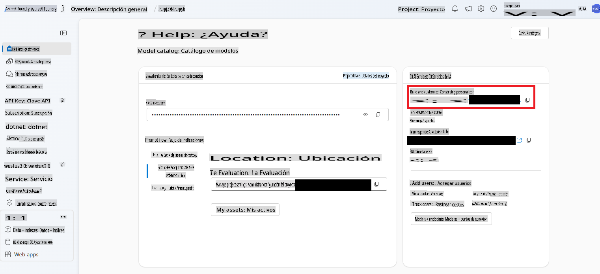

# Agentes de IA

En esta lección aprenderás a crear una entidad de IA que... ¿toma decisiones y ejecuta acciones sin interacción humana continua? Así es, los agentes de IA son capaces de realizar tareas específicas de manera independiente.

---

[](https://youtu.be/Btkmw1Bosh0?feature=shared)

_⬆️Haz clic en la imagen para ver el video⬆️_

Los agentes de IA permiten que los LLMs evolucionen de asistentes a entidades capaces de tomar acciones en nombre de los usuarios. Los agentes incluso pueden interactuar con otros agentes para completar tareas. Algunos de los atributos clave de un agente incluyen un nivel de **autonomía** que les permite iniciar acciones basadas en su programación, lo que les lleva a la capacidad de **tomar decisiones** basadas en objetivos predefinidos. Además, son **adaptables**, ya que aprenden y se ajustan para mejorar su desempeño con el tiempo.

Algo importante a tener en cuenta al construir agentes es que deben estar enfocados en hacer solo una cosa. Es ideal delimitar su propósito tanto como sea posible.

> 🧑‍🏫**Aprende más**: Conoce más sobre los fundamentos de los agentes de IA en [Generative AI for Beginners: AI Agents](https://github.com/microsoft/generative-ai-for-beginners/tree/main/17-ai-agents).

## Creando un agente de IA

Trabajaremos con algunos conceptos nuevos para construir un agente de IA en .NET. Usaremos un nuevo SDK y realizaremos una configuración adicional en Azure AI Foundry para comenzar.

> 🧑‍💻**Código de ejemplo**: Usaremos el [ejemplo AgentLabs-01-Simple](../../../03-CoreGenerativeAITechniques/src/AgentLabs-01-Simple) para esta lección.
>
> También incluimos algunos ejemplos más avanzados en la carpeta `/src/`. Puedes consultar los README de [AgentLabs-02-Functions](../../../03-CoreGenerativeAITechniques/src/AgentLabs-02-Functions), [AgentLabs-03-OpenAPIs](../../../03-CoreGenerativeAITechniques/src/AgentLabs-03-OpenAPIs) o [AgentLabs-03-PythonParksInformationServer](../../../03-CoreGenerativeAITechniques/src/AgentLabs-03-PythonParksInformationServer) para más información sobre ellos.

### Servicio de Agentes de Azure AI

Vamos a presentar un nuevo servicio de Azure que nos ayudará a construir agentes, el convenientemente llamado [Azure AI Agent Service](https://learn.microsoft.com/azure/ai-services/agents/overview).

Para ejecutar los ejemplos de código incluidos en esta lección, necesitarás realizar una configuración adicional en Azure AI Foundry. Puedes seguir [estas instrucciones para configurar un **agente básico**](https://learn.microsoft.com/azure/ai-services/agents/quickstart?pivots=programming-language-csharp).

### Biblioteca Azure AI Projects

Los agentes están compuestos por 3 partes: el **LLM** o modelo, el **estado** o contexto (muy parecido a una conversación) que guía las decisiones basadas en resultados previos, y las **herramientas**, que son como [las funciones que aprendimos antes](./01-lm-completions-functions.md#function-calling) y que permiten una conexión entre el modelo y sistemas externos.

En teoría, podrías construir agentes de IA con lo que ya has aprendido. Pero la biblioteca **Azure AI Projects for .NET** facilita el desarrollo de agentes al proporcionar una API que simplifica muchas de las tareas típicas.

Hay algunos conceptos (que se corresponden con clases) que necesitas entender al trabajar con esta biblioteca.

- `AgentClient`: El cliente general que crea y aloja los agentes, gestiona los hilos en los que se ejecutan y maneja la conexión con la nube.
- `Agent`: El agente que contiene las instrucciones de lo que debe hacer, así como las definiciones de las herramientas a las que tiene acceso.
- `ThreadMessage`: Son mensajes, casi como los prompts que aprendimos antes, que se envían al agente. Los agentes también crean objetos `ThreadMessage` para comunicarse.
- `ThreadRun`: Un hilo en el que se envían los mensajes al agente. El hilo se inicia y puede recibir instrucciones adicionales, además de ser consultado sobre su estado.

¡Veamos un ejemplo sencillo de esto en acción!

### Construir un agente matemático

Crearemos un agente con un único propósito: actuar como tutor para estudiantes de matemáticas. Su única misión será resolver y explicar problemas matemáticos que le plantee el usuario.

1. Para empezar, necesitamos crear un objeto `AgentsClient` que será responsable de gestionar la conexión con Azure, el propio agente, los hilos, los mensajes, y más.

    ```csharp
    string projectConnectionString = "< YOU GET THIS FROM THE PROJECT IN AI FOUNDRY >";
    AgentsClient client = new(projectConnectionString, new DefaultAzureCredential());
    ```

    Puedes encontrar la cadena de conexión del proyecto en AI Foundry abriendo el Hub que creaste y luego el proyecto. Estará en el lado derecho.

    

1. A continuación, queremos crear el agente tutor. Recuerda, debe estar enfocado en un solo objetivo.
   
    ```csharp
    Agent tutorAgent = (await client.CreateAgentAsync(
    model: "gpt-4o",
    name: "Math Tutor",
    instructions: "You are a personal math tutor. Write and run code to answer math questions.",
    tools: [new CodeInterpreterToolDefinition()])).Value;
    ```

    Un par de cosas a destacar aquí. La primera es el uso de `tools` parameter. We're creating a `CodeInterpreterToolDefinition` object (that is apart of the **Azure.AI.Projects** SDK) that will allow the agent to create and execute code.

    > 🗒️**Note**: You can create your own tools too. See the [Functions](../../../03-CoreGenerativeAITechniques/src/AgentLabs-02-Functions) to learn more.

    Second note the `instructions` that are being sent along. It's a prompt and we're limiting it to answer math questions. Then last creating the agent is an async operation. That's because it's creating an object within Azure AI Foundry Agents service. So we both `await` the `CreateAgentAsync` function and then grab the `Value` para obtener el objeto `Agent` real. Verás este patrón repetirse una y otra vez al crear objetos con el SDK **Azure.AI.Projects**.

1. Un `AgentThread` es un objeto que maneja la comunicación entre agentes individuales, el usuario, y otros elementos. Necesitaremos crearlo para poder agregar un `ThreadMessage`. En este caso, será la primera pregunta del usuario.

    ```csharp
    AgentThread thread = (await client.CreateThreadAsync()).Value;

    // Creating the first user message to AN agent - notice how we're putting it on a thread
    ThreadMessage userMessage = (await client.CreateMessageAsync(
        thread.Id,
        MessageRole.User,
        "Hello, I need to solve the equation `3x + 11 = 14`. Can you help me?")
    ).Value;
    ```

    Nota que `ThreadMessage` tiene un tipo de `MessageRole.User`. Y observa que no estamos enviando el mensaje a un agente específico, sino que simplemente lo colocamos en un hilo.

1. Luego, pediremos al agente que proporcione una respuesta inicial, la colocaremos en el hilo y lo iniciaremos. Al comenzar el hilo, proporcionaremos el id del agente inicial que ejecutará y cualquier instrucción adicional.

    ```csharp
    ThreadMessage agentMessage =  await client.CreateMessageAsync(
        thread.Id,
        MessageRole.Agent,
        "Please address the user as their name. The user has a basic account, so just share the answer to the question.")
    ).Value;

    ThreadRun run = (await client.CreateRunAsync(
        thread.Id,
        assistantId: agentMathTutor.Id, 
        additionalInstructions: "You are working in FREE TIER EXPERIENCE mode`, every user has premium account for a short period of time. Explain detailed the steps to answer the user questions")
    ).Value;
    ```

1. Finalmente, solo queda comprobar el estado de la ejecución.

    ```csharp
    do
    {
        await Task.Delay(Timespan.FromMilliseconds(100));
        run = (await client.GetRunAsync(thread.Id, run.Id)).Value;

        Console.WriteLine($"Run Status: {run.Status}");
    }
    while (run.Status == RunStatus.Queued || run.Status == RunStatus.InProgress);
    ```

1. Y luego mostrar los mensajes de los resultados.

    ```csharp
    Response<PageableList<ThreadMessage>> afterRunMessagesResponse = await client.GetMessagesAsync(thread.Id);
    IReadOnlyList<ThreadMessage> messages = afterRunMessagesResponse.Value.Data;

    // sort by creation date
    messages = messages.OrderBy(m => m.CreatedAt).ToList();

    foreach (ThreadMessage msg in messages)
    {
        Console.Write($"{msg.CreatedAt:yyyy-MM-dd HH:mm:ss} - {msg.Role,10}: ");

        foreach (MessageContent contentItem in msg.ContentItems)
        {
            if (contentItem is MessageTextContent textItem)
                Console.Write(textItem.Text);
        }
        Console.WriteLine();
    }
    ```

> 🙋 **¿Necesitas ayuda?**: Si encuentras algún problema, [abre un issue en el repositorio](https://github.com/microsoft/Generative-AI-for-beginners-dotnet/issues/new).

El siguiente paso lógico es comenzar a usar múltiples agentes para crear un sistema autónomo. Un siguiente paso podría ser tener un agente que verifique si el usuario tiene una cuenta premium o no.

## Resumen

Los agentes de IA son entidades autónomas que van más allá de simples interacciones de chat; pueden:

- Tomar decisiones independientes: Ejecutar tareas sin intervención humana constante.
- Mantener contexto: Guardar estado y recordar interacciones previas.
- Usar herramientas: Acceder a sistemas externos y APIs para completar tareas.
- Colaborar: Trabajar con otros agentes para resolver problemas complejos.

Y aprendiste cómo usar el servicio **Azure AI Agents** junto con el SDK **Azure AI Project** para crear un agente básico.

Piensa en los agentes como asistentes de IA con capacidad de acción: no solo responden, actúan basándose en su programación y objetivos.

## Recursos adicionales

- [Construir un agente mínimo con .NET](https://learn.microsoft.com/dotnet/ai/quickstarts/quickstart-assistants?pivots=openai)
- [Orquestación de múltiples agentes](https://techcommunity.microsoft.com/blog/educatordeveloperblog/using-azure-ai-agent-service-with-autogen--semantic-kernel-to-build-a-multi-agen/4363121)
- [Marco de trabajo de agentes de Semantic Kernel](https://learn.microsoft.com/semantic-kernel/frameworks/agent/?pivots=programming-language-csharp)
- [Agentes de IA - Serie para principiantes en GenAI](https://github.com/microsoft/generative-ai-for-beginners/tree/main/17-ai-agents)

## Próximos pasos

¡Has avanzado mucho! Desde aprender sobre simples completaciones de texto hasta construir agentes.

👉 [En la próxima lección verás algunos ejemplos prácticos](../04-PracticalSamples/readme.md) de cómo usar todo lo aprendido.

**Descargo de responsabilidad**:  
Este documento ha sido traducido utilizando servicios de traducción automática basados en inteligencia artificial. Si bien nos esforzamos por garantizar la precisión, tenga en cuenta que las traducciones automatizadas pueden contener errores o imprecisiones. El documento original en su idioma nativo debe considerarse la fuente autorizada. Para información crítica, se recomienda una traducción profesional realizada por humanos. No nos hacemos responsables de malentendidos o interpretaciones erróneas que puedan surgir del uso de esta traducción.