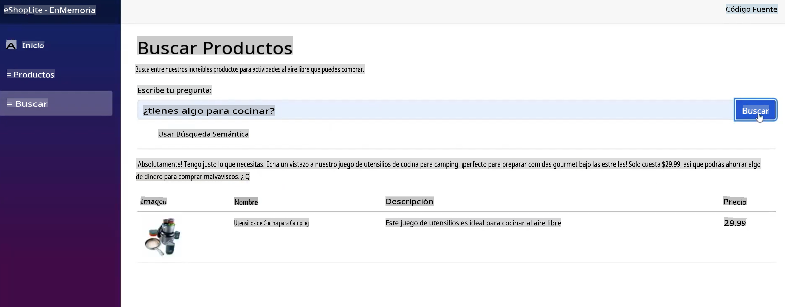
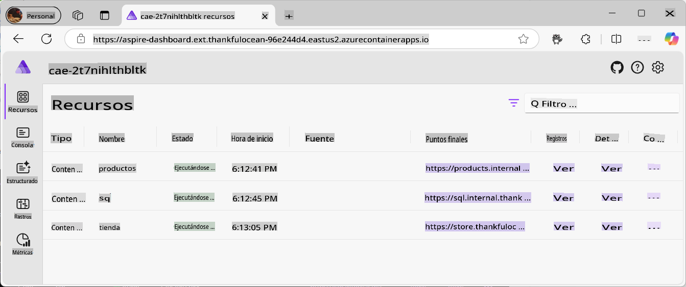
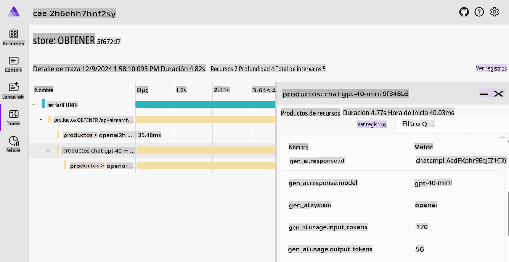
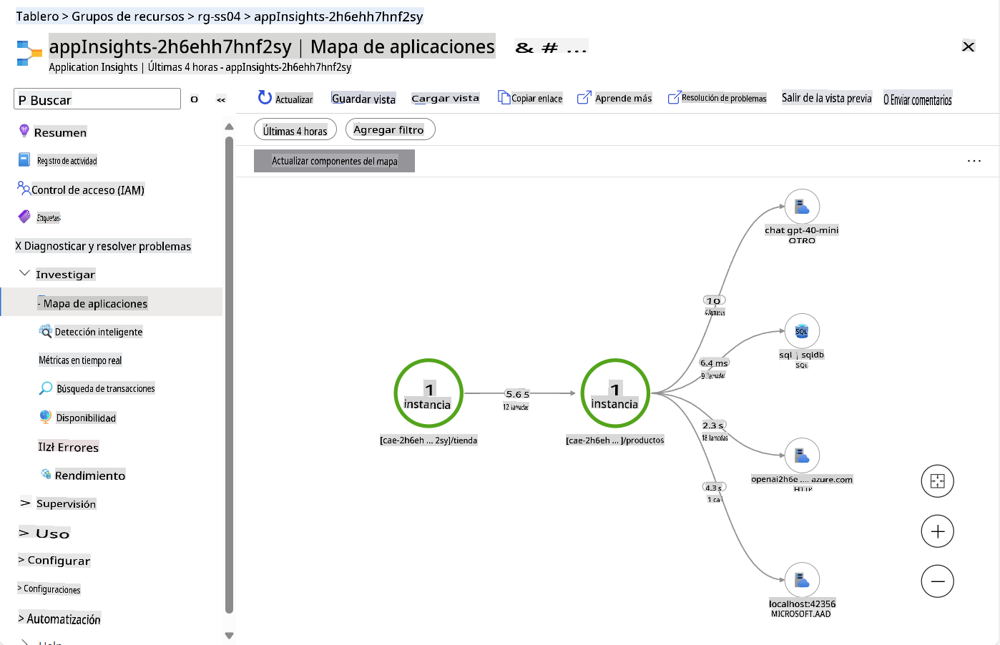
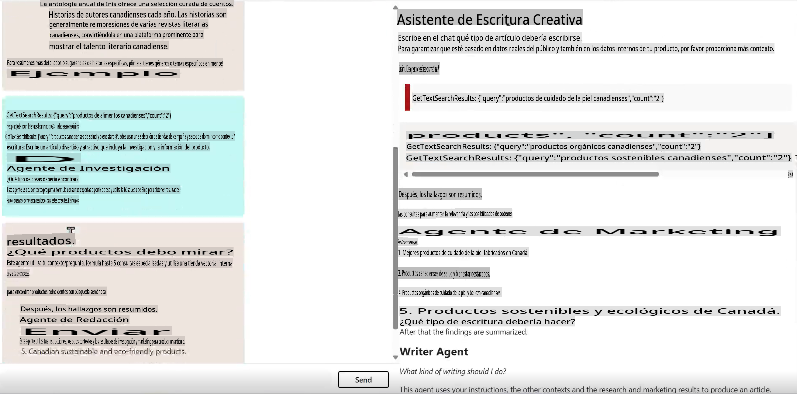
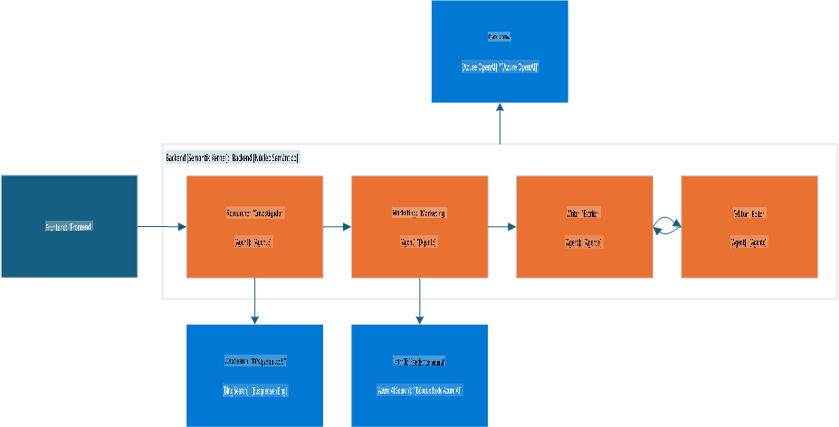
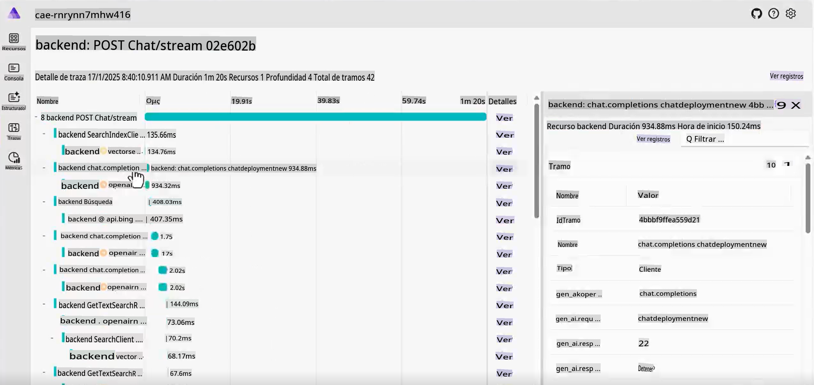
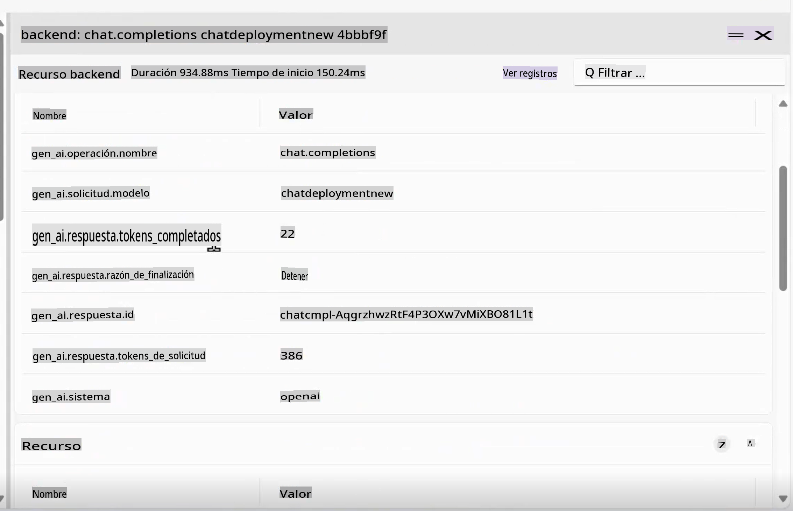

# Muestras Canónicas de IA Generativa

Descubre todos los conceptos que has aprendido en acción con estos ejemplos prácticos y del mundo real.

---

## Lo que lograrás

- Ver cómo GenAI se integra en aplicaciones existentes.
- Comprender cómo funcionan los Agentes en escenarios complejos.

## Ejemplos incluidos
- [Muestras Canónicas de IA Generativa](../../../04-PracticalSamples)
  - [Lo que lograrás](../../../04-PracticalSamples)
  - [Ejemplos incluidos](../../../04-PracticalSamples)
  - [Demos de eShopLite](../../../04-PracticalSamples)
    - [eShopLite con búsqueda semántica - En Memoria](../../../04-PracticalSamples)
    - [eShopLite con búsqueda semántica - Azure AI Search](../../../04-PracticalSamples)
    - [eShopLite con audio en tiempo real](../../../04-PracticalSamples)
  - [Agente Escritor Creativo](../../../04-PracticalSamples)
  - [Resumen](../../../04-PracticalSamples)
    - [Recursos adicionales](../../../04-PracticalSamples)
    - [Próximos pasos](../../../04-PracticalSamples)

[](https://youtu.be/Ky4CACXJqR8?feature=shared)

_⬆️Haz clic en la imagen para ver el video⬆️_

## Demos de eShopLite

En nuestras primeras demos, exploraremos los proyectos de **eShopLite**. **eShopLite** es una aplicación sencilla de comercio electrónico diseñada para entusiastas del camping y el equipo de exteriores, mejorada con capacidades de IA Generativa como optimización de búsqueda, soporte al cliente y análisis de audio en tiempo real.

Estas demos utilizan [Azure OpenAI](https://azure.microsoft.com/products/ai-services/openai-service) y [Azure AI Foundry Models](https://ai.azure.com/) para realizar las inferencias (o la parte de IA generativa) en las aplicaciones.

En la primera demo, mostramos cómo usar Semantic Kernel para mejorar las capacidades de búsqueda, logrando entender el contexto de las consultas de los usuarios y proporcionando resultados más precisos.

### eShopLite con búsqueda semántica

[](https://youtu.be/FlkruF6USro?feature=shared)

_⬆️Haz clic en la imagen para ver el video⬆️_

En eShopLite con búsqueda semántica, utilizamos Semantic Kernel para mejorar las capacidades de búsqueda de la aplicación de comercio electrónico. Semantic Kernel nos ayuda a crear un motor de búsqueda más robusto que entiende el contexto de las consultas de los usuarios y ofrece resultados más precisos.

Por ejemplo, si un usuario busca "¿tienes algo para cocinar?", el motor de búsqueda puede entender que el usuario está buscando utensilios de cocina y mostrar los productos más relevantes. En este caso, devuelve utensilios de cocina para camping.

> 🧑‍💻**Ejemplo**: Consulta el [ejemplo de búsqueda semántica en eShopLite](https://aka.ms/netaieshoplitesemanticsearch)



La búsqueda semántica puede ayudar a los usuarios a encontrar los productos que necesitan más fácilmente, mejorando la experiencia de compra y aumentando las ventas. Para implementar esta funcionalidad, necesitamos un almacén vectorial con los productos, un índice de búsqueda y un modelo de lenguaje. Las herramientas de [.NET Aspire](https://learn.microsoft.com/dotnet/aspire/get-started/aspire-overview) ayudan a coordinar todos los procesos en el backend.



En el panel de .NET Aspire, podemos ver los productos, SQL y contenedores de almacenamiento, que interactúan con el modelo de lenguaje. Al profundizar en el Aspire App Host, encontramos lo siguiente:

```csharp
if (builder.ExecutionContext.IsPublishMode)
{
    // Add the Azure Application Insights for monitoring
    var appInsights = builder.AddAzureApplicationInsights("appInsights");
    // Add the Azure OpenAI for the chat and embeddings deployments, the embedding is used for the vector entities
    var chatDeploymentName = "gpt-4o-mini";
    var embeddingsDeploymentName = "text-embedding-ada-002";
    var aoai = builder.AddAzureOpenAI("openai")
        .AddDeployment(new AzureOpenAIDeployment(chatDeploymentName,
        "gpt-4o-mini",
        "2024-07-18",
        "GlobalStandard",
        10))
        .AddDeployment(new AzureOpenAIDeployment(embeddingsDeploymentName,
        "text-embedding-ada-002",
        "2"));

    products.WithReference(appInsights)
        .WithReference(aoai)
        .WithEnvironment("AI_ChatDeploymentName", chatDeploymentName)
        .WithEnvironment("AI_embeddingsDeploymentName", embeddingsDeploymentName);

    store.WithReference(appInsights)
        .WithExternalHttpEndpoints();
}
```

El código anterior muestra cómo agregar Azure Application Insights para monitoreo, Azure OpenAI para los despliegues de chat y embeddings, y el embedding utilizado para las entidades vectoriales.

Para la creación de embeddings y AOAI, esto se encuentra en el contenedor de productos, como se muestra a continuación:

```csharp
var azureOpenAiClientName = "openai";
builder.AddAzureOpenAIClient(azureOpenAiClientName);

// get azure openai client and create Chat client from aspire hosting configuration
builder.Services.AddSingleton<ChatClient>(serviceProvider =>
{
    var chatDeploymentName = "gpt-4o-mini";
    var logger = serviceProvider.GetService<ILogger<Program>>()!;
    logger.LogInformation($"Chat client configuration, modelId: {chatDeploymentName}");
    ChatClient chatClient = null;
    try
    {
        OpenAIClient client = serviceProvider.GetRequiredService<OpenAIClient>();
        chatClient = client.GetChatClient(chatDeploymentName);
    }...
}
```

El código anterior demuestra cómo obtener el cliente de Azure OpenAI y crear el cliente de Chat a partir de la configuración de alojamiento de Aspire. El `chatDeploymentName` es el nombre del despliegue utilizado en la aplicación. El mismo proceso se usa para crear el cliente de Embedding, como se muestra a continuación:

```csharp
// get azure openai client and create embedding client from aspire hosting configuration
builder.Services.AddSingleton<EmbeddingClient>(serviceProvider =>
{
    var embeddingsDeploymentName = "text-embedding-ada-002";
    var logger = serviceProvider.GetService<ILogger<Program>>()!;
    logger.LogInformation($"Embeddings client configuration, modelId: {embeddingsDeploymentName}");
    EmbeddingClient embeddingsClient = null;
    try
    {
        OpenAIClient client = serviceProvider.GetRequiredService<OpenAIClient>();
        embeddingsClient = client.GetEmbeddingClient(embeddingsDeploymentName);
    }...
});
```

Con esto podemos crear el `MemoryContext`, como nuestro almacén vectorial para comparar con la consulta del usuario y devolver los productos más relevantes, como se muestra a continuación:

```csharp
// Iterate over the products and add them to the memory
_logger.LogInformation("Adding product to memory: {Product}", product.Name);
var productInfo = $"[{product.Name}] is a product that costs [{product.Price}] and is described as [{product.Description}]";

// Create a new product vector
var productVector = new ProductVector
{
    Id = product.Id,
    Name = product.Name,
    Description = product.Description,
    Price = product.Price,
    ImageUrl = product.ImageUrl
};

// Generate the embedding for the product information
var result = await _embeddingClient.GenerateEmbeddingAsync(productInfo);

// Convert the embedding result to a float array and assign it to the product vector
productVector.Vector = result.Value.ToFloats();
var recordId = await _productsCollection.UpsertAsync(productVector);
_logger.LogInformation("Product added to memory: {Product} with recordId: {RecordId}", product.Name, recordId);
```

El código anterior muestra cómo iterar sobre los productos y agregarlos a la memoria.

Después de crear un nuevo vector de producto, lo usamos para generar embeddings para la información del producto, convertir el resultado del embedding en un array de flotantes y asignarlo al vector del producto.

Observa `_productsCollection`, que es una referencia al contenedor donde se almacenan los productos, utilizando una llamada a CosmosDB para obtener la respuesta para el `recordId`. En este caso, para registro.

El producto se agrega a la memoria, repitiendo el proceso para cada producto en la colección.

Después de eso, cuando el usuario busca un producto, podemos comparar la consulta del usuario con los vectores de productos y devolver los productos más relevantes.

```csharp
try
{
    // Generate embedding for the search query
    var result = await _embeddingClient.GenerateEmbeddingAsync(search);
    var vectorSearchQuery = result.Value.ToFloats();

    var searchOptions = new VectorSearchOptions()
    {
        Top = 1, // Retrieve the top 1 result
        VectorPropertyName = "Vector"
    };

    // Search the vector database for the most similar product
    var searchResults = await _productsCollection.VectorizedSearchAsync(vectorSearchQuery, searchOptions);
    double searchScore = 0.0;
    await foreach (var searchItem in searchResults.Results)
    {
        if (searchItem.Score > 0.5)
        {
            // Product found, retrieve the product details
            firstProduct = new Product
            {
                Id = searchItem.Record.Id,
                Name = searchItem.Record.Name,
                Description = searchItem.Record.Description,
                Price = searchItem.Record.Price,
                ImageUrl = searchItem.Record.ImageUrl
            };

            searchScore = searchItem.Score.Value;
            responseText = $"The product [{firstProduct.Name}] fits with the search criteria [{search}][{searchItem.Score.Value.ToString("0.00")}]";
            _logger.LogInformation($"Search Response: {responseText}");
        }
    }

    // Generate a friendly response message using the found product information
    var prompt = @$"You are an intelligent assistant helping clients with their search about outdoor products. Generate a catchy and friendly message using the following information:
    - User Question: {search}
    - Found Product Name: {firstProduct.Name}
    - Found Product Description: {firstProduct.Description}
    - Found Product Price: {firstProduct.Price}
    Include the found product information in the response to the user question.";

    var messages = new List<ChatMessage>
    {
        new SystemChatMessage(_systemPrompt),
        new UserChatMessage(prompt)
    };

    _logger.LogInformation("{ChatHistory}", JsonConvert.SerializeObject(messages));

    var resultPrompt = await _chatClient.CompleteChatAsync(messages);
}
```

Con el código anterior, generamos el embedding para la consulta de búsqueda, buscamos en la base de datos vectorial el producto más similar y obtenemos un mensaje de respuesta utilizando la información del producto encontrado.

Esto ayuda a los usuarios a encontrar los productos que necesitan más fácilmente, mejorando la experiencia de compra y aumentando las ventas.

Además, a medida que la IA generativa evoluciona, necesitamos telemetría y monitoreo para entender el comportamiento de los usuarios y mejorar el motor de búsqueda. Aquí es donde entran Azure Application Insights y .NET Aspire.



.NET Aspire proporciona un conjunto poderoso de herramientas para monitorear y rastrear el comportamiento de la aplicación, incluidas las interacciones de los usuarios con el motor de búsqueda, los servicios backend y los modelos de IA. Las capacidades de rastreo pueden ayudarnos a entender posibles cuellos de botella, errores y problemas de rendimiento, lo que nos permite optimizar la aplicación y ofrecer una mejor experiencia al usuario.



Como la telemetría es esencial para entender el comportamiento de los usuarios y mejorar los servicios, introducimos Azure Application Insights para monitorear el rendimiento de la aplicación y las interacciones de los usuarios.

Application Insights proporciona un conjunto completo de datos de telemetría, ayudándonos a entender cómo están funcionando nuestros servicios y cómo los usuarios interactúan con la aplicación y el uso de la nube.

En la imagen, podemos ver el panel de Application Insights, mostrando cómo están funcionando los servicios, por ejemplo, las llamadas a nuestra base de datos, el número de solicitudes y el tiempo de respuesta.

> 💡 **Consejo Pro**: Para más información sobre eShopLite con búsqueda semántica, consulta el repositorio para aprender más: https://aka.ms/netaieshoplitesemanticsearch

### eShopLite con búsqueda semántica usando Azure AI Search

En la demo completa de eShopLite, usamos **Azure AI Search** para mejorar las capacidades de búsqueda de la aplicación de comercio electrónico. Azure AI Search nos ayuda a crear un motor de búsqueda más robusto que entiende el contexto de las consultas de los usuarios y ofrece resultados más precisos.

También proporciona un motor de búsqueda más escalable y confiable que puede manejar grandes cantidades de datos y consultas de usuarios. Azure AI Search permite que la solución persista los índices de búsqueda, de modo que la información estará disponible incluso si la aplicación se reinicia.

- [eShopLite con Azure AI Search](https://aka.ms/netaieshoplitesemanticsearchazureaisearch)

### eShopLite con audio en tiempo real

[](https://youtu.be/bx0hRNdr_bQ?feature=shared)

_⬆️Haz clic en la imagen para ver el video⬆️_

En eShopLite con audio en tiempo real, utilizamos las capacidades de audio en tiempo real de GPT-4o para analizar las conversaciones entre el cliente y el chatbot, proporcionando una experiencia más personalizada y atractiva. Por ejemplo, si un cliente solicita una recomendación de producto, el chatbot puede analizar la solicitud del cliente en tiempo real y ofrecer una respuesta más precisa y relevante.

> 🧑‍💻**Ejemplo**: Consulta el [ejemplo de búsqueda semántica en eShopLite](https://aka.ms/netaieshopliterealtimechat)


Para implementar esta funcionalidad, necesitamos agregar nuevas características para crear los endpoints del análisis en tiempo real, que se encuentran en la implementación `StoreRealtime\ConversationManager.cs` para análisis en tiempo real.

```csharp
public async Task RunAsync(
    Stream audioInput, 
    Speaker audioOutput, 
    Func<string, Task> addMessageAsync, 
    Func<string, bool, Task> addChatMessageAsync, 
    CancellationToken cancellationToken)
{
    // Define the initial prompt for the assistant
    var prompt = $"""
        You are a useful assistant.
        Respond as succinctly as possible, in just a few words.
        Check the product database and external sources for information.
        The current date is {DateTime.Now.ToLongDateString()}
        """;
```

Primero, definimos el prompt inicial para el asistente, proporcionando al usuario instrucciones sobre cómo interactuar con el chatbot. Recuerda usar prompts que sean claros y concisos; la ingeniería de prompts es esencial para obtener resultados precisos de los modelos de IA.

```csharp
// Notify the user that the connection is being established
await addMessageAsync("Connecting...");

// Send an initial greeting message
await addChatMessageAsync("Hello, how can I help?", false);

// Create AI functions for semantic search and product name search
var contosoSemanticSearchTool = AIFunctionFactory.Create(_contosoProductContext.SemanticSearchOutdoorProductsAsync);
var contosoSearchByProductNameTool = AIFunctionFactory.Create(_contosoProductContext.SearchOutdoorProductsByNameAsync);

// Add the AI functions to a list of tools
List<AIFunction> tools = new List<AIFunction> { contosoSemanticSearchTool, contosoSearchByProductNameTool };
```

Luego, notificamos al usuario que el chat está listo para comenzar y enviamos un mensaje de saludo inicial. Después, se crean funciones de IA para buscar productos, realizar búsqueda semántica y buscar por nombre de producto, las cuales se añaden a una lista de herramientas que pueden usarse para proporcionar información relevante a las consultas del usuario.

```csharp
// Configure the conversation session options
var sessionOptions = new ConversationSessionOptions()
{
    Instructions = prompt,
    Voice = ConversationVoice.Shimmer,
    InputTranscriptionOptions = new() { Model = "whisper-1" },
};

// Add each tool to the session options
foreach (var tool in tools)
{
    sessionOptions.Tools.Add(tool.ToConversationFunctionTool());
}

// Start the conversation session with the configured options
session = await client.StartConversationSessionAsync(cancellationToken);
await session.ConfigureSessionAsync(sessionOptions);

// Initialize a StringBuilder to store the output transcription
var outputTranscription = new StringBuilder();
```

Se configuran las opciones de la sesión de conversación, incluidas las instrucciones, la voz y las opciones de transcripción de entrada, utilizando el modelo `Whisper-1` para la transcripción de entrada.

Cada herramienta se añade a las opciones de la sesión, y la sesión de conversación comienza con las opciones configuradas. Estas pueden modificarse para ajustarse a las necesidades del usuario.

> 🧑‍💻**Ejemplo**: Consulta el [ejemplo de búsqueda semántica en eShopLite](https://aka.ms/netaieshopliterealtimechat)

## Agente Escritor Creativo

[](https://youtu.be/ZjZWilI_5z8?feature=shared)

_⬆️Haz clic en la imagen para ver el video⬆️_

Los agentes son un tema importante en el panorama actual de la IA, y para demostrar sus capacidades, utilizaremos el Agente Escritor Creativo, una herramienta que puede generar texto creativo y atractivo basado en la entrada del usuario, ayudando a escribir contenido investigado, específico y cautivador.

> 🧑‍💻**Ejemplo**: Consulta el [código de ejemplo del Agente Escritor Creativo](https://aka.ms/netaicreativewriter)



Esta solución se centra en cuatro módulos dedicados que trabajan juntos para generar contenido de alta calidad:

- Investigador: Utiliza Bing Search para recopilar contexto, temas y datos, resumiéndolos de manera concisa.
- Marketing: Interpreta la intención del usuario, construye preguntas relevantes y utiliza la base de datos vectorial para obtener resultados precisos.
- Escritor: Sintetiza los hallazgos del Investigador y Marketing, produciendo un escrito cohesivo del artículo.
- Editor: Evalúa el borrador, ofrece correcciones y decide si está listo para su publicación.

El flujo de trabajo integra datos relevantes, mensajes efectivos y revisión, siendo orquestado por Semantic Kernel, Microsoft AI Extension y .NET Aspire.



Entender cómo interactúan los componentes entre sí puede servir como referencia para crear tus propias aplicaciones basadas en agentes. Observa el siguiente código para entender cómo interactúan los componentes, primero en la llamada de `ChatController.cs` al Escritor Creativo:

```csharp
var userInput = request.Messages.Last();

// Deserialize the user input content into a CreateWriterRequest object
CreateWriterRequest createWriterRequest = _yamlDeserializer.Deserialize<CreateWriterRequest>(userInput.Content);

// Create a new session for the Creative Writer application
var session = await _creativeWriterApp.CreateSessionAsync(Response);

// Process the streaming request and write the response in real-time
await foreach (var delta in session.ProcessStreamingRequest(createWriterRequest))
{
    // Serialize the delta and write it to the response stream and flush
    await response.WriteAsync($"{JsonSerializer.Serialize(delta)}\r\n");
    await response.Body.FlushAsync();
}
```

El tipo `CreateWriterRequest` needs to have three properties: `Research`, `Products`, and `Writing`. After getting them setted by processing the request, it calls the `CreateSessionAsync` se ve así:

```csharp
internal async Task<CreativeWriterSession> CreateSessionAsync(HttpResponse response)
{
    // Add custom function invocation filters to handle response modifications
    defaultKernel.FunctionInvocationFilters.Add(new FunctionInvocationFilter(response));

    // Create a separate kernel for Bing search integration and intialize the Bing service, and create a plugin for Bing search
    Kernel bingKernel = defaultKernel.Clone();
    BingTextSearch textSearch = new(apiKey: configuration["BingAPIKey"]!);
    KernelPlugin searchPlugin = textSearch.CreateWithSearch("BingSearchPlugin");
    bingKernel.Plugins.Add(searchPlugin);

    // Clone the default kernel to set up the vector search capabilities, and create the vector search kernel
    Kernel vectorSearchKernel = defaultKernel.Clone();
    await ConfigureVectorSearchKernel(vectorSearchKernel);

    // Return a new session encapsulating all configured kernels for comprehensive AI functionalities
    return new CreativeWriterSession(defaultKernel, bingKernel, vectorSearchKernel);
}
```

Ahora, podemos ver los componentes `CreativeWriterSession` class for the `ProcessStreamingRequest` function, to understand how the components interact with each other, first look at the `Research` and `Marketing`:

```csharp
// Initialize the Researcher Agent with a specific prompt template.
// This agent leverages the Bing Kernel for enhanced semantic search capabilities.
ChatCompletionAgent researcherAgent = new(ReadFileForPromptTemplateConfig("./Agents/Prompts/researcher.yaml"))
{
    Name = ResearcherName,
    Kernel = bingKernel,
    Arguments = CreateFunctionChoiceAutoBehavior(),
    LoggerFactory = bingKernel.LoggerFactory
};

// Initialize the Marketing Agent with its own prompt template.
// This agent utilizes the Vector Search Kernel to handle product-related queries efficiently.
ChatCompletionAgent marketingAgent = new(ReadFileForPromptTemplateConfig("./Agents/Prompts/marketing.yaml"))
{
    Name = MarketingName,
    Kernel = vectorSearchKernel,
    Arguments = CreateFunctionChoiceAutoBehavior(),
    LoggerFactory = vectorSearchKernel.LoggerFactory
};

// ...

// Invoke the Researcher Agent asynchronously with the provided research context.
await foreach (ChatMessageContent response in researcherAgent.InvokeAsync(
    new object[] { }, 
    new Dictionary<string, string> { { "research_context", createWriterRequest.Research } }))
{
    // Aggregate the research results for further processing or display.
    sbResearchResults.AppendLine(response.Content);
    
    yield return new AIChatCompletionDelta(Delta: new AIChatMessageDelta
    {
        Role = AIChatRole.Assistant,
        Context = new AIChatAgentInfo(ResearcherName),
        Content = response.Content,
    });
}

// ...

// Invoke the Marketing Agent with the provided product context.
await foreach (ChatMessageContent response in marketingAgent.InvokeAsync(
    new object[] { },
    new Dictionary<string, string> { { "product_context", createWriterRequest.Products } }))
{
    // Consolidate the product-related results for use in marketing strategies or user feedback.
    sbProductResults.AppendLine(response.Content);
    
    yield return new AIChatCompletionDelta(Delta: new AIChatMessageDelta
    {
        Role = AIChatRole.Assistant,
        Context = new AIChatAgentInfo(MarketingName),
        Content = response.Content,
    });
}
```

Finalmente, inicializamos y configuramos los agentes `Writer` and `Editor`. Observa el código:

```csharp
// Initialize the Writer Agent with its specific prompt configuration
ChatCompletionAgent writerAgent = new(ReadFileForPromptTemplateConfig("./Agents/Prompts/writer.yaml"))
{
    Name = WriterName, 
    Kernel = kernel, /
    Arguments = new Dictionary<string, string>(), 
    LoggerFactory = kernel.LoggerFactory 
};

// Initialize the Editor Agent with its specific prompt configuration
ChatCompletionAgent editorAgent = new(ReadFileForPromptTemplateConfig("./Agents/Prompts/editor.yaml"))
{
    Name = EditorName, 
    Kernel = kernel, 
    LoggerFactory = kernel.LoggerFactory
};

// Populate the Writer Agent with contextual data required for generating content, gathered from the User, Researcher and Marketing Agents
writerAgent.Arguments["research_context"] = createWriterRequest.Research;
writerAgent.Arguments["research_results"] = sbResearchResults.ToString();
writerAgent.Arguments["product_context"] = createWriterRequest.Products;
writerAgent.Arguments["product_results"] = sbProductResults.ToString();
writerAgent.Arguments["assignment"] = createWriterRequest.Writing;

// Configure the Agent Group Chat to manage interactions between Writer and Editor
AgentGroupChat chat = new(writerAgent, editorAgent)
{
    LoggerFactory = kernel.LoggerFactory,
    ExecutionSettings = new AgentGroupChatSettings
    {
        // Define the strategy for selecting which agent interacts next
        SelectionStrategy = new SequentialSelectionStrategy() 
        { 
            InitialAgent = writerAgent // Start the conversation with the Writer Agent
        },
        // Define the termination condition for the agent interactions, in this case, the Editor Agent will terminate the conversation
        TerminationStrategy = new NoFeedbackLeftTerminationStrategy()
    }
};
```

En .NET Aspire, notamos cómo los componentes están orquestados para crear una experiencia fluida para el usuario. La función de rastreo nos permite monitorear las interacciones entre los agentes, y la telemetría proporciona información sobre el comportamiento del usuario y el rendimiento de los modelos de IA.




> 🧑‍💻**Ejemplo**: Consulta el [código de ejemplo del Agente de Escritura Creativa](https://aka.ms/netaicreativewriter)

## Resumen

Estos son solo algunos ejemplos de cómo puedes usar GenAI en tus aplicaciones. Las posibilidades son infinitas, y la tecnología está evolucionando rápidamente. Revisa algunos de nuestros recursos para aprender más sobre GenAI y cómo puedes usarlo en tus proyectos.

> 🙋 **¿Necesitas ayuda?**: Si encuentras algún problema, abre un issue en el repositorio.

### Recursos adicionales

- [eShopLite con DeepSeek](https://aka.ms/netaieshoplitedeepseekr1)
- [eShopLite con Azure AI Search](https://aka.ms/netaieshoplitesemanticsearchazureaisearch)

### Próximos pasos

¡Aprende sobre prácticas de IA responsable y cómo asegurarte de que tus modelos de IA sean éticos y tengan un impacto positivo!

👉 [IA Responsable](../05-ResponsibleGenAI/readme.md)

**Descargo de responsabilidad**:  
Este documento ha sido traducido utilizando servicios de traducción automática basados en inteligencia artificial. Si bien nos esforzamos por lograr precisión, tenga en cuenta que las traducciones automatizadas pueden contener errores o imprecisiones. El documento original en su idioma nativo debe considerarse la fuente autorizada. Para información crítica, se recomienda una traducción profesional realizada por humanos. No nos hacemos responsables de malentendidos o interpretaciones erróneas que puedan surgir del uso de esta traducción.