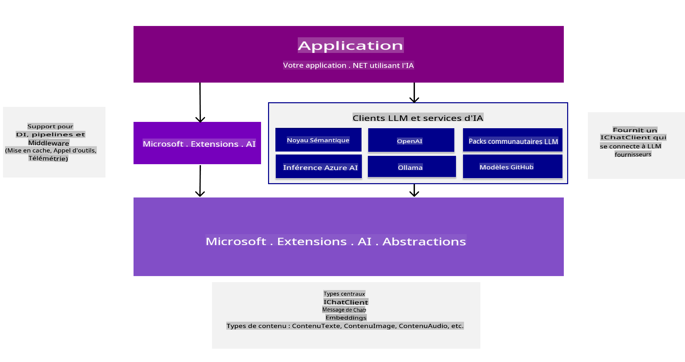
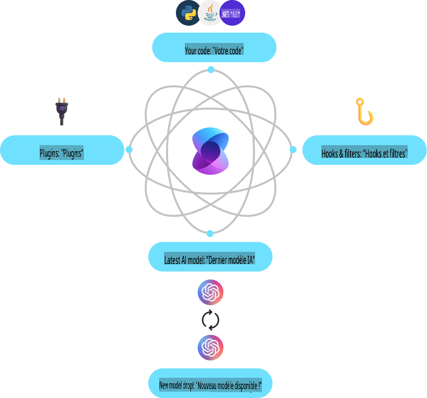
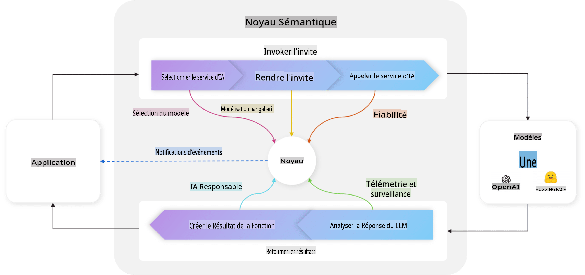
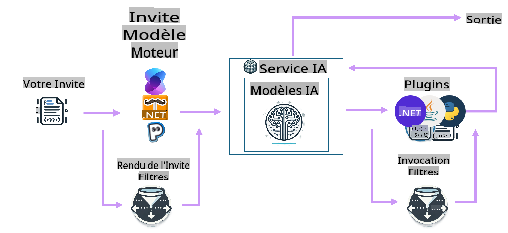

# Bien démarrer avec les outils de développement AI

Rafraîchissez vos connaissances en intelligence artificielle générative et découvrez les outils .NET disponibles pour vous aider à développer des applications d'IA générative.

---

[](http://www.youtube.com/watch?v=SZvE_meBdvg)

_⬆️Cliquez sur l'image pour regarder la vidéo⬆️_

## Ce que vous apprendrez dans cette leçon :

- 🌟 Comprendre les concepts fondamentaux de l'IA générative et leurs applications
- 🔍 Explorer les outils .NET pour le développement d'IA, y compris MEAI, Semantic Kernel et Azure OpenAI

## Fondamentaux de l'IA générative pour .NET

Avant de plonger dans le code, prenons un moment pour réviser certains concepts de l'IA générative (GenAI). Dans cette leçon, **Fondamentaux de l'IA générative pour .NET**, nous allons rafraîchir quelques concepts fondamentaux de GenAI afin que vous compreniez pourquoi certaines choses sont faites de cette manière. Nous introduirons également les outils et SDK que vous utiliserez pour créer des applications, comme **MEAI** (Microsoft.Extensions.AI), **Semantic Kernel**, et l'**extension AI Toolkit pour VS Code**.

### Petit rappel sur les concepts de l'IA générative

L'IA générative est un type d'intelligence artificielle qui crée du contenu nouveau, comme du texte, des images ou du code, en se basant sur des modèles et des relations appris à partir de données. Les modèles d'IA générative peuvent produire des réponses proches de celles d'un humain, comprendre le contexte et parfois même créer un contenu qui semble humain.

Lorsque vous développerez vos applications .NET AI, vous travaillerez avec des **modèles d'IA générative** pour créer du contenu. Voici quelques capacités de ces modèles :

- **Génération de texte** : Rédiger du texte naturel pour des chatbots, du contenu ou des complétions de texte.
- **Génération et analyse d'images** : Produire des images réalistes, améliorer des photos ou détecter des objets.
- **Génération de code** : Écrire des extraits de code ou des scripts.

Il existe différents types de modèles optimisés pour des tâches spécifiques. Par exemple, les **modèles de langage de petite taille (SLMs)** sont idéaux pour la génération de texte, tandis que les **modèles de langage de grande taille (LLMs)** conviennent mieux aux tâches complexes comme la génération de code ou l'analyse d'images. Ensuite, différentes entreprises et groupes développent ces modèles, comme Microsoft, OpenAI ou Anthropic. Le choix du modèle dépendra de votre cas d'utilisation et des capacités requises.

Bien sûr, les réponses de ces modèles ne sont pas toujours parfaites. Vous avez probablement entendu parler de modèles qui "hallucinent" ou génèrent des informations incorrectes avec assurance. Cependant, vous pouvez guider le modèle pour produire de meilleures réponses en lui fournissant des instructions claires et un contexte approprié. C'est là qu'intervient le **prompt engineering**.

#### Rappel sur le prompt engineering

Le prompt engineering consiste à concevoir des entrées efficaces pour guider les modèles d'IA vers les résultats souhaités. Cela implique :

- **Clarté** : Rendre les instructions claires et sans ambiguïté.
- **Contexte** : Fournir les informations de base nécessaires.
- **Contraintes** : Spécifier les limitations ou les formats attendus.

Quelques bonnes pratiques incluent la conception des prompts, des instructions claires, la décomposition des tâches, l'apprentissage à un ou plusieurs exemples, et l'optimisation des prompts. Il est également utile d'essayer et de tester différents prompts pour voir ce qui fonctionne le mieux pour votre cas spécifique.

Il est important de noter qu'il existe différents types de prompts dans le développement d'applications. Par exemple, vous serez chargé de définir des **prompts système** qui établissent les règles de base et le contexte pour la réponse du modèle. Les données que l'utilisateur de votre application fournit au modèle sont appelées **prompts utilisateur**. Et les **prompts assistant** sont les réponses générées par le modèle en fonction des prompts système et utilisateur.

> 🧑‍🏫 **En savoir plus** : Apprenez-en davantage sur le prompt engineering dans le [chapitre sur le prompt engineering du cours GenAI pour débutants](https://github.com/microsoft/generative-ai-for-beginners/tree/main/04-prompt-engineering-fundamentals)

#### Tokens, embeddings et agents - oh là là !

Lorsque vous travaillez avec des modèles d'IA générative, vous rencontrerez des termes comme **tokens**, **embeddings** et **agents**. Voici un aperçu rapide de ces concepts :

- **Tokens** : Les tokens sont les plus petites unités de texte dans un modèle. Ils peuvent être des mots, des caractères ou des sous-mots. Les tokens servent à représenter les données textuelles dans un format compréhensible par le modèle.
- **Embeddings** : Les embeddings sont des représentations vectorielles des tokens. Ils capturent la signification sémantique des mots et des phrases, permettant aux modèles de comprendre les relations entre les mots et de générer des réponses contextuellement pertinentes.
- **Bases de données vectorielles** : Les bases de données vectorielles sont des collections d'embeddings utilisées pour comparer et analyser des données textuelles. Elles permettent aux modèles de générer des réponses basées sur le contexte des données d'entrée.
- **Agents** : Les agents sont des composants d'IA qui interagissent avec les modèles pour générer des réponses. Il peut s'agir de chatbots, d'assistants virtuels ou d'autres applications utilisant des modèles d'IA générative pour créer du contenu.

En développant des applications .NET AI, vous utiliserez des tokens, des embeddings et des agents pour créer des chatbots, des générateurs de contenu et d'autres applications alimentées par l'IA. Comprendre ces concepts vous aidera à concevoir des applications AI plus efficaces et performantes.

### Outils et bibliothèques de développement AI pour .NET

.NET offre une gamme d'outils pour le développement d'IA. Prenons un moment pour comprendre certains des outils et bibliothèques disponibles.

#### Microsoft.Extensions.AI (MEAI)

La bibliothèque Microsoft.Extensions.AI (MEAI) fournit des abstractions unifiées et des middlewares pour simplifier l'intégration des services d'IA dans les applications .NET.

En offrant une API cohérente, MEAI permet aux développeurs d'interagir avec différents services d'IA, tels que les modèles de langage petits et grands, les embeddings, et même les middlewares via une interface commune. Cela réduit les frictions liées à la création d'une application .NET AI, car vous développerez contre la même API pour différents services.

Par exemple, voici l'interface que vous utiliseriez pour créer un client de chat avec MEAI, quel que soit le service d'IA utilisé :

```csharp
public interface IChatClient : IDisposable 
{ 
    Task<ChatCompletion> CompleteAsync(...); 
    IAsyncEnumerable<StreamingChatCompletionUpdate> CompleteStreamingAsync(...); 
    ChatClientMetadata Metadata { get; } 
    TService? GetService<TService>(object? key = null) where TService : class; 
}
```

Ainsi, lorsque vous utilisez MEAI pour créer une application de chat, vous développerez contre la même surface d'API pour obtenir une complétion de chat ou diffuser cette complétion, récupérer des métadonnées ou accéder au service d'IA sous-jacent. Cela facilite le remplacement ou l'ajout de nouveaux services d'IA selon les besoins.

De plus, la bibliothèque prend en charge des composants middleware pour des fonctionnalités comme la journalisation, la mise en cache et la télémétrie, ce qui simplifie le développement d'applications AI robustes.



Grâce à une API unifiée, MEAI permet aux développeurs de travailler avec différents services d'IA, tels que Azure AI Inference, Ollama et OpenAI, de manière cohérente. Cela simplifie l'intégration des modèles d'IA dans les applications .NET, offrant aux développeurs une flexibilité pour choisir les meilleurs services d'IA pour leurs projets et leurs besoins spécifiques.

> 🏎️ **Démarrage rapide** : Pour un démarrage rapide avec MEAI, [consultez l'article de blog](https://devblogs.microsoft.com/dotnet/introducing-microsoft-extensions-ai-preview/).
>
> 📖 **Docs** : En savoir plus sur Microsoft.Extensions.AI (MEAI) dans la [documentation MEAI](https://learn.microsoft.com/dotnet/ai/ai-extensions)

#### Semantic Kernel (SK)

Semantic Kernel est un SDK open-source qui permet aux développeurs d'intégrer des modèles de langage d'IA générative dans leurs applications .NET. Il fournit des abstractions pour les services d'IA et les magasins de mémoire (vecteurs), permettant la création de plugins orchestrés automatiquement par l'IA. Il utilise même le standard OpenAPI, permettant aux développeurs de créer des agents d'IA pour interagir avec des API externes.



Semantic Kernel prend en charge .NET, ainsi que d'autres langages tels que Java et Python, offrant une multitude de connecteurs, de fonctions et de plugins pour l'intégration. Certaines des fonctionnalités clés incluent :

- **Noyau Kernel** : Fournit les fonctionnalités principales pour le Semantic Kernel, y compris les connecteurs, les fonctions et les plugins, pour interagir avec les services et modèles d'IA. Le noyau est le cœur du Semantic Kernel, accessible aux services et plugins, les récupérant lorsque nécessaire, surveillant les agents, et agissant comme middleware actif pour votre application.

    Par exemple, il peut choisir le meilleur service d'IA pour une tâche spécifique, construire et envoyer le prompt au service, puis renvoyer la réponse à l'application. Ci-dessous, un diagramme du noyau Kernel en action :

    

- **Connecteurs de services IA** : Fournit une couche d'abstraction pour exposer les services d'IA à plusieurs fournisseurs via une interface cohérente, comme la complétion de chat, le texte en image, le texte en parole et l'audio en texte.

- **Connecteurs de magasins vectoriels** : Expose les magasins vectoriels à plusieurs fournisseurs via une interface cohérente, permettant aux développeurs de travailler avec des embeddings, des vecteurs et d'autres représentations de données.

- **Fonctions et plugins** : Offre une gamme de fonctions et plugins pour des tâches AI courantes, comme le traitement des fonctions, le Prompt Templating, la recherche textuelle, et plus encore. Connecté au service/modèle d'IA, cela permet des implémentations pour RAG et des agents, par exemple.

- **Prompt Templating** : Fournit des outils pour le prompt engineering, y compris la conception, les tests et l'optimisation des prompts, pour améliorer les performances et la précision des modèles d'IA. Cela permet aux développeurs de créer, tester et optimiser des prompts pour des tâches spécifiques.

- **Filtres** : Offre des contrôles sur le moment et la manière dont les fonctions sont exécutées pour améliorer la sécurité et favoriser des pratiques d'IA responsable.

Dans Semantic Kernel, une boucle complète ressemblerait au diagramme ci-dessous :



> 📖 **Docs** : En savoir plus sur Semantic Kernel dans la [documentation Semantic Kernel](https://learn.microsoft.com/semantic-kernel/overview/)

## Conclusion

L'IA générative ouvre un monde de possibilités pour les développeurs, leur permettant de créer des applications innovantes qui génèrent du contenu, comprennent le contexte et fournissent des réponses proches de celles d'un humain. L'écosystème .NET offre une gamme d'outils et de bibliothèques pour simplifier le développement d'IA, facilitant l'intégration des capacités d'IA dans les applications .NET.

## Prochaines étapes

Dans les prochains chapitres, nous explorerons ces scénarios en détail, avec des exemples pratiques, des extraits de code et des bonnes pratiques pour vous aider à créer des solutions d'IA concrètes avec .NET !

Ensuite, nous configurerons votre environnement de développement ! Vous serez ainsi prêt à plonger dans le monde de l'IA générative avec .NET !

👉 [Configurez votre environnement de développement AI](/02-SetupDevEnvironment/readme.md)

**Avertissement** :  
Ce document a été traduit à l'aide de services de traduction automatisée basés sur l'intelligence artificielle. Bien que nous nous efforcions d'assurer l'exactitude, veuillez noter que les traductions automatisées peuvent contenir des erreurs ou des inexactitudes. Le document original dans sa langue d'origine doit être considéré comme la source faisant autorité. Pour des informations critiques, il est recommandé de faire appel à une traduction humaine professionnelle. Nous déclinons toute responsabilité en cas de malentendus ou d'interprétations erronées résultant de l'utilisation de cette traduction.