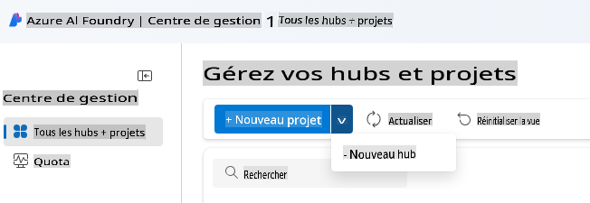
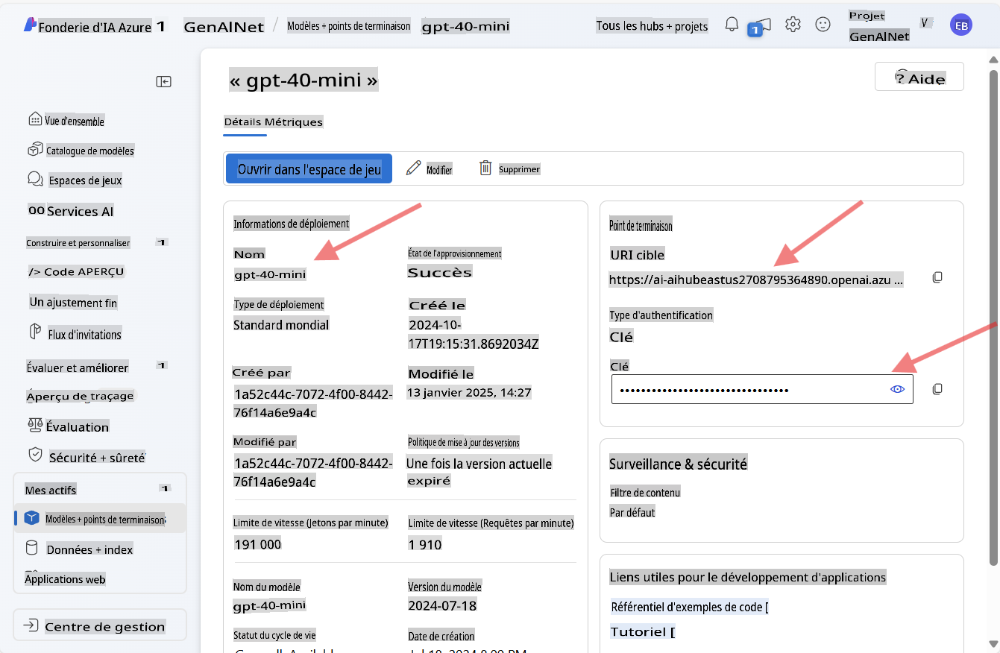
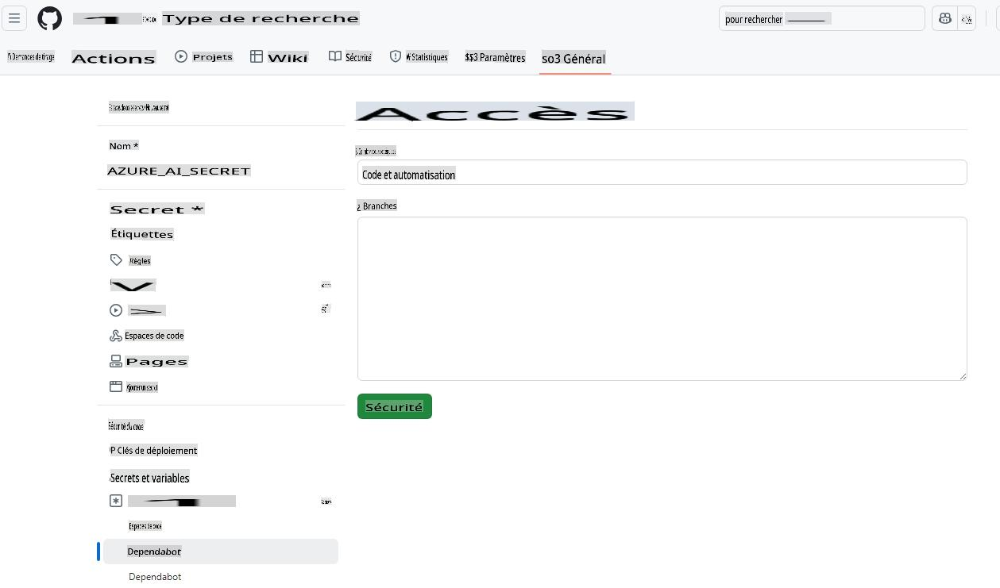

# Configuration de l'environnement de développement pour Azure OpenAI

Si vous souhaitez utiliser les modèles Azure AI Foundry pour vos applications .NET AI dans ce cours, suivez les étapes de ce guide.

Vous ne voulez pas utiliser Azure OpenAI ?

👉 [Pour utiliser les modèles GitHub, voici le guide qu'il vous faut](README.md)  
👉 [Voici les étapes pour Ollama](getting-started-ollama.md)

## Créer les ressources Azure AI Foundry

Pour utiliser les modèles Azure AI Foundry, vous devez créer un hub et un projet dans le portail Azure AI Foundry. Ensuite, vous devrez déployer un modèle. Cette section vous montrera comment faire.

### Créer un hub et un projet dans Azure AI Foundry

1. Rendez-vous sur le [Portail Azure AI Foundry](https://ai.azure.com/).  
1. Connectez-vous avec votre compte Azure.  
1. Sélectionnez **Tous les hubs + projets** dans le menu de gauche, puis cliquez sur **+ Nouveau hub** dans le menu déroulant. (Note : Vous devrez peut-être cliquer sur **+ Nouveau projet** en premier pour voir l'option **+ Nouveau hub**).  
      
1. Une nouvelle fenêtre s'ouvrira. Remplissez les détails de votre hub :  
    - Donnez un nom à votre hub (par ex., "MonHubAI").  
    - Choisissez une région proche de vous.  
    - Sélectionnez l'abonnement et le groupe de ressources appropriés.  
    - Vous pouvez laisser les autres paramètres par défaut.  
    - Cliquez sur **Suivant**.  
    - Vérifiez les détails et cliquez sur **Créer**.  
1. Une fois votre hub créé, le portail ouvrira la page de détails. Cliquez sur le bouton **Créer un projet**.  
    - Donnez un nom à votre projet (par ex., "GenAINET") ou acceptez le nom par défaut.  
    - Cliquez sur **Créer**.  

🎉 **Félicitations !** Vous venez de créer votre premier projet dans Azure AI Foundry.

### Déployer un modèle de langage dans Azure AI Foundry

Déployons maintenant un modèle **gpt-4o-mini** dans votre projet :

1. Dans le portail Azure AI Foundry, accédez à votre projet (il devrait s'ouvrir automatiquement après sa création).  
1. Cliquez sur **Modèles et Points de terminaison** dans le menu de gauche, puis sur le bouton **Déployer un modèle**.  
1. Sélectionnez **Déployer un modèle de base** dans le menu déroulant.  
1. Recherchez **gpt-4o-mini** dans le catalogue de modèles.  
1. Sélectionnez le modèle et cliquez sur le bouton **Confirmer**.  
1. Spécifiez un nom de déploiement (par ex., "gpt-4o-mini"). Vous pouvez laisser les autres options par défaut.  
1. Cliquez sur **Déployer** et attendez que le modèle soit provisionné.  
1. Une fois déployé, notez le **Nom du modèle**, l'**URI cible**, et la **Clé API** depuis la page des détails du modèle.  

🎉 **Félicitations !** Vous avez déployé votre premier modèle de langage dans Azure AI Foundry.



> 📝 **Note :** Le point de terminaison pourrait ressembler à `https://< your hub name>.openai.azure.com/openai/deployments/gpt-4o-mini/chat/completions?api-version=2024-08-01-preview`. Le nom du point de terminaison dont nous avons besoin est uniquement `https://< your hub name >.openai.azure.com/`*.

## Ajouter la clé API Azure AI aux secrets de votre Codespace

Pour des raisons de sécurité, ajoutons la clé API que vous venez de créer aux secrets de votre Codespace.

1. Assurez-vous d'avoir forké ce dépôt dans votre compte GitHub.  
1. Accédez à l'onglet **Paramètres** de votre dépôt forké, puis développez **Secrets et variables** dans le menu de gauche et sélectionnez **Codespaces**.  

      
1. Nommez votre secret **AZURE_AI_KEY**.  
1. Collez la clé API que vous avez copiée depuis le portail Azure AI Foundry dans le champ **Secret**.

## Créer un Codespace GitHub

Créons un Codespace GitHub pour développer tout au long de ce cours.

1. Ouvrez la page principale de ce dépôt dans une nouvelle fenêtre en [cliquant ici avec le bouton droit](https://github.com/microsoft/Generative-AI-for-beginners-dotnet) et en sélectionnant **Ouvrir dans une nouvelle fenêtre** dans le menu contextuel.  
1. Forkez ce dépôt dans votre compte GitHub en cliquant sur le bouton **Fork** en haut à droite de la page.  
1. Cliquez sur le bouton **Code**, puis sélectionnez l'onglet **Codespaces**.  
1. Sélectionnez l'option **...** (les trois points) et choisissez **Nouveau avec options...**  


### Choisir votre conteneur de développement

Dans le menu déroulant **Configuration du conteneur de développement**, sélectionnez l'une des options suivantes :

**Option 1 : C# (.NET)** : Cette option est recommandée si vous prévoyez d'utiliser les modèles GitHub ou Azure OpenAI. Elle inclut tous les outils de développement .NET nécessaires pour le reste du cours et offre un temps de démarrage rapide.  

**Option 2 : C# (.NET) - Ollama** : Ollama vous permet d'exécuter les démonstrations sans avoir besoin de vous connecter aux modèles GitHub ou Azure OpenAI. Elle inclut également les outils de développement .NET de base en plus d'Ollama, mais avec un temps de démarrage plus long, environ cinq minutes. [Suivez ce guide](getting-started-ollama.md) si vous souhaitez utiliser Ollama.  

Vous pouvez laisser les autres paramètres par défaut. Cliquez sur le bouton **Créer un Codespace** pour lancer le processus de création.


## Mettre à jour le code d'exemple pour utiliser Azure OpenAI et votre nouveau modèle

Mettons à jour le code pour utiliser le modèle que vous venez de déployer. Tout d'abord, nous devrons ajouter quelques packages NuGet pour travailler avec Azure OpenAI.

1. Ouvrez le terminal et placez-vous dans le répertoire du projet :

    ```bash
    cd 02-SetupDevEnvironment/src/BasicChat-01MEAI/
    ```

1. Exécutez les commandes suivantes pour ajouter le package requis :

    ```bash
    dotnet add package Azure.AI.OpenAI
    dotnet add package Microsoft.Extensions.AI.OpenAI --version 9.1.0-preview.1.25064.3
    ```

[Plus d'informations sur Azure.AI.OpenAI](https://www.nuget.org/packages/Azure.AI.OpenAI/2.1.0#show-readme-container).

1. Ouvrez `/workspaces/Generative-AI-for-beginners-dotnet/02-SetupDevEnvironment/src/BasicChat-01MEAI/Program.cs`.

    Ajoutez les instructions `using` suivantes en haut du fichier :

    ```csharp
    using System.ClientModel;
    using Azure.AI.OpenAI;
    using Microsoft.Extensions.AI;

1. Create new variables to hold the model name, endpoint, and API key:

    ```csharp
    var deploymentName = "< deployment name > "; // ex. "gpt-4o-mini"
    var endpoint = new Uri("< endpoint >"); // ex. "https://< your hub name >.openai.azure.com/"
    var apiKey = new ApiKeyCredential(Environment.GetEnvironmentVariable("AZURE_AI_SECRET"));
    ```

    Making sure to replace `< deployment name >`, and `< endpoint >` with the values you noted above.

1. Replace the `IChatClient` creation with the following code:

    ```csharp
    IChatClient client = new AzureOpenAIClient(
        endpoint,
        apiKey)
    .AsChatClient(deploymentName);
    ```

1. Run the following command in the terminal:

    ```bash
    dotnet run
    ```

1. You should see output similar to the following:

    ```bash
    L'intelligence artificielle (IA) désigne la simulation de l'intelligence humaine dans des machines programmées pour penser et apprendre comme des humains. L'IA englobe une variété de technologies et d'approches permettant aux ordinateurs et systèmes d'effectuer des tâches nécessitant généralement une intelligence humaine. Ces tâches incluent :

    1. **Apprentissage** : La capacité d'améliorer les performances en fonction de l'expérience, souvent grâce à des algorithmes qui analysent des données.
    
    ...
    ```

> 🙋 **Besoin d'aide ?** : Quelque chose ne fonctionne pas ? [Ouvrez un ticket](https://github.com/microsoft/Generative-AI-for-beginners-dotnet/issues/new?template=Blank+issue) et nous vous aiderons.

## Résumé

Dans cette leçon, vous avez appris à configurer votre environnement de développement pour le reste du cours. Vous avez créé un Codespace GitHub et l'avez configuré pour utiliser Azure OpenAI. Vous avez également mis à jour le code d'exemple pour utiliser le modèle récemment déployé dans Azure AI Foundry.

### Ressources supplémentaires

- [Documentation Azure AI Foundry](https://learn.microsoft.com/azure/ai-services/)  
- [Travailler avec GitHub Codespaces](https://docs.github.com/fr/codespaces/getting-started)  
- [Comment déployer des modèles dans Azure AI Foundry](https://learn.microsoft.com/azure/ai-services/deploy/)  
- [Package NuGet Azure.AI.OpenAI](https://www.nuget.org/packages/Azure.AI.OpenAI)

## Prochaines étapes

Ensuite, nous explorerons comment créer votre première application d'IA ! 🚀

👉 [Techniques fondamentales de l'IA générative](../03-CoreGenerativeAITechniques/readme.md)

**Avertissement** :  
Ce document a été traduit à l'aide de services de traduction automatisés basés sur l'intelligence artificielle. Bien que nous fassions de notre mieux pour garantir l'exactitude, veuillez noter que les traductions automatiques peuvent contenir des erreurs ou des inexactitudes. Le document original dans sa langue d'origine doit être considéré comme la source faisant autorité. Pour des informations critiques, il est recommandé de faire appel à une traduction humaine professionnelle. Nous déclinons toute responsabilité en cas de malentendus ou de mauvaises interprétations résultant de l'utilisation de cette traduction.