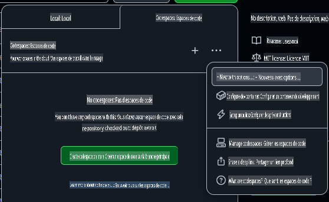
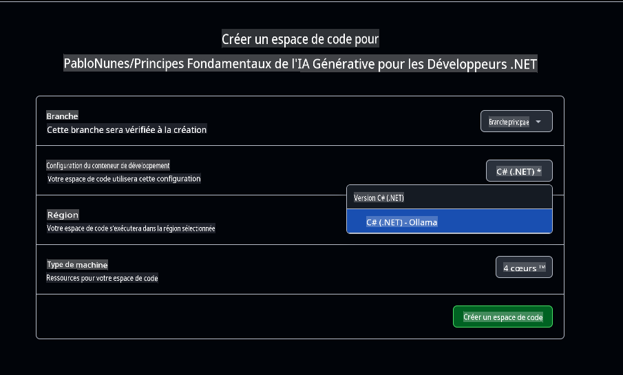

# Configuration de l'environnement de développement avec Ollama

Si vous souhaitez utiliser Ollama pour exécuter des modèles localement dans le cadre de ce cours, suivez les étapes de ce guide.

Vous ne voulez pas utiliser Azure OpenAI ?

👉 [Pour utiliser les modèles GitHub, voici le guide qu'il vous faut](README.md)  
👉 [Voici les étapes pour Ollama](getting-started-ollama.md)

## Création d'un Codespace GitHub

Créons un Codespace GitHub pour développer tout au long de ce cours.

1. Ouvrez la page principale de ce dépôt dans une nouvelle fenêtre en [cliquant ici avec le bouton droit](https://github.com/microsoft/Generative-AI-for-beginners-dotnet) et en sélectionnant **Ouvrir dans une nouvelle fenêtre** dans le menu contextuel.  
1. Forkez ce dépôt dans votre compte GitHub en cliquant sur le bouton **Fork** en haut à droite de la page.  
1. Cliquez sur le bouton déroulant **Code**, puis sélectionnez l'onglet **Codespaces**.  
1. Sélectionnez l'option **...** (les trois points) et choisissez **New with options...**.



### Choisir votre conteneur de développement

Dans le menu déroulant **Dev container configuration**, sélectionnez l'une des options suivantes :

**Option 1 : C# (.NET)** : C'est l'option recommandée si vous prévoyez d'utiliser les modèles GitHub ou Azure OpenAI. Elle inclut tous les outils de développement .NET nécessaires pour le reste du cours et offre un temps de démarrage rapide.

**Option 2 : C# (.NET) - Ollama** : Choisissez cette option pour exécuter des modèles localement avec Ollama. Elle inclut tous les outils de développement .NET en plus d'Ollama, mais le temps de démarrage est plus lent, environ cinq minutes en moyenne. [Suivez ce guide](getting-started-ollama.md) si vous voulez utiliser Ollama.

Vous pouvez laisser les autres paramètres tels quels. Cliquez sur le bouton **Create codespace** pour lancer le processus de création du Codespace.



## Vérification que votre Codespace fonctionne correctement avec Ollama

Une fois que votre Codespace est complètement chargé et configuré, exécutons une application d'exemple pour vérifier que tout fonctionne correctement :

1. Ouvrez le terminal. Vous pouvez ouvrir une fenêtre de terminal en tapant **Ctrl+\`** (backtick) on Windows or **Cmd+`** sur macOS.

1. Accédez au bon répertoire en exécutant la commande suivante :

    ```bash
    cd 02-SetupDevEnvironment/src/BasicChat-03Ollama/
    ```

1. Ensuite, exécutez l'application avec la commande suivante :

    ```bash
    dotnet run
    ```

1. Cela peut prendre quelques secondes, mais l'application devrait finalement afficher un message similaire à celui-ci :

    ```bash
    AI, or Artificial Intelligence, refers to the development of computer systems that can perform tasks that typically require human intelligence, such as:

    1. Learning: AI systems can learn from data and improve their performance over time.
    2. Reasoning: AI systems can draw conclusions and make decisions based on the data they have been trained on.
    
    ...
    ```

> 🙋 **Besoin d'aide ?** : Quelque chose ne fonctionne pas ? [Ouvrez une issue](https://github.com/microsoft/Generative-AI-for-beginners-dotnet/issues/new?template=Blank+issue) et nous vous aiderons.

## Remplacer le modèle dans Ollama

L'un des avantages d'Ollama est qu'il est facile de changer de modèle. L'application actuelle utilise le modèle "**llama3.2**". Essayons de passer au modèle "**phi3.5**".

1. Téléchargez le modèle Phi3.5 en exécutant la commande suivante depuis le terminal :

    ```bash
    ollama pull phi3.5
    ```

    Vous pouvez en apprendre davantage sur le [Phi3.5](https://ollama.com/library/phi3.5) et les autres modèles disponibles dans la [bibliothèque Ollama](https://ollama.com/library/).

1. Modifiez l'initialisation du client de chat dans `Program.cs` pour utiliser le nouveau modèle :

    ```csharp
    IChatClient client = new OllamaChatClient(new Uri("http://localhost:11434/"), "phi3.5");
    ```

1. Enfin, exécutez l'application avec la commande suivante :

    ```bash
    dotnet run
    ```

1. Vous venez de passer à un nouveau modèle. Remarquez comment la réponse est plus longue et détaillée.

    ```bash
    Artificial Intelligence (AI) refers to the simulation of human intelligence processes by machines, especially computer systems. These processes include learning (the acquisition of information and accumulation of knowledge), reasoning (using the acquired knowledge to make deductions or decisions), and self-correction. AI can manifest in various forms:

    1. **Narrow AI** – Designed for specific tasks, such as facial recognition software, voice assistants like Siri or Alexa, autonomous vehicles, etc., which operate under a limited preprogrammed set of behaviors and rules but excel within their domain when compared to humans in these specialized areas.

    2. **General AI** – Capable of understanding, learning, and applying intelligence broadly across various domains like human beings do (natural language processing, problem-solving at a high level). General AIs are still largely theoretical as we haven't yet achieved this form to the extent necessary for practical applications beyond narrow tasks.
    
    ...
    ```

> 🙋 **Besoin d'aide ?** : Quelque chose ne fonctionne pas ? [Ouvrez une issue](https://github.com/microsoft/Generative-AI-for-beginners-dotnet/issues/new?template=Blank+issue) et nous vous aiderons.

## Résumé

Dans cette leçon, vous avez appris à configurer votre environnement de développement pour le reste du cours. Vous avez créé un Codespace GitHub et l'avez configuré pour utiliser Ollama. Vous avez également modifié le code d'exemple pour changer facilement de modèles.

### Ressources supplémentaires

- [Modèles Ollama](https://ollama.com/search)  
- [Travailler avec GitHub Codespaces](https://docs.github.com/en/codespaces/getting-started)  
- [Documentation des extensions Microsoft pour l'IA](https://learn.microsoft.com/dotnet/)

## Prochaines étapes

Ensuite, nous allons explorer comment créer votre première application d'IA ! 🚀

👉 [Techniques de base pour l'IA générative](../03-CoreGenerativeAITechniques/readme.md)

**Avertissement** :  
Ce document a été traduit à l'aide de services de traduction automatique basés sur l'intelligence artificielle. Bien que nous nous efforcions d'assurer l'exactitude, veuillez noter que les traductions automatisées peuvent contenir des erreurs ou des inexactitudes. Le document original dans sa langue d'origine doit être considéré comme la source faisant autorité. Pour des informations critiques, il est recommandé de recourir à une traduction professionnelle effectuée par un humain. Nous déclinons toute responsabilité en cas de malentendus ou d'interprétations erronées découlant de l'utilisation de cette traduction.