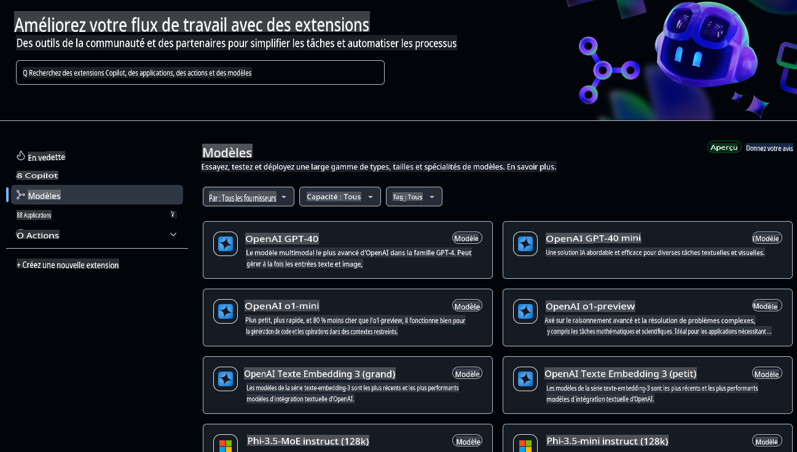
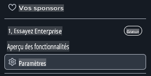
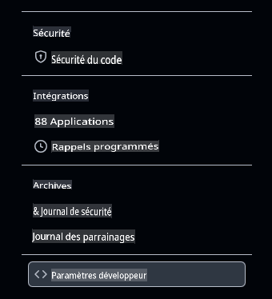
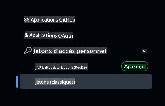
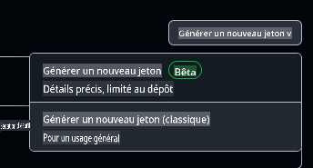

# Configurer l'environnement de développement pour ce cours

Cette leçon vous guidera dans la configuration de votre environnement de développement pour ce cours. Pour garantir votre succès, nous avons préparé une configuration de devcontainer qui inclut tous les outils nécessaires pour compléter le cours. Vous pouvez exécuter le devcontainer dans GitHub Codespaces (recommandé) ou localement sur votre machine. Nous vous montrons également comment configurer vos jetons d'accès GitHub pour interagir avec les modèles GitHub.

*Nous avons préparé des guides pour configurer [Azure OpenAI](getting-started-azure-openai.md) et [Ollama](getting-started-ollama.md), si vous le souhaitez.*

---

## Ce que vous apprendrez dans cette leçon :

- ⚡ Comment configurer un environnement de développement avec GitHub Codespaces
- 🤖 Configurer votre environnement pour accéder aux LLMs via GitHub Models, Azure OpenAI ou Ollama
- 🛠️ Configuration d'outils standards de l'industrie avec .devcontainer
- 🎯 Enfin, tout sera prêt pour compléter le reste du cours

Plongeons dans la configuration de votre environnement de développement ! 🏃‍♂️

[](https://youtu.be/7kYoVRNQXyA?feature=shared)

_⬆️Cliquez sur l'image pour regarder la vidéo⬆️_

## Quel service d'IA utiliser pour ce cours ?

Nous fournissons des instructions pour configurer votre environnement de développement avec GitHub Models, Azure OpenAI et Ollama. Vous pouvez choisir celui qui correspond le mieux à vos besoins. Nous recommandons GitHub Models pour ce cours, mais vous pouvez utiliser l'un des trois services.

Voici un résumé des services :

- **GitHub Models** : Un service gratuit pour commencer, qui vous permet de tester et d'interagir avec divers modèles d'IA directement dans votre environnement de développement. Facile à utiliser depuis Codespaces, c'est une excellente façon d'expérimenter avec différents modèles et de comprendre leurs capacités avant de les implémenter.
- **Azure OpenAI** : Un service payant qui donne accès à une large gamme de modèles d'IA. Il inclut les avantages habituels d'Azure, comme une sécurité robuste et une grande scalabilité. Une excellente option si vous avez déjà accès à un abonnement Azure.
- **Ollama** : Ollama vous permet d'exécuter des modèles d'IA localement sur votre machine ou dans un Codespace ou devcontainer gratuitement. Une bonne option si vous préférez exécuter les modèles localement, mais cela nécessite plus de ressources matérielles et peut être plus lent que les options cloud.

> Si **GitHub Models** est votre choix, suivez le reste de ce document pour configurer votre environnement de développement avec GitHub Models.
> - Vous préférez **Azure OpenAI** ? [Voici le document qu'il vous faut](getting-started-azure-openai.md).
> - **Ollama** vous tente ? [Ce guide est fait pour vous](getting-started-ollama.md).

## Apprenez et testez des modèles d'IA avec GitHub Models

**GitHub Models** offre une façon intuitive d'expérimenter avec divers modèles d'IA directement dans votre environnement de développement. Cette fonctionnalité permet aux développeurs de tester et d'interagir avec différents modèles, de comprendre leurs capacités et leurs limites avant de les implémenter. Grâce à une interface simple, vous pouvez explorer les réponses des modèles, évaluer leurs performances et déterminer celui qui convient le mieux à vos besoins. Hébergés dans l'infrastructure de GitHub, ces modèles offrent un accès fiable et des performances constantes, ce qui les rend idéaux pour les phases de développement et de test. Cerise sur le gâteau, une offre gratuite vous permet de commencer sans aucun coût.



## Préparation : Configuration des jetons d'accès GitHub

Avant toute chose, nous devons configurer les informations d'identification essentielles pour permettre à votre Codespace d'interagir avec GitHub Models et d'exécuter vos applications en toute sécurité.

### Création d'un jeton d'accès personnel pour GitHub Models

1. Rendez-vous sur [les paramètres GitHub](https://github.com/settings/profile) :

    - Cliquez sur votre photo de profil en haut à droite
    - Sélectionnez **Settings** dans le menu déroulant

    

1. Accédez aux [paramètres des développeurs](https://github.com/settings/apps) :

    - Faites défiler la barre latérale gauche
    - Cliquez sur **Developer settings** (généralement en bas)

    

1. Générez un nouveau jeton :

    - Sélectionnez **Personal access tokens** → **Tokens (classic)**

        

    - Dans le menu déroulant au milieu de la page, cliquez sur **Generate new token (classic)**

        

    - Sous "Note", fournissez un nom descriptif (par ex. `GenAI-DotNet-Course-Token`)
    - Définissez une date d'expiration (recommandé : 7 jours pour respecter les bonnes pratiques de sécurité)
    - Aucun besoin d'ajouter des permissions à ce jeton.

> 💡 **Astuce de sécurité** : Utilisez toujours la portée minimale requise et la durée d'expiration la plus courte possible pour vos jetons d'accès. Cela suit le principe du moindre privilège et aide à sécuriser vos jetons.

## Création d'un Codespace GitHub

Créons un Codespace GitHub à utiliser pour le reste de ce cours.

1. Ouvrez la page principale de ce dépôt dans une nouvelle fenêtre en [cliquant ici avec le bouton droit](https://github.com/microsoft/Generative-AI-for-beginners-dotnet) et en sélectionnant **Ouvrir dans une nouvelle fenêtre** dans le menu contextuel.
1. Forkez ce dépôt dans votre compte GitHub en cliquant sur le bouton **Fork** en haut à droite de la page.
1. Cliquez sur le bouton **Code** puis sélectionnez l'onglet **Codespaces**.
1. Sélectionnez l'option **...** (les trois points) et choisissez **New with options...**


### Choix de votre conteneur de développement

Dans le menu déroulant **Dev container configuration**, sélectionnez l'une des options suivantes :

**Option 1 : C# (.NET)** : C'est l'option à utiliser si vous prévoyez d'utiliser GitHub Models et c'est notre méthode recommandée pour compléter ce cours. Elle inclut tous les outils de développement .NET nécessaires pour le reste du cours et offre un démarrage rapide.

**Option 2 : C# (.NET) - Ollama** : Ollama vous permet d'exécuter les démonstrations sans avoir besoin de se connecter à GitHub Models ou Azure OpenAI. Elle inclut tous les outils de développement .NET ainsi qu'Ollama, mais le démarrage est plus lent, environ cinq minutes en moyenne. [Suivez ce guide](getting-started-ollama.md) si vous voulez utiliser Ollama.

> 💡**Astuce** : Lors de la création de votre Codespace, utilisez la région la plus proche de vous si vous avez cette option dans le menu. Utiliser une région éloignée peut entraîner des erreurs lors de la création.

Cliquez sur le bouton **Create codespace** pour lancer le processus de création du Codespace.


## Vérification que votre Codespace fonctionne correctement avec GitHub Models

Une fois que votre Codespace est complètement chargé et configuré, testons une application exemple pour vérifier que tout fonctionne correctement :

1. Ouvrez le terminal. Vous pouvez ouvrir une fenêtre de terminal en tapant **Ctrl+\`** (backtick) on Windows or **Cmd+`** sur macOS.

1. Passez au bon répertoire en exécutant la commande suivante :

    ```bash
    cd 02-SetupDevEnvironment\src\BasicChat-01MEAI
    ```

1. Ensuite, exécutez l'application avec la commande suivante :

    ```bash
    dotnet run
    ```

1. Cela peut prendre quelques secondes, mais l'application devrait finalement afficher un message similaire à ce qui suit :

    ```bash
    AI, or artificial intelligence, refers to the simulation of human intelligence in machines that are programmed to think and learn like humans. It is a broad field of computer science that focuses on creating systems and algorithms capable of performing tasks that typically require human intelligence. These tasks include problem-solving,

    ...
    ```

> 🙋 **Besoin d'aide ?** : Un problème ? [Ouvrez une issue](https://github.com/microsoft/Generative-AI-for-beginners-dotnet/issues/new?template=Blank+issue) et nous vous aiderons.

## Résumé

Dans cette leçon, vous avez appris à configurer votre environnement de développement pour le reste du cours. Vous avez créé un Codespace GitHub et l'avez configuré pour utiliser GitHub Models, Azure OpenAI ou Ollama. Vous avez également appris à créer un jeton d'accès personnel pour GitHub Models et à exécuter une application exemple pour vérifier que tout fonctionne correctement.

### Ressources supplémentaires

- Testez ce guide avec d'autres fournisseurs d'hébergement !
    - [Azure OpenAI](getting-started-azure-openai.md)
    - [Ollama](getting-started-ollama.md)
- [Documentation GitHub Codespaces](https://docs.github.com/en/codespaces)
- [Documentation GitHub Models](https://docs.github.com/en/github-models/prototyping-with-ai-models)

## Prochaines étapes

Ensuite, nous explorerons comment créer votre première application d'IA ! 🚀

👉 [Techniques fondamentales de l'IA générative](../03-CoreGenerativeAITechniques/readme.md)

**Avertissement** :  
Ce document a été traduit à l'aide de services de traduction automatisée basés sur l'intelligence artificielle. Bien que nous nous efforcions de garantir l'exactitude, veuillez noter que les traductions automatisées peuvent contenir des erreurs ou des inexactitudes. Le document original dans sa langue d'origine doit être considéré comme la source faisant autorité. Pour des informations critiques, il est recommandé de recourir à une traduction humaine professionnelle. Nous déclinons toute responsabilité en cas de malentendus ou de mauvaises interprétations résultant de l'utilisation de cette traduction.