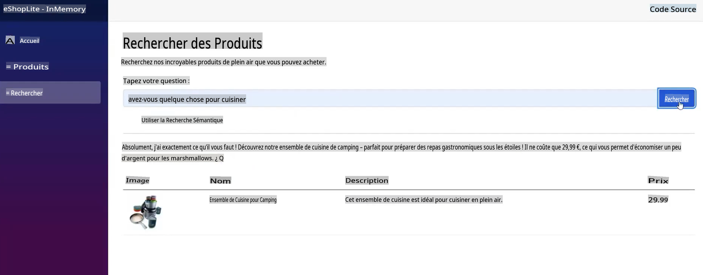
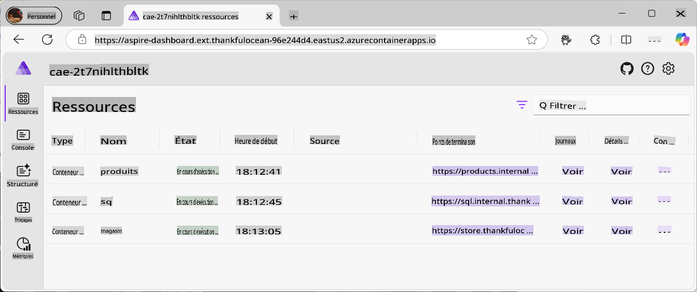
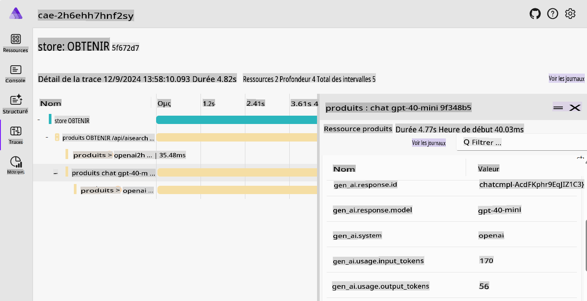
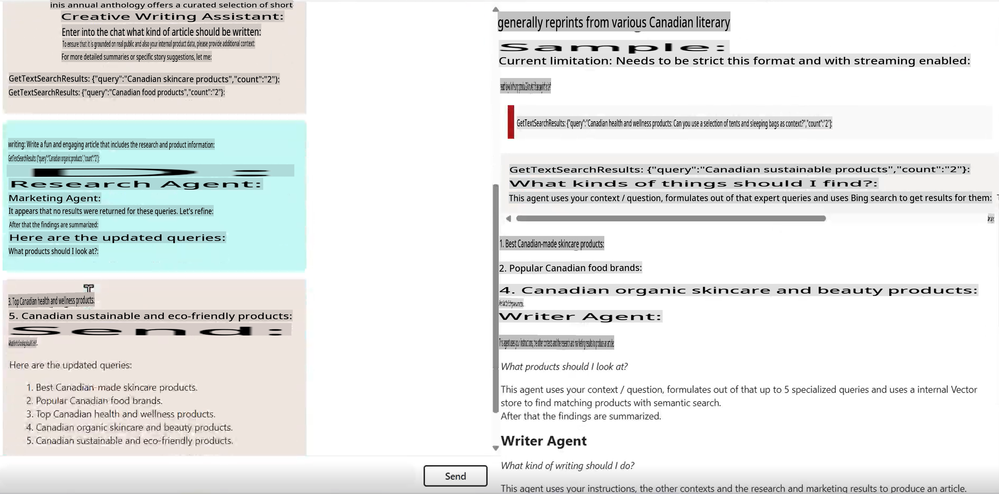
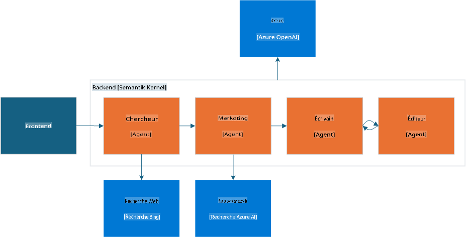
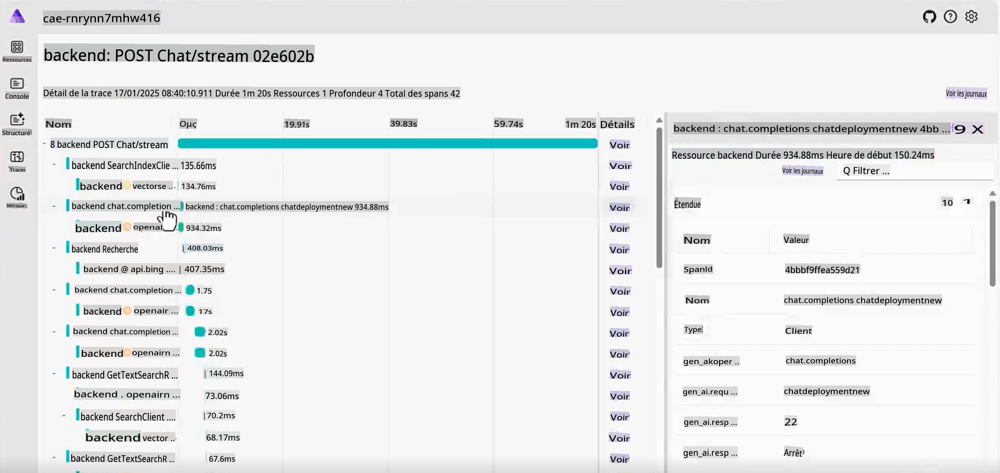
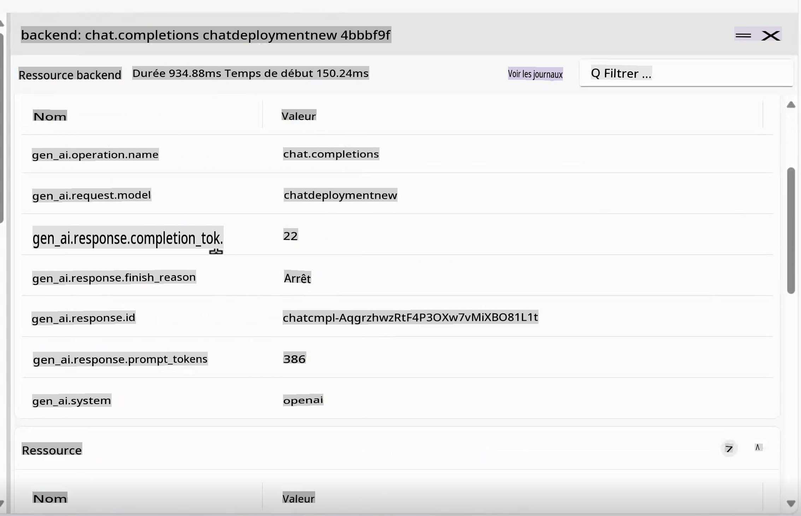

# Exemples Canoniques d'IA Générative

Découvrez tous les concepts que vous avez appris en action dans ces exemples pratiques et concrets.

---

## Ce que vous allez accomplir

- Comprendre comment l'IA générative s'intègre dans des applications existantes.
- Découvrir le fonctionnement des Agents dans des scénarios complexes.

## Exemples inclus
- [Exemples Canoniques d'IA Générative](../../../04-PracticalSamples)
  - [Ce que vous allez accomplir](../../../04-PracticalSamples)
  - [Exemples inclus](../../../04-PracticalSamples)
  - [Démos eShopLite](../../../04-PracticalSamples)
    - [eShopLite avec recherche sémantique - en mémoire](../../../04-PracticalSamples)
    - [eShopLite avec recherche sémantique - Azure AI Search](../../../04-PracticalSamples)
    - [eShopLite avec audio en temps réel](../../../04-PracticalSamples)
  - [Agent d'Écriture Créative](../../../04-PracticalSamples)
  - [Résumé](../../../04-PracticalSamples)
    - [Ressources supplémentaires](../../../04-PracticalSamples)
    - [Étapes suivantes](../../../04-PracticalSamples)


[](https://youtu.be/Ky4CACXJqR8?feature=shared)

_⬆️Cliquez sur l'image pour regarder la vidéo⬆️_

## Démos eShopLite

Pour nos premières démos, nous explorerons les projets **eShopLite**. **eShopLite** est une application e-commerce simple dédiée aux amateurs d'activités de plein air et de camping, enrichie par des fonctionnalités d'IA générative, comme l'optimisation des recherches, l'assistance client, et l'analyse audio en temps réel.

Ces démos utilisent [Azure OpenAI](https://azure.microsoft.com/products/ai-services/openai-service) et [Azure AI Foundry Models](https://ai.azure.com/) pour effectuer les inférences (ou la partie IA générative) nécessaires à ces applications.

Dans la première démo, nous montrons comment utiliser le Semantic Kernel pour améliorer les capacités de recherche, en permettant une compréhension contextuelle des requêtes des utilisateurs et en fournissant des résultats précis.

### eShopLite avec recherche sémantique

[](https://youtu.be/FlkruF6USro?feature=shared)

_⬆️Cliquez sur l'image pour regarder la vidéo⬆️_

Dans eShopLite avec recherche sémantique, nous utilisons le Semantic Kernel pour améliorer les capacités de recherche de l'application e-commerce. Le Semantic Kernel nous aide à créer un moteur de recherche plus performant, capable de comprendre le contexte des requêtes des utilisateurs et de fournir des résultats plus pertinents.

Par exemple, si un utilisateur recherche "avez-vous quelque chose pour cuisiner", le moteur de recherche peut comprendre qu'il cherche des ustensiles de cuisine et afficher les produits les plus pertinents. Dans notre exemple, il retourne des équipements de cuisine pour le camping.

> 🧑‍💻**Exemple** : Découvrez l'[exemple de recherche sémantique dans eShopLite](https://aka.ms/netaieshoplitesemanticsearch)



La recherche sémantique permet aux utilisateurs de trouver plus facilement les produits dont ils ont besoin, ce qui améliore leur expérience d'achat et augmente les ventes. Pour implémenter cette fonctionnalité, nous avons besoin d'un magasin vectoriel avec les produits, d'un index de recherche, et d'un modèle de langage. Les outils [.NET Aspire](https://learn.microsoft.com/dotnet/aspire/get-started/aspire-overview) permettent de coordonner tous les processus en arrière-plan.



Dans le tableau de bord .NET Aspire, nous pouvons voir les produits, SQL et conteneurs de stockage, qui interagissent avec le modèle de langage. En examinant de plus près l'Aspire App Host, nous avons ce qui suit :

```csharp
if (builder.ExecutionContext.IsPublishMode)
{
    // Add the Azure Application Insights for monitoring
    var appInsights = builder.AddAzureApplicationInsights("appInsights");
    // Add the Azure OpenAI for the chat and embeddings deployments, the embedding is used for the vector entities
    var chatDeploymentName = "gpt-4o-mini";
    var embeddingsDeploymentName = "text-embedding-ada-002";
    var aoai = builder.AddAzureOpenAI("openai")
        .AddDeployment(new AzureOpenAIDeployment(chatDeploymentName,
        "gpt-4o-mini",
        "2024-07-18",
        "GlobalStandard",
        10))
        .AddDeployment(new AzureOpenAIDeployment(embeddingsDeploymentName,
        "text-embedding-ada-002",
        "2"));

    products.WithReference(appInsights)
        .WithReference(aoai)
        .WithEnvironment("AI_ChatDeploymentName", chatDeploymentName)
        .WithEnvironment("AI_embeddingsDeploymentName", embeddingsDeploymentName);

    store.WithReference(appInsights)
        .WithExternalHttpEndpoints();
}
```

Le code ci-dessus montre comment ajouter Azure Application Insights pour la surveillance, Azure OpenAI pour les déploiements de chat et d'embeddings, ainsi que les embeddings utilisés pour les entités vectorielles.

Pour la création d'embeddings et d'Azure OpenAI, cela peut être trouvé dans le conteneur de produits, comme suit :

```csharp
var azureOpenAiClientName = "openai";
builder.AddAzureOpenAIClient(azureOpenAiClientName);

// get azure openai client and create Chat client from aspire hosting configuration
builder.Services.AddSingleton<ChatClient>(serviceProvider =>
{
    var chatDeploymentName = "gpt-4o-mini";
    var logger = serviceProvider.GetService<ILogger<Program>>()!;
    logger.LogInformation($"Chat client configuration, modelId: {chatDeploymentName}");
    ChatClient chatClient = null;
    try
    {
        OpenAIClient client = serviceProvider.GetRequiredService<OpenAIClient>();
        chatClient = client.GetChatClient(chatDeploymentName);
    }...
}
```

Le code ci-dessus montre comment obtenir le client Azure OpenAI et créer le client Chat à partir de la configuration d'hébergement Aspire. Le `chatDeploymentName` est le nom du déploiement utilisé dans l'application. Le même processus est utilisé pour créer le client Embedding, comme suit :

```csharp
// get azure openai client and create embedding client from aspire hosting configuration
builder.Services.AddSingleton<EmbeddingClient>(serviceProvider =>
{
    var embeddingsDeploymentName = "text-embedding-ada-002";
    var logger = serviceProvider.GetService<ILogger<Program>>()!;
    logger.LogInformation($"Embeddings client configuration, modelId: {embeddingsDeploymentName}");
    EmbeddingClient embeddingsClient = null;
    try
    {
        OpenAIClient client = serviceProvider.GetRequiredService<OpenAIClient>();
        embeddingsClient = client.GetEmbeddingClient(embeddingsDeploymentName);
    }...
});
```

Avec cela, nous pouvons créer le `MemoryContext`, comme magasin vectoriel pour comparer à la requête de l'utilisateur et retourner les produits les plus pertinents, comme suit :

```csharp
// Iterate over the products and add them to the memory
_logger.LogInformation("Adding product to memory: {Product}", product.Name);
var productInfo = $"[{product.Name}] is a product that costs [{product.Price}] and is described as [{product.Description}]";

// Create a new product vector
var productVector = new ProductVector
{
    Id = product.Id,
    Name = product.Name,
    Description = product.Description,
    Price = product.Price,
    ImageUrl = product.ImageUrl
};

// Generate the embedding for the product information
var result = await _embeddingClient.GenerateEmbeddingAsync(productInfo);

// Convert the embedding result to a float array and assign it to the product vector
productVector.Vector = result.Value.ToFloats();
var recordId = await _productsCollection.UpsertAsync(productVector);
_logger.LogInformation("Product added to memory: {Product} with recordId: {RecordId}", product.Name, recordId);
```

Le code ci-dessus montre comment parcourir les produits et les ajouter à la mémoire.

Après avoir créé un nouveau vecteur produit, nous l'utilisons pour générer un embedding pour les informations sur le produit, convertir le résultat d'embedding en tableau de flottants, et l'attribuer au vecteur produit.

Regardez `_productsCollection`, qui est une référence au conteneur où les produits sont stockés, utilisant un appel CosmosDB pour obtenir la réponse pour le recordId, dans ce cas, pour la journalisation.

Le produit est ensuite ajouté à la mémoire, répétant le processus pour chaque produit dans la collection.

Après cela, lorsque l'utilisateur recherche un produit, nous pouvons comparer la requête de l'utilisateur avec les vecteurs produits et retourner les produits les plus pertinents.

```csharp
try
{
    // Generate embedding for the search query
    var result = await _embeddingClient.GenerateEmbeddingAsync(search);
    var vectorSearchQuery = result.Value.ToFloats();

    var searchOptions = new VectorSearchOptions()
    {
        Top = 1, // Retrieve the top 1 result
        VectorPropertyName = "Vector"
    };

    // Search the vector database for the most similar product
    var searchResults = await _productsCollection.VectorizedSearchAsync(vectorSearchQuery, searchOptions);
    double searchScore = 0.0;
    await foreach (var searchItem in searchResults.Results)
    {
        if (searchItem.Score > 0.5)
        {
            // Product found, retrieve the product details
            firstProduct = new Product
            {
                Id = searchItem.Record.Id,
                Name = searchItem.Record.Name,
                Description = searchItem.Record.Description,
                Price = searchItem.Record.Price,
                ImageUrl = searchItem.Record.ImageUrl
            };

            searchScore = searchItem.Score.Value;
            responseText = $"The product [{firstProduct.Name}] fits with the search criteria [{search}][{searchItem.Score.Value.ToString("0.00")}]";
            _logger.LogInformation($"Search Response: {responseText}");
        }
    }

    // Generate a friendly response message using the found product information
    var prompt = @$"You are an intelligent assistant helping clients with their search about outdoor products. Generate a catchy and friendly message using the following information:
    - User Question: {search}
    - Found Product Name: {firstProduct.Name}
    - Found Product Description: {firstProduct.Description}
    - Found Product Price: {firstProduct.Price}
    Include the found product information in the response to the user question.";

    var messages = new List<ChatMessage>
    {
        new SystemChatMessage(_systemPrompt),
        new UserChatMessage(prompt)
    };

    _logger.LogInformation("{ChatHistory}", JsonConvert.SerializeObject(messages));

    var resultPrompt = await _chatClient.CompleteChatAsync(messages);
}
```

Avec le code ci-dessus, nous générons l'embedding pour la requête de recherche, recherchons dans la base de données vectorielle le produit le plus similaire, et obtenons un message de réponse en utilisant les informations du produit trouvé.

Cela aide l'utilisateur à trouver plus facilement les produits dont il a besoin, améliorant ainsi son expérience d'achat et augmentant les ventes.

De plus, à mesure que l'IA générative évolue, il est important d'avoir de la télémétrie et une surveillance pour comprendre le comportement des utilisateurs et améliorer le moteur de recherche. C'est là qu'interviennent Azure Application Insights et .NET Aspire.



.NET Aspire offre un ensemble puissant d'outils pour surveiller et tracer le comportement de l'application, y compris les interactions des utilisateurs avec le moteur de recherche, les services en arrière-plan, et les modèles d'IA. Les capacités de traçage nous aident à comprendre les éventuels goulots d'étranglement, erreurs, et problèmes de performance, ce qui permet d'optimiser l'application et d'offrir une meilleure expérience utilisateur.


Comme la télémétrie est essentielle pour comprendre le comportement des utilisateurs et améliorer les services, nous introduisons Azure Application Insights pour surveiller la performance de l'application et les interactions des utilisateurs.

Application Insights fournit un ensemble complet de données de télémétrie, nous aidant à comprendre comment nos services fonctionnent, comment les utilisateurs interagissent avec l'application, et l'utilisation du cloud.

Dans l'image, nous pouvons voir le tableau de bord Application Insights, montrant comment les services fonctionnent, par exemple, les appels à notre base de données, le nombre de requêtes, et le temps de réponse.

> 💡 **Astuce Pro** : Pour plus d'informations sur eShopLite avec Recherche Sémantique, consultez le dépôt pour en savoir plus : https://aka.ms/netaieshoplitesemanticsearch

### eShopLite avec recherche sémantique en utilisant Azure AI Search

Dans la démo complète eShopLite, nous utilisons **Azure AI Search** pour améliorer les capacités de recherche de l'application e-commerce. Azure AI Search nous aide à créer un moteur de recherche plus performant, capable de comprendre le contexte des requêtes des utilisateurs et de fournir des résultats plus précis.

Il offre également un moteur de recherche plus évolutif et fiable, capable de gérer de grandes quantités de données et de requêtes utilisateur. Azure AI Search permet à la solution de conserver les index de recherche, de sorte que les informations restent disponibles même si l'application est redémarrée.

- [eShopLite avec Azure AI Search](https://aka.ms/netaieshoplitesemanticsearchazureaisearch)

### eShopLite avec audio en temps réel

[](https://youtu.be/bx0hRNdr_bQ?feature=shared)

_⬆️Cliquez sur l'image pour regarder la vidéo⬆️_

Dans eShopLite avec audio en temps réel, nous utilisons les capacités audio en temps réel de GPT-4o pour analyser les conversations entre le client et le chatbot, offrant une expérience plus personnalisée et engageante. Par exemple, si un client demande une recommandation de produit, le chatbot peut analyser la demande en temps réel et fournir une réponse plus précise et pertinente.

> 🧑‍💻**Exemple** : Découvrez l'[exemple de chat en temps réel dans eShopLite](https://aka.ms/netaieshopliterealtimechat)


Pour implémenter cette fonctionnalité, nous devons ajouter de nouvelles fonctionnalités pour créer les points de terminaison pour l'analyse en temps réel, qui se trouvent dans l'implémentation `StoreRealtime\ConversationManager.cs`.

```csharp
public async Task RunAsync(
    Stream audioInput, 
    Speaker audioOutput, 
    Func<string, Task> addMessageAsync, 
    Func<string, bool, Task> addChatMessageAsync, 
    CancellationToken cancellationToken)
{
    // Define the initial prompt for the assistant
    var prompt = $"""
        You are a useful assistant.
        Respond as succinctly as possible, in just a few words.
        Check the product database and external sources for information.
        The current date is {DateTime.Now.ToLongDateString()}
        """;
```

Tout d'abord, nous définissons l'invite initiale pour l'assistant, fournissant à l'utilisateur des instructions sur la façon d'interagir avec le chatbot. Il est important d'utiliser des invites claires et concises, car l'ingénierie des invites est essentielle pour obtenir des résultats précis des modèles d'IA.

```csharp
// Notify the user that the connection is being established
await addMessageAsync("Connecting...");

// Send an initial greeting message
await addChatMessageAsync("Hello, how can I help?", false);

// Create AI functions for semantic search and product name search
var contosoSemanticSearchTool = AIFunctionFactory.Create(_contosoProductContext.SemanticSearchOutdoorProductsAsync);
var contosoSearchByProductNameTool = AIFunctionFactory.Create(_contosoProductContext.SearchOutdoorProductsByNameAsync);

// Add the AI functions to a list of tools
List<AIFunction> tools = new List<AIFunction> { contosoSemanticSearchTool, contosoSearchByProductNameTool };
```

Ensuite, nous informons l'utilisateur que le chat est prêt à démarrer et envoyons un message de bienvenue initial. Puis, des fonctions d'IA pour rechercher des produits, effectuer une recherche sémantique, et rechercher par nom de produit sont créées et ajoutées à une liste d'outils. Ces outils peuvent être utilisés pour fournir à l'utilisateur des informations pertinentes en fonction de ses requêtes.

```csharp
// Configure the conversation session options
var sessionOptions = new ConversationSessionOptions()
{
    Instructions = prompt,
    Voice = ConversationVoice.Shimmer,
    InputTranscriptionOptions = new() { Model = "whisper-1" },
};

// Add each tool to the session options
foreach (var tool in tools)
{
    sessionOptions.Tools.Add(tool.ToConversationFunctionTool());
}

// Start the conversation session with the configured options
session = await client.StartConversationSessionAsync(cancellationToken);
await session.ConfigureSessionAsync(sessionOptions);

// Initialize a StringBuilder to store the output transcription
var outputTranscription = new StringBuilder();
```

Les options de session de conversation sont configurées, y compris les instructions, la voix, et les options de transcription d'entrée. Le modèle `Whisper-1` est utilisé pour la transcription d'entrée.

Chaque outil est ajouté aux options de session, et la session de conversation est lancée avec les options configurées. Ces options peuvent être ajustées en fonction des besoins de l'utilisateur.

> 🧑‍💻**Exemple** : Découvrez l'[exemple de chat en temps réel dans eShopLite](https://aka.ms/netaieshopliterealtimechat)

## Agent d'Écriture Créative

[](https://youtu.be/ZjZWilI_5z8?feature=shared)

_⬆️Cliquez sur l'image pour regarder la vidéo⬆️_

Les agents sont un sujet majeur dans le paysage actuel de l'IA, et pour démontrer leurs capacités, nous utiliserons l'Agent d'Écriture Créative, un outil capable de générer du texte créatif et engageant en fonction des saisies de l'utilisateur, aidant à rédiger un contenu recherché, spécifique, et captivant.

> 🧑‍💻**Exemple** : Découvrez le [code exemple de l'Agent d'Écriture Créative](https://aka.ms/netaicreativewriter)



Cette solution repose sur quatre modules dédiés qui se combinent pour générer un contenu de haute qualité :

- **Chercheur** : Utilise Bing pour rassembler le contexte, les sujets, et les données, puis les résume de manière concise.
- **Marketing** : Interprète l'intention de l'utilisateur, construit des questions pertinentes, et exploite la base de données vectorielle pour obtenir des résultats précis.
- **Rédacteur** : Synthétise les informations fournies par le Chercheur et le Marketing, produisant une rédaction cohérente de l'article.
- **Éditeur** : Évalue le brouillon, propose des corrections, et décide s'il est prêt pour publication.

Le flux de travail intègre des données pertinentes, un message efficace, et une révision, orchestré par Semantic Kernel, Microsoft AI Extension, et .NET Aspire.



Comprendre comment les composants interagissent peut servir de référence pour créer vos propres applications agentiques. Examinez le code ci-dessous pour comprendre ces interactions. Tout d'abord, regardez l'appel dans `ChatController.cs` à l'Agent d'Écriture Créative :

```csharp
var userInput = request.Messages.Last();

// Deserialize the user input content into a CreateWriterRequest object
CreateWriterRequest createWriterRequest = _yamlDeserializer.Deserialize<CreateWriterRequest>(userInput.Content);

// Create a new session for the Creative Writer application
var session = await _creativeWriterApp.CreateSessionAsync(Response);

// Process the streaming request and write the response in real-time
await foreach (var delta in session.ProcessStreamingRequest(createWriterRequest))
{
    // Serialize the delta and write it to the response stream and flush
    await response.WriteAsync($"{JsonSerializer.Serialize(delta)}\r\n");
    await response.Body.FlushAsync();
}
```

Le type `CreateWriterRequest` needs to have three properties: `Research`, `Products`, and `Writing`. After getting them setted by processing the request, it calls the `CreateSessionAsync` ressemble à ceci :

```csharp
internal async Task<CreativeWriterSession> CreateSessionAsync(HttpResponse response)
{
    // Add custom function invocation filters to handle response modifications
    defaultKernel.FunctionInvocationFilters.Add(new FunctionInvocationFilter(response));

    // Create a separate kernel for Bing search integration and intialize the Bing service, and create a plugin for Bing search
    Kernel bingKernel = defaultKernel.Clone();
    BingTextSearch textSearch = new(apiKey: configuration["BingAPIKey"]!);
    KernelPlugin searchPlugin = textSearch.CreateWithSearch("BingSearchPlugin");
    bingKernel.Plugins.Add(searchPlugin);

    // Clone the default kernel to set up the vector search capabilities, and create the vector search kernel
    Kernel vectorSearchKernel = defaultKernel.Clone();
    await ConfigureVectorSearchKernel(vectorSearchKernel);

    // Return a new session encapsulating all configured kernels for comprehensive AI functionalities
    return new CreativeWriterSession(defaultKernel, bingKernel, vectorSearchKernel);
}
```

Ensuite, nous voyons les composants `CreativeWriterSession` class for the `ProcessStreamingRequest` function, to understand how the components interact with each other, first look at the `Research` and `Marketing` :

```csharp
// Initialize the Researcher Agent with a specific prompt template.
// This agent leverages the Bing Kernel for enhanced semantic search capabilities.
ChatCompletionAgent researcherAgent = new(ReadFileForPromptTemplateConfig("./Agents/Prompts/researcher.yaml"))
{
    Name = ResearcherName,
    Kernel = bingKernel,
    Arguments = CreateFunctionChoiceAutoBehavior(),
    LoggerFactory = bingKernel.LoggerFactory
};

// Initialize the Marketing Agent with its own prompt template.
// This agent utilizes the Vector Search Kernel to handle product-related queries efficiently.
ChatCompletionAgent marketingAgent = new(ReadFileForPromptTemplateConfig("./Agents/Prompts/marketing.yaml"))
{
    Name = MarketingName,
    Kernel = vectorSearchKernel,
    Arguments = CreateFunctionChoiceAutoBehavior(),
    LoggerFactory = vectorSearchKernel.LoggerFactory
};

// ...

// Invoke the Researcher Agent asynchronously with the provided research context.
await foreach (ChatMessageContent response in researcherAgent.InvokeAsync(
    new object[] { }, 
    new Dictionary<string, string> { { "research_context", createWriterRequest.Research } }))
{
    // Aggregate the research results for further processing or display.
    sbResearchResults.AppendLine(response.Content);
    
    yield return new AIChatCompletionDelta(Delta: new AIChatMessageDelta
    {
        Role = AIChatRole.Assistant,
        Context = new AIChatAgentInfo(ResearcherName),
        Content = response.Content,
    });
}

// ...

// Invoke the Marketing Agent with the provided product context.
await foreach (ChatMessageContent response in marketingAgent.InvokeAsync(
    new object[] { },
    new Dictionary<string, string> { { "product_context", createWriterRequest.Products } }))
{
    // Consolidate the product-related results for use in marketing strategies or user feedback.
    sbProductResults.AppendLine(response.Content);
    
    yield return new AIChatCompletionDelta(Delta: new AIChatMessageDelta
    {
        Role = AIChatRole.Assistant,
        Context = new AIChatAgentInfo(MarketingName),
        Content = response.Content,
    });
}
```

Enfin, nous initialisons et configurons les agents `Writer` and `Editor`. Voici le code correspondant :

```csharp
// Initialize the Writer Agent with its specific prompt configuration
ChatCompletionAgent writerAgent = new(ReadFileForPromptTemplateConfig("./Agents/Prompts/writer.yaml"))
{
    Name = WriterName, 
    Kernel = kernel, /
    Arguments = new Dictionary<string, string>(), 
    LoggerFactory = kernel.LoggerFactory 
};

// Initialize the Editor Agent with its specific prompt configuration
ChatCompletionAgent editorAgent = new(ReadFileForPromptTemplateConfig("./Agents/Prompts/editor.yaml"))
{
    Name = EditorName, 
    Kernel = kernel, 
    LoggerFactory = kernel.LoggerFactory
};

// Populate the Writer Agent with contextual data required for generating content, gathered from the User, Researcher and Marketing Agents
writerAgent.Arguments["research_context"] = createWriterRequest.Research;
writerAgent.Arguments["research_results"] = sbResearchResults.ToString();
writerAgent.Arguments["product_context"] = createWriterRequest.Products;
writerAgent.Arguments["product_results"] = sbProductResults.ToString();
writerAgent.Arguments["assignment"] = createWriterRequest.Writing;

// Configure the Agent Group Chat to manage interactions between Writer and Editor
AgentGroupChat chat = new(writerAgent, editorAgent)
{
    LoggerFactory = kernel.LoggerFactory,
    ExecutionSettings = new AgentGroupChatSettings
    {
        // Define the strategy for selecting which agent interacts next
        SelectionStrategy = new SequentialSelectionStrategy() 
        { 
            InitialAgent = writerAgent // Start the conversation with the Writer Agent
        },
        // Define the termination condition for the agent interactions, in this case, the Editor Agent will terminate the conversation
        TerminationStrategy = new NoFeedbackLeftTerminationStrategy()
    }
};
```

Dans .NET Aspire, nous remarquons comment les composants sont orchestrés pour créer une expérience fluide pour l'utilisateur. La fonctionnalité de traçage permet de surveiller les interactions entre les agents, et la télémétrie fournit des informations sur le comportement des utilisateurs et les performances des modèles d'IA.




> 🧑‍💻**Exemple** : Découvrez le [code d'exemple de l'agent d'écriture créative](https://aka.ms/netaicreativewriter)

## Résumé

Ce ne sont que quelques exemples de la manière dont vous pouvez utiliser GenAI dans vos applications. Les possibilités sont infinies, et la technologie évolue rapidement. Consultez certaines de nos ressources pour en apprendre davantage sur GenAI et comment l'intégrer dans vos projets.

> 🙋 **Besoin d'aide ?** : Si vous rencontrez des problèmes, ouvrez un ticket dans le dépôt.

### Ressources supplémentaires

- [eShopLite avec DeepSeek](https://aka.ms/netaieshoplitedeepseekr1)
- [eShopLite avec Azure AI Search](https://aka.ms/netaieshoplitesemanticsearchazureaisearch)

### Prochaines étapes

Découvrez les pratiques d'IA responsable et apprenez à garantir que vos modèles d'IA sont éthiques et ont un impact positif !

👉 [IA Responsable](../05-ResponsibleGenAI/readme.md)

**Avertissement** :  
Ce document a été traduit à l'aide de services de traduction automatisée basés sur l'intelligence artificielle. Bien que nous nous efforcions d'assurer l'exactitude, veuillez noter que les traductions automatisées peuvent contenir des erreurs ou des inexactitudes. Le document original dans sa langue d'origine doit être considéré comme la source faisant autorité. Pour des informations critiques, il est recommandé de recourir à une traduction professionnelle réalisée par un humain. Nous déclinons toute responsabilité en cas de malentendus ou d'interprétations erronées résultant de l'utilisation de cette traduction.