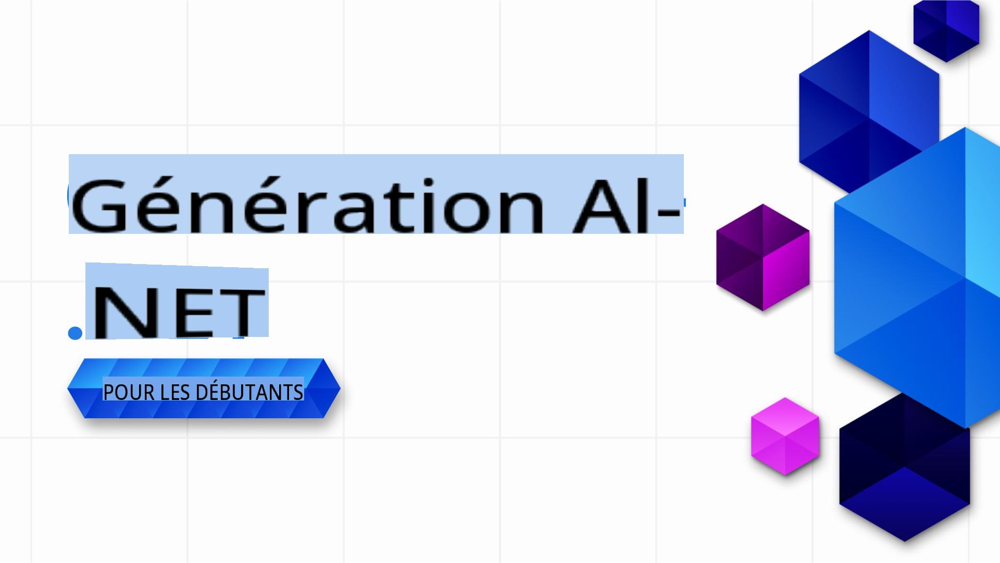

# Générative AI pour Débutants .NET - Un Cours

### Leçons pratiques pour apprendre à créer des applications d'IA générative avec .NET

Bienvenue dans **Générative AI pour Débutants .NET**, un cours pratique conçu pour les développeurs .NET qui souhaitent plonger dans l'univers de l'IA générative !

Ce n’est pas un cours classique du type "voici la théorie, bonne chance". Ce dépôt est axé sur des **applications concrètes** et du **codage en direct** pour permettre aux développeurs .NET de tirer pleinement parti de l'IA générative.

C'est **pratique**, **orienté sur la pratique**, et conçu pour être **amusant** !

N'oubliez pas de [mettre une étoile (🌟) à ce dépôt](https://docs.github.com/en/get-started/exploring-projects-on-github/saving-repositories-with-stars) pour le retrouver facilement plus tard.

➡️Obtenez votre propre copie en [forkant ce dépôt](https://github.com/microsoft/Generative-AI-for-beginners-dotnet/fork) et retrouvez-le ensuite dans vos propres dépôts.

## ✨ Quoi de neuf !

Nous améliorons constamment ce cours avec les derniers outils IA, modèles et exemples pratiques :

- **Nouveau : Démo de génération vidéo Azure OpenAI Sora !**
  - La leçon 3 propose désormais une démo pratique montrant comment générer des vidéos à partir de prompts textuels en utilisant le nouveau [modèle de génération vidéo Sora](https://learn.microsoft.com/azure/ai-services/openai/concepts/video-generation) dans Azure OpenAI.
  - L'exemple démontre comment :
    - Soumettre un travail de génération vidéo avec un prompt créatif.
    - Interroger le statut du travail et télécharger automatiquement le fichier vidéo résultant.
    - Sauvegarder la vidéo générée sur votre bureau pour un visionnage facile.
  - Voir la documentation officielle : [Génération vidéo Azure OpenAI Sora](https://learn.microsoft.com/azure/ai-services/openai/concepts/video-generation)
  - Trouvez l'exemple dans [Leçon 3 : Techniques IA génératives fondamentales /src/VideoGeneration-AzureSora-01/Program.cs](../03-CoreGenerativeAITechniques/src/VideoGeneration-AzureSora-01/Program.cs)

- **Nouveau : Modèle de génération d'images Azure OpenAI (`gpt-image-1`)** : La leçon 3 propose maintenant des exemples de code pour utiliser le nouveau modèle de génération d'images Azure OpenAI, `gpt-image-1`. Apprenez comment générer des images depuis .NET en utilisant les dernières capacités d'Azure OpenAI.
  - Voir la documentation officielle : [Comment utiliser les modèles de génération d'images Azure OpenAI](https://learn.microsoft.com/azure/ai-services/openai/how-to/dall-e?tabs=gpt-image-1) et le [guide de génération d'images openai-dotnet](https://github.com/openai/openai-dotnet?tab=readme-ov-file#how-to-generate-images) pour plus de détails.
  - Trouvez l'exemple dans [Leçon 3 : Techniques IA génératives fondamentales .. /src/ImageGeneration-01.csproj](../03-CoreGenerativeAITechniques/src/ImageGeneration-01/ImageGeneration-01.csproj).

- **Nouveau scénario : Orchestration d'agents concurrents dans eShopLite** : Le [dépôt eShopLite](https://github.com/Azure-Samples/eShopLite/tree/main/scenarios/07-AgentsConcurrent) propose maintenant un scénario démontrant l'orchestration d'agents concurrents en utilisant Semantic Kernel. Ce scénario montre comment plusieurs agents peuvent travailler en parallèle pour analyser les requêtes utilisateur et fournir des insights précieux pour l'analyse future.

[Voir toutes les mises à jour précédentes dans notre section Quoi de neuf](./10-WhatsNew/readme.md)

## 🚀 Introduction

L'IA générative transforme le développement logiciel, et .NET n'y fait pas exception. Ce cours vise à simplifier cette transition en proposant :

- De courtes vidéos de 5 à 10 minutes pour chaque leçon.
- Des exemples de code .NET entièrement fonctionnels que vous pouvez exécuter et explorer.
- Une intégration avec des outils comme **GitHub Codespaces** et **GitHub Models** pour une configuration facile et un démarrage rapide. Mais si vous préférez exécuter les exemples localement avec vos propres modèles, c'est également possible.

Vous apprendrez à intégrer l'IA générative dans des projets .NET, de la génération de texte de base à la création de solutions complètes en utilisant **GitHub Models**, **Azure OpenAI Services** et des modèles locaux avec **Ollama**.

## 📦 Chaque Leçon Comprend

- **Vidéo Courte** : Un aperçu rapide de la leçon (5-10 minutes).
- **Exemples de Code Complets** : Entièrement fonctionnels et prêts à l'emploi.
- **Guide Étape par Étape** : Instructions simples pour vous aider à apprendre et à appliquer les concepts.
- **Références Approfondies** : Ce cours se concentre sur l'implémentation pratique de l'IA générative, mais nous fournissons également des liens vers des explications dans [Generative AI for Beginners - A Course](https://github.com/microsoft/generative-ai-for-beginners) pour approfondir les aspects théoriques si nécessaire.

## 🗃️ Leçons

| #   | **Lien vers la Leçon** | **Description** |
| --- | ----------------------- | --------------- |
| 01  | [**Introduction aux Bases de l'IA Générative pour les Développeurs .NET**](./01-IntroToGenAI/readme.md) | <ul><li>Aperçu des modèles génératifs et de leurs applications en .NET</li></ul> |
| 02  | [**Configurer un Environnement de Développement pour l'IA Générative avec .NET**](./02-SetupDevEnvironment/readme.md) | <ul><li>Utilisation de bibliothèques comme **Microsoft.Extensions.AI** et **Semantic Kernel**.</li><li>Configuration de fournisseurs comme GitHub Models, Azure AI Foundry, et développement local avec Ollama.</li></ul> |
| 03  | [**Techniques Fondamentales d'IA Générative avec .NET**](./03-CoreGenerativeAITechniques/readme.md) | <ul><li>Génération de texte et flux conversationnels.</li><li> Capacités multimodales (vision et audio).</li><li>Agents</li></ul> |
| 04  | [**Exemples Pratiques d'IA Générative avec .NET**](./04-PracticalSamples/readme.md) | <ul><li>Exemples complets démontrant l'IA générative dans des scénarios réels</li><li>Applications de recherche sémantique.</li><li>Applications avec agents multiples</li></ul> |
| 05  | [**Utilisation Responsable de l'IA Générative dans les Applications .NET**](./05-ResponsibleGenAI/readme.md) | <ul><li>Considérations éthiques, réduction des biais, et implémentations sécurisées.</li></ul> |

## 🌐 Support Multi-Langues

| Langue               | Code | Lien vers le README Traduit                            | Dernière Mise à Jour |
|----------------------|------|-------------------------------------------------------|-----------------------|
| Chinois (Simplifié)  | zh   | [Traduction Chinoise](../zh/README.md)     | 2025-02-19           |
| Chinois (Traditionnel)| tw   | [Traduction Chinoise](../tw/README.md)     | 2025-02-19           |
| Français             | fr   | [Traduction Française](./README.md)    | 2025-02-19           |
| Japonais             | ja   | [Traduction Japonaise](../ja/README.md)    | 2025-02-19           |
| Coréen               | ko   | [Traduction Coréenne](../ko/README.md)     | 2025-02-19           |
| Portugais            | pt   | [Traduction Portugaise](../pt/README.md)   | 2025-02-19           |
| Espagnol             | es   | [Traduction Espagnole](../es/README.md)    | 2025-02-19           |
| Allemand             | de   | [Traduction Allemande](../de/README.md)    | 2025-02-19           |

## 🛠️ Ce Dont Vous Avez Besoin

Pour commencer, vous aurez besoin de :

1. Un **compte GitHub** (gratuit, c'est suffisant !) pour [forker ce dépôt](https://github.com/microsoft/generative-ai-for-beginners-dotnet/fork) dans votre propre compte GitHub.

1. **GitHub Codespaces activé** pour des environnements de codage instantanés. Vous pouvez activer GitHub Codespaces dans les paramètres de votre dépôt. En savoir plus sur GitHub Codespaces [ici](https://docs.github.com/en/codespaces).

1. Créez votre copie en [forkant ce dépôt](https://github.com/microsoft/Generative-AI-for-beginners-dotnet/fork), ou utilisez le bouton `Fork` en haut de cette page.

1. Une compréhension de base du **développement .NET**. En savoir plus sur .NET [ici](https://dotnet.microsoft.com/learn/dotnet/what-is-dotnet).

Et c'est tout.

Nous avons conçu ce cours pour qu'il soit aussi simple que possible. Nous utilisons les éléments suivants pour vous aider à démarrer rapidement :

- **Exécuter dans GitHub Codespaces** : En un clic, vous obtiendrez un environnement préconfiguré pour tester et explorer les leçons.

# 🤖 Générative IA pour les Débutants .NET

Bienvenue dans ce dépôt qui vous aidera à démarrer avec l'IA générative en utilisant .NET. Nous avons conçu ce cours pour vous accompagner pas à pas, que vous soyez un débutant ou que vous souhaitiez approfondir vos connaissances.

## 🧠 Ce que vous allez apprendre

- **Comprendre les bases de l'IA générative** : Explorez les concepts fondamentaux et apprenez comment les modèles génératifs fonctionnent.
- **Construire des applications avec .NET** : Découvrez comment intégrer des modèles d'IA générative dans vos projets .NET.
- **Explorer des cas d'utilisation réels** : Apprenez à appliquer ces technologies dans des contextes pratiques.

---

## 🚀 Démarrer

Pour commencer, suivez les instructions dans [02-SetupDevEnvironment/readme.md](02-SetupDevEnvironment/readme.md) pour configurer votre environnement de développement.

---

## 📚 Ressources Incluses

Voici quelques-unes des choses que vous trouverez dans ce dépôt :

- Des exemples de code pour comprendre et implémenter des concepts.
- Des exercices pour mettre en pratique ce que vous apprenez.
- Des leçons progressives pour vous guider tout au long du processus.

---

## 🌟 Ressources Supplémentaires

### **Tirez parti des modèles GitHub** : Essayez des démonstrations alimentées par l'IA directement hébergées dans ce dépôt. Nous en expliquons davantage dans les leçons au fur et à mesure. *(Si vous souhaitez en savoir plus sur les modèles GitHub, cliquez [ici](https://docs.github.com/github-models))*

Lorsque vous serez prêt à aller plus loin, nous avons également des guides pour :

- Passer à **Azure OpenAI Services** pour des solutions évolutives et adaptées aux entreprises.
- Utiliser **Ollama** pour exécuter des modèles localement sur votre matériel, offrant ainsi une confidentialité et un contrôle accrus.

---

## 🤝 Vous souhaitez contribuer ?

Les contributions sont les bienvenues ! Voici comment vous pouvez aider :

- [Signalez des problèmes](https://github.com/microsoft/Generative-AI-for-beginners-dotnet/issues/new) ou des bugs dans le dépôt.
- Améliorez les exemples de code existants ou ajoutez-en de nouveaux, clonez ce dépôt et proposez des modifications !
- Suggérez des leçons ou des améliorations supplémentaires.
- Vous avez des suggestions ou trouvé des fautes d'orthographe ou des erreurs dans le code ? [Créez une pull request](https://github.com/microsoft/Generative-AI-for-beginners-dotnet/compare).

Consultez le fichier [CONTRIBUTING.md](CONTRIBUTING.md) pour savoir comment vous impliquer.

---

## 📄 Licence

Ce projet est sous licence MIT - consultez le fichier [LICENSE](../../LICENSE) pour plus de détails.

---

## 🌐 Autres Cours

Nous avons beaucoup d'autres contenus pour vous accompagner dans votre apprentissage. Consultez :

- [Generative AI for Beginners](https://aka.ms/genai-beginners)
- [Generative AI for Beginners .NET](https://github.com/microsoft/Generative-AI-for-beginners-dotnet)
- [Generative AI with JavaScript](https://github.com/microsoft/generative-ai-with-javascript)
- [AI for Beginners](https://aka.ms/ai-beginners)
- [AI Agents for Beginners - A Course](https://github.com/microsoft/ai-agents-for-beginners)
- [Data Science for Beginners](https://aka.ms/datascience-beginners)
- [ML for Beginners](https://aka.ms/ml-beginners)
- [Cybersecurity for Beginners](https://github.com/microsoft/Security-101) 
- [Web Dev for Beginners](https://aka.ms/webdev-beginners)
- [IoT for Beginners](https://aka.ms/iot-beginners)
- [XR Development for Beginners](https://github.com/microsoft/xr-development-for-beginners)
- [Mastering GitHub Copilot for Paired Programming](https://github.com/microsoft/Mastering-GitHub-Copilot-for-Paired-Programming)
- [Mastering GitHub Copilot for C#/.NET Developers](https://github.com/microsoft/mastering-github-copilot-for-dotnet-csharp-developers)
- [Choose Your Own Copilot Adventure](https://github.com/microsoft/CopilotAdventures)

[Commençons à apprendre l'IA générative et .NET !](02-SetupDevEnvironment/readme.md) 🚀

**Avertissement** :  
Ce document a été traduit à l'aide de services de traduction automatisée basés sur l'intelligence artificielle. Bien que nous nous efforcions d'assurer l'exactitude, veuillez noter que les traductions automatisées peuvent contenir des erreurs ou des inexactitudes. Le document original dans sa langue d'origine doit être considéré comme la source faisant autorité. Pour des informations critiques, il est recommandé de recourir à une traduction professionnelle humaine. Nous déclinons toute responsabilité en cas de malentendus ou de mauvaises interprétations résultant de l'utilisation de cette traduction.