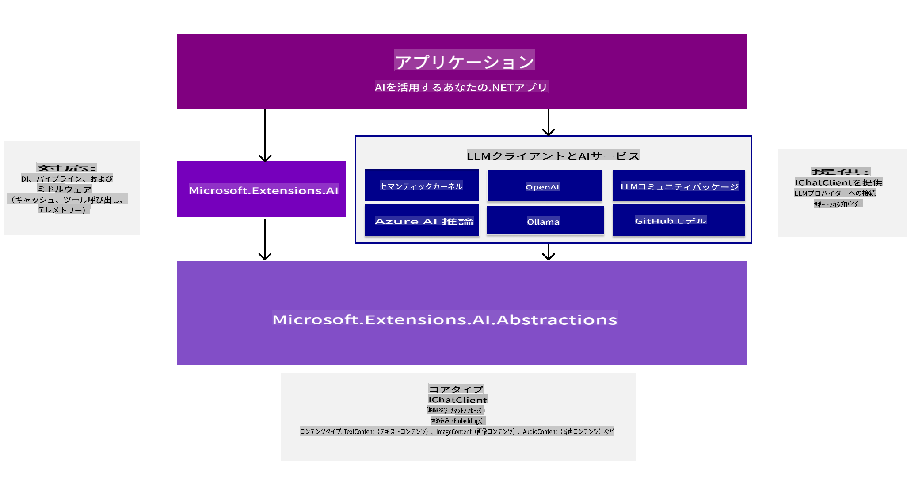
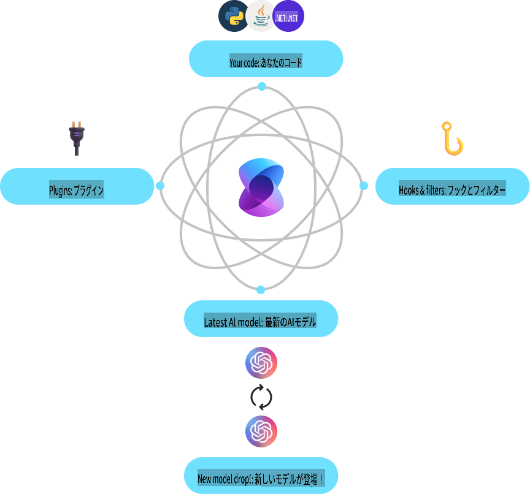
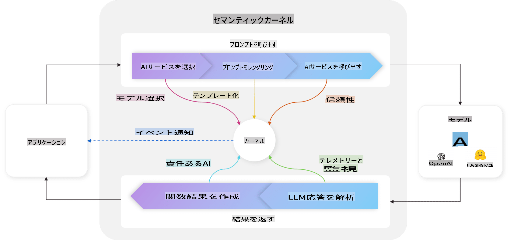
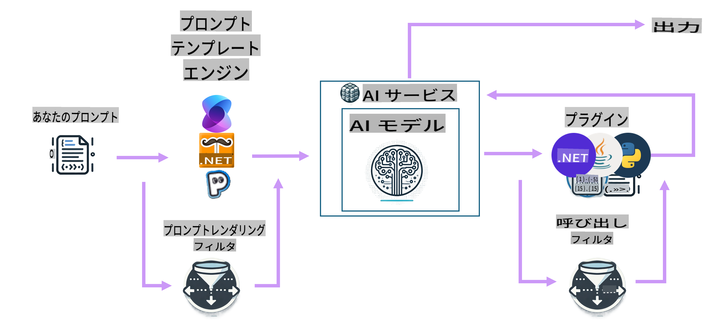

# AI開発ツールの始め方

生成AIの基礎知識を復習し、生成AIアプリケーションを開発するために利用できる.NETツールについて理解を深めましょう。

---

[](http://www.youtube.com/watch?v=SZvE_meBdvg)

_⬆️画像をクリックして動画を視聴⬆️_

## このレッスンで学べること：

- 🌟 生成AIの基本概念とその応用について理解する
- 🔍 MEAI、Semantic Kernel、Azure OpenAIなど、AI開発における.NETツールを探索する

## .NETのための生成AIの基礎

コードに入る前に、生成AI（GenAI）の基本的な概念を復習しましょう。このレッスンでは、**.NETのための生成AIの基礎**について学びます。これにより、なぜ特定の方法で実行する必要があるのかを理解できるようになります。また、アプリ構築に使用するツールやSDK（**MEAI** (Microsoft.Extensions.AI)、**Semantic Kernel**、**VS Code用AIツールキット拡張機能**など）も紹介します。

### 生成AIの概念を簡単におさらい

生成AIは、データから学習したパターンや関係性に基づいて、新しいコンテンツ（テキスト、画像、コードなど）を生成する人工知能の一種です。生成AIモデルは、人間のような応答を生成したり、文脈を理解したり、時には人間らしいコンテンツを作成することもできます。

.NETでAIアプリケーションを開発する際には、**生成AIモデル**を利用してコンテンツを作成します。生成AIモデルの主な機能には以下のようなものがあります：

- **テキスト生成**：チャットボット、コンテンツ作成、テキスト補完のための人間らしいテキストの生成。
- **画像生成と分析**：リアルな画像の生成、写真の補正、オブジェクトの検出。
- **コード生成**：コードスニペットやスクリプトの作成。

また、特定のタスクに最適化されたモデルも存在します。例えば、**Small Language Models (SLMs)** はテキスト生成に適しており、**Large Language Models (LLMs)** はコード生成や画像分析のような複雑なタスクに向いています。そして、MicrosoftやOpenAI、Anthropicなど、さまざまな企業やグループがこれらのモデルを開発しています。どのモデルを使用するかは、ユースケースや必要な機能に依存します。

もちろん、これらのモデルが常に完璧な応答を返すわけではありません。モデルが「幻覚を起こす」つまり、間違った情報をあたかも正しいかのように生成することがある、という話を聞いたことがあるかもしれません。しかし、モデルに明確な指示や文脈を与えることで、より良い応答を生成する手助けができます。これが**プロンプトエンジニアリング**の出番です。

#### プロンプトエンジニアリングの復習

プロンプトエンジニアリングとは、AIモデルを望ましい出力に導くための効果的な入力を設計する技術です。これには以下が含まれます：

- **明確性**：指示を明確かつ曖昧でないものにする。
- **文脈**：必要な背景情報を提供する。
- **制約条件**：制限やフォーマットを指定する。

プロンプトエンジニアリングのベストプラクティスには、プロンプト設計、明確な指示、タスク分解、ワンショット学習と少ショット学習、プロンプトチューニングが含まれます。また、特定のユースケースに最適なプロンプトを見つけるために、さまざまなプロンプトを試してテストすることも重要です。

さらに、アプリケーションを開発する際には、異なる種類のプロンプトを設定する責任があります。例えば、モデルの応答に基づく基本ルールや文脈を設定する**システムプロンプト**、アプリケーションのユーザーがモデルに入力するデータである**ユーザープロンプト**、そしてシステムプロンプトとユーザープロンプトに基づいてモデルが生成する応答である**アシスタントプロンプト**があります。

> 🧑‍🏫 **もっと学ぶ**：[生成AI初心者向けコースのプロンプトエンジニアリング章](https://github.com/microsoft/generative-ai-for-beginners/tree/main/04-prompt-engineering-fundamentals)でプロンプトエンジニアリングについてさらに学びましょう

#### トークン、埋め込み、エージェント - これらは何？

生成AIモデルを使用する際には、**トークン**、**埋め込み**、**エージェント**といった用語に出会うでしょう。これらの概念を簡単に説明します：

- **トークン**：トークンはモデル内での最小単位のテキストです。単語、文字、または部分的な単語で構成されます。トークンは、モデルがテキストデータを理解できる形式で表現するために使用されます。
- **埋め込み**：埋め込みはトークンのベクトル表現です。単語やフレーズの意味を捉え、モデルが単語間の関係を理解し、文脈に適した応答を生成できるようにします。
- **ベクトルデータベース**：埋め込みのコレクションで、テキストデータを比較・分析するために使用されます。これにより、モデルが入力データの文脈に基づいて応答を生成できるようになります。
- **エージェント**：エージェントはモデルと対話して応答を生成するAIコンポーネントです。これには、チャットボット、バーチャルアシスタント、その他の生成AIモデルを使用するアプリケーションが含まれます。

.NETでAIアプリケーションを開発する際には、トークン、埋め込み、エージェントを活用して、チャットボット、コンテンツ生成ツール、その他のAI対応アプリケーションを構築します。これらの概念を理解することで、より効果的かつ効率的なAIアプリケーションを構築できるようになります。

### .NETのAI開発ツールとライブラリ

.NETにはAI開発のための多くのツールが用意されています。ここでは、利用可能なツールとライブラリについて簡単に理解していきましょう。

#### Microsoft.Extensions.AI (MEAI)

Microsoft.Extensions.AI (MEAI) ライブラリは、AIサービスを.NETアプリケーションに統合するプロセスを簡素化するための統一された抽象化とミドルウェアを提供します。

統一されたAPIを提供することで、MEAIは開発者が異なるAIサービス（小型および大型言語モデル、埋め込み、ミドルウェアなど）と共通のインターフェースを介してやり取りできるようにします。これにより、異なるサービスに対しても同じAPIを使用して開発できるため、.NET AIアプリケーションの構築が容易になります。

例えば、MEAIを使用してチャットクライアントを作成する際には、以下のようなインターフェースを使用します：

```csharp
public interface IChatClient : IDisposable 
{ 
    Task<ChatCompletion> CompleteAsync(...); 
    IAsyncEnumerable<StreamingChatCompletionUpdate> CompleteStreamingAsync(...); 
    ChatClientMetadata Metadata { get; } 
    TService? GetService<TService>(object? key = null) where TService : class; 
}
```

このように、MEAIを使用してチャットアプリケーションを構築する場合、チャット補完を取得したり、補完をストリームしたり、メタデータを取得したり、基盤となるAIサービスにアクセスしたりする際に同じAPIを使用します。これにより、必要に応じてAIサービスを切り替えたり、新しいサービスを追加したりすることが容易になります。

さらに、このライブラリは、ロギング、キャッシュ、テレメトリなどの機能を提供するミドルウェアコンポーネントもサポートしており、堅牢なAIアプリケーションの開発を容易にします。



統一されたAPIを使用することで、MEAIはAzure AI Inference、Ollama、OpenAIなど、さまざまなAIサービスと一貫性のある方法で連携することが可能になります。これにより、開発者はプロジェクトや特定の要件に最適なAIサービスを柔軟に選択できるようになります。

> 🏎️ **クイックスタート**：MEAIのクイックスタートについては、[ブログ記事](https://devblogs.microsoft.com/dotnet/introducing-microsoft-extensions-ai-preview/)を参照してください。
>
> 📖 **ドキュメント**：Microsoft.Extensions.AI (MEAI) についてさらに詳しくは、[MEAI ドキュメント](https://learn.microsoft.com/dotnet/ai/ai-extensions)を参照してください。
 

#### Semantic Kernel (SK)

Semantic Kernelは、生成AI言語モデルを.NETアプリケーションに統合するためのオープンソースSDKです。AIサービスやメモリ（ベクトル）ストアの抽象化を提供し、AIによって自動的にオーケストレーションされるプラグインの作成を可能にします。また、OpenAPI標準を使用して、外部APIと対話するAIエージェントを作成することも可能です。



Semantic Kernelは.NETだけでなく、JavaやPythonなどの他の言語もサポートしており、多くのコネクタ、関数、プラグインを統合のために提供します。Semantic Kernelの主な機能には以下が含まれます：

- **Kernel Core**：AIサービスやモデルと対話するためのコネクタ、関数、プラグインなど、Semantic Kernelのコア機能を提供します。KernelはSemantic Kernelの中心であり、サービスやプラグインを利用可能にし、必要に応じてそれらを取得し、エージェントを監視し、アプリケーションのミドルウェアとして機能します。

    例えば、特定のタスクに最適なAIサービスを選択し、プロンプトをサービスに送信し、応答をアプリケーションに返すことができます。以下はKernel Coreが動作する様子を示す図です：

    

- **AIサービスコネクタ**：AIサービスを複数のプロバイダーに抽象化レイヤーとして提供し、共通かつ一貫したインターフェースを持つ例（チャット補完、テキストから画像、音声からテキストなど）を提供します。

- **ベクトルストアコネクタ**：ベクトルストアを複数のプロバイダーに抽象化し、共通かつ一貫したインターフェースを介して、埋め込み、ベクトル、その他のデータ表現を扱うことを可能にします。

- **関数とプラグイン**：関数処理、プロンプトテンプレート、テキスト検索など、一般的なAIタスクのためのさまざまな関数やプラグインを提供します。これをAIサービスやモデルに接続し、例えばRAGやエージェントの実装を作成できます。

- **プロンプトテンプレート**：プロンプト設計、テスト、最適化など、プロンプトエンジニアリングのためのツールを提供し、AIモデルのパフォーマンスと精度を向上させます。これにより、開発者は特定のタスクに合わせたプロンプトを作成し、テストおよび最適化できます。

- **フィルタ**：関数の実行タイミングや方法を制御し、セキュリティや責任あるAIの実践を向上させます。

Semantic Kernelでは、完全なループは以下の図のようになります：



> 📖 **ドキュメント**：Semantic Kernelについてさらに詳しくは、[Semantic Kernel ドキュメント](https://learn.microsoft.com/semantic-kernel/overview)を参照してください。

## 結論

生成AIは、コンテンツを生成し、文脈を理解し、人間のような応答を提供する革新的なアプリケーションを開発者に可能にする無限の可能性を提供します。.NETエコシステムは、AI開発を簡素化するための多くのツールとライブラリを提供しており、.NETアプリケーションにAI機能を統合するのを容易にします。

## 次のステップ

次の章では、これらのシナリオを詳しく掘り下げ、実践的な例、コードスニペット、ベストプラクティスを提供し、.NETを使用して現実世界のAIソリューションを構築する方法を学びます！

次は、開発環境をセットアップします！これで、.NETと生成AIの世界に飛び込む準備が整います！

👉 [AI開発環境をセットアップする](/02-SetupDevEnvironment/readme.md)

**免責事項**:  
この文書は、機械ベースのAI翻訳サービスを使用して翻訳されています。正確さを追求していますが、自動翻訳には誤りや不正確さが含まれる可能性がありますのでご注意ください。元の言語で書かれた原文が信頼できる情報源とみなされるべきです。重要な情報については、専門の人間による翻訳をお勧めします。この翻訳の使用に起因する誤解や誤解釈について、当社は一切の責任を負いません。