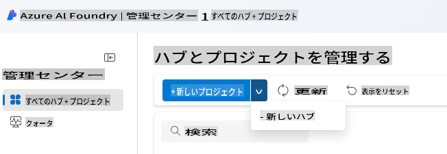
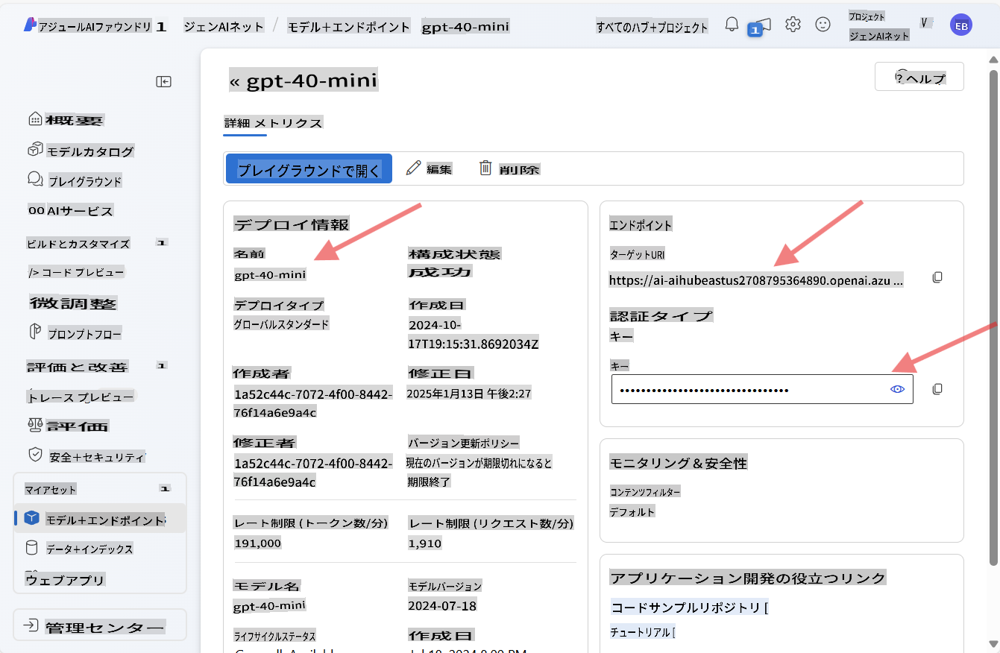
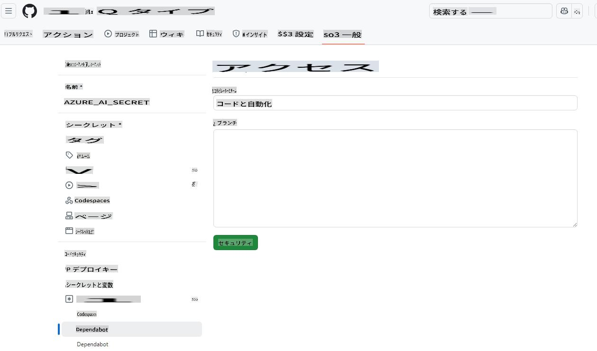
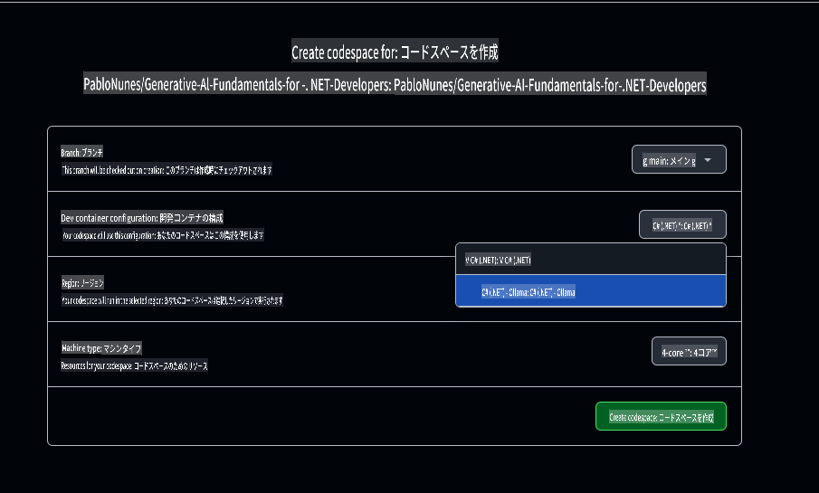

# Azure OpenAI 開発環境のセットアップ

このコースで .NET AI アプリケーションに Azure AI Foundry モデルを使用する場合、このガイドの手順に従ってください。

Azure OpenAI を使いたくない場合は？

👉 [GitHub Models を使用する場合はこちらのガイドをご覧ください](README.md)  
👉 [Ollama の手順はこちら](getting-started-ollama.md)

## Azure AI Foundry リソースを作成する

Azure AI Foundry モデルを使用するには、Azure AI Foundry ポータルでハブとプロジェクトを作成し、モデルをデプロイする必要があります。このセクションでは、その手順を説明します。

### Azure AI Foundry でハブとプロジェクトを作成する

1. [Azure AI Foundry ポータル](https://ai.azure.com/) にアクセスします。
1. Azure アカウントでサインインします。
1. 左側のメニューから **All hubs + projects** を選択し、ドロップダウンから **+ New hub** をクリックします。（注: **+ New project** を先にクリックする必要がある場合があります）。
    
1. 新しいウィンドウが開きます。ハブの詳細を入力してください：
    - ハブの名前を入力（例: "MyAIHub"）。
    - 自分に最も近いリージョンを選択。
    - 適切なサブスクリプションとリソースグループを選択。
    - 他の設定はそのままにしておきます。
    - **Next** をクリック。
    - 詳細を確認して **Create** をクリック。
1. ハブが作成されると、その詳細ページがポータルに表示されます。**Create Project** ボタンをクリックします。
    - プロジェクト名を入力（例: "GenAINET"）またはデフォルトを使用。
    - **Create** をクリック。

🎉 **完了！** Azure AI Foundry で最初のプロジェクトを作成しました。

### Azure AI Foundry で言語モデルをデプロイする

次に、**gpt-4o-mini** モデルをプロジェクトにデプロイします：

1. Azure AI Foundry ポータルでプロジェクトに移動します（作成後に自動的に開かれるはずです）。
1. 左側のメニューから **Models and Endpoints** を選択し、**Deploy Model** ボタンをクリックします。
1. ドロップダウンから **Deploy base model** を選択。
1. モデルカタログで **gpt-4o-mini** を検索。
1. モデルを選択して **Confirm** ボタンをクリック。
1. デプロイ名を指定（例: "gpt-4o-mini"）。他のオプションはそのままで構いません。
1. **Deploy** をクリックしてモデルのプロビジョニングを待ちます。
1. デプロイ完了後、モデル詳細ページから **Model Name**、**Target URI**、**API Key** をメモしてください。

🎉 **完了！** Azure AI Foundry で最初の大規模言語モデルをデプロイしました。



> 📝 **注:** エンドポイントは `https://< your hub name>.openai.azure.com/openai/deployments/gpt-4o-mini/chat/completions?api-version=2024-08-01-preview` のような形式になる場合があります。必要なエンドポイント名は `https://< your hub name >.openai.azure.com/`* のみです。

## Azure AI API キーを Codespace の Secrets に追加する

セキュリティのため、作成した API キーを Codespace の Secrets に追加しましょう。

1. このリポジトリを自分の GitHub アカウントにフォークしていることを確認してください。
1. フォークしたリポジトリの **Settings** タブに移動し、左側のメニューから **Secrets and variables** を展開して **Codespaces** を選択します。

    
1. シークレット名を **AZURE_AI_KEY** とします。
1. Azure AI Foundry ポータルからコピーした API キーを **Secret** フィールドに貼り付けます。

## GitHub Codespace の作成

このコースの開発用に GitHub Codespace を作成しましょう。

1. このリポジトリのメインページを新しいウィンドウで開きます。[ここを右クリックして](https://github.com/microsoft/Generative-AI-for-beginners-dotnet) **新しいウィンドウで開く** を選択してください。
1. ページ右上の **Fork** ボタンをクリックして、このリポジトリを自分の GitHub アカウントにフォークします。
1. **Code** ドロップダウンボタンをクリックし、**Codespaces** タブを選択。
1. **...** オプション（三点ドット）を選択し、**New with options...** を選びます。


### 開発コンテナの選択

**Dev container configuration** ドロップダウンから次のオプションのいずれかを選択してください：

**オプション 1: C# (.NET)** : GitHub Models または Azure OpenAI を使用する場合、このオプションを選択します。このコースで必要な .NET 開発ツールがすべて含まれており、起動時間も短いです。

**オプション 2: C# (.NET) - Ollama**: Ollama を使用してデモを実行し、GitHub Models または Azure OpenAI に接続する必要がない場合、このオプションを選択します。Ollama の他に .NET 開発ツールも含まれていますが、起動時間がやや長く、平均で 5 分ほどかかります。[こちらのガイド](getting-started-ollama.md) を参照してください。

他の設定はそのままで構いません。**Create codespace** ボタンをクリックして、Codespace 作成プロセスを開始します。



## サンプルコードを Azure OpenAI と新しいモデルに更新する

次に、新しくデプロイしたモデルを使用するようにコードを更新します。まず、Azure OpenAI を操作するために必要な NuGet パッケージを追加します。

1. ターミナルを開き、プロジェクトディレクトリに移動します：

    ```bash
    cd 02-SetupDevEnvironment/src/BasicChat-01MEAI/
    ```

1. 以下のコマンドを実行して必要なパッケージを追加します：

    ```bash
    dotnet add package Azure.AI.OpenAI
    dotnet add package Microsoft.Extensions.AI.OpenAI --version 9.1.0-preview.1.25064.3
    ```

[Azure.AI.OpenAI に関する詳細はこちら](https://www.nuget.org/packages/Azure.AI.OpenAI/2.1.0#show-readme-container)。

1. `/workspaces/Generative-AI-for-beginners-dotnet/02-SettingUp.NETDev/src/BasicChat-01MEAI/Program.cs` を開きます。

    ファイルの先頭に次の using 文を追加します：

    ```csharp
    using System.ClientModel;
    using Azure.AI.OpenAI;
    using Microsoft.Extensions.AI;

1. Create new variables to hold the model name, endpoint, and API key:

    ```csharp
    var deploymentName = "< deployment name > "; // 例: "gpt-4o-mini"
    var endpoint = new Uri("< endpoint >"); // 例: "https://< your hub name >.openai.azure.com/"
    var apiKey = new ApiKeyCredential(Environment.GetEnvironmentVariable("AZURE_AI_SECRET"));
    ```

    Making sure to replace `< deployment name >`, and `< endpoint >` with the values you noted above.

1. Replace the `IChatClient` creation with the following code:

    ```csharp
    IChatClient client = new AzureOpenAIClient(
        endpoint,
        apiKey)
    .AsChatClient(deploymentName);
    ```

1. Run the following command in the terminal:

    ```bash
    dotnet run
    ```

1. You should see output similar to the following:

    ```bash
    人工知能 (AI) とは、人間の知能を模倣するようにプログラムされた機械を指します。AI は、人間の知能を必要とするタスクをコンピューターやシステムが実行できるようにするさまざまな技術やアプローチを包含しています。これには以下のタスクが含まれます：

    1. **学習**: データを分析するアルゴリズムを通じて経験に基づいてパフォーマンスを向上させる能力。
    
    ...
    ```

> 🙋 **サポートが必要ですか？**: 何かうまくいかない場合は、[新しい Issue を作成](https://github.com/microsoft/Generative-AI-for-beginners-dotnet/issues/new?template=Blank+issue) してください。サポートいたします。

## まとめ

このレッスンでは、コース全体で使用する開発環境をセットアップする方法を学びました。GitHub Codespace を作成し、それを Azure OpenAI に接続するように設定しました。また、新しくデプロイしたモデルを使用するようにサンプルコードを更新しました。

### 追加リソース

- [Azure AI Foundry ドキュメント](https://learn.microsoft.com/azure/ai-services/)  
- [GitHub Codespaces の使用方法](https://docs.github.com/en/codespaces/getting-started)  
- [Azure AI Foundry でモデルをデプロイする方法](https://learn.microsoft.com/azure/ai-services/deploy/)  
- [Azure.AI.OpenAI NuGet パッケージ](https://www.nuget.org/packages/Azure.AI.OpenAI)

## 次のステップ

次は、最初の AI アプリケーションを作成する方法を学びます！ 🚀

👉 [コア生成 AI テクニック](../03-CoreGenerativeAITechniques/readme.md)

**免責事項**:  
この文書は、機械翻訳AIサービスを使用して翻訳されています。正確性を追求しておりますが、自動翻訳には誤りや不正確さが含まれる場合があります。元の言語で作成された原文が信頼できる正式な情報源とみなされるべきです。重要な情報については、専門の人間による翻訳をお勧めします。この翻訳の使用に起因する誤解や誤った解釈について、当方は一切の責任を負いません。