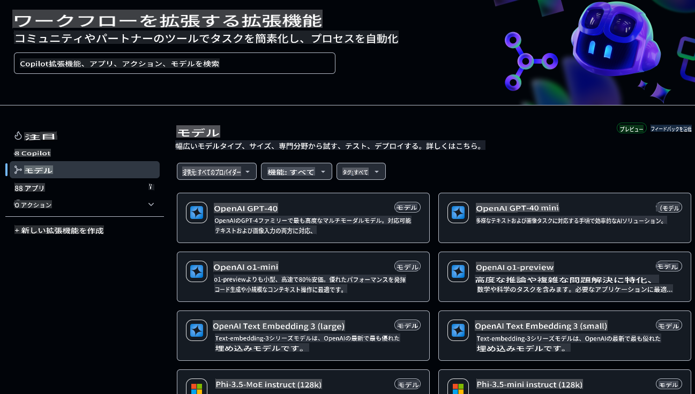
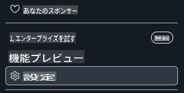
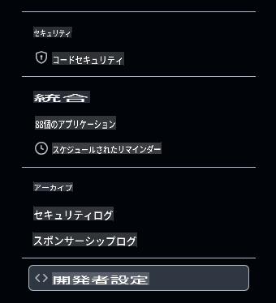
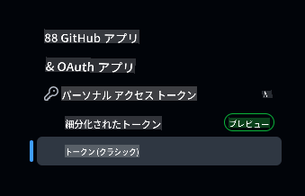
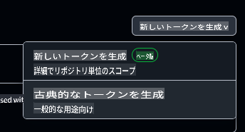

# このコースの開発環境をセットアップする

このレッスンでは、このコースのための開発環境をセットアップする手順を説明します。成功を確実にするために、必要なツールがすべて揃った devcontainer 設定を用意しました。この devcontainer は、GitHub Codespaces（推奨）またはローカル環境で実行できます。また、GitHub Models と連携するための GitHub アクセストークンの設定方法も解説します。

*必要に応じて、[Azure OpenAI](getting-started-azure-openai.md) や [Ollama](getting-started-ollama.md) のセットアップガイドも用意しています。*

---

## このレッスンで学ぶこと:

- ⚡ GitHub Codespaces を使った開発環境のセットアップ方法
- 🤖 GitHub Models、Azure OpenAI、または Ollama を介して LLM にアクセスするための環境設定
- 🛠️ .devcontainer を使った業界標準のツール構成
- 🎯 最終的に、コースの残りを進める準備がすべて整う

さあ、開発環境をセットアップしていきましょう！ 🏃‍♂️

[](https://youtu.be/7kYoVRNQXyA?feature=shared)

_⬆️画像をクリックしてビデオを見る⬆️_

## このコースでどの AI サービスを使うべき？

GitHub Models、Azure OpenAI、Ollama のいずれかを使って開発環境をセットアップする方法を説明します。ニーズに最も合ったものを選択してください。このコースでは GitHub Models を使用することを推奨していますが、どのサービスを使っても構いません。

以下は各サービスの概要です：

- **GitHub Models**: 無料で始められるサービスで、開発環境内でさまざまな AI モデルを直接テスト・操作できます。Codespaces から簡単に使用でき、モデルの能力を理解しながら実験するのに最適です。
- **Azure OpenAI**: 有料サービスで、多様な AI モデルにアクセスできます。Azure の堅牢なセキュリティやスケーラビリティを活用できるのが特徴です。Azure サブスクリプションを既にお持ちの場合、このコースに最適な選択肢です。
- **Ollama**: AI モデルをローカル環境、または Codespace や devcontainer 内で無料で実行できるサービスです。ローカル実行を好む場合に適していますが、ハードウェアリソースが多く必要で、クラウドベースのオプションよりも動作が遅くなることがあります。

> **GitHub Models** を選ぶ場合は、このドキュメントの残りを参考にしてセットアップを進めてください。
> - **Azure OpenAI** を選ぶなら、[こちらのドキュメント](getting-started-azure-openai.md)をご覧ください。
> - **Ollama** を選ぶなら、[こちらのガイド](getting-started-ollama.md)をご覧ください。

## GitHub Models を使って AI モデルを学び、テストする

**GitHub Models** は、開発環境内でさまざまな AI モデルを直感的に試せる機能を提供します。開発者はシンプルなインターフェースを通じて、モデルの応答を調べ、パフォーマンスを評価し、アプリケーション要件に最適なモデルを選定できます。GitHub のインフラ内でホストされているため、信頼性の高いアクセスと一貫したパフォーマンスを提供し、開発やテスト段階に最適です。さらに、無料の利用枠があり、コストをかけずに探索を始められます。



## 事前準備: GitHub アクセストークンの設定

まず最初に、Codespace が GitHub Models と連携し、安全にアプリケーションを実行できるようにするためのセキュリティ資格情報を設定します。

### GitHub Models にアクセスするための個人アクセストークンの作成

1. [GitHub 設定ページ](https://github.com/settings/profile) に移動します：

    - 画面右上のプロフィール画像をクリック
    - ドロップダウンメニューから **Settings** を選択

    

1. [Developer Settings](https://github.com/settings/apps) にアクセスします：

    - 左側のサイドバーを下にスクロール
    - **Developer settings**（通常は一番下）をクリック

    

1. 新しいトークンを生成します：

    - **Personal access tokens** → **Tokens (classic)** を選択

        

    - ページ中央のドロップダウンから **Generate new token (classic)** をクリック

        

    - 「Note」には、`GenAI-DotNet-Course-Token` のようなわかりやすい名前を入力
    - 有効期限を設定（推奨: セキュリティの観点から 7 日間）
    - このトークンには特別な権限を追加する必要はありません。

> 💡 **セキュリティのヒント**: アクセストークンには最小限のスコープと最短の有効期限を設定するのがベストプラクティスです。これにより、アカウントの安全性を確保できます。

## GitHub Codespace の作成

次に、このコースで使用する GitHub Codespace を作成します。

1. [こちらを右クリック](https://github.com/microsoft/Generative-AI-for-beginners-dotnet)して、**Open in new window** を選択し、このリポジトリのメインページを新しいウィンドウで開きます。
1. ページ右上の **Fork** ボタンをクリックして、このリポジトリを自分の GitHub アカウントにフォークします。
1. **Code** ドロップダウンボタンをクリックし、**Codespaces** タブを選択します。
1. **...**（三点リーダー）をクリックし、**New with options...** を選択します。


### 開発コンテナの選択

**Dev container configuration** ドロップダウンから以下のオプションのいずれかを選択します：

**オプション 1: C# (.NET)** : GitHub Models を使用する場合に選ぶべきオプションで、このコースを進めるための推奨設定です。必要な .NET 開発ツールがすべて揃っており、起動時間も高速です。

**オプション 2: C# (.NET) - Ollama**: GitHub Models や Azure OpenAI に接続せずにデモを実行する場合に適したオプションです。必要な .NET 開発ツールに加え、Ollama が含まれていますが、起動時間は平均で 5 分ほどかかります。[こちらのガイド](getting-started-ollama.md)を参照してください。

> 💡**ヒント** : Codespace を作成する際、メニューに選択肢がある場合は、自分の近くのリージョンを選んでください。遠いリージョンを選ぶと、作成時にエラーが発生する可能性があります。

**Create codespace** ボタンをクリックして、Codespace の作成プロセスを開始します。


## GitHub Models を使用して Codespace が正しく動作していることを確認する

Codespace が完全にロードされ、設定が完了したら、サンプルアプリを実行してすべてが正しく動作しているか確認しましょう：

1. ターミナルを開きます。Windows の場合、**Ctrl+\`** (backtick)、macOS では **Cmd+`** を入力してターミナルウィンドウを開くことができます。

1. 次のコマンドを実行して、適切なディレクトリに移動します：

    ```bash
    cd 02-SetupDevEnvironment\src\BasicChat-01MEAI
    ```

1. 次に、以下のコマンドでアプリケーションを実行します：

    ```bash
    dotnet run
    ```

1. 数秒かかる場合がありますが、最終的には次のようなメッセージが出力されるはずです：

    ```bash
    AI, or artificial intelligence, refers to the simulation of human intelligence in machines that are programmed to think and learn like humans. It is a broad field of computer science that focuses on creating systems and algorithms capable of performing tasks that typically require human intelligence. These tasks include problem-solving,

    ...
    ```

> 🙋 **ヘルプが必要？**: 何か問題が発生しましたか？[問題を報告](https://github.com/microsoft/Generative-AI-for-beginners-dotnet/issues/new?template=Blank+issue)してサポートを受けてください。

## まとめ

このレッスンでは、コースの残りを進めるための開発環境のセットアップ方法を学びました。GitHub Codespace を作成し、GitHub Models、Azure OpenAI、または Ollama を使用するように構成しました。また、GitHub Models 用の個人アクセストークンの作成方法と、サンプルアプリケーションを実行して動作確認を行う方法も学びました。

### 追加リソース

- 他のホスティングプロバイダーでこのガイドを試してみてください！
    - [Azure OpenAI](getting-started-azure-openai.md)
    - [Ollama](getting-started-ollama.md)
- [GitHub Codespaces ドキュメント](https://docs.github.com/en/codespaces)
- [GitHub Models ドキュメント](https://docs.github.com/en/github-models/prototyping-with-ai-models)

## 次のステップ

次は、最初の AI アプリケーションを作成する方法を学びます！ 🚀

👉 [生成 AI のコア技術](../03-CoreGenerativeAITechniques/readme.md)

**免責事項**:  
この文書は、機械ベースのAI翻訳サービスを使用して翻訳されています。正確さを追求しておりますが、自動翻訳には誤りや不正確な箇所が含まれる可能性があります。元の言語で作成された原文が正式な情報源と見なされるべきです。重要な情報については、専門の人間による翻訳を推奨します。本翻訳の利用によって生じた誤解や解釈の誤りについて、当社は一切の責任を負いません。
