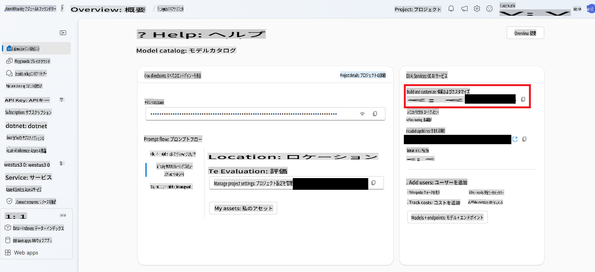

# AIエージェント

このレッスンでは、人間が常に関与することなく意思決定を行い、アクションを実行するAIエンティティを作成する方法を学びます。そう、AIエージェントは特定のタスクを自律的に実行することができます。

---

[](https://youtu.be/Btkmw1Bosh0?feature=shared)

_⬆️画像をクリックして動画を視聴⬆️_

AIエージェントは、LLMをアシスタントから、ユーザーの代わりにアクションを実行できるエンティティへと進化させます。エージェントは他のエージェントと連携してタスクを実行することも可能です。エージェントの主な特徴には、プログラムに基づいてアクションを開始する**自律性**、事前に定義された目標に基づいて意思決定を行う**意思決定能力**、そして時間とともに学習しパフォーマンスを向上させる**適応性**が含まれます。

エージェントを構築する際に重要なポイントは、彼らが1つのことに集中しているということです。目的を可能な限り絞り込むことが重要です。

> 🧑‍🏫**詳細を学ぶ**: AIエージェントの基本についてさらに知りたい方は、[Generative AI for Beginners: AI Agents](https://github.com/microsoft/generative-ai-for-beginners/tree/main/17-ai-agents)をご覧ください。

## AIエージェントの作成

.NETでAIエージェントを構築するために、いくつかの新しいコンセプトを学びます。このレッスンでは新しいSDKを使用し、Azure AI Foundryで追加のセットアップを行う必要があります。

> 🧑‍💻**サンプルコード**: このレッスンでは、[AgentLabs-01-Simple サンプル](../../../03-CoreGenerativeAITechniques/src/AgentLabs-01-Simple)を使用します。
>
> また、より高度なサンプルも`/src/`フォルダに含まれています。[AgentLabs-02-Functions](../../../03-CoreGenerativeAITechniques/src/AgentLabs-02-Functions)、[AgentLabs-03-OpenAPIs](../../../03-CoreGenerativeAITechniques/src/AgentLabs-03-OpenAPIs)、[AgentLabs-03-PythonParksInformationServer](../../../03-CoreGenerativeAITechniques/src/AgentLabs-03-PythonParksInformationServer)のREADMEを参照してください。

### Azure AIエージェントサービス

エージェントの構築を支援する新しいAzureサービスを紹介します。その名も[Aazure AIエージェントサービス](https://learn.microsoft.com/azure/ai-services/agents/overview)です。

このレッスンに含まれるコードサンプルを実行するには、Azure AI Foundryで追加のセットアップを行う必要があります。[**Basic Agent**をセットアップするための手順](https://learn.microsoft.com/azure/ai-services/agents/quickstart?pivots=programming-language-csharp)をご参照ください。

### Azure AI Projectsライブラリ

エージェントは3つの要素で構成されています。**LLM**（モデル）、**State**（コンテキスト、過去の結果に基づいて意思決定を導くもの）、そして**Tools**（以前学んだ[関数](./01-lm-completions-functions.md#function-calling)のようなもので、モデルと外部システムをつなぐ役割を果たします）。

理論上は、これまで学んだ内容だけでもAIエージェントを構築できます。しかし、**Azure AI Projects for .NET**ライブラリを使用すると、多くの一般的なタスクが簡略化され、エージェントの開発がより容易になります。

Azure AI Projectsライブラリを使用する際には、いくつかの重要な概念（クラスに対応）が存在します。

- `AgentClient`: エージェントを作成・ホストし、それらが実行されるスレッドを管理し、クラウドへの接続を処理するクライアント全体。
- `Agent`: エージェント自体で、タスクの指示やアクセス可能なツールの定義を保持します。
- `ThreadMessage`: エージェントに渡されるメッセージ（以前学んだプロンプトのようなもの）。エージェントも`ThreadMessage`オブジェクトを作成して通信します。
- `ThreadRun`: メッセージがエージェントに渡されるスレッド。このスレッドは開始され、追加の指示を提供でき、その状態をポーリングして確認します。

それでは、これを使った簡単な例を見てみましょう！

### 数学エージェントの構築

今回は、数学の問題を解き、解説することだけを目的としたエージェントを構築します。このエージェントの唯一の使命は、ユーザーが尋ねる数学の問題を解決し、それを説明することです。

1. まず、Azureとの接続、エージェント自体、スレッド、メッセージなどを管理する`AgentsClient`オブジェクトを作成する必要があります。

    ```csharp
    string projectConnectionString = "< YOU GET THIS FROM THE PROJECT IN AI FOUNDRY >";
    AgentsClient client = new(projectConnectionString, new DefaultAzureCredential());
    ```

    AI Foundryで作成したHubを開き、そのプロジェクトを開くと、右側にプロジェクト接続文字列が表示されます。

    

1. 次に、チューターエージェントを作成します。覚えておいてください、1つのことに集中するべきです。
   
    ```csharp
    Agent tutorAgent = (await client.CreateAgentAsync(
    model: "gpt-4o",
    name: "Math Tutor",
    instructions: "You are a personal math tutor. Write and run code to answer math questions.",
    tools: [new CodeInterpreterToolDefinition()])).Value;
    ```

    ここで注意すべき点はいくつかあります。最初に`tools` parameter. We're creating a `CodeInterpreterToolDefinition` object (that is apart of the **Azure.AI.Projects** SDK) that will allow the agent to create and execute code.

    > 🗒️**Note**: You can create your own tools too. See the [Functions](../../../03-CoreGenerativeAITechniques/src/AgentLabs-02-Functions) to learn more.

    Second note the `instructions` that are being sent along. It's a prompt and we're limiting it to answer math questions. Then last creating the agent is an async operation. That's because it's creating an object within Azure AI Foundry Agents service. So we both `await` the `CreateAgentAsync` function and then grab the `Value`の戻り値を使用して実際の`Agent`オブジェクトを取得します。このパターンは、**Azure.AI.Projects** SDKでオブジェクトを作成する際に何度も登場します。

1. `AgentThread`は、個々のエージェントとユーザー間の通信を処理するオブジェクトです。これを作成し、そこに`ThreadMessage`を追加します。この場合、ユーザーの最初の質問となります。

    ```csharp
    AgentThread thread = (await client.CreateThreadAsync()).Value;

    // Creating the first user message to AN agent - notice how we're putting it on a thread
    ThreadMessage userMessage = (await client.CreateMessageAsync(
        thread.Id,
        MessageRole.User,
        "Hello, I need to solve the equation `3x + 11 = 14`. Can you help me?")
    ).Value;
    ```

    `ThreadMessage`は`MessageRole.User`のタイプを持っています。また、特定のエージェントにメッセージを送信するのではなく、スレッドにメッセージを追加していることに注意してください。

1. 次に、エージェントに初期応答を提供させ、それをスレッドに追加し、スレッドを開始します。スレッドを開始する際には、初期エージェントのIDと追加の指示を提供します。

    ```csharp
    ThreadMessage agentMessage =  await client.CreateMessageAsync(
        thread.Id,
        MessageRole.Agent,
        "Please address the user as their name. The user has a basic account, so just share the answer to the question.")
    ).Value;

    ThreadRun run = (await client.CreateRunAsync(
        thread.Id,
        assistantId: agentMathTutor.Id, 
        additionalInstructions: "You are working in FREE TIER EXPERIENCE mode`, every user has premium account for a short period of time. Explain detailed the steps to answer the user questions")
    ).Value;
    ```

1. あとは、実行状況を確認するだけです。

    ```csharp
    do
    {
        await Task.Delay(Timespan.FromMilliseconds(100));
        run = (await client.GetRunAsync(thread.Id, run.Id)).Value;

        Console.WriteLine($"Run Status: {run.Status}");
    }
    while (run.Status == RunStatus.Queued || run.Status == RunStatus.InProgress);
    ```

1. 最後に、結果からメッセージを表示します。

    ```csharp
    Response<PageableList<ThreadMessage>> afterRunMessagesResponse = await client.GetMessagesAsync(thread.Id);
    IReadOnlyList<ThreadMessage> messages = afterRunMessagesResponse.Value.Data;

    // sort by creation date
    messages = messages.OrderBy(m => m.CreatedAt).ToList();

    foreach (ThreadMessage msg in messages)
    {
        Console.Write($"{msg.CreatedAt:yyyy-MM-dd HH:mm:ss} - {msg.Role,10}: ");

        foreach (MessageContent contentItem in msg.ContentItems)
        {
            if (contentItem is MessageTextContent textItem)
                Console.Write(textItem.Text);
        }
        Console.WriteLine();
    }
    ```

> 🙋 **助けが必要ですか？**: 問題が発生した場合は、[リポジトリで問題を報告してください](https://github.com/microsoft/Generative-AI-for-beginners-dotnet/issues/new)。

次の論理的なステップは、複数のエージェントを使用して自律システムを構築することです。例えば、ユーザーがプレミアムアカウントを持っているかどうかを確認するエージェントを追加することが考えられます。

## まとめ

AIエージェントは、単なるチャットのやり取りを超えた自律的なAIエンティティです。以下のことが可能です：

- 独立した意思決定: 人間の入力なしでタスクを実行
- コンテキストの保持: 状態を保持し、以前のやり取りを記憶
- ツールの利用: 外部システムやAPIにアクセスしてタスクを達成
- 協力: 他のエージェントと連携して複雑な問題を解決

そして、**Azure AI Agents**サービスと**Azure AI Project** SDKを使用して、簡単なエージェントを作成する方法を学びました。

エージェントは、単に応答するだけでなく、プログラムや目標に基づいて行動するAIアシスタントのような存在です。

## 追加リソース

- [.NETで最小限のエージェントを構築する](https://learn.microsoft.com/dotnet/ai/quickstarts/quickstart-assistants?pivots=openai)
- [マルチエージェントのオーケストレーション](https://techcommunity.microsoft.com/blog/educatordeveloperblog/using-azure-ai-agent-service-with-autogen--semantic-kernel-to-build-a-multi-agen/4363121)
- [Semantic Kernel Agent Framework](https://learn.microsoft.com/semantic-kernel/frameworks/agent/?pivots=programming-language-csharp)
- [AI Agents - Beginners Series to GenAI](https://github.com/microsoft/generative-ai-for-beginners/tree/main/17-ai-agents)

## 次のステップ

ここまで多くのことを学んできました！単純なテキスト補完から、エージェントの構築まで進みましたね！

👉 [次のレッスンでは、これまで学んだ内容を活用した実践的なサンプル](../04-PracticalSamples/readme.md)をご覧ください。

**免責事項**:  
この文書は、機械翻訳AIサービスを使用して翻訳されています。正確性を追求していますが、自動翻訳には誤りや不正確な部分が含まれる可能性があります。元の言語で書かれた原文が信頼できる情報源と見なされるべきです。重要な情報については、専門の人間による翻訳をお勧めします。本翻訳の使用に起因する誤解や誤解釈について、当社は一切の責任を負いません。