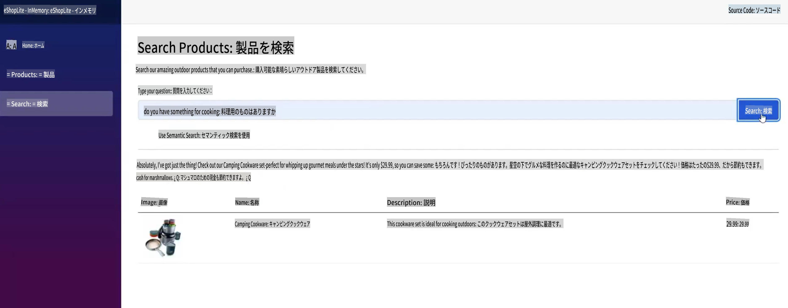
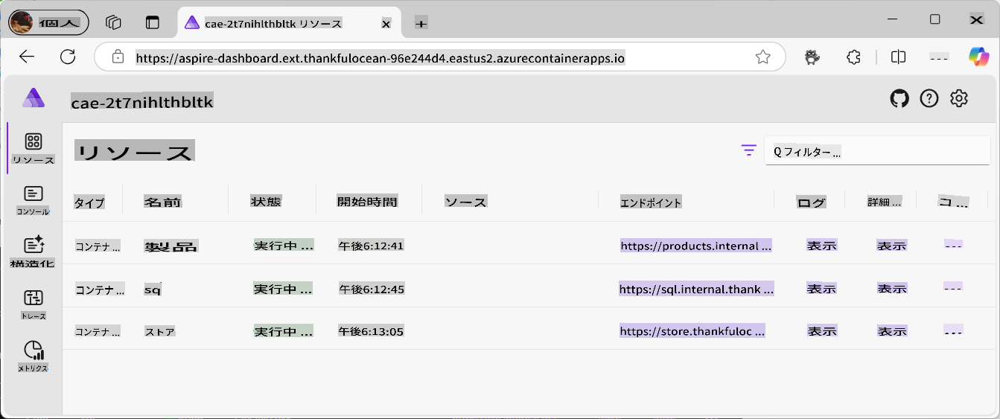
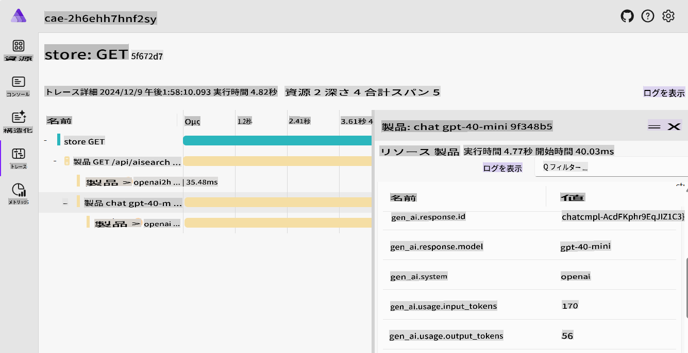
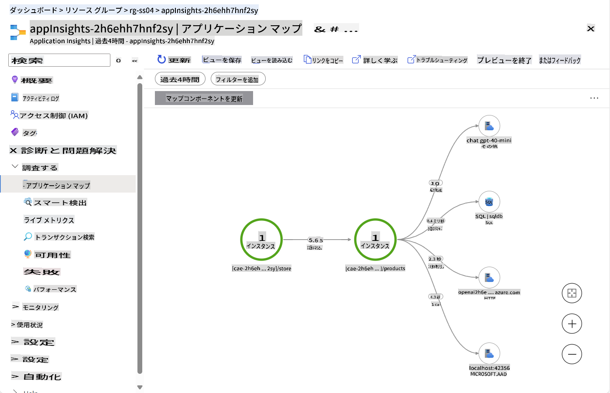
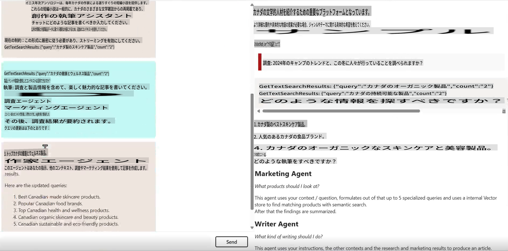
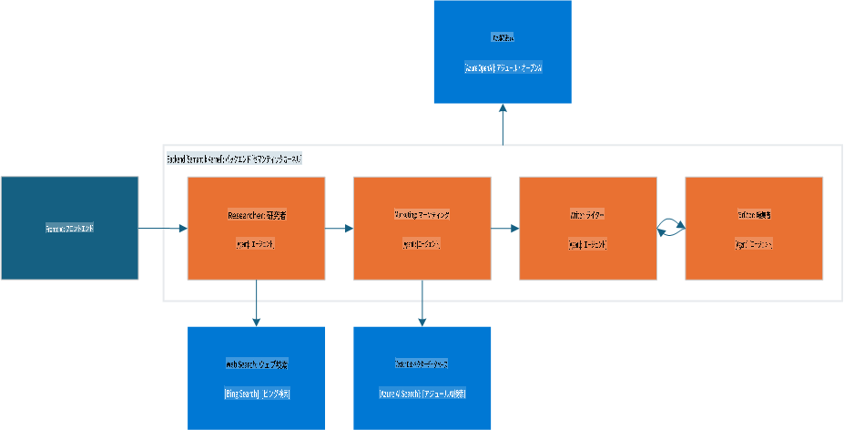
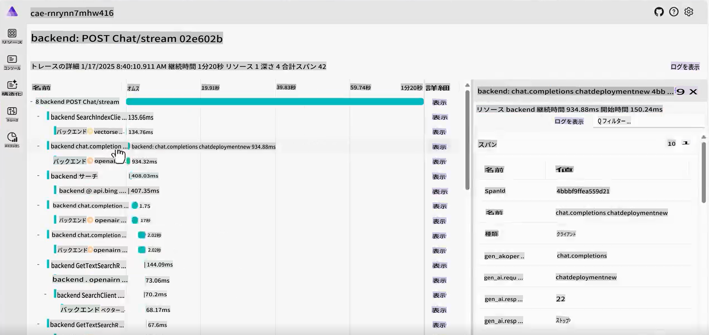
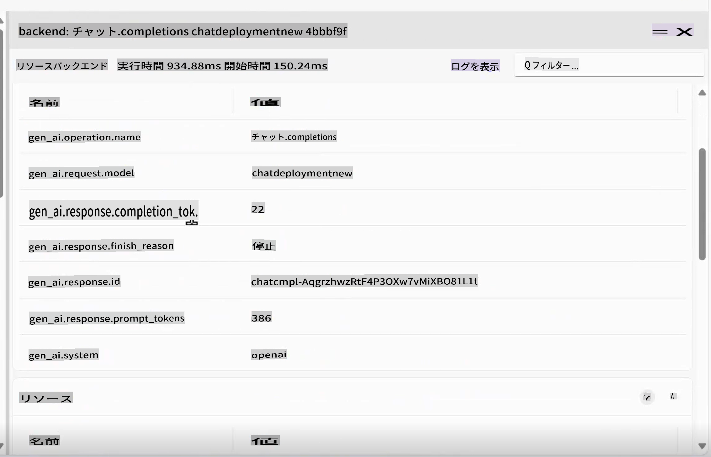

# 標準的な生成AIサンプル

学んだコンセプトを、これらの実際的で現実世界のサンプルで確認しましょう。

---

## 達成できること

- 生成 AI が既存のアプリケーションにどのように組み込まれるかを理解する。
- エージェントが複雑なシナリオでどのように機能するかを理解する。

## 含まれるサンプル
- [標準的な生成AIサンプル](../../../04-PracticalSamples)
  - [達成できること](../../../04-PracticalSamples)
  - [含まれるサンプル](../../../04-PracticalSamples)
  - [eShopLite デモ](../../../04-PracticalSamples)
    - [eShopLite のセマンティック検索 - インメモリ](../../../04-PracticalSamples)
    - [eShopLite のセマンティック検索 - Azure AI Search](../../../04-PracticalSamples)
    - [eShopLite のリアルタイム音声](../../../04-PracticalSamples)
  - [クリエイティブライターエージェント](../../../04-PracticalSamples)
  - [まとめ](../../../04-PracticalSamples)
    - [追加リソース](../../../04-PracticalSamples)
    - [次のステップ](../../../04-PracticalSamples)

[](https://youtu.be/Ky4CACXJqR8?feature=shared)

_⬆️画像をクリックして動画を見る⬆️_

## eShopLite デモ

最初のデモとして、**eShopLite** プロジェクトを見ていきます。**eShopLite** は、アウトドア用品やキャンプ愛好家向けのシンプルなeコマースアプリケーションで、検索機能の最適化、カスタマーサポート、リアルタイム音声分析など、生成AIの機能を活用しています。

これらのデモでは、[Azure OpenAI](https://azure.microsoft.com/products/ai-services/openai-service) および [Azure AI Foundry Models](https://ai.azure.com/) を使用して、アプリケーションにおける推論（生成AI部分）を行います。

最初のデモでは、セマンティック カーネルを使用して検索機能を強化する方法を示します。この機能は、ユーザーのクエリの文脈を理解し、正確な結果を提供します。

### eShopLite のセマンティック検索

[](https://youtu.be/FlkruF6USro?feature=shared)

_⬆️画像をクリックして動画を見る⬆️_

eShopLite のセマンティック検索では、セマンティック カーネルを使用してeコマースアプリケーションの検索機能を強化します。セマンティック カーネルにより、ユーザーのクエリの文脈を理解し、より正確な結果を提供できる強力な検索エンジンを作成できます。

例えば、ユーザーが「料理に使えるものはありますか」と検索した場合、検索エンジンはそのユーザーがキッチン用品を探していることを理解し、このサンプルではキャンプ用調理器具を返します。

> 🧑‍💻**サンプル**: [eShopLite セマンティック検索サンプル](https://aka.ms/netaieshoplitesemanticsearch) をチェックしてください



セマンティック検索により、ユーザーが必要な商品をより簡単に見つけられるようになり、ショッピング体験が向上し、売上が増加します。この機能を実装するには、商品データを格納するベクトルストア、検索インデックス、言語モデルが必要です。[.NET Aspire](https://learn.microsoft.com/dotnet/aspire/get-started/aspire-overview) のツールは、バックエンドでこれらのプロセスを調整するのに役立ちます。



.NET Aspire ダッシュボードでは、製品、SQL、ストアコンテナが言語モデルとどのようにやり取りするかを確認できます。Aspire アプリホストを詳しく見ると、以下のようになります：

```csharp
if (builder.ExecutionContext.IsPublishMode)
{
    // Add the Azure Application Insights for monitoring
    var appInsights = builder.AddAzureApplicationInsights("appInsights");
    // Add the Azure OpenAI for the chat and embeddings deployments, the embedding is used for the vector entities
    var chatDeploymentName = "gpt-4o-mini";
    var embeddingsDeploymentName = "text-embedding-ada-002";
    var aoai = builder.AddAzureOpenAI("openai")
        .AddDeployment(new AzureOpenAIDeployment(chatDeploymentName,
        "gpt-4o-mini",
        "2024-07-18",
        "GlobalStandard",
        10))
        .AddDeployment(new AzureOpenAIDeployment(embeddingsDeploymentName,
        "text-embedding-ada-002",
        "2"));

    products.WithReference(appInsights)
        .WithReference(aoai)
        .WithEnvironment("AI_ChatDeploymentName", chatDeploymentName)
        .WithEnvironment("AI_embeddingsDeploymentName", embeddingsDeploymentName);

    store.WithReference(appInsights)
        .WithExternalHttpEndpoints();
}
```

上記のコードは、Azure Application Insights を監視のために追加する方法、Azure OpenAI をチャットおよび埋め込みのデプロイメントに使用する方法、およびベクトルエンティティに使用する埋め込みの方法を示しています。

埋め込みおよび AOAI 作成については、以下のように製品コンテナで確認できます：

```csharp
var azureOpenAiClientName = "openai";
builder.AddAzureOpenAIClient(azureOpenAiClientName);

// get azure openai client and create Chat client from aspire hosting configuration
builder.Services.AddSingleton<ChatClient>(serviceProvider =>
{
    var chatDeploymentName = "gpt-4o-mini";
    var logger = serviceProvider.GetService<ILogger<Program>>()!;
    logger.LogInformation($"Chat client configuration, modelId: {chatDeploymentName}");
    ChatClient chatClient = null;
    try
    {
        OpenAIClient client = serviceProvider.GetRequiredService<OpenAIClient>();
        chatClient = client.GetChatClient(chatDeploymentName);
    }...
}
```

上記のコードは、Azure OpenAI クライアントを取得し、Aspire ホスティング構成からチャットクライアントを作成する方法を示しています。`chatDeploymentName` はアプリケーションで使用されるデプロイメントの名前です。同じプロセスを使用して埋め込みクライアントを作成します：

```csharp
// get azure openai client and create embedding client from aspire hosting configuration
builder.Services.AddSingleton<EmbeddingClient>(serviceProvider =>
{
    var embeddingsDeploymentName = "text-embedding-ada-002";
    var logger = serviceProvider.GetService<ILogger<Program>>()!;
    logger.LogInformation($"Embeddings client configuration, modelId: {embeddingsDeploymentName}");
    EmbeddingClient embeddingsClient = null;
    try
    {
        OpenAIClient client = serviceProvider.GetRequiredService<OpenAIClient>();
        embeddingsClient = client.GetEmbeddingClient(embeddingsDeploymentName);
    }...
});
```

これにより、`MemoryContext` を作成し、ユーザーのクエリと比較して最も関連性の高い商品を返すことができます：

```csharp
// Iterate over the products and add them to the memory
_logger.LogInformation("Adding product to memory: {Product}", product.Name);
var productInfo = $"[{product.Name}] is a product that costs [{product.Price}] and is described as [{product.Description}]";

// Create a new product vector
var productVector = new ProductVector
{
    Id = product.Id,
    Name = product.Name,
    Description = product.Description,
    Price = product.Price,
    ImageUrl = product.ImageUrl
};

// Generate the embedding for the product information
var result = await _embeddingClient.GenerateEmbeddingAsync(productInfo);

// Convert the embedding result to a float array and assign it to the product vector
productVector.Vector = result.Value.ToFloats();
var recordId = await _productsCollection.UpsertAsync(productVector);
_logger.LogInformation("Product added to memory: {Product} with recordId: {RecordId}", product.Name, recordId);
```

上記のコードは、製品を反復処理し、それをメモリに追加する方法を示しています。

新しい製品ベクトルを作成した後、それを使用して製品情報の埋め込みを生成し、埋め込み結果をフロート配列に変換して製品ベクトルに割り当てます。

`_productsCollection` は、製品が保存されているコンテナへの参照であり、CosmosDB 呼び出しを使用して recordId に応じた応答を取得します（この場合はログ記録用）。

その後、製品がメモリに追加され、コレクション内の各製品についてこのプロセスが繰り返されます。

その後、ユーザーが製品を検索すると、ユーザーのクエリと製品ベクトルを比較し、最も関連性の高い製品を返すことができます。

```csharp
try
{
    // Generate embedding for the search query
    var result = await _embeddingClient.GenerateEmbeddingAsync(search);
    var vectorSearchQuery = result.Value.ToFloats();

    var searchOptions = new VectorSearchOptions()
    {
        Top = 1, // Retrieve the top 1 result
        VectorPropertyName = "Vector"
    };

    // Search the vector database for the most similar product
    var searchResults = await _productsCollection.VectorizedSearchAsync(vectorSearchQuery, searchOptions);
    double searchScore = 0.0;
    await foreach (var searchItem in searchResults.Results)
    {
        if (searchItem.Score > 0.5)
        {
            // Product found, retrieve the product details
            firstProduct = new Product
            {
                Id = searchItem.Record.Id,
                Name = searchItem.Record.Name,
                Description = searchItem.Record.Description,
                Price = searchItem.Record.Price,
                ImageUrl = searchItem.Record.ImageUrl
            };

            searchScore = searchItem.Score.Value;
            responseText = $"The product [{firstProduct.Name}] fits with the search criteria [{search}][{searchItem.Score.Value.ToString("0.00")}]";
            _logger.LogInformation($"Search Response: {responseText}");
        }
    }

    // Generate a friendly response message using the found product information
    var prompt = @$"You are an intelligent assistant helping clients with their search about outdoor products. Generate a catchy and friendly message using the following information:
    - User Question: {search}
    - Found Product Name: {firstProduct.Name}
    - Found Product Description: {firstProduct.Description}
    - Found Product Price: {firstProduct.Price}
    Include the found product information in the response to the user question.";

    var messages = new List<ChatMessage>
    {
        new SystemChatMessage(_systemPrompt),
        new UserChatMessage(prompt)
    };

    _logger.LogInformation("{ChatHistory}", JsonConvert.SerializeObject(messages));

    var resultPrompt = await _chatClient.CompleteChatAsync(messages);
}
```

上記のコードにより、検索クエリの埋め込みを生成し、ベクトルデータベースで最も類似した製品を検索し、見つかった製品情報を使用して応答メッセージを取得します。

これにより、ユーザーが必要な商品をより簡単に見つけられるようになり、ショッピング体験が向上し、売上が増加します。

さらに、生成AIが進化する中で、ユーザーの行動を理解し検索エンジンを改善するために、テレメトリーとモニタリングが必要です。ここで Azure Application Insights と .NET Aspire が役立ちます。



.NET Aspire は、検索エンジン、バックエンドサービス、AIモデルとのユーザーのやり取りを含むアプリケーションの動作を監視および追跡するための強力なツールセットを提供します。トレース機能は、ボトルネックやエラー、パフォーマンスの問題を特定し、アプリケーションを最適化してより良いユーザー体験を提供するのに役立ちます。



テレメトリーは、ユーザーの行動を理解し、サービスを改善するために不可欠です。Azure Application Insights を導入して、アプリケーションのパフォーマンスとユーザーのやり取りを監視します。

Application Insights は包括的なテレメトリーデータを提供し、サービスのパフォーマンスやユーザーがアプリケーションとどのようにやり取りしているか、クラウドの利用状況を把握するのに役立ちます。

画像では、Application Insights ダッシュボードが表示され、データベースへの呼び出し、リクエスト数、応答時間など、サービスのパフォーマンスが確認できます。

> 💡 **プロのヒント**: eShopLite のセマンティック検索について詳しくは、リポジトリをご覧ください: https://aka.ms/netaieshoplitesemanticsearch

### eShopLite のセマンティック検索 - Azure AI Search を使用

eShopLite のエンドツーエンドデモでは、**Azure AI Search** を使用して eコマースアプリケーションの検索機能を強化します。Azure AI Search は、ユーザーのクエリの文脈を理解し、より正確な結果を提供する強力な検索エンジンを作成するのに役立ちます。

また、大量のデータやユーザーのクエリを処理できる、よりスケーラブルで信頼性の高い検索エンジンも提供します。Azure AI Search により、検索インデックスを永続化できるため、アプリケーションが再起動しても情報が利用可能です。

- [eShopLite with Azure AI Search](https://aka.ms/netaieshoplitesemanticsearchazureaisearch)

### eShopLite のリアルタイム音声

[](https://youtu.be/bx0hRNdr_bQ?feature=shared)

_⬆️画像をクリックして動画を見る⬆️_

eShopLite のリアルタイム音声では、GPT-4o のリアルタイム音声機能を使用して、顧客とチャットボットの会話を分析し、よりパーソナライズされた魅力的な体験を提供します。例えば、顧客が製品の推奨を求めた場合、チャットボットは顧客のリクエストをリアルタイムで分析し、より正確で関連性の高い応答を提供します。

> 🧑‍💻**サンプル**: [eShopLite リアルタイムチャットサンプル](https://aka.ms/netaieshopliterealtimechat) をチェックしてください


この機能を実装するには、リアルタイム分析のエンドポイントを作成するための新しい機能を実装する必要があります。この実装は `StoreRealtime\ConversationManager.cs` にあります。

```csharp
public async Task RunAsync(
    Stream audioInput, 
    Speaker audioOutput, 
    Func<string, Task> addMessageAsync, 
    Func<string, bool, Task> addChatMessageAsync, 
    CancellationToken cancellationToken)
{
    // Define the initial prompt for the assistant
    var prompt = $"""
        You are a useful assistant.
        Respond as succinctly as possible, in just a few words.
        Check the product database and external sources for information.
        The current date is {DateTime.Now.ToLongDateString()}
        """;
```

まず、アシスタントの初期プロンプトを定義し、ユーザーにチャットボットとのやり取り方法を指示します。プロンプトは明確で簡潔であることが重要です。プロンプトエンジニアリングは、AIモデルから正確な結果を得るために不可欠です。

```csharp
// Notify the user that the connection is being established
await addMessageAsync("Connecting...");

// Send an initial greeting message
await addChatMessageAsync("Hello, how can I help?", false);

// Create AI functions for semantic search and product name search
var contosoSemanticSearchTool = AIFunctionFactory.Create(_contosoProductContext.SemanticSearchOutdoorProductsAsync);
var contosoSearchByProductNameTool = AIFunctionFactory.Create(_contosoProductContext.SearchOutdoorProductsByNameAsync);

// Add the AI functions to a list of tools
List<AIFunction> tools = new List<AIFunction> { contosoSemanticSearchTool, contosoSearchByProductNameTool };
```

次に、チャットの準備が整ったことをユーザーに通知し、初期の挨拶メッセージを送信します。その後、製品検索、セマンティック検索、製品名による検索のためのAI機能が作成され、ツールのリストに追加されます。これにより、ユーザーのクエリに関連する情報を提供できます。

```csharp
// Configure the conversation session options
var sessionOptions = new ConversationSessionOptions()
{
    Instructions = prompt,
    Voice = ConversationVoice.Shimmer,
    InputTranscriptionOptions = new() { Model = "whisper-1" },
};

// Add each tool to the session options
foreach (var tool in tools)
{
    sessionOptions.Tools.Add(tool.ToConversationFunctionTool());
}

// Start the conversation session with the configured options
session = await client.StartConversationSessionAsync(cancellationToken);
await session.ConfigureSessionAsync(sessionOptions);

// Initialize a StringBuilder to store the output transcription
var outputTranscription = new StringBuilder();
```

会話セッションのオプションが構成され、指示、音声、および入力のトランスクリプションオプションが含まれます。入力のトランスクリプションには `Whisper-1` モデルを使用します。

各ツールがセッションオプションに追加され、構成されたオプションで会話セッションが開始されます。これらはユーザーのニーズに合わせて変更可能です。

> 🧑‍💻**サンプル**: [eShopLite リアルタイムチャットサンプル](https://aka.ms/netaieshopliterealtimechat) をチェックしてください

## クリエイティブライターエージェント

[](https://youtu.be/ZjZWilI_5z8?feature=shared)

_⬆️画像をクリックして動画を見る⬆️_

エージェントは現在のAI分野で重要なトピックです。その能力を示すために、ユーザーの入力に基づいて創造的で魅力的な文章を生成し、調査された具体的で魅力的なコンテンツを書くのを助けるツールであるクリエイティブライターエージェントを使用します。

> 🧑‍💻**サンプル**: [クリエイティブライターエージェントサンプルコード](https://aka.ms/netaicreativewriter) をチェックしてください



このソリューションは、高品質なコンテンツを生成するために組み合わされた4つの専用モジュールを中心に展開されています：

- **Researcher**: Bing 検索を活用して文脈、トピック、データを収集し、それを簡潔に要約。
- **Marketing**: ユーザーの意図を解釈し、関連する質問を構築し、正確な結果を得るために Vector DB を活用。
- **Writer**: Researcher と Marketing からの知見を統合し、記事の一貫性ある執筆を生成。
- **Editor**: ドラフトを評価し、修正を提案し、公開準備が整っているかを判断。

このワークフローは、関連データ、効果的なメッセージング、レビューを統合し、セマンティック カーネル、Microsoft AI Extension、および .NET Aspire によってオーケストレーションされています。



コンポーネントがどのように相互作用するかを理解することは、自分自身のエージェントアプリケーションを作成するための参考になります。以下のコードを見て、コンポーネント間の相互作用を理解してください。まず、Creative Writer への `ChatController.cs` 呼び出しを見てみましょう：

```csharp
var userInput = request.Messages.Last();

// Deserialize the user input content into a CreateWriterRequest object
CreateWriterRequest createWriterRequest = _yamlDeserializer.Deserialize<CreateWriterRequest>(userInput.Content);

// Create a new session for the Creative Writer application
var session = await _creativeWriterApp.CreateSessionAsync(Response);

// Process the streaming request and write the response in real-time
await foreach (var delta in session.ProcessStreamingRequest(createWriterRequest))
{
    // Serialize the delta and write it to the response stream and flush
    await response.WriteAsync($"{JsonSerializer.Serialize(delta)}\r\n");
    await response.Body.FlushAsync();
}
```

`CreateWriterRequest` needs to have three properties: `Research`, `Products`, and `Writing`. After getting them setted by processing the request, it calls the `CreateSessionAsync` メソッドの内容は以下の通りです：

```csharp
internal async Task<CreativeWriterSession> CreateSessionAsync(HttpResponse response)
{
    // Add custom function invocation filters to handle response modifications
    defaultKernel.FunctionInvocationFilters.Add(new FunctionInvocationFilter(response));

    // Create a separate kernel for Bing search integration and intialize the Bing service, and create a plugin for Bing search
    Kernel bingKernel = defaultKernel.Clone();
    BingTextSearch textSearch = new(apiKey: configuration["BingAPIKey"]!);
    KernelPlugin searchPlugin = textSearch.CreateWithSearch("BingSearchPlugin");
    bingKernel.Plugins.Add(searchPlugin);

    // Clone the default kernel to set up the vector search capabilities, and create the vector search kernel
    Kernel vectorSearchKernel = defaultKernel.Clone();
    await ConfigureVectorSearchKernel(vectorSearchKernel);

    // Return a new session encapsulating all configured kernels for comprehensive AI functionalities
    return new CreativeWriterSession(defaultKernel, bingKernel, vectorSearchKernel);
}
```

次に、`CreativeWriterSession` class for the `ProcessStreamingRequest` function, to understand how the components interact with each other, first look at the `Research` and `Marketing` コンポーネントを確認します：

```csharp
// Initialize the Researcher Agent with a specific prompt template.
// This agent leverages the Bing Kernel for enhanced semantic search capabilities.
ChatCompletionAgent researcherAgent = new(ReadFileForPromptTemplateConfig("./Agents/Prompts/researcher.yaml"))
{
    Name = ResearcherName,
    Kernel = bingKernel,
    Arguments = CreateFunctionChoiceAutoBehavior(),
    LoggerFactory = bingKernel.LoggerFactory
};

// Initialize the Marketing Agent with its own prompt template.
// This agent utilizes the Vector Search Kernel to handle product-related queries efficiently.
ChatCompletionAgent marketingAgent = new(ReadFileForPromptTemplateConfig("./Agents/Prompts/marketing.yaml"))
{
    Name = MarketingName,
    Kernel = vectorSearchKernel,
    Arguments = CreateFunctionChoiceAutoBehavior(),
    LoggerFactory = vectorSearchKernel.LoggerFactory
};

// ...

// Invoke the Researcher Agent asynchronously with the provided research context.
await foreach (ChatMessageContent response in researcherAgent.InvokeAsync(
    new object[] { }, 
    new Dictionary<string, string> { { "research_context", createWriterRequest.Research } }))
{
    // Aggregate the research results for further processing or display.
    sbResearchResults.AppendLine(response.Content);
    
    yield return new AIChatCompletionDelta(Delta: new AIChatMessageDelta
    {
        Role = AIChatRole.Assistant,
        Context = new AIChatAgentInfo(ResearcherName),
        Content = response.Content,
    });
}

// ...

// Invoke the Marketing Agent with the provided product context.
await foreach (ChatMessageContent response in marketingAgent.InvokeAsync(
    new object[] { },
    new Dictionary<string, string> { { "product_context", createWriterRequest.Products } }))
{
    // Consolidate the product-related results for use in marketing strategies or user feedback.
    sbProductResults.AppendLine(response.Content);
    
    yield return new AIChatCompletionDelta(Delta: new AIChatMessageDelta
    {
        Role = AIChatRole.Assistant,
        Context = new AIChatAgentInfo(MarketingName),
        Content = response.Content,
    });
}
```

最後に、`Writer` and `Editor` エージェントを初期化および構成します。コードは以下の通りです：

```csharp
// Initialize the Writer Agent with its specific prompt configuration
ChatCompletionAgent writerAgent = new(ReadFileForPromptTemplateConfig("./Agents/Prompts/writer.yaml"))
{
    Name = WriterName, 
    Kernel = kernel, /
    Arguments = new Dictionary<string, string>(), 
    LoggerFactory = kernel.LoggerFactory 
};

// Initialize the Editor Agent with its specific prompt configuration
ChatCompletionAgent editorAgent = new(ReadFileForPromptTemplateConfig("./Agents/Prompts/editor.yaml"))
{
    Name = EditorName, 
    Kernel = kernel, 
    LoggerFactory = kernel.LoggerFactory
};

// Populate the Writer Agent with contextual data required for generating content, gathered from the User, Researcher and Marketing Agents
writerAgent.Arguments["research_context"] = createWriterRequest.Research;
writerAgent.Arguments["research_results"] = sbResearchResults.ToString();
writerAgent.Arguments["product_context"] = createWriterRequest.Products;
writerAgent.Arguments["product_results"] = sbProductResults.ToString();
writerAgent.Arguments["assignment"] = createWriterRequest.Writing;

// Configure the Agent Group Chat to manage interactions between Writer and Editor
AgentGroupChat chat = new(writerAgent, editorAgent)
{
    LoggerFactory = kernel.LoggerFactory,
    ExecutionSettings = new AgentGroupChatSettings
    {
        // Define the strategy for selecting which agent interacts next
        SelectionStrategy = new SequentialSelectionStrategy() 
        { 
            InitialAgent = writerAgent // Start the conversation with the Writer Agent
        },
        // Define the termination condition for the agent interactions, in this case, the Editor Agent will terminate the conversation
        TerminationStrategy = new NoFeedbackLeftTerminationStrategy()
    }
};
```

.NET Aspire では、コンポーネントがどのようにオーケストレーションされ、ユーザーにシームレスな体験を提供しているかがわかります。トレース機能により、エージェント間のやり取りを監視し、テレメトリー機能により、ユーザーの行動やAIモデルのパフォーマンスに関する洞察を得ることができます。




> 🧑‍💻**サンプル**: [Creative Writing Agent のサンプルコード](https://aka.ms/netaicreativewriter)をご覧ください。

## 概要

これらは、アプリケーション内で 生成 AI を活用する方法のほんの一例に過ぎません。可能性は無限大で、技術は急速に進化しています。生成 AI についてさらに学び、プロジェクトに活用する方法を知るために、いくつかのリソースをご覧ください。

> 🙋 **サポートが必要ですか？**: 問題が発生した場合は、リポジトリで Issue を作成してください。

### 追加リソース

- [eShopLite with DeepSeek](https://aka.ms/netaieshoplitedeepseekr1)
- [eShopLite with Azure AI Search](https://aka.ms/netaieshoplitesemanticsearchazureaisearch)

### 次のステップ

責任ある AI の実践方法を学び、AI モデルが倫理的であり、ポジティブな影響を与えることを確保しましょう！

👉 [責任ある AI](../05-ResponsibleGenAI/readme.md)

**免責事項**:  
この文書は、機械翻訳AIサービスを使用して翻訳されています。正確性を追求しておりますが、自動翻訳には誤りや不正確さが含まれる場合があります。原文（元の言語の文書）が公式な情報源として優先されるべきです。重要な情報については、専門の人間による翻訳を推奨します。本翻訳の使用に起因する誤解や誤った解釈について、当方は一切の責任を負いません。
