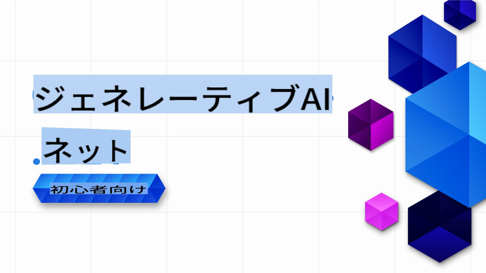

# 初心者向け 生成 AI .NET コース

### .NET で 生成 AI アプリケーションを構築するための実践的なレッスン

  
  
  
  
  

  
  
  

  

**初心者向け 生成 AI .NET** へようこそ！.NET 開発者が 生成 AI の世界に飛び込むための実践的なコースです！

このコースは単なる「理論を教えて終わり」のようなものではありません。このリポジトリは **実際のアプリケーション** と **ライブコーディング** に焦点を当て、.NET 開発者が 生成 AI を最大限に活用できるようサポートします。

このコースは **ハンズオン形式**、**実践的**、そして **楽しい** を目指しています！

ぜひこのリポジトリを [スター (🌟) する](https://docs.github.com/en/get-started/exploring-projects-on-github/saving-repositories-with-stars) ことで、後で簡単に見つけられるようにしておいてください。

➡️ [リポジトリをフォークする](https://github.com/microsoft/Generative-AI-for-beginners-dotnet/fork) ことで、自分のリポジトリにコピーを作成してください。

## 🚀 はじめに

生成 AI はソフトウェア開発を変革しており、.NET も例外ではありません。このコースでは以下の内容をシンプルに学べます：

- 各レッスンごとの 5～10 分の短い動画。
- 実行可能な .NET のコードサンプル。
- **GitHub Codespaces** や **GitHub Models** などのツールとの統合により、簡単にセットアップしてすぐにコーディングを始められる環境。ローカルでモデルを使用してサンプルを実行することも可能です。

基本的なテキスト生成から **GitHub Models**、**Azure OpenAI Services**、**Ollama を使ったローカルモデル** まで、.NET プロジェクトに 生成 AI を実装する方法を学びます。

## 📦 各レッスンの内容

- **短い動画**：レッスンの概要を 5～10 分で説明。
- **完全なコードサンプル**：実行可能で、そのまま使えるサンプル。
- **ステップバイステップのガイド**：コンセプトを学び、実装するためのシンプルな指示。
- **詳細リファレンス**：このコースは 生成 AI の実践的な実装に焦点を当てていますが、理論的な背景について詳しく知りたい場合は [Generative AI for Beginners - A Course](https://github.com/microsoft/generative-ai-for-beginners) のリンクも提供しています。

## 🗃️ レッスン一覧

| #   | **レッスンリンク** | **説明** |
| --- | --- | --- |
| 01  | [**.NET 開発者向け 生成 AI の基礎**](./01-IntroToGenAI/readme.md) | <ul><li>生成モデルの概要と .NET における応用</li></ul> |
| 02  | [**生成 AI のための .NET 開発環境のセットアップ**](./02-SetupDevEnvironment/readme.md) | <ul><li>**Microsoft.Extensions.AI** や **セマンティック カーネル** などのライブラリの利用。</li><li>GitHub Models、Azure AI Foundry、Ollama などのプロバイダーのセットアップ。</li></ul> |
| 03  | [**.NET を使った 生成 AI のコア技術**](./03-CoreGenerativeAITechniques/readme.md) | <ul><li>テキスト生成と会話フロー。</li><li>マルチモーダル機能（ビジョンと音声）。</li><li>エージェント。</li></ul> |
| 04  | [**実践的な .NET 生成 AI サンプル**](./04-PracticalSamples/readme.md) | <ul><li>実際のシナリオでの 生成 AI を示す完全なサンプル。</li><li>セマンティック検索アプリケーション。</li><li>複数エージェントアプリケーション。</li></ul> |
| 05  | [**.NET アプリにおける 生成 AI の責任ある利用**](./05-ResponsibleGenAI/readme.md) | <ul><li>倫理的考慮、バイアスの軽減、安全な実装。</li></ul> |

## 🌐 多言語サポート

| 言語                 | コード | 翻訳された README へのリンク                            | 最終更新日 |
|----------------------|------|-----------------------------------------------------|------------|
| 中国語 (簡体字)      | zh   | [中国語翻訳](../zh/README.md)           | 2025-02-19 |
| 中国語 (繁体字)      | tw   | [中国語翻訳](../tw/README.md)           | 2025-02-19 |
| フランス語           | fr   | [フランス語翻訳](../fr/README.md)       | 2025-02-19 |
| 日本語               | ja   | [日本語翻訳](./README.md)           | 2025-02-19 |
| 韓国語               | ko   | [韓国語翻訳](../ko/README.md)           | 2025-02-19 |
| ポルトガル語         | pt   | [ポルトガル語翻訳](../pt/README.md)     | 2025-02-19 |
| スペイン語           | es   | [スペイン語翻訳](../es/README.md)       | 2025-02-19 |
| ドイツ語             | de   | [ドイツ語翻訳](../de/README.md)         | 2025-02-19 |

## 🛠️ 必要なもの

始めるために必要なものは以下の通りです：

1. **GitHub アカウント**（無料アカウントで十分です）。このリポジトリを [フォーク](https://github.com/microsoft/generative-ai-for-beginners-dotnet/fork) して自分の GitHub アカウントにコピーを作成してください。

1. コーディング環境をすぐに利用可能にする **GitHub Codespaces** を有効化してください。リポジトリの設定で GitHub Codespaces を有効化できます。GitHub Codespaces について詳しくは [こちら](https://docs.github.com/en/codespaces) を参照してください。

1. [リポジトリをフォーク](https://github.com/microsoft/generative-ai-for-beginners-dotnet/fork) するか、このページ上部の `Fork` ボタンを使ってコピーを作成してください。

1. **.NET 開発** の基本的な理解。詳細は [こちら](https://dotnet.microsoft.com/learn/dotnet/what-is-dotnet) を参照してください。

以上で準備完了です。

このコースは可能な限り簡単に始められるように設計されています。以下の機能を活用して、すぐに学習を始められます：

- **GitHub Codespaces で実行**：ワンクリックで事前設定済みの環境が利用可能になり、レッスンをテストして探索できます。
- **GitHubモデルを活用する**: このリポジトリ内でホストされているAI駆動のデモを試してみてください。詳細はレッスンの中で順を追って説明します。  
  *(GitHubモデルについてもっと知りたい場合は、[こちら](https://docs.github.com/github-models)をクリックしてください)*

準備が整ったら、次のような拡張ガイドも用意しています:

- **Azure OpenAI Services**へのアップグレード：スケーラブルでエンタープライズ向けのソリューションを提供します。
- **Ollama**を使用して、ローカルハードウェア上でモデルを実行し、プライバシーと制御を強化します。

## 🤝 協力したいですか？

コントリビューションは大歓迎です！以下の方法で協力できます:

- [リポジトリの問題やバグを報告する](https://github.com/microsoft/Generative-AI-for-beginners-dotnet/issues/new)

- 既存のコードサンプルを改善したり、新しいコードサンプルを追加する。リポジトリをフォークして変更を提案してください！
- 追加のレッスンや改善案を提案する。
- 提案やスペルミス、コードエラーを見つけた場合は、[プルリクエストを作成する](https://github.com/microsoft/Generative-AI-for-beginners-dotnet/compare)

詳細については、[CONTRIBUTING.md](CONTRIBUTING.md) ファイルをご確認ください。

## 📄 ライセンス

このプロジェクトはMITライセンスの下で提供されています。詳細は[LICENSE](../../LICENSE)ファイルをご覧ください。

## 🌐 その他のコース

学習をサポートするための多くのコンテンツを用意しています。ぜひチェックしてください:

- [Generative AI for Beginners](https://aka.ms/genai-beginners)
- [Generative AI for Beginners .NET](https://github.com/microsoft/Generative-AI-for-beginners-dotnet)
- [Generative AI with JavaScript](https://github.com/microsoft/generative-ai-with-javascript)
- [AI for Beginners](https://aka.ms/ai-beginners)
- [AI Agents for Beginners - A Course](https://github.com/microsoft/ai-agents-for-beginners)
- [Data Science for Beginners](https://aka.ms/datascience-beginners)
- [ML for Beginners](https://aka.ms/ml-beginners)
- [Cybersecurity for Beginners](https://github.com/microsoft/Security-101) 
- [Web Dev for Beginners](https://aka.ms/webdev-beginners)
- [IoT for Beginners](https://aka.ms/iot-beginners)
- [XR Development for Beginners](https://github.com/microsoft/xr-development-for-beginners)
- [Mastering GitHub Copilot for Paired Programming](https://github.com/microsoft/Mastering-GitHub-Copilot-for-Paired-Programming)
- [Mastering GitHub Copilot for C#/.NET Developers](https://github.com/microsoft/mastering-github-copilot-for-dotnet-csharp-developers)
- [Choose Your Own Copilot Adventure](https://github.com/microsoft/CopilotAdventures)

[生成 AI と.NET の学習を始めましょう！](02-SetupDevEnvironment/readme.md) 🚀

**免責事項**:  
本書類は、機械翻訳AIサービスを使用して翻訳されています。正確性を追求しておりますが、自動翻訳には誤りや不正確な表現が含まれる場合があります。原文（原言語で記載された文書）を公式な情報源としてご参照ください。重要な情報については、専門の人間による翻訳を推奨いたします。本翻訳の利用に起因する誤解や解釈の相違について、当方は一切の責任を負いかねます。
