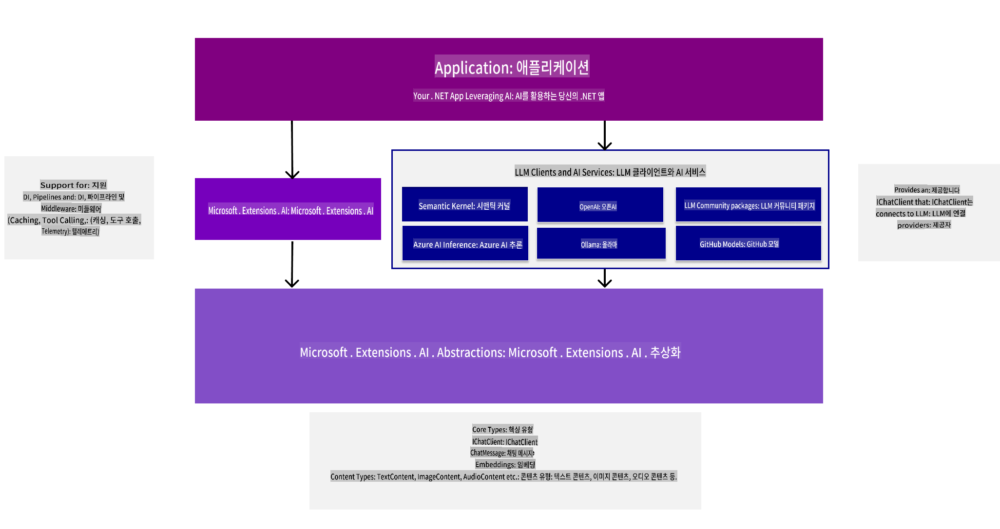
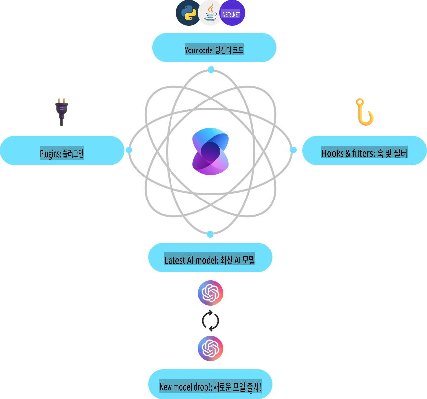
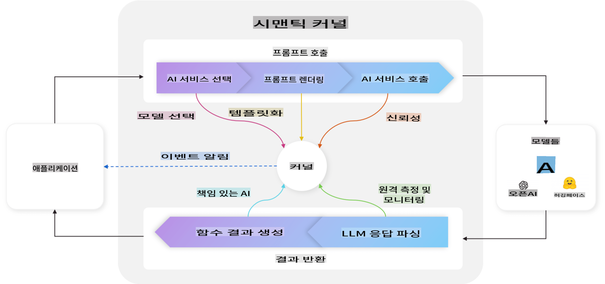
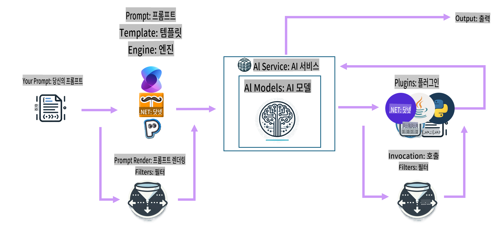

# AI 개발 도구 시작하기

생성형 AI에 대한 지식을 새롭게 하고, 생성형 AI 애플리케이션을 개발하는 데 도움을 주는 .NET 도구를 이해해보세요.

---

[](http://www.youtube.com/watch?v=SZvE_meBdvg)

_⬆️이미지를 클릭하여 동영상을 시청하세요⬆️_

## 이 강의에서 배우게 될 내용:

- 🌟 생성형 AI의 기본 개념과 그 활용 방법 이해하기
- 🔍 MEAI, Semantic Kernel, Azure OpenAI 등 .NET AI 개발 도구 탐구하기

## .NET을 위한 생성형 AI 기초

코드를 다루기 전에, 잠시 시간을 내어 생성형 AI(GenAI)의 개념을 복습해봅시다. 이번 강의인 **.NET을 위한 생성형 AI 기초**에서는 중요한 GenAI 개념을 복습하여 특정 작업들이 왜 그렇게 수행되는지 이해할 수 있도록 돕습니다. 또한, **MEAI**(Microsoft.Extensions.AI), **Semantic Kernel**, **VS Code용 AI Toolkit Extension**과 같은 앱 개발에 사용할 도구와 SDK를 소개합니다.

### 생성형 AI 개념 빠르게 복습하기

생성형 AI는 텍스트, 이미지, 코드와 같은 새로운 콘텐츠를 데이터에서 학습한 패턴과 관계를 기반으로 생성하는 인공지능의 한 유형입니다. 생성형 AI 모델은 사람과 유사한 응답을 생성하고, 맥락을 이해하며, 때로는 사람과 유사한 콘텐츠를 생성할 수도 있습니다.

.NET AI 애플리케이션을 개발할 때, **생성형 AI 모델**을 활용하여 콘텐츠를 생성하게 됩니다. 생성형 AI 모델의 주요 기능은 다음과 같습니다:

- **텍스트 생성**: 챗봇, 콘텐츠 생성, 텍스트 완성을 위한 사람과 유사한 텍스트 작성.
- **이미지 생성 및 분석**: 사실적인 이미지 생성, 사진 개선, 객체 감지.
- **코드 생성**: 코드 스니펫 또는 스크립트 작성.

특정 작업에 최적화된 다양한 유형의 모델이 있습니다. 예를 들어, **소형 언어 모델(SLM)**은 텍스트 생성에 적합하고, **대형 언어 모델(LLM)**은 코드 생성이나 이미지 분석과 같은 복잡한 작업에 더 적합합니다. 그리고 Microsoft, OpenAI, Anthropic과 같은 다양한 기업과 그룹에서 모델을 개발합니다. 사용하는 모델은 사용 사례와 필요한 기능에 따라 달라집니다.

물론, 이러한 모델의 응답이 항상 완벽하지는 않습니다. 모델이 "환각"을 일으키거나 권위적으로 보이는 잘못된 정보를 생성하는 경우에 대해 들어보셨을 겁니다. 하지만 명확한 지침과 맥락을 제공함으로써 모델이 더 나은 응답을 생성하도록 도울 수 있습니다. 이때 **프롬프트 엔지니어링**이 중요한 역할을 합니다.

#### 프롬프트 엔지니어링 복습

프롬프트 엔지니어링은 AI 모델이 원하는 결과를 생성하도록 효과적인 입력을 설계하는 실습입니다. 여기에는 다음이 포함됩니다:

- **명확성**: 지침을 명확하고 모호하지 않게 만들기.
- **맥락**: 필요한 배경 정보를 제공하기.
- **제약 조건**: 제한 사항이나 형식을 명시하기.

프롬프트 엔지니어링의 몇 가지 모범 사례로는 프롬프트 설계, 명확한 지침 제공, 작업 분해, 원샷 및 소수샷 학습, 프롬프트 튜닝 등이 있습니다. 또한, 특정 사용 사례에 가장 적합한 프롬프트를 찾기 위해 다양한 프롬프트를 시도하고 테스트하는 것이 중요합니다.

애플리케이션을 개발할 때 사용하는 프롬프트의 유형도 다양합니다. 예를 들어, 모델 응답의 기본 규칙과 맥락을 설정하는 **시스템 프롬프트**를 설정하게 됩니다. 애플리케이션 사용자가 모델에 제공하는 데이터는 **사용자 프롬프트**로 알려져 있습니다. 그리고 **도우미 프롬프트**는 시스템 및 사용자 프롬프트를 기반으로 모델이 생성하는 응답입니다.

> 🧑‍🏫 **더 알아보기**: [초보자를 위한 생성형 AI 강의의 프롬프트 엔지니어링 챕터](https://github.com/microsoft/generative-ai-for-beginners/tree/main/04-prompt-engineering-fundamentals)에서 프롬프트 엔지니어링에 대해 더 알아보세요.

#### 토큰, 임베딩, 에이전트 - 간단히 살펴보기

생성형 AI 모델을 다룰 때 **토큰**, **임베딩**, **에이전트**와 같은 용어를 접하게 됩니다. 간단히 살펴보겠습니다:

- **토큰**: 토큰은 모델에서 텍스트를 표현하는 가장 작은 단위입니다. 단어, 문자, 또는 서브워드일 수 있습니다. 토큰은 모델이 텍스트 데이터를 이해할 수 있는 형식으로 표현합니다.
- **임베딩**: 임베딩은 토큰의 벡터 표현입니다. 단어와 구의 의미를 캡처하여 모델이 단어 간의 관계를 이해하고 맥락적으로 관련성 있는 응답을 생성할 수 있게 합니다.
- **벡터 데이터베이스**: 벡터 데이터베이스는 임베딩을 저장하는 컬렉션으로, 텍스트 데이터를 비교하고 분석하는 데 사용됩니다. 이를 통해 모델이 입력 데이터의 맥락에 기반하여 응답을 생성할 수 있습니다.
- **에이전트**: 에이전트는 모델과 상호작용하여 응답을 생성하는 AI 구성 요소입니다. 챗봇, 가상 비서, 또는 생성형 AI 모델을 활용하여 콘텐츠를 생성하는 애플리케이션 등이 포함됩니다.

.NET AI 애플리케이션을 개발할 때, 토큰, 임베딩, 에이전트를 사용하여 챗봇, 콘텐츠 생성기, 기타 AI 기반 애플리케이션을 만들게 됩니다. 이러한 개념을 이해하면 더 효과적이고 효율적인 AI 애플리케이션을 구축할 수 있습니다.

### .NET을 위한 AI 개발 도구 및 라이브러리

.NET은 AI 개발을 위한 다양한 도구를 제공합니다. 사용 가능한 도구와 라이브러리를 살펴보겠습니다.

#### Microsoft.Extensions.AI (MEAI)

Microsoft.Extensions.AI (MEAI) 라이브러리는 .NET 애플리케이션에 AI 서비스를 통합하는 과정을 단순화하기 위한 통합 추상화 및 미들웨어를 제공합니다.

일관된 API를 제공함으로써, MEAI는 개발자가 소형 및 대형 언어 모델, 임베딩, 심지어 미들웨어와 같은 다양한 AI 서비스를 공통 인터페이스를 통해 상호작용할 수 있도록 지원합니다. 이를 통해 .NET AI 애플리케이션을 개발할 때 서로 다른 서비스에 대해 동일한 API를 사용하여 개발할 수 있어 진입 장벽이 낮아집니다.

예를 들어, MEAI를 사용하여 채팅 클라이언트를 생성할 때 사용하는 인터페이스는 다음과 같습니다:

```csharp
public interface IChatClient : IDisposable 
{ 
    Task<ChatCompletion> CompleteAsync(...); 
    IAsyncEnumerable<StreamingChatCompletionUpdate> CompleteStreamingAsync(...); 
    ChatClientMetadata Metadata { get; } 
    TService? GetService<TService>(object? key = null) where TService : class; 
}
```

이처럼 MEAI를 사용하여 채팅 애플리케이션을 개발할 때, 동일한 API 표면을 사용하여 채팅 완성을 가져오거나, 완성을 스트리밍하거나, 메타데이터를 가져오거나, 기본 AI 서비스에 접근할 수 있습니다. 이를 통해 AI 서비스를 교체하거나 필요한 경우 새 서비스를 추가하는 것이 더 쉬워집니다.

또한, 이 라이브러리는 로깅, 캐싱, 텔레메트리와 같은 기능을 위한 미들웨어 구성 요소를 지원하여 강력한 AI 애플리케이션 개발을 더 쉽게 만듭니다.



MEAI는 통합된 API를 사용하여 Azure AI Inference, Ollama, OpenAI와 같은 다양한 AI 서비스를 일관된 방식으로 사용할 수 있도록 지원합니다. 이를 통해 .NET 애플리케이션에 AI 모델을 통합하는 과정이 단순화되며, 프로젝트와 특정 요구 사항에 가장 적합한 AI 서비스를 선택할 수 있는 유연성을 제공합니다.

> 🏎️ **빠른 시작**: MEAI에 빠르게 시작하려면 [블로그 게시물](https://devblogs.microsoft.com/dotnet/introducing-microsoft-extensions-ai-preview/)을 확인하세요.
>
> 📖 **문서**: Microsoft.Extensions.AI (MEAI)에 대해 더 알아보려면 [MEAI 문서](https://learn.microsoft.com/dotnet/ai/ai-extensions)를 참고하세요.

#### Semantic Kernel (SK)

Semantic Kernel은 생성형 AI 언어 모델을 .NET 애플리케이션에 통합할 수 있도록 지원하는 오픈 소스 SDK입니다. 이 SDK는 AI 서비스와 메모리(벡터) 저장소에 대한 추상화를 제공하며, AI에 의해 자동으로 조율될 수 있는 플러그인을 생성할 수 있습니다. 또한 OpenAPI 표준을 사용하여 외부 API와 상호작용하는 AI 에이전트를 생성할 수 있습니다.



Semantic Kernel은 .NET뿐만 아니라 Java, Python과 같은 다른 언어도 지원하며, 통합을 위한 다양한 커넥터, 기능, 플러그인을 제공합니다. Semantic Kernel의 주요 기능은 다음과 같습니다:

- **Kernel Core**: AI 서비스 및 모델과 상호작용하기 위한 커넥터, 기능, 플러그인을 포함하여 Semantic Kernel의 핵심 기능을 제공합니다. 커널은 Semantic Kernel의 중심으로, 서비스 및 플러그인에 사용 가능하며, 필요할 때 이를 검색하고 에이전트를 모니터링하며 애플리케이션의 활성 미들웨어 역할을 합니다.

    예를 들어, 특정 작업에 가장 적합한 AI 서비스를 선택하고, 프롬프트를 생성하여 서비스에 보내고, 응답을 애플리케이션에 반환할 수 있습니다. 아래는 Kernel Core의 동작을 나타낸 다이어그램입니다:

    

- **AI 서비스 커넥터**: 공통되고 일관된 인터페이스를 통해 여러 제공업체의 AI 서비스를 노출하는 추상화 계층을 제공합니다. 예: 채팅 완성, 텍스트에서 이미지로, 텍스트 음성 변환, 오디오 텍스트 변환 등.

- **벡터 저장소 커넥터**: 공통되고 일관된 인터페이스를 통해 여러 제공업체의 벡터 저장소를 노출하여, 임베딩, 벡터, 기타 데이터 표현을 다룰 수 있도록 지원합니다.

- **기능 및 플러그인**: 함수 처리, 프롬프트 템플릿화, 텍스트 검색 등과 같은 일반적인 AI 작업을 위한 다양한 기능과 플러그인을 제공합니다. 이를 AI 서비스/모델과 연결하여 RAG, 에이전트 구현 등을 생성합니다.

- **프롬프트 템플릿화**: 프롬프트 설계, 테스트, 최적화를 포함하여 AI 모델 성능과 정확성을 향상시키기 위한 프롬프트 엔지니어링 도구를 제공합니다. 개발자가 특정 작업에 적합한 프롬프트를 생성하고 테스트하며 최적화할 수 있습니다.

- **필터**: 실행 시점과 실행 방법을 제어하여 보안 및 책임 있는 AI 실천을 향상시킵니다.

Semantic Kernel의 전체 작업 흐름은 아래 다이어그램과 같습니다:



> 📖 **문서**: Semantic Kernel에 대해 더 알아보려면 [Semantic Kernel 문서](https://learn.microsoft.com/semantic-kernel/overview)를 참고하세요.

## 결론

생성형 AI는 개발자에게 새로운 콘텐츠를 생성하고 맥락을 이해하며 사람과 유사한 응답을 제공할 수 있는 혁신적인 애플리케이션을 만들 수 있는 가능성을 제공합니다. .NET 생태계는 AI 개발을 단순화하는 다양한 도구와 라이브러리를 제공하여 .NET 애플리케이션에 AI 기능을 통합하기 쉽게 만듭니다.

## 다음 단계

다음 챕터에서는 이러한 시나리오를 자세히 탐구하며, 실습 예제, 코드 스니펫, 모범 사례를 제공하여 .NET을 사용해 실제 AI 솔루션을 구축하는 방법을 배울 것입니다!

다음은 개발 환경을 설정하는 단계입니다! .NET과 함께 생성형 AI의 세계에 뛰어들 준비를 하세요!

👉 [AI 개발 환경 설정하기](/02-SetupDevEnvironment/readme.md)

**면책 조항**:  
이 문서는 기계 기반 AI 번역 서비스를 사용하여 번역되었습니다. 정확성을 위해 최선을 다하고 있으나, 자동 번역에는 오류나 부정확성이 포함될 수 있습니다. 원본 문서의 원어 버전이 권위 있는 자료로 간주되어야 합니다. 중요한 정보의 경우, 전문적인 인간 번역을 권장합니다. 이 번역 사용으로 인해 발생하는 오해나 잘못된 해석에 대해 당사는 책임을 지지 않습니다.