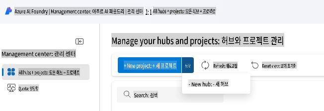
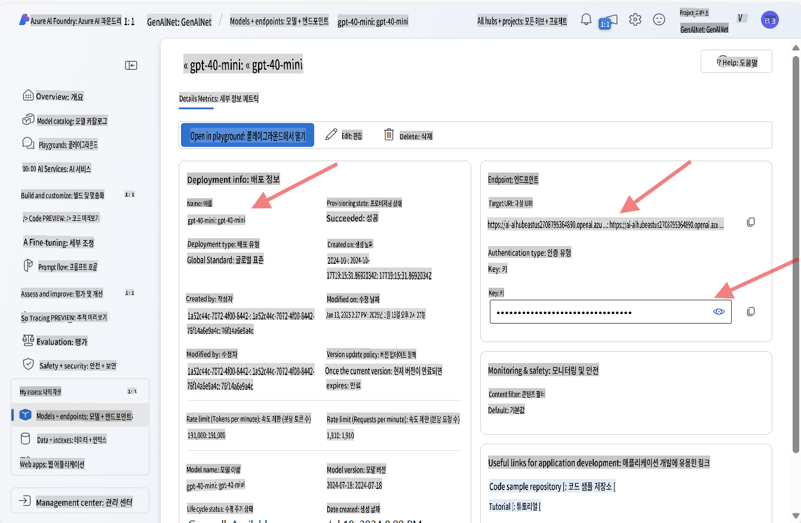
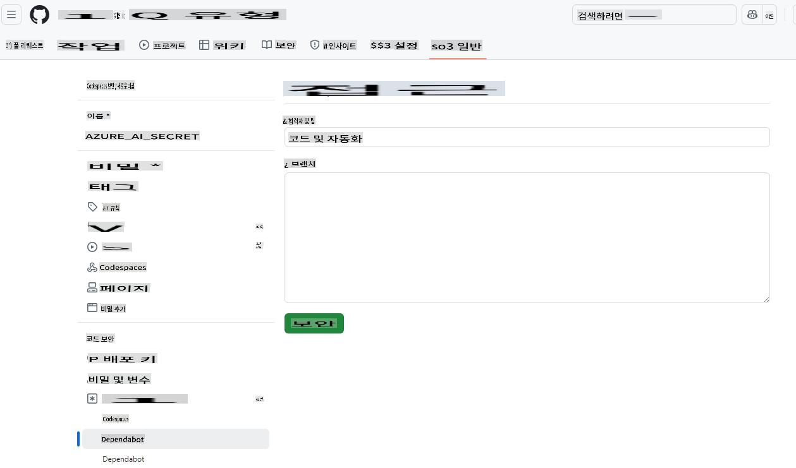

# Azure OpenAI 개발 환경 설정

이 강의에서 .NET AI 애플리케이션에 Azure AI Foundry 모델을 사용하려면, 이 가이드를 따라 설정하세요.

Azure OpenAI를 사용하지 않으시겠습니까?

👉 [GitHub Models를 사용하는 방법은 여기 있습니다](README.md)  
👉 [Ollama 설정 방법은 여기에서 확인하세요](getting-started-ollama.md)

## Azure AI Foundry 리소스 생성하기

Azure AI Foundry 모델을 사용하려면, Azure AI Foundry 포털에서 허브와 프로젝트를 생성해야 합니다. 이후 모델을 배포해야 합니다. 이 섹션에서는 이를 수행하는 방법을 안내합니다.

### Azure AI Foundry에서 허브와 프로젝트 생성하기

1. [Azure AI Foundry 포털](https://ai.azure.com/)로 이동합니다.  
1. Azure 계정으로 로그인합니다.  
1. 왼쪽 메뉴에서 **All hubs + projects**를 선택한 다음, 드롭다운에서 **+ New hub**를 클릭합니다. (참고: **+ New project**를 먼저 클릭해야 **+ New hub** 옵션이 나타날 수 있습니다).  
     
1. 새 창이 열리면 허브의 세부 정보를 입력하세요:  
    - 허브 이름을 입력합니다(예: "MyAIHub").  
    - 가장 가까운 지역을 선택합니다.  
    - 적절한 구독 및 리소스 그룹을 선택합니다.  
    - 나머지 설정은 기본값으로 유지할 수 있습니다.  
    - **Next**를 클릭합니다.  
    - 세부 정보를 검토한 후 **Create**를 클릭합니다.  
1. 허브가 생성되면 포털이 허브의 세부 정보 페이지를 엽니다. **Create Project** 버튼을 클릭하세요.  
    - 프로젝트 이름을 입력하세요(예: "GenAINET") 또는 기본값을 그대로 사용합니다.  
    - **Create**를 클릭합니다.  

🎉 **완료!** 이제 Azure AI Foundry에서 첫 번째 프로젝트를 생성했습니다.

### Azure AI Foundry에서 언어 모델 배포하기

이제 **gpt-4o-mini** 모델을 프로젝트에 배포해 보겠습니다:

1. Azure AI Foundry 포털에서 프로젝트로 이동합니다(생성 직후 자동으로 열릴 것입니다).  
1. 왼쪽 메뉴에서 **Models and Endpoints**를 클릭한 다음 **Deploy Model** 버튼을 클릭합니다.  
1. 드롭다운에서 **Deploy base model**을 선택합니다.  
1. 모델 카탈로그에서 **gpt-4o-mini**를 검색합니다.  
1. 모델을 선택하고 **Confirm** 버튼을 클릭합니다.  
1. 배포 이름을 지정하세요(예: "gpt-4o-mini"). 나머지 옵션은 기본값으로 유지할 수 있습니다.  
1. **Deploy**를 클릭하고 모델이 프로비저닝될 때까지 기다립니다.  
1. 배포가 완료되면 모델 세부 정보 페이지에서 **Model Name**, **Target URI**, **API Key**를 기록해 두세요.  

🎉 **완료!** Azure AI Foundry에서 첫 번째 대형 언어 모델을 배포했습니다.



> 📝 **참고:** 엔드포인트는 `https://< your hub name>.openai.azure.com/openai/deployments/gpt-4o-mini/chat/completions?api-version=2024-08-01-preview`와 비슷할 수 있습니다. 필요한 엔드포인트 이름은 `https://< your hub name >.openai.azure.com/`*입니다.

## Azure AI API 키를 Codespace의 Secrets에 추가하기

보안을 위해 방금 생성한 API 키를 Codespace의 Secrets에 추가해 보겠습니다.

1. 이 리포지토리를 GitHub 계정으로 포크했는지 확인하세요.  
1. 포크한 리포지토리의 **Settings** 탭으로 이동한 다음, 왼쪽 메뉴에서 **Secrets and variables**를 확장하고 **Codespaces**를 선택합니다.  

      
1. Secret 이름을 **AZURE_AI_KEY**로 지정합니다.  
1. Azure AI Foundry 포털에서 복사한 API 키를 **Secret** 필드에 붙여넣습니다.  

## GitHub Codespace 생성하기

이제 나머지 강의를 진행하기 위한 GitHub Codespace를 생성해 보겠습니다.

1. 이 리포지토리의 메인 페이지를 새 창에서 열려면 [여기를 오른쪽 클릭](https://github.com/microsoft/Generative-AI-for-beginners-dotnet)하고 컨텍스트 메뉴에서 **새 창에서 열기**를 선택하세요.  
1. 페이지 오른쪽 상단의 **Fork** 버튼을 클릭하여 리포지토리를 GitHub 계정으로 포크하세요.  
1. **Code** 드롭다운 버튼을 클릭한 다음 **Codespaces** 탭을 선택합니다.  
1. **...** 옵션(세 개의 점)을 클릭하고 **New with options...**를 선택합니다.  


### 개발 컨테이너 선택하기

**Dev container configuration** 드롭다운에서 다음 옵션 중 하나를 선택하세요:

**옵션 1: C# (.NET)** : GitHub Models 또는 Azure OpenAI를 사용할 계획이라면 이 옵션을 사용하세요. 이 옵션은 강의 진행에 필요한 핵심 .NET 개발 도구를 포함하며 빠른 시작 시간을 제공합니다.

**옵션 2: C# (.NET) - Ollama**: GitHub Models나 Azure OpenAI에 연결하지 않고 데모를 실행하려면 Ollama를 사용할 수 있습니다. 이 옵션은 Ollama와 핵심 .NET 개발 도구를 포함하지만, 시작 시간이 더 느리며 평균 5분 정도 소요됩니다. [이 가이드](getting-started-ollama.md)를 참고하세요.

나머지 설정은 기본값으로 유지할 수 있습니다. **Create codespace** 버튼을 클릭하여 Codespace 생성 프로세스를 시작하세요.


## 샘플 코드를 Azure OpenAI 및 새 모델로 업데이트하기

이제 새로 배포한 모델을 사용하도록 코드를 업데이트해 보겠습니다. 먼저 Azure OpenAI와 함께 작업하기 위한 NuGet 패키지를 추가해야 합니다.

1. 터미널을 열고 프로젝트 디렉토리로 이동합니다:

    ```bash
    cd 02-SetupDevEnvironment/src/BasicChat-01MEAI/
    ```

1. 다음 명령을 실행하여 필요한 패키지를 추가합니다:

    ```bash
    dotnet add package Azure.AI.OpenAI
    dotnet add package Microsoft.Extensions.AI.OpenAI --version 9.1.0-preview.1.25064.3
    ```

[Azure.AI.OpenAI에 대한 추가 정보](https://www.nuget.org/packages/Azure.AI.OpenAI/2.1.0#show-readme-container).

1. `/workspaces/Generative-AI-for-beginners-dotnet/02-SettingUp.NETDev/src/BasicChat-01MEAI/Program.cs` 파일을 엽니다.

    파일 상단에 다음 using 문을 추가하세요:

    ```csharp
    using System.ClientModel;
    using Azure.AI.OpenAI;
    using Microsoft.Extensions.AI;

1. Create new variables to hold the model name, endpoint, and API key:

    ```csharp
    var deploymentName = "< deployment name > "; // 예: "gpt-4o-mini"
    var endpoint = new Uri("< endpoint >"); // 예: "https://< your hub name >.openai.azure.com/"
    var apiKey = new ApiKeyCredential(Environment.GetEnvironmentVariable("AZURE_AI_SECRET"));
    ```

    Making sure to replace `< deployment name >`, and `< endpoint >` with the values you noted above.

1. Replace the `IChatClient` creation with the following code:

    ```csharp
    IChatClient client = new AzureOpenAIClient(
        endpoint,
        apiKey)
    .AsChatClient(deploymentName);
    ```

1. Run the following command in the terminal:

    ```bash
    dotnet run
    ```

1. You should see output similar to the following:

    ```bash
    인공지능(AI)은 인간의 지능을 모방하여 사고하고 학습하도록 프로그래밍된 기계를 말합니다. AI는 컴퓨터와 시스템이 인간의 지능이 필요한 작업을 수행할 수 있도록 하는 다양한 기술과 접근 방식을 포함합니다. 이러한 작업에는 다음이 포함됩니다:

    1. **학습**: 데이터를 분석하는 알고리즘을 통해 경험을 바탕으로 성능을 개선하는 능력.
    
    ...
    ```

> 🙋 **도움이 필요하신가요?**: 문제가 발생했나요? [이슈 열기](https://github.com/microsoft/Generative-AI-for-beginners-dotnet/issues/new?template=Blank+issue)를 통해 도움을 요청하세요.

## 요약

이번 강의에서는 나머지 강의를 진행하기 위한 개발 환경을 설정하는 방법을 배웠습니다. GitHub Codespace를 생성하고 Azure OpenAI를 사용하도록 구성했습니다. 또한 Azure AI Foundry에 배포된 새 모델을 사용하도록 샘플 코드를 업데이트했습니다.

### 추가 자료

- [Azure AI Foundry 문서](https://learn.microsoft.com/azure/ai-services/)  
- [GitHub Codespaces 사용법](https://docs.github.com/en/codespaces/getting-started)  
- [Azure AI Foundry에서 모델 배포하기](https://learn.microsoft.com/azure/ai-services/deploy/)  
- [Azure.AI.OpenAI NuGet 패키지](https://www.nuget.org/packages/Azure.AI.OpenAI)

## 다음 단계

다음으로 첫 번째 AI 애플리케이션을 만드는 방법을 배워봅시다! 🚀

👉 [핵심 생성 AI 기술](../03-CoreGenerativeAITechniques/readme.md)

**면책 조항**:  
이 문서는 기계 기반 AI 번역 서비스를 사용하여 번역되었습니다. 정확성을 위해 노력하고 있지만, 자동 번역에는 오류나 부정확성이 포함될 수 있습니다. 원문은 해당 언어로 작성된 문서를 권위 있는 자료로 간주해야 합니다. 중요한 정보의 경우, 전문 번역사의 번역을 권장합니다. 이 번역 사용으로 인해 발생하는 오해나 잘못된 해석에 대해 당사는 책임을 지지 않습니다.