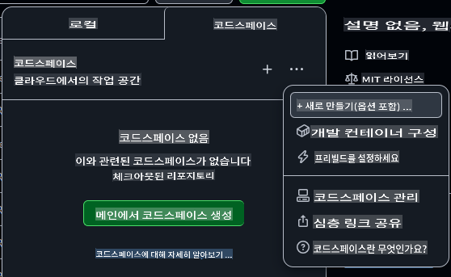
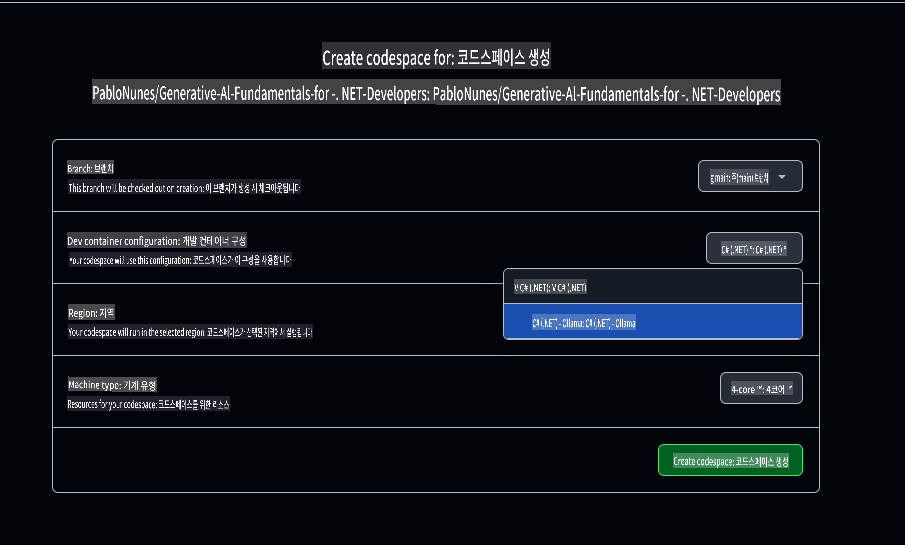

# Ollama를 사용한 개발 환경 설정

이 강의를 위해 Ollama를 사용하여 로컬 모델을 실행하려면, 이 가이드의 단계를 따라주세요.

Azure OpenAI를 사용하고 싶지 않으신가요?

👉 [GitHub 모델을 사용하는 방법은 이 가이드를 참고하세요](README.md)  
👉 [Ollama를 사용하는 단계는 여기를 참고하세요](getting-started-ollama.md)

## GitHub Codespace 생성하기

이번 강의의 나머지 과정을 위해 개발 환경으로 사용할 GitHub Codespace를 만들어 보겠습니다.

1. [여기를 오른쪽 클릭](https://github.com/microsoft/Generative-AI-for-beginners-dotnet)하여 새 창에서 **열기**를 선택해 이 저장소의 메인 페이지를 엽니다.
1. 페이지 오른쪽 상단의 **Fork** 버튼을 클릭하여 이 저장소를 본인의 GitHub 계정으로 포크합니다.
1. **Code** 드롭다운 버튼을 클릭한 뒤 **Codespaces** 탭을 선택합니다.
1. **...** 옵션(점 세 개)을 선택하고 **New with options...**를 클릭합니다.



### 개발 컨테이너 선택하기

**Dev container configuration** 드롭다운에서 다음 옵션 중 하나를 선택하세요:

**옵션 1: C# (.NET)** : GitHub 모델이나 Azure OpenAI를 사용할 계획이라면 이 옵션을 선택하세요. 이 강의를 완료하는 데 추천되는 방법입니다. 강의의 나머지 과정에 필요한 핵심 .NET 개발 도구를 포함하고 있으며, 시작 속도가 빠릅니다.

**옵션 2: C# (.NET) - Ollama**: Ollama를 사용하여 로컬에서 모델을 실행하려면 이 옵션을 선택하세요. 핵심 .NET 개발 도구에 Ollama가 추가로 포함되어 있지만, 평균적으로 약 5분 정도의 느린 시작 속도를 가집니다. [이 가이드](getting-started-ollama.md)를 참고하여 Ollama를 사용해 보세요.

나머지 설정은 그대로 두셔도 됩니다. **Create codespace** 버튼을 클릭하여 Codespace 생성 과정을 시작하세요.



## Codespace가 Ollama와 함께 정상적으로 작동하는지 확인하기

Codespace가 완전히 로드되고 설정되면, 모든 것이 올바르게 작동하는지 확인하기 위해 샘플 앱을 실행해 봅시다:

1. 터미널을 엽니다. macOS에서는 **Ctrl+\`** (backtick) on Windows or **Cmd+`**을 입력하여 터미널 창을 열 수 있습니다.

1. 다음 명령어를 실행하여 적절한 디렉토리로 이동하세요:

    ```bash
    cd 02-SetupDevEnvironment/src/BasicChat-03Ollama/
    ```

1. 그런 다음, 다음 명령어를 실행하여 애플리케이션을 실행하세요:

    ```bash
    dotnet run
    ```

1. 몇 초가 걸릴 수 있지만, 결국 애플리케이션은 다음과 유사한 메시지를 출력할 것입니다:

    ```bash
    AI, or Artificial Intelligence, refers to the development of computer systems that can perform tasks that typically require human intelligence, such as:

    1. Learning: AI systems can learn from data and improve their performance over time.
    2. Reasoning: AI systems can draw conclusions and make decisions based on the data they have been trained on.
    
    ...
    ```

> 🙋 **도움이 필요하신가요?**: 문제가 발생했나요? [문제를 등록하세요](https://github.com/microsoft/Generative-AI-for-beginners-dotnet/issues/new?template=Blank+issue), 저희가 도와드리겠습니다.

## Ollama에서 모델 변경하기

Ollama의 멋진 점 중 하나는 모델을 쉽게 변경할 수 있다는 것입니다. 현재 앱은 "**llama3.2**" 모델을 사용 중입니다. 이제 "**phi3.5**" 모델로 바꿔보겠습니다.

1. 터미널에서 다음 명령어를 실행하여 Phi3.5 모델을 다운로드하세요:

    ```bash
    ollama pull phi3.5
    ```

    [Phi3.5](https://ollama.com/library/phi3.5) 및 Ollama 라이브러리의 다른 사용 가능한 모델에 대해 더 알아보려면 [Ollama 라이브러리](https://ollama.com/library/)를 참고하세요.

1. `Program.cs`에서 채팅 클라이언트 초기화를 수정하여 새 모델을 사용하도록 설정하세요:

    ```csharp
    IChatClient client = new OllamaChatClient(new Uri("http://localhost:11434/"), "phi3.5");
    ```

1. 마지막으로 다음 명령어를 실행하여 앱을 실행하세요:

    ```bash
    dotnet run
    ```

1. 이제 새 모델로 전환되었습니다. 응답이 더 길고 상세해진 것을 확인해 보세요.

    ```bash
    Artificial Intelligence (AI) refers to the simulation of human intelligence processes by machines, especially computer systems. These processes include learning (the acquisition of information and accumulation of knowledge), reasoning (using the acquired knowledge to make deductions or decisions), and self-correction. AI can manifest in various forms:

    1. **Narrow AI** – Designed for specific tasks, such as facial recognition software, voice assistants like Siri or Alexa, autonomous vehicles, etc., which operate under a limited preprogrammed set of behaviors and rules but excel within their domain when compared to humans in these specialized areas.

    2. **General AI** – Capable of understanding, learning, and applying intelligence broadly across various domains like human beings do (natural language processing, problem-solving at a high level). General AIs are still largely theoretical as we haven't yet achieved this form to the extent necessary for practical applications beyond narrow tasks.
    
    ...
    ```

> 🙋 **도움이 필요하신가요?**: 문제가 발생했나요? [문제를 등록하세요](https://github.com/microsoft/Generative-AI-for-beginners-dotnet/issues/new?template=Blank+issue), 저희가 도와드리겠습니다.

## 요약

이번 강의에서는 나머지 과정을 위한 개발 환경을 설정하는 방법을 배웠습니다. GitHub Codespace를 생성하고 Ollama를 사용하도록 구성했습니다. 또한 샘플 코드를 업데이트하여 모델을 쉽게 변경하는 방법도 배웠습니다.

### 추가 자료

- [Ollama 모델](https://ollama.com/search)  
- [GitHub Codespaces 사용하기](https://docs.github.com/en/codespaces/getting-started)  
- [Microsoft Extensions for AI Documentation](https://learn.microsoft.com/dotnet/)

## 다음 단계

다음으로는 첫 번째 AI 애플리케이션을 만드는 방법을 탐구하겠습니다! 🚀

👉 [핵심 생성 AI 기술](../03-CoreGenerativeAITechniques/readme.md)

**면책 조항**:  
이 문서는 기계 기반 AI 번역 서비스를 사용하여 번역되었습니다. 정확성을 위해 최선을 다하고 있지만, 자동 번역에는 오류나 부정확성이 포함될 수 있습니다. 원문(원어로 작성된 문서)을 신뢰할 수 있는 권위 있는 자료로 간주해야 합니다. 중요한 정보의 경우, 전문적인 인간 번역을 권장합니다. 이 번역 사용으로 인해 발생하는 오해나 잘못된 해석에 대해 당사는 책임을 지지 않습니다.