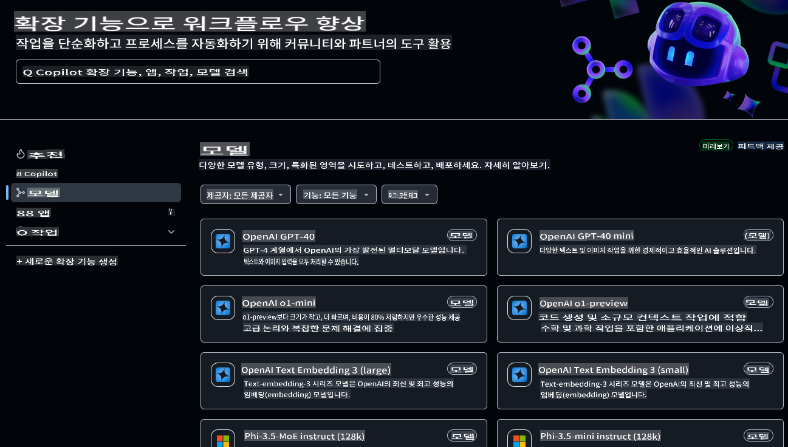
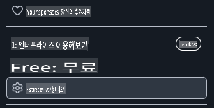
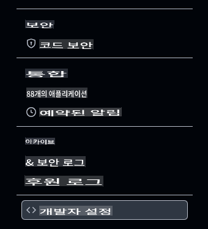
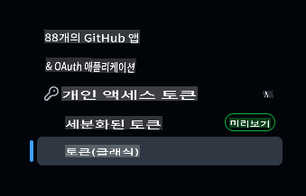

# 이 강의를 위한 개발 환경 설정

이 강의에서는 개발 환경을 설정하는 방법을 안내합니다. 성공적인 학습을 위해 필요한 모든 도구를 제공하는 devcontainer 구성을 준비했습니다. 이 devcontainer는 GitHub Codespaces(권장) 또는 로컬 머신에서 실행할 수 있습니다. 또한 GitHub Models와 상호작용하기 위해 GitHub 액세스 토큰을 설정하는 방법도 보여드립니다.

*필요에 따라 [Azure OpenAI](getting-started-azure-openai.md) 및 [Ollama](getting-started-ollama.md) 설정 가이드도 준비되어 있습니다.*

---

## 이번 강의에서 배우게 될 내용:

- ⚡ GitHub Codespaces를 활용한 개발 환경 설정 방법
- 🤖 GitHub Models, Azure OpenAI, 또는 Ollama를 통해 LLMs에 접근할 수 있도록 환경 설정하기
- 🛠️ .devcontainer를 활용한 업계 표준 도구 설정
- 🎯 마지막으로, 강의를 진행할 준비 완료하기

그럼 바로 시작해서 개발 환경을 설정해 봅시다! 🏃‍♂️

[](https://youtu.be/7kYoVRNQXyA?feature=shared)

_⬆️이미지를 클릭하면 동영상을 볼 수 있습니다⬆️_

## 이 강의에서 어떤 AI 서비스를 사용해야 할까요?

GitHub Models, Azure OpenAI, Ollama를 사용하여 개발 환경을 설정하는 방법을 제공합니다. 필요에 따라 가장 적합한 서비스를 선택할 수 있습니다. 이 강의에서는 GitHub Models 사용을 권장하지만, 세 가지 서비스 중 어떤 것을 사용해도 괜찮습니다.

서비스 간략 소개:

- **GitHub Models**: 개발 환경 내에서 다양한 AI 모델을 테스트하고 상호작용할 수 있는 무료 서비스입니다. Codespaces에서 쉽게 사용할 수 있으며, 구현 전에 다양한 모델의 기능을 실험하고 이해하기에 적합합니다.
- **Azure OpenAI**: 유료 서비스로 다양한 AI 모델에 접근할 수 있습니다. Azure의 강력한 보안 및 확장성을 포함한 이점이 제공됩니다. 이미 Azure 구독을 보유하고 있다면 이 강의에 적합한 옵션입니다.
- **Ollama**: Ollama는 로컬 머신 또는 Codespace, devcontainer 내에서 AI 모델을 실행할 수 있는 무료 옵션입니다. 클라우드 기반 옵션보다 느릴 수 있고 하드웨어 자원이 더 필요하지만, 로컬에서 실행을 선호하는 경우 적합합니다.

> **GitHub Models**를 선택했다면, GitHub Models를 사용해 개발 환경을 설정하는 방법을 안내하는 이 문서를 계속 따라가세요.
> - **Azure OpenAI**를 고려 중이라면, [이 문서](getting-started-azure-openai.md)를 참조하세요.
> - **Ollama**를 선택했다면, [이 가이드](getting-started-ollama.md)를 확인하세요.

## GitHub Models로 AI 모델 학습 및 테스트하기

**GitHub Models**는 개발 환경 내에서 다양한 AI 모델을 실험할 수 있는 직관적인 방법을 제공합니다. 이를 통해 개발자는 모델의 응답을 탐색하고, 성능을 평가하며, 애플리케이션 요구사항에 가장 적합한 모델을 결정할 수 있습니다. GitHub의 인프라에서 호스팅되므로 신뢰할 수 있는 접근성과 일관된 성능을 제공합니다. 특히 무료로 시작할 수 있는 계층이 제공되어 비용 부담 없이 탐구를 시작할 수 있습니다.



## 사전 준비: GitHub 액세스 토큰 설정

먼저, Codespace가 GitHub Models와 상호작용하고 애플리케이션을 안전하게 실행할 수 있도록 필수 보안 자격 증명을 설정해야 합니다.

### GitHub Model 액세스를 위한 개인 액세스 토큰 생성

1. [GitHub 설정 페이지](https://github.com/settings/profile)로 이동:

    - 오른쪽 상단의 프로필 사진을 클릭
    - 드롭다운 메뉴에서 **Settings** 선택

    

1. [개발자 설정 페이지](https://github.com/settings/apps)로 이동:

    - 왼쪽 사이드바를 아래로 스크롤
    - **Developer settings** 클릭 (일반적으로 맨 아래에 위치)

    

1. 새 토큰 생성:

    - **Personal access tokens** → **Tokens (classic)** 선택

        

    - 페이지 중간의 드롭다운에서 **Generate new token (classic)** 클릭

        

    - "Note" 필드에 설명을 추가 (예: `GenAI-DotNet-Course-Token`)
    - 만료 날짜 설정 (권장: 보안 모범 사례를 위해 7일)
    - 이 토큰에 별도의 권한 추가는 필요하지 않습니다.

> 💡 **보안 팁**: 액세스 토큰에는 최소한의 범위와 가장 짧은 만료 시간을 설정하세요. 이는 최소 권한 원칙을 따르며 계정의 토큰을 안전하게 유지하는 데 도움이 됩니다.

## GitHub Codespace 생성하기

이제 이 강의에서 사용할 GitHub Codespace를 생성해 봅시다.

1. [여기를 오른쪽 클릭](https://github.com/microsoft/Generative-AI-for-beginners-dotnet)하고 **새 창에서 열기**를 선택하여 이 저장소의 메인 페이지를 엽니다.
1. 페이지 오른쪽 상단의 **Fork** 버튼을 클릭하여 이 저장소를 자신의 GitHub 계정으로 복제합니다.
1. **Code** 드롭다운 버튼을 클릭한 후 **Codespaces** 탭을 선택합니다.
1. **...** 옵션(세 개의 점)을 선택하고 **New with options...**를 클릭합니다.


### 개발 컨테이너 선택하기

**Dev container configuration** 드롭다운에서 다음 옵션 중 하나를 선택합니다:

**옵션 1: C# (.NET)** : GitHub Models를 사용할 계획이라면 이 옵션을 사용하세요. 강의를 진행하기 위한 핵심 .NET 개발 도구가 포함되어 있으며 빠른 시작 속도를 제공합니다.

**옵션 2: C# (.NET) - Ollama**: GitHub Models나 Azure OpenAI에 연결하지 않고 데모를 실행하려면 Ollama를 사용할 수 있습니다. Ollama 외에도 핵심 .NET 개발 도구가 포함되어 있지만, 평균적으로 5분 정도의 느린 시작 속도를 가집니다. [이 가이드](getting-started-ollama.md)를 따라 Ollama를 사용해 보세요.

> 💡**팁** : Codespace를 생성할 때, 메뉴에서 선택 가능한 경우 자신과 가장 가까운 지역을 사용하세요. 먼 지역을 선택하면 생성 과정에서 오류가 발생할 수 있습니다.

**Create codespace** 버튼을 클릭하여 Codespace 생성 과정을 시작합니다.


## GitHub Models와 함께 Codespace가 올바르게 작동하는지 확인하기

Codespace가 완전히 로드되고 구성되었으면, 샘플 앱을 실행하여 모든 것이 올바르게 작동하는지 확인해 봅시다:

1. 터미널을 엽니다. macOS에서는 **Ctrl+\`** (backtick) on Windows or **Cmd+`**를 입력하여 터미널 창을 열 수 있습니다.

1. 다음 명령어를 실행하여 적절한 디렉토리로 이동합니다:

    ```bash
    cd 02-SetupDevEnvironment\src\BasicChat-01MEAI
    ```

1. 그런 다음, 다음 명령어로 애플리케이션을 실행합니다:

    ```bash
    dotnet run
    ```

1. 몇 초 정도 걸릴 수 있지만, 애플리케이션이 다음과 유사한 메시지를 출력해야 합니다:

    ```bash
    AI, or artificial intelligence, refers to the simulation of human intelligence in machines that are programmed to think and learn like humans. It is a broad field of computer science that focuses on creating systems and algorithms capable of performing tasks that typically require human intelligence. These tasks include problem-solving,

    ...
    ```

> 🙋 **도움이 필요하신가요?**: 문제가 발생했나요? [이슈를 열어주세요](https://github.com/microsoft/Generative-AI-for-beginners-dotnet/issues/new?template=Blank+issue). 도와드리겠습니다.

## 요약

이번 강의에서는 강의를 진행하기 위한 개발 환경을 설정하는 방법을 배웠습니다. GitHub Codespace를 생성하고, 이를 GitHub Models, Azure OpenAI, 또는 Ollama와 함께 사용할 수 있도록 구성했습니다. 또한 GitHub Models를 위한 개인 액세스 토큰 생성 방법과 샘플 애플리케이션을 실행하여 올바르게 작동하는지 확인하는 방법도 학습했습니다.

### 추가 자료

- 다른 호스팅 제공업체와 함께 이 가이드를 테스트해 보세요!
    - [Azure OpenAI](getting-started-azure-openai.md)
    - [Ollama](getting-started-ollama.md)
- [GitHub Codespaces 문서](https://docs.github.com/en/codespaces)
- [GitHub Models 문서](https://docs.github.com/en/github-models/prototyping-with-ai-models)

## 다음 단계

다음으로, 첫 번째 AI 애플리케이션을 만드는 방법을 살펴보겠습니다! 🚀

👉 [Core Generative AI Techniques](../03-CoreGenerativeAITechniques/readme.md)

**면책 조항**:  
이 문서는 AI 기반 기계 번역 서비스를 사용하여 번역되었습니다. 정확성을 위해 노력하고 있지만, 자동 번역에는 오류나 부정확성이 포함될 수 있습니다. 원본 문서의 원어 버전을 신뢰할 수 있는 권위 있는 자료로 간주해야 합니다. 중요한 정보의 경우, 전문적인 인간 번역을 권장합니다. 이 번역 사용으로 인해 발생하는 오해나 잘못된 해석에 대해 당사는 책임을 지지 않습니다.