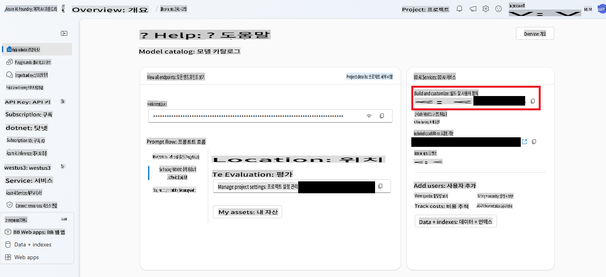

# AI 에이전트

이번 레슨에서는 인간의 지속적인 개입 없이도 스스로 결정을 내리고 작업을 실행하는 AI 엔터티를 만드는 방법을 배워보겠습니다. 맞습니다. AI 에이전트는 특정 작업을 독립적으로 수행할 수 있습니다.

---

[](https://youtu.be/Btkmw1Bosh0?feature=shared)

_⬆️이미지를 클릭하여 영상을 시청하세요⬆️_

AI 에이전트는 LLM(대규모 언어 모델)을 단순한 어시스턴트에서 사용자 대신 작업을 수행할 수 있는 엔터티로 발전시킵니다. 에이전트는 심지어 다른 에이전트와 상호작용하여 작업을 수행할 수도 있습니다. 에이전트의 주요 속성 중 일부는 **자율성**으로, 프로그래밍된 대로 작업을 시작할 수 있는 능력을 가지며, 이는 사전 정의된 목표를 기반으로 한 **의사결정 능력**으로 이어집니다. 또한, 시간이 지남에 따라 학습하고 성능을 개선할 수 있는 **적응성**도 갖추고 있습니다.

에이전트를 구축할 때 중요한 점은 단일 작업에 집중해야 한다는 것입니다. 에이전트의 목적을 최대한 구체적으로 좁히는 것이 중요합니다.

> 🧑‍🏫**더 알아보기**: AI 에이전트의 기본 개념에 대해 더 알아보려면 [Generative AI for Beginners: AI Agents](https://github.com/microsoft/generative-ai-for-beginners/tree/main/17-ai-agents)를 참고하세요.

## AI 에이전트 생성하기

.NET에서 AI 에이전트를 구축하기 위해 몇 가지 새로운 개념을 다룰 것입니다. 새로운 SDK를 사용하고, 시작을 위해 Azure AI Foundry에서 추가적인 설정도 필요합니다.

> 🧑‍💻**샘플 코드**: 이번 레슨에서는 [AgentLabs-01-Simple 샘플](../../../03-CoreGenerativeAITechniques/src/AgentLabs-01-Simple)을 기반으로 작업할 예정입니다.
>
> 또한, `/src/` 폴더에 더 고급 샘플들도 포함되어 있습니다. [AgentLabs-02-Functions](../../../03-CoreGenerativeAITechniques/src/AgentLabs-02-Functions), [AgentLabs-03-OpenAPIs](../../../03-CoreGenerativeAITechniques/src/AgentLabs-03-OpenAPIs), [AgentLabs-03-PythonParksInformationServer](../../../03-CoreGenerativeAITechniques/src/AgentLabs-03-PythonParksInformationServer)의 README를 참고하여 자세한 내용을 확인할 수 있습니다.

### Azure AI 에이전트 서비스

에이전트 구축을 도와줄 새로운 Azure 서비스인 [Azure AI 에이전트 서비스](https://learn.microsoft.com/azure/ai-services/agents/overview)를 소개합니다.

이번 레슨에 포함된 코드 샘플을 실행하려면 Azure AI Foundry에서 추가 설정을 수행해야 합니다. [**기본 에이전트**를 설정하는 방법](https://learn.microsoft.com/azure/ai-services/agents/quickstart?pivots=programming-language-csharp)을 따라 진행하세요.

### Azure AI Projects 라이브러리

에이전트는 세 가지 주요 요소로 구성됩니다. **LLM** 또는 모델, 과거 결과를 기반으로 의사결정을 안내하는 **상태**(대화와 유사한 컨텍스트), 그리고 모델과 외부 시스템 간의 다리를 제공하는 [이전에 배운 함수](./01-lm-completions-functions.md#function-calling)와 같은 **도구**입니다.

이론적으로는 지금까지 배운 내용만으로도 AI 에이전트를 구축할 수 있습니다. 하지만 **Azure AI Projects for .NET** 라이브러리는 일반적인 작업을 간소화해주는 API를 제공하여 에이전트 개발을 더 쉽게 만듭니다.

Azure AI Projects 라이브러리를 사용할 때 이해해야 할 몇 가지 개념(클래스와 매핑됨)이 있습니다.

- `AgentClient`: 에이전트를 생성 및 호스팅하고, 실행되는 스레드를 관리하며, 클라우드와의 연결을 처리하는 전체 클라이언트입니다.
- `Agent`: 수행해야 할 작업에 대한 지침과 사용할 수 있는 도구의 정의를 보유한 에이전트입니다.
- `ThreadMessage`: 에이전트로 전달되는 메시지로, 이전에 배운 프롬프트와 비슷합니다. 에이전트는 또한 통신을 위해 `ThreadMessage` 객체를 생성합니다.
- `ThreadRun`: 메시지가 에이전트로 전달되는 스레드입니다. 스레드는 시작된 후 추가 지침을 제공할 수 있으며 상태를 폴링할 수 있습니다.

간단한 예제를 통해 이를 실제로 살펴보겠습니다!

### 수학 에이전트 구축하기

수학 학생들에게 튜터 역할을 하는 단일 목적의 에이전트를 만들어 보겠습니다. 이 에이전트의 유일한 목적은 사용자가 묻는 수학 문제를 해결하고 설명하는 것입니다.

1. 우선, Azure와의 연결, 에이전트 자체, 스레드, 메시지 등을 관리하는 `AgentsClient` 객체를 생성해야 합니다.

    ```csharp
    string projectConnectionString = "< YOU GET THIS FROM THE PROJECT IN AI FOUNDRY >";
    AgentsClient client = new(projectConnectionString, new DefaultAzureCredential());
    ```

    AI Foundry에서 생성한 허브를 열고 프로젝트를 선택하면 오른쪽에 프로젝트 연결 문자열을 확인할 수 있습니다.

    

1. 다음으로, 튜터 에이전트를 생성합니다. 기억하세요, 에이전트는 하나의 작업에만 집중해야 합니다.

    ```csharp
    Agent tutorAgent = (await client.CreateAgentAsync(
    model: "gpt-4o",
    name: "Math Tutor",
    instructions: "You are a personal math tutor. Write and run code to answer math questions.",
    tools: [new CodeInterpreterToolDefinition()])).Value;
    ```

    여기에서 주목할 점은 `tools` parameter. We're creating a `CodeInterpreterToolDefinition` object (that is apart of the **Azure.AI.Projects** SDK) that will allow the agent to create and execute code.

    > 🗒️**Note**: You can create your own tools too. See the [Functions](../../../03-CoreGenerativeAITechniques/src/AgentLabs-02-Functions) to learn more.

    Second note the `instructions` that are being sent along. It's a prompt and we're limiting it to answer math questions. Then last creating the agent is an async operation. That's because it's creating an object within Azure AI Foundry Agents service. So we both `await` the `CreateAgentAsync` function and then grab the `Value` 패턴입니다. **Azure.AI.Projects** SDK로 객체를 생성할 때 이 패턴을 자주 보게 될 것입니다.

1. `AgentThread`는 개별 에이전트와 사용자 간의 통신을 처리하는 객체입니다. 이를 생성하여 `ThreadMessage`를 추가할 것입니다. 여기에서는 사용자의 첫 번째 질문이 해당됩니다.

    ```csharp
    AgentThread thread = (await client.CreateThreadAsync()).Value;

    // Creating the first user message to AN agent - notice how we're putting it on a thread
    ThreadMessage userMessage = (await client.CreateMessageAsync(
        thread.Id,
        MessageRole.User,
        "Hello, I need to solve the equation `3x + 11 = 14`. Can you help me?")
    ).Value;
    ```

    `ThreadMessage`의 유형은 `MessageRole.User`입니다. 메시지가 특정 에이전트로 전송되는 것이 아니라, 단순히 스레드에 추가된다는 점에 유의하세요.

1. 이제 에이전트가 초기 응답을 제공하도록 하고 이를 스레드에 추가한 다음, 스레드를 시작합니다. 스레드를 시작할 때 초기 에이전트 ID와 추가 지침을 제공합니다.

    ```csharp
    ThreadMessage agentMessage =  await client.CreateMessageAsync(
        thread.Id,
        MessageRole.Agent,
        "Please address the user as their name. The user has a basic account, so just share the answer to the question.")
    ).Value;

    ThreadRun run = (await client.CreateRunAsync(
        thread.Id,
        assistantId: agentMathTutor.Id, 
        additionalInstructions: "You are working in FREE TIER EXPERIENCE mode`, every user has premium account for a short period of time. Explain detailed the steps to answer the user questions")
    ).Value;
    ```

1. 이후에는 실행 상태를 확인합니다.

    ```csharp
    do
    {
        await Task.Delay(Timespan.FromMilliseconds(100));
        run = (await client.GetRunAsync(thread.Id, run.Id)).Value;

        Console.WriteLine($"Run Status: {run.Status}");
    }
    while (run.Status == RunStatus.Queued || run.Status == RunStatus.InProgress);
    ```

1. 마지막으로 결과에서 메시지를 표시합니다.

    ```csharp
    Response<PageableList<ThreadMessage>> afterRunMessagesResponse = await client.GetMessagesAsync(thread.Id);
    IReadOnlyList<ThreadMessage> messages = afterRunMessagesResponse.Value.Data;

    // sort by creation date
    messages = messages.OrderBy(m => m.CreatedAt).ToList();

    foreach (ThreadMessage msg in messages)
    {
        Console.Write($"{msg.CreatedAt:yyyy-MM-dd HH:mm:ss} - {msg.Role,10}: ");

        foreach (MessageContent contentItem in msg.ContentItems)
        {
            if (contentItem is MessageTextContent textItem)
                Console.Write(textItem.Text);
        }
        Console.WriteLine();
    }
    ```

> 🙋 **도움이 필요하세요?**: 문제가 발생하면 [저장소에서 이슈를 열어주세요](https://github.com/microsoft/Generative-AI-for-beginners-dotnet/issues/new).

다음 단계로는 다수의 에이전트를 사용하여 자율 시스템을 만드는 것입니다. 예를 들어, 사용자가 프리미엄 계정을 보유하고 있는지 확인하는 에이전트를 추가할 수 있습니다.

## 요약

AI 에이전트는 단순한 채팅 상호작용을 넘어서는 자율적인 AI 엔터티입니다. 이들은 다음과 같은 작업을 수행할 수 있습니다:

- 독립적으로 결정: 지속적인 인간 입력 없이 작업 실행
- 컨텍스트 유지: 상태를 유지하고 이전 상호작용을 기억
- 도구 사용: 외부 시스템 및 API에 접근하여 작업 수행
- 협업: 다른 에이전트와 협력하여 복잡한 문제 해결

그리고 **Azure AI Agents** 서비스와 **Azure AI Project** SDK를 사용하여 기본적인 에이전트를 만드는 방법을 배웠습니다.

에이전트를 AI 어시스턴트가 아닌 **행동하는 AI**로 생각하세요. 단순히 응답하는 것이 아니라, 프로그래밍과 목표에 따라 행동합니다.

## 추가 자료

- [.NET으로 최소한의 에이전트 구축하기](https://learn.microsoft.com/dotnet/ai/quickstarts/quickstart-assistants?pivots=openai)
- [다중 에이전트 오케스트레이션](https://techcommunity.microsoft.com/blog/educatordeveloperblog/using-azure-ai-agent-service-with-autogen--semantic-kernel-to-build-a-multi-agen/4363121)
- [Semantic Kernel 에이전트 프레임워크](https://learn.microsoft.com/semantic-kernel/frameworks/agent/?pivots=programming-language-csharp)
- [AI 에이전트 - 초보자를 위한 GenAI 시리즈](https://github.com/microsoft/generative-ai-for-beginners/tree/main/17-ai-agents)

## 다음 단계

여기까지 오느라 수고하셨습니다! 간단한 텍스트 완성부터 에이전트 구축까지 배웠습니다!

👉 [다음 레슨에서는 실제 실용적인 예제를](../04-PracticalSamples/readme.md) 살펴보세요.

**면책 조항**:  
이 문서는 기계 기반 AI 번역 서비스를 사용하여 번역되었습니다. 정확성을 위해 노력하고 있지만, 자동 번역에는 오류나 부정확성이 포함될 수 있습니다. 원문이 작성된 언어의 문서를 권위 있는 원본으로 간주해야 합니다. 중요한 정보에 대해서는 전문적인 인간 번역을 권장합니다. 이 번역 사용으로 인해 발생하는 오해나 잘못된 해석에 대해 당사는 책임을 지지 않습니다.