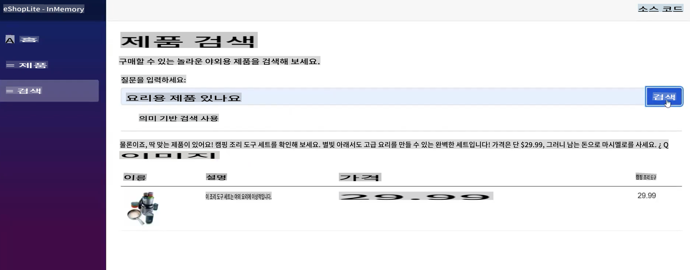
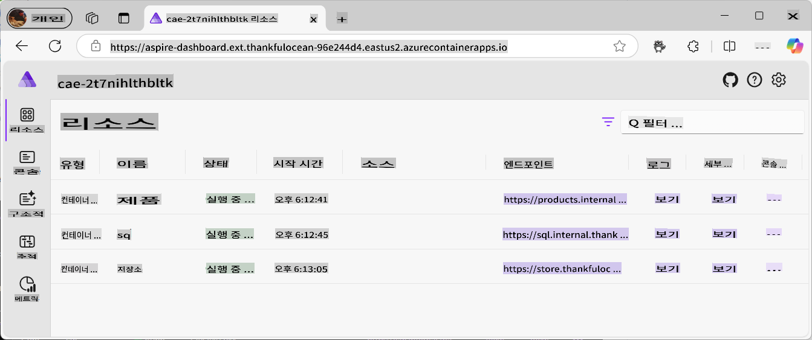
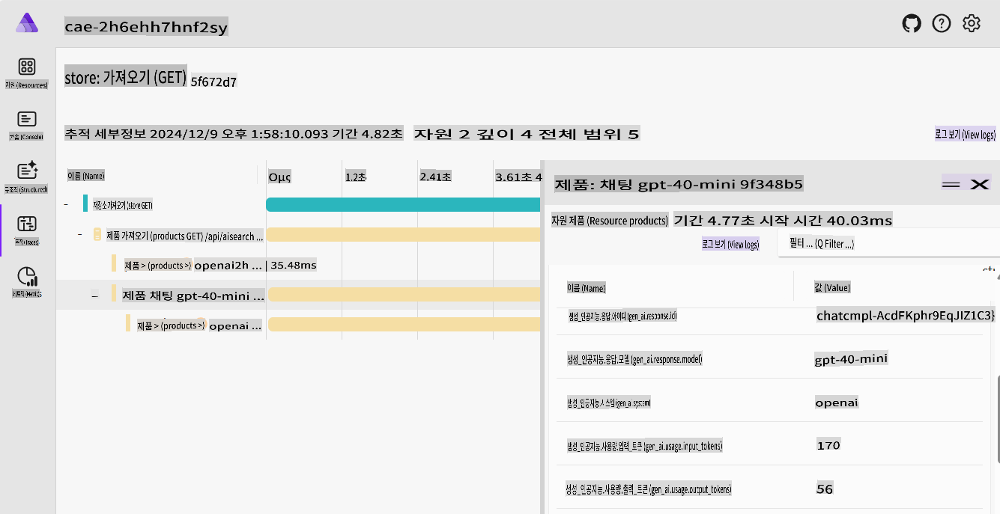
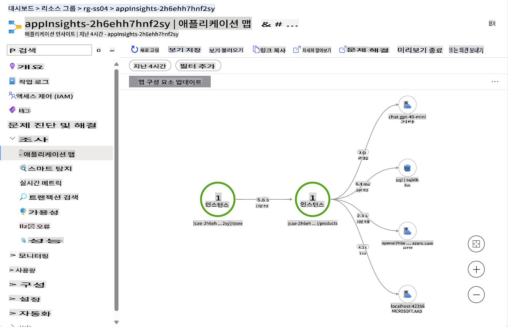
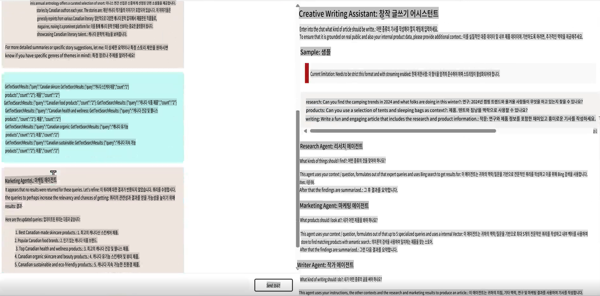
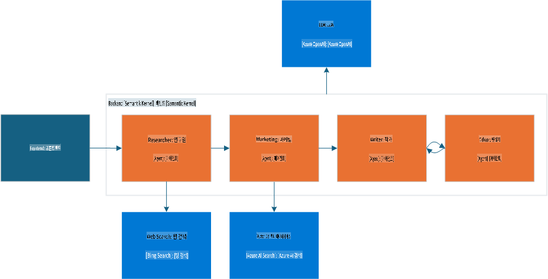
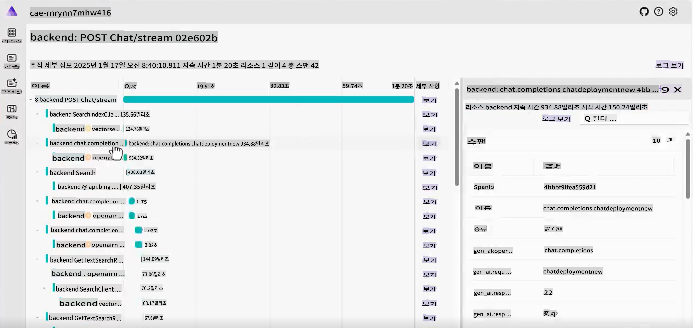
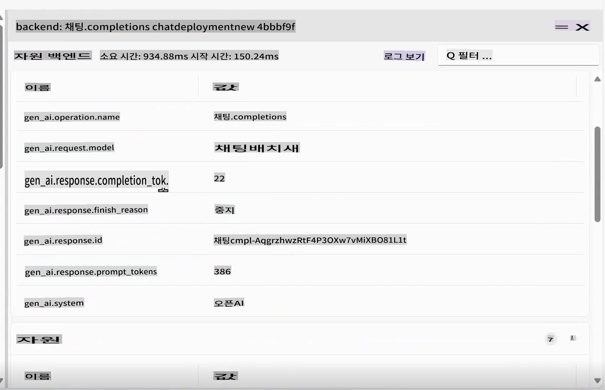

# Canonical Generative AI Samples

이 문서에서는 실제 사례를 통해 학습한 개념들이 어떻게 적용되는지 확인할 수 있습니다.

---

## 목표

- GenAI(생성형 AI)가 기존 애플리케이션에 어떻게 통합되는지 확인합니다.
- 복잡한 시나리오에서 에이전트가 어떻게 작동하는지 이해합니다.

## 포함된 샘플
- [Canonical Generative AI Samples](../../../04-PracticalSamples)
  - [목표](../../../04-PracticalSamples)
  - [포함된 샘플](../../../04-PracticalSamples)
  - [eShopLite 데모](../../../04-PracticalSamples)
    - [eShopLite와 시맨틱 검색 - 메모리 내 검색](../../../04-PracticalSamples)
    - [eShopLite와 시맨틱 검색 - Azure AI Search 활용](../../../04-PracticalSamples)
    - [eShopLite와 실시간 오디오](../../../04-PracticalSamples)
  - [Creative Writer Agent](../../../04-PracticalSamples)
  - [요약](../../../04-PracticalSamples)
    - [추가 자료](../../../04-PracticalSamples)
    - [다음 단계](../../../04-PracticalSamples)

[](https://youtu.be/Ky4CACXJqR8?feature=shared)

_⬆️ 이미지를 클릭하면 영상을 볼 수 있습니다 ⬆️_

## eShopLite 데모

첫 번째 데모에서는 **eShopLite** 프로젝트를 탐색합니다. **eShopLite**는 아웃도어 장비와 캠핑 용품을 위한 간단한 전자상거래 애플리케이션으로, 시맨틱 검색 기능 최적화, 고객 지원, 실시간 오디오 분석 등 생성형 AI 기능이 추가된 애플리케이션입니다.

이 데모는 [Azure OpenAI](https://azure.microsoft.com/products/ai-services/openai-service)와 [Azure AI Foundry Models](https://ai.azure.com/)을 사용하여 애플리케이션에서 생성형 AI 작업(추론)을 수행합니다.

첫 번째 데모에서는 Semantic Kernel을 활용하여 사용자의 쿼리 맥락을 이해하고 정확한 결과를 제공하는 검색 기능을 개선하는 방법을 보여줍니다.

### eShopLite와 시맨틱 검색

[](https://youtu.be/FlkruF6USro?feature=shared)

_⬆️ 이미지를 클릭하면 영상을 볼 수 있습니다 ⬆️_

eShopLite와 시맨틱 검색에서는 Semantic Kernel을 활용해 전자상거래 애플리케이션의 검색 기능을 강화합니다. Semantic Kernel은 사용자의 쿼리 맥락을 이해하고 보다 정확한 결과를 제공하는 강력한 검색 엔진을 생성하는 데 도움을 줍니다.

예를 들어, 사용자가 "요리에 쓸 만한 게 있나요?"라고 검색하면, 검색 엔진은 사용자가 주방용품을 찾고 있다는 것을 이해하고 가장 관련성이 높은 제품(샘플에서는 캠핑 조리기구)을 보여줍니다.

> 🧑‍💻**샘플**: [eShopLite 시맨틱 검색 샘플](https://aka.ms/netaieshoplitesemanticsearch)을 확인해보세요.



시맨틱 검색은 사용자가 원하는 제품을 더 쉽게 찾을 수 있도록 도와 쇼핑 경험을 개선하고 판매를 증가시킵니다. 이 기능을 구현하려면 제품 벡터 저장소, 검색 인덱스, 언어 모델이 필요합니다. [.NET Aspire](https://learn.microsoft.com/dotnet/aspire/get-started/aspire-overview) 도구는 백엔드에서 모든 프로세스를 조율하는 데 도움을 줍니다.



.NET Aspire 대시보드에서는 제품, SQL, 저장소 컨테이너를 볼 수 있으며, 이는 언어 모델과 상호작용할 수 있습니다. Aspire App Host를 자세히 살펴보면 다음과 같습니다:

```csharp
if (builder.ExecutionContext.IsPublishMode)
{
    // Add the Azure Application Insights for monitoring
    var appInsights = builder.AddAzureApplicationInsights("appInsights");
    // Add the Azure OpenAI for the chat and embeddings deployments, the embedding is used for the vector entities
    var chatDeploymentName = "gpt-4o-mini";
    var embeddingsDeploymentName = "text-embedding-ada-002";
    var aoai = builder.AddAzureOpenAI("openai")
        .AddDeployment(new AzureOpenAIDeployment(chatDeploymentName,
        "gpt-4o-mini",
        "2024-07-18",
        "GlobalStandard",
        10))
        .AddDeployment(new AzureOpenAIDeployment(embeddingsDeploymentName,
        "text-embedding-ada-002",
        "2"));

    products.WithReference(appInsights)
        .WithReference(aoai)
        .WithEnvironment("AI_ChatDeploymentName", chatDeploymentName)
        .WithEnvironment("AI_embeddingsDeploymentName", embeddingsDeploymentName);

    store.WithReference(appInsights)
        .WithExternalHttpEndpoints();
}
```

위 코드는 Azure Application Insights를 모니터링에 추가하고, Azure OpenAI를 채팅 및 임베딩 배포에 사용하며, 벡터 엔터티에 사용되는 임베딩을 추가하는 방법을 보여줍니다.

임베딩과 AOAI 생성을 위해, 이는 제품 컨테이너에서 찾을 수 있습니다. 예:

```csharp
var azureOpenAiClientName = "openai";
builder.AddAzureOpenAIClient(azureOpenAiClientName);

// get azure openai client and create Chat client from aspire hosting configuration
builder.Services.AddSingleton<ChatClient>(serviceProvider =>
{
    var chatDeploymentName = "gpt-4o-mini";
    var logger = serviceProvider.GetService<ILogger<Program>>()!;
    logger.LogInformation($"Chat client configuration, modelId: {chatDeploymentName}");
    ChatClient chatClient = null;
    try
    {
        OpenAIClient client = serviceProvider.GetRequiredService<OpenAIClient>();
        chatClient = client.GetChatClient(chatDeploymentName);
    }...
}
```

위 코드는 Azure OpenAI 클라이언트를 가져오고 Aspire 호스팅 구성에서 Chat 클라이언트를 생성하는 방법을 보여줍니다. `chatDeploymentName`은 애플리케이션에서 사용되는 배포의 이름입니다. 동일한 프로세스가 임베딩 클라이언트를 생성하는 데도 사용됩니다. 예:

```csharp
// get azure openai client and create embedding client from aspire hosting configuration
builder.Services.AddSingleton<EmbeddingClient>(serviceProvider =>
{
    var embeddingsDeploymentName = "text-embedding-ada-002";
    var logger = serviceProvider.GetService<ILogger<Program>>()!;
    logger.LogInformation($"Embeddings client configuration, modelId: {embeddingsDeploymentName}");
    EmbeddingClient embeddingsClient = null;
    try
    {
        OpenAIClient client = serviceProvider.GetRequiredService<OpenAIClient>();
        embeddingsClient = client.GetEmbeddingClient(embeddingsDeploymentName);
    }...
});
```

이를 통해 사용자의 쿼리와 비교하고 가장 관련성 높은 제품을 반환하는 `MemoryContext`를 생성할 수 있습니다. 예:

```csharp
// Iterate over the products and add them to the memory
_logger.LogInformation("Adding product to memory: {Product}", product.Name);
var productInfo = $"[{product.Name}] is a product that costs [{product.Price}] and is described as [{product.Description}]";

// Create a new product vector
var productVector = new ProductVector
{
    Id = product.Id,
    Name = product.Name,
    Description = product.Description,
    Price = product.Price,
    ImageUrl = product.ImageUrl
};

// Generate the embedding for the product information
var result = await _embeddingClient.GenerateEmbeddingAsync(productInfo);

// Convert the embedding result to a float array and assign it to the product vector
productVector.Vector = result.Value.ToFloats();
var recordId = await _productsCollection.UpsertAsync(productVector);
_logger.LogInformation("Product added to memory: {Product} with recordId: {RecordId}", product.Name, recordId);
```

위 코드는 제품을 반복하며 메모리에 추가하는 방법을 보여줍니다.

새로운 제품 벡터를 생성한 후, 제품 정보를 위한 임베딩을 생성하고 결과를 float 배열로 변환하여 제품 벡터에 할당합니다.

`_productsCollection`을 보면 제품이 저장된 컨테이너를 참조하며, CosmosDB 호출을 사용하여 `recordId`에 대한 응답을 얻습니다. 이 경우, 로깅 목적으로 사용됩니다.

제품은 메모리에 추가되며, 컬렉션의 각 제품에 대해 이 과정을 반복합니다.

그 후, 사용자가 제품을 검색하면 사용자의 쿼리와 제품 벡터를 비교하여 가장 관련성 높은 제품을 반환할 수 있습니다.

```csharp
try
{
    // Generate embedding for the search query
    var result = await _embeddingClient.GenerateEmbeddingAsync(search);
    var vectorSearchQuery = result.Value.ToFloats();

    var searchOptions = new VectorSearchOptions()
    {
        Top = 1, // Retrieve the top 1 result
        VectorPropertyName = "Vector"
    };

    // Search the vector database for the most similar product
    var searchResults = await _productsCollection.VectorizedSearchAsync(vectorSearchQuery, searchOptions);
    double searchScore = 0.0;
    await foreach (var searchItem in searchResults.Results)
    {
        if (searchItem.Score > 0.5)
        {
            // Product found, retrieve the product details
            firstProduct = new Product
            {
                Id = searchItem.Record.Id,
                Name = searchItem.Record.Name,
                Description = searchItem.Record.Description,
                Price = searchItem.Record.Price,
                ImageUrl = searchItem.Record.ImageUrl
            };

            searchScore = searchItem.Score.Value;
            responseText = $"The product [{firstProduct.Name}] fits with the search criteria [{search}][{searchItem.Score.Value.ToString("0.00")}]";
            _logger.LogInformation($"Search Response: {responseText}");
        }
    }

    // Generate a friendly response message using the found product information
    var prompt = @$"You are an intelligent assistant helping clients with their search about outdoor products. Generate a catchy and friendly message using the following information:
    - User Question: {search}
    - Found Product Name: {firstProduct.Name}
    - Found Product Description: {firstProduct.Description}
    - Found Product Price: {firstProduct.Price}
    Include the found product information in the response to the user question.";

    var messages = new List<ChatMessage>
    {
        new SystemChatMessage(_systemPrompt),
        new UserChatMessage(prompt)
    };

    _logger.LogInformation("{ChatHistory}", JsonConvert.SerializeObject(messages));

    var resultPrompt = await _chatClient.CompleteChatAsync(messages);
}
```

위 코드는 검색 쿼리를 위한 임베딩을 생성하고, 벡터 데이터베이스에서 가장 유사한 제품을 검색하며, 검색된 제품 정보를 사용하여 응답 메시지를 생성하는 방법을 보여줍니다.

이를 통해 사용자가 원하는 제품을 더 쉽게 찾을 수 있도록 하여 쇼핑 경험을 개선하고 판매를 증가시킬 수 있습니다.

더 나아가, 생성형 AI가 발전함에 따라 사용자의 행동을 이해하고 검색 엔진을 개선하기 위해 텔레메트리와 모니터링이 필요합니다. 이때 Azure Application Insights와 .NET Aspire가 유용합니다.



.NET Aspire는 검색 엔진, 백엔드 서비스, AI 모델과 같은 애플리케이션의 동작을 모니터링하고 추적할 수 있는 강력한 도구 세트를 제공합니다. 이러한 추적 기능은 병목현상, 오류, 성능 문제를 이해하고 애플리케이션을 최적화하여 더 나은 사용자 경험을 제공하는 데 도움을 줍니다.



텔레메트리는 사용자의 행동을 이해하고 서비스를 개선하는 데 필수적입니다. 이를 위해 Azure Application Insights를 도입하여 애플리케이션의 성능과 사용자 상호작용을 모니터링합니다.

Application Insights는 포괄적인 텔레메트리 데이터를 제공하여 서비스 성능, 사용자 상호작용, 클라우드 사용량 등을 이해할 수 있도록 돕습니다.

이미지에서는 Application Insights 대시보드를 볼 수 있으며, 데이터베이스 호출, 요청 수, 응답 시간 등 서비스 성능에 대한 정보를 제공합니다.

> 💡 **전문가 팁**: eShopLite의 시맨틱 검색에 대한 자세한 정보는 레포지토리를 참조하세요: https://aka.ms/netaieshoplitesemanticsearch

### eShopLite와 시맨틱 검색 - Azure AI Search 활용

eShopLite의 엔드 투 엔드 데모에서는 **Azure AI Search**를 활용하여 전자상거래 애플리케이션의 검색 기능을 강화합니다. Azure AI Search는 사용자의 쿼리 맥락을 이해하고 보다 정확한 결과를 제공하는 강력한 검색 엔진을 생성하는 데 도움을 줍니다.

또한, 대량의 데이터와 사용자 쿼리를 처리할 수 있는 더 확장 가능하고 신뢰할 수 있는 검색 엔진을 제공합니다. Azure AI Search는 검색 인덱스를 유지하므로 애플리케이션이 재시작되더라도 정보가 유지됩니다.

- [eShopLite와 Azure AI Search](https://aka.ms/netaieshoplitesemanticsearchazureaisearch)

### eShopLite와 실시간 오디오

[](https://youtu.be/bx0hRNdr_bQ?feature=shared)

_⬆️ 이미지를 클릭하면 영상을 볼 수 있습니다 ⬆️_

eShopLite와 실시간 오디오에서는 GPT-4o의 실시간 오디오 기능을 활용하여 고객과 챗봇 간의 대화를 분석하고 보다 개인화되고 몰입감 있는 경험을 제공합니다. 예를 들어, 고객이 제품 추천을 요청하면 챗봇은 고객의 요청을 실시간으로 분석하여 보다 정확하고 관련성 높은 응답을 제공합니다.

> 🧑‍💻**샘플**: [eShopLite 실시간 채팅 샘플](https://aka.ms/netaieshopliterealtimechat)을 확인해보세요.


이 기능을 구현하려면 Realtime Analysis를 위한 엔드포인트를 생성하는 새로운 기능을 구현해야 합니다. 이는 `StoreRealtime\ConversationManager.cs`에서 찾을 수 있습니다.

```csharp
public async Task RunAsync(
    Stream audioInput, 
    Speaker audioOutput, 
    Func<string, Task> addMessageAsync, 
    Func<string, bool, Task> addChatMessageAsync, 
    CancellationToken cancellationToken)
{
    // Define the initial prompt for the assistant
    var prompt = $"""
        You are a useful assistant.
        Respond as succinctly as possible, in just a few words.
        Check the product database and external sources for information.
        The current date is {DateTime.Now.ToLongDateString()}
        """;
```

먼저, 어시스턴트를 위한 초기 프롬프트를 정의하여 사용자에게 챗봇과 상호작용하는 방법에 대한 지침을 제공합니다. 명확하고 간결한 프롬프트를 사용하는 것이 중요하며, 프롬프트 엔지니어링은 AI 모델에서 정확한 결과를 얻는 데 필수적입니다.

```csharp
// Notify the user that the connection is being established
await addMessageAsync("Connecting...");

// Send an initial greeting message
await addChatMessageAsync("Hello, how can I help?", false);

// Create AI functions for semantic search and product name search
var contosoSemanticSearchTool = AIFunctionFactory.Create(_contosoProductContext.SemanticSearchOutdoorProductsAsync);
var contosoSearchByProductNameTool = AIFunctionFactory.Create(_contosoProductContext.SearchOutdoorProductsByNameAsync);

// Add the AI functions to a list of tools
List<AIFunction> tools = new List<AIFunction> { contosoSemanticSearchTool, contosoSearchByProductNameTool };
```

그런 다음, 사용자가 대화를 시작할 준비가 되었음을 알리고 초기 환영 메시지를 보냅니다. 이후 AI 기능을 생성하여 제품 검색, 시맨틱 검색, 제품 이름별 검색을 추가합니다. 이는 사용자의 쿼리에 대한 관련 정보를 제공하는 데 사용될 수 있습니다.

```csharp
// Configure the conversation session options
var sessionOptions = new ConversationSessionOptions()
{
    Instructions = prompt,
    Voice = ConversationVoice.Shimmer,
    InputTranscriptionOptions = new() { Model = "whisper-1" },
};

// Add each tool to the session options
foreach (var tool in tools)
{
    sessionOptions.Tools.Add(tool.ToConversationFunctionTool());
}

// Start the conversation session with the configured options
session = await client.StartConversationSessionAsync(cancellationToken);
await session.ConfigureSessionAsync(sessionOptions);

// Initialize a StringBuilder to store the output transcription
var outputTranscription = new StringBuilder();
```

대화 세션 옵션을 구성하며, 여기에는 지침, 음성, 입력 전사 옵션이 포함됩니다. 입력 전사에는 `Whisper-1` 모델을 사용합니다.

각 도구는 세션 옵션에 추가되며, 구성된 옵션으로 대화 세션이 시작됩니다. 이러한 옵션은 사용자의 요구에 맞게 조정할 수 있습니다.

> 🧑‍💻**샘플**: [eShopLite 실시간 채팅 샘플](https://aka.ms/netaieshopliterealtimechat)을 확인해보세요.

## Creative Writer Agent

[](https://youtu.be/ZjZWilI_5z8?feature=shared)

_⬆️ 이미지를 클릭하면 영상을 볼 수 있습니다 ⬆️_

에이전트는 현재 AI 환경에서 중요한 주제입니다. 이를 보여주기 위해 Creative Writer Agent를 사용합니다. 이 도구는 사용자의 입력에 기반하여 창의적이고 매력적인 텍스트를 생성하며, 연구된 구체적이고 흥미로운 콘텐츠를 작성하는 데 도움을 줍니다.

> 🧑‍💻**샘플**: [Creative Writer Agent 샘플 코드](https://aka.ms/netaicreativewriter)를 확인해보세요.



이 솔루션은 고품질 콘텐츠 생성을 위해 네 가지 주요 모듈로 구성됩니다:

- Researcher: Bing 검색을 활용해 맥락, 주제, 데이터를 수집한 후 이를 간결하게 요약합니다.
- Marketing: 사용자의 의도를 해석하고 관련 질문을 구성하며, Vector DB를 활용해 정확한 결과를 제공합니다.
- Writer: Researcher와 Marketing에서 얻은 결과를 종합해 기사를 작성합니다.
- Editor: 초안을 검토하고 수정 사항을 제안하며, 게시 준비가 되었는지 판단합니다.

이 워크플로는 Semantic Kernel, Microsoft AI Extension, .NET Aspire에 의해 조율되며 관련 데이터를 통합하고 효과적인 메시징 및 검토 과정을 포함합니다.



구성 요소들이 서로 어떻게 상호작용하는지 이해하면 자체 에이전틱 애플리케이션을 설계하는 데 참고할 수 있습니다. 아래 코드를 통해 구성 요소들이 서로 어떻게 상호작용하는지 확인해보세요. 먼저 `ChatController.cs`에서 Creative Writer로의 호출을 살펴보겠습니다:

```csharp
var userInput = request.Messages.Last();

// Deserialize the user input content into a CreateWriterRequest object
CreateWriterRequest createWriterRequest = _yamlDeserializer.Deserialize<CreateWriterRequest>(userInput.Content);

// Create a new session for the Creative Writer application
var session = await _creativeWriterApp.CreateSessionAsync(Response);

// Process the streaming request and write the response in real-time
await foreach (var delta in session.ProcessStreamingRequest(createWriterRequest))
{
    // Serialize the delta and write it to the response stream and flush
    await response.WriteAsync($"{JsonSerializer.Serialize(delta)}\r\n");
    await response.Body.FlushAsync();
}
```

`CreateWriterRequest` needs to have three properties: `Research`, `Products`, and `Writing`. After getting them setted by processing the request, it calls the `CreateSessionAsync` 메서드는 다음과 같습니다:

```csharp
internal async Task<CreativeWriterSession> CreateSessionAsync(HttpResponse response)
{
    // Add custom function invocation filters to handle response modifications
    defaultKernel.FunctionInvocationFilters.Add(new FunctionInvocationFilter(response));

    // Create a separate kernel for Bing search integration and intialize the Bing service, and create a plugin for Bing search
    Kernel bingKernel = defaultKernel.Clone();
    BingTextSearch textSearch = new(apiKey: configuration["BingAPIKey"]!);
    KernelPlugin searchPlugin = textSearch.CreateWithSearch("BingSearchPlugin");
    bingKernel.Plugins.Add(searchPlugin);

    // Clone the default kernel to set up the vector search capabilities, and create the vector search kernel
    Kernel vectorSearchKernel = defaultKernel.Clone();
    await ConfigureVectorSearchKernel(vectorSearchKernel);

    // Return a new session encapsulating all configured kernels for comprehensive AI functionalities
    return new CreativeWriterSession(defaultKernel, bingKernel, vectorSearchKernel);
}
```

이제 `CreativeWriterSession` class for the `ProcessStreamingRequest` function, to understand how the components interact with each other, first look at the `Research` and `Marketing` 구성 요소를 확인해보겠습니다:

```csharp
// Initialize the Researcher Agent with a specific prompt template.
// This agent leverages the Bing Kernel for enhanced semantic search capabilities.
ChatCompletionAgent researcherAgent = new(ReadFileForPromptTemplateConfig("./Agents/Prompts/researcher.yaml"))
{
    Name = ResearcherName,
    Kernel = bingKernel,
    Arguments = CreateFunctionChoiceAutoBehavior(),
    LoggerFactory = bingKernel.LoggerFactory
};

// Initialize the Marketing Agent with its own prompt template.
// This agent utilizes the Vector Search Kernel to handle product-related queries efficiently.
ChatCompletionAgent marketingAgent = new(ReadFileForPromptTemplateConfig("./Agents/Prompts/marketing.yaml"))
{
    Name = MarketingName,
    Kernel = vectorSearchKernel,
    Arguments = CreateFunctionChoiceAutoBehavior(),
    LoggerFactory = vectorSearchKernel.LoggerFactory
};

// ...

// Invoke the Researcher Agent asynchronously with the provided research context.
await foreach (ChatMessageContent response in researcherAgent.InvokeAsync(
    new object[] { }, 
    new Dictionary<string, string> { { "research_context", createWriterRequest.Research } }))
{
    // Aggregate the research results for further processing or display.
    sbResearchResults.AppendLine(response.Content);
    
    yield return new AIChatCompletionDelta(Delta: new AIChatMessageDelta
    {
        Role = AIChatRole.Assistant,
        Context = new AIChatAgentInfo(ResearcherName),
        Content = response.Content,
    });
}

// ...

// Invoke the Marketing Agent with the provided product context.
await foreach (ChatMessageContent response in marketingAgent.InvokeAsync(
    new object[] { },
    new Dictionary<string, string> { { "product_context", createWriterRequest.Products } }))
{
    // Consolidate the product-related results for use in marketing strategies or user feedback.
    sbProductResults.AppendLine(response.Content);
    
    yield return new AIChatCompletionDelta(Delta: new AIChatMessageDelta
    {
        Role = AIChatRole.Assistant,
        Context = new AIChatAgentInfo(MarketingName),
        Content = response.Content,
    });
}
```

이제 `Writer` and `Editor` 에이전트를 초기화하고 구성합니다. 코드는 다음과 같습니다:

```csharp
// Initialize the Writer Agent with its specific prompt configuration
ChatCompletionAgent writerAgent = new(ReadFileForPromptTemplateConfig("./Agents/Prompts/writer.yaml"))
{
    Name = WriterName, 
    Kernel = kernel, /
    Arguments = new Dictionary<string, string>(), 
    LoggerFactory = kernel.LoggerFactory 
};

// Initialize the Editor Agent with its specific prompt configuration
ChatCompletionAgent editorAgent = new(ReadFileForPromptTemplateConfig("./Agents/Prompts/editor.yaml"))
{
    Name = EditorName, 
    Kernel = kernel, 
    LoggerFactory = kernel.LoggerFactory
};

// Populate the Writer Agent with contextual data required for generating content, gathered from the User, Researcher and Marketing Agents
writerAgent.Arguments["research_context"] = createWriterRequest.Research;
writerAgent.Arguments["research_results"] = sbResearchResults.ToString();
writerAgent.Arguments["product_context"] = createWriterRequest.Products;
writerAgent.Arguments["product_results"] = sbProductResults.ToString();
writerAgent.Arguments["assignment"] = createWriterRequest.Writing;

// Configure the Agent Group Chat to manage interactions between Writer and Editor
AgentGroupChat chat = new(writerAgent, editorAgent)
{
    LoggerFactory = kernel.LoggerFactory,
    ExecutionSettings = new AgentGroupChatSettings
    {
        // Define the strategy for selecting which agent interacts next
        SelectionStrategy = new SequentialSelectionStrategy() 
        { 
            InitialAgent = writerAgent // Start the conversation with the Writer Agent
        },
        // Define the termination condition for the agent interactions, in this case, the Editor Agent will terminate the conversation
        TerminationStrategy = new NoFeedbackLeftTerminationStrategy()
    }
};
```

.NET Aspire에서는 구성 요소들이 사용자에게 매끄러운 경험을 제공하기 위해 어떻게 조율되는지 확인할 수 있습니다. 추적 기능을 통해 에이전트 간의 상호작용을 모니터링하고, 텔레메트리 기능은 사용자의 행동과 AI 모델의 성능에 대한 통찰을 제공합니다.




> 🧑‍💻**샘플**: [Creative Writing Agent 샘플 코드](https://aka.ms/netaicreativewriter)를 확인해 보세요.

## 요약

위는 GenAI를 애플리케이션에서 활용할 수 있는 몇 가지 예시일 뿐입니다. 가능성은 무궁무진하며, 기술은 빠르게 발전하고 있습니다. GenAI에 대해 더 배우고 이를 프로젝트에 활용하는 방법을 알아보려면 우리의 자료를 확인해 보세요.

> 🙋 **도움이 필요하신가요?**: 문제가 발생하면 저장소에 이슈를 등록해 주세요.

### 추가 자료

- [DeepSeek을 활용한 eShopLite](https://aka.ms/netaieshoplitedeepseekr1)
- [Azure AI Search를 활용한 eShopLite](https://aka.ms/netaieshoplitesemanticsearchazureaisearch)

### 다음 단계

책임 있는 AI 실천법에 대해 배우고, AI 모델이 윤리적이며 긍정적인 영향을 미칠 수 있도록 하는 방법을 알아보세요!

👉 [책임 있는 AI](../05-ResponsibleGenAI/readme.md)

**면책 조항**:  
이 문서는 기계 기반 AI 번역 서비스를 사용하여 번역되었습니다. 정확성을 위해 노력하고 있으나, 자동 번역에는 오류나 부정확성이 포함될 수 있습니다. 원본 문서(모국어로 작성된 문서)를 신뢰할 수 있는 권위 있는 자료로 간주해야 합니다. 중요한 정보의 경우, 전문적인 인간 번역을 권장합니다. 이 번역 사용으로 인해 발생하는 오해나 잘못된 해석에 대해 당사는 책임을 지지 않습니다.