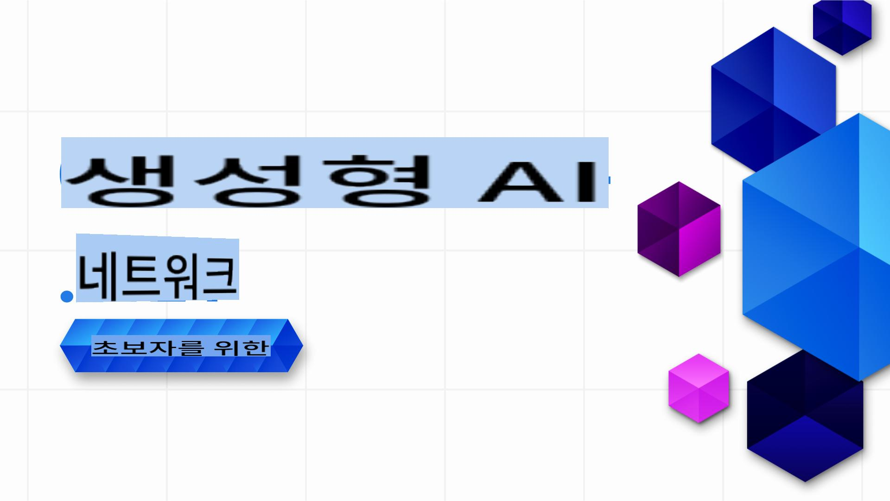

# 초보자를 위한 Generative AI .NET - 강좌

### .NET에서 Generative AI 애플리케이션을 구축하는 방법을 배우는 실습 강좌

**초보자를 위한 Generative AI .NET**에 오신 것을 환영합니다. 이 강좌는 .NET 개발자들이 Generative AI의 세계로 뛰어들 수 있도록 돕는 실습 중심의 강좌입니다!

이 강좌는 단순히 이론만 제공하고 끝나는 강좌가 아닙니다. 이 저장소는 **현실 세계의 애플리케이션**과 **라이브 코딩**을 통해 .NET 개발자들이 Generative AI를 최대한 활용할 수 있도록 설계되었습니다.

이 강좌는 **실습 위주**, **실용적**, 그리고 무엇보다도 **재미있게** 진행됩니다!

이 저장소를 [즐겨찾기(🌟)](https://docs.github.com/en/get-started/exploring-projects-on-github/saving-repositories-with-stars)해 두어 나중에 쉽게 찾으세요. 

➡️ [이 저장소를 포크(Fork)](https://github.com/microsoft/Generative-AI-for-beginners-dotnet/fork)하여 자신의 저장소에서 쉽게 확인할 수 있습니다.

## ✨ 새로운 소식!

우리는 최신 AI 도구, 모델 및 실용적인 샘플로 이 강좌를 지속적으로 개선하고 있습니다:

- **새로운 기능: Azure OpenAI Sora 비디오 생성 데모!**
  - 레슨 3에서는 Azure OpenAI의 새로운 [Sora 비디오 생성 모델](https://learn.microsoft.com/azure/ai-services/openai/concepts/video-generation)을 사용하여 텍스트 프롬프트에서 비디오를 생성하는 방법을 보여주는 실습 데모를 제공합니다.
  - 이 샘플은 다음 방법을 보여줍니다:
    - 창의적인 프롬프트로 비디오 생성 작업을 제출하기.
    - 작업 상태를 폴링하고 결과 비디오 파일을 자동으로 다운로드하기.
    - 생성된 비디오를 데스크톱에 저장하여 쉽게 보기.
  - 공식 문서 보기: [Azure OpenAI Sora 비디오 생성](https://learn.microsoft.com/azure/ai-services/openai/concepts/video-generation)
  - 샘플 찾기: [레슨 3: 핵심 생성 AI 기술 /src/VideoGeneration-AzureSora-01/Program.cs](../03-CoreGenerativeAITechniques/src/VideoGeneration-AzureSora-01/Program.cs)

- **새로운 기능: Azure OpenAI 이미지 생성 모델 (`gpt-image-1`)**: 레슨 3에서는 새로운 Azure OpenAI 이미지 생성 모델인 `gpt-image-1`을 사용하는 코드 샘플을 제공합니다. 최신 Azure OpenAI 기능을 사용하여 .NET에서 이미지를 생성하는 방법을 배워보세요.
  - 공식 문서 보기: [Azure OpenAI 이미지 생성 모델 사용 방법](https://learn.microsoft.com/azure/ai-services/openai/how-to/dall-e?tabs=gpt-image-1) 및 [openai-dotnet 이미지 생성 가이드](https://github.com/openai/openai-dotnet?tab=readme-ov-file#how-to-generate-images)에서 자세한 내용을 확인하세요.
  - 샘플 찾기: [레슨 3: 핵심 생성 AI 기술 .. /src/ImageGeneration-01.csproj](../03-CoreGenerativeAITechniques/src/ImageGeneration-01/ImageGeneration-01.csproj).

- **새로운 시나리오: eShopLite의 동시 에이전트 오케스트레이션**: [eShopLite 저장소](https://github.com/Azure-Samples/eShopLite/tree/main/scenarios/07-AgentsConcurrent)에서는 Semantic Kernel을 사용한 동시 에이전트 오케스트레이션을 보여주는 시나리오를 제공합니다. 이 시나리오는 여러 에이전트가 병렬로 작업하여 사용자 쿼리를 분석하고 향후 분석을 위한 귀중한 통찰력을 제공하는 방법을 보여줍니다.

[새로운 소식 섹션에서 모든 이전 업데이트 보기](./10-WhatsNew/readme.md)

## 🚀 소개

Generative AI는 소프트웨어 개발의 패러다임을 변화시키고 있으며, .NET도 예외가 아닙니다. 이 강좌는 다음을 제공하여 여러분의 여정을 간소화합니다:

- 각 강의마다 5~10분 분량의 짧은 동영상.
- 실행 가능한 완전한 .NET 코드 샘플.
- **GitHub Codespaces** 및 **GitHub Models**와 같은 도구와의 통합으로 빠르고 간단한 환경 설정. 물론, 로컬에서 자신의 모델로 샘플을 실행하는 것도 가능합니다.

여러분은 **GitHub Models**, **Azure OpenAI Services**, 그리고 **Ollama와 같은 로컬 모델**을 사용하여 기본 텍스트 생성부터 완전한 솔루션 구축까지 .NET 프로젝트에 Generative AI를 구현하는 방법을 배우게 됩니다.

## 📦 각 강의 구성

- **짧은 동영상**: 강의를 간략히 소개하는 5~10분 분량의 영상.
- **완전한 코드 샘플**: 실행 가능한 완전한 코드.
- **단계별 가이드**: 개념을 배우고 구현할 수 있도록 돕는 간단한 지침.
- **심화 참고자료**: 이 강좌는 Generative AI의 실용적 구현에 초점을 맞추고 있으며, 이론적인 내용을 더 깊이 이해하고자 할 경우 [Generative AI for Beginners - A Course](https://github.com/microsoft/generative-ai-for-beginners)의 자료로 연결됩니다.

## 🗃️ 강의 목록

| #   | **강의 링크** | **설명** |
| --- | --- | --- |
| 01  | [**.NET 개발자를 위한 Generative AI 기본 소개**](./01-IntroToGenAI/readme.md) | <ul><li>Generative 모델과 .NET에서의 활용 개요</li></ul> |
| 02  | [**Generative AI와 함께 .NET 개발 환경 설정하기**](./02-SetupDevEnvironment/readme.md) | <ul><li>**Microsoft.Extensions.AI** 및 **Semantic Kernel**과 같은 라이브러리 사용.</li><li>GitHub Models, Azure AI Foundry, Ollama와 같은 환경 설정.</li></ul> |
| 03  | [**.NET에서 핵심 Generative AI 기술 배우기**](./03-CoreGenerativeAITechniques/readme.md) | <ul><li>텍스트 생성 및 대화 흐름.</li><li>멀티모달 기능(비전 및 오디오).</li><li>에이전트 활용</li></ul> |
| 04  | [**실용적인 .NET Generative AI 샘플**](./04-PracticalSamples/readme.md) | <ul><li>현실 세계에서의 GenAI 활용 샘플</li><li>시맨틱 검색 애플리케이션.</li><li>다중 에이전트 애플리케이션</li></ul> |
| 05  | [**.NET 애플리케이션에서 Generative AI의 책임 있는 사용**](./05-ResponsibleGenAI/readme.md) | <ul><li>윤리적 고려 사항, 편향 완화 및 안전한 구현.</li></ul> |

## 🌐 다국어 지원

| 언어                | 코드 | 번역된 README 링크                                      | 마지막 업데이트 |
|---------------------|------|---------------------------------------------------------|----------------|
| 중국어(간체)        | zh   | [중국어 번역](../zh/README.md)              | 2025-02-19    |
| 중국어(번체)        | tw   | [중국어 번역](../tw/README.md)              | 2025-02-19    |
| 프랑스어            | fr   | [프랑스어 번역](../fr/README.md)            | 2025-02-19    |
| 일본어              | ja   | [일본어 번역](../ja/README.md)              | 2025-02-19    |
| 한국어              | ko   | [한국어 번역](./README.md)              | 2025-02-19    |
| 포르투갈어          | pt   | [포르투갈어 번역](../pt/README.md)          | 2025-02-19    |
| 스페인어            | es   | [스페인어 번역](../es/README.md)            | 2025-02-19    |
| 독일어              | de   | [독일어 번역](../de/README.md)              | 2025-02-19    |

## 🛠️ 필요한 준비물

시작하려면 다음이 필요합니다:

1. [이 저장소를 포크(Fork)](https://github.com/microsoft/generative-ai-for-beginners-dotnet/fork)하여 자신의 GitHub 계정에 복사하세요. 무료 GitHub 계정으로도 충분합니다.

1. 즉시 코딩 환경을 사용할 수 있도록 **GitHub Codespaces 활성화**. 저장소 설정에서 GitHub Codespaces를 활성화하세요. GitHub Codespaces에 대한 자세한 내용은 [여기](https://docs.github.com/en/codespaces)를 참조하세요.

1. 이 저장소를 포크하거나 페이지 상단의 `Fork` 버튼을 사용하여 복사본을 만드세요.

1. 기본적인 **.NET 개발**에 대한 이해. .NET에 대해 더 알아보려면 [여기](https://dotnet.microsoft.com/learn/dotnet/what-is-dotnet)를 참조하세요.

이게 전부입니다.

우리는 이 강좌를 최대한 간단하게 설계했습니다. 다음과 같은 기능을 활용하여 빠르게 시작할 수 있습니다:

- **GitHub Codespaces에서 실행**: 한 번의 클릭으로 사전 구성된 환경에서 강의를 테스트하고 탐색할 수 있습니다.
- **GitHub Models 활용하기**: 이 저장소에서 직접 호스팅되는 AI 기반 데모를 체험해 보세요. 과정에서 더 자세히 설명드릴 예정입니다. *(GitHub Models에 대해 더 알고 싶다면, [여기](https://docs.github.com/github-models)를 클릭하세요.)*

확장을 준비되셨다면, 다음 가이드를 참고하세요:

- 확장성과 기업 환경에 적합한 솔루션을 위해 **Azure OpenAI Services**로 업그레이드하기.
- 향상된 프라이버시와 제어를 위해 로컬 하드웨어에서 모델을 실행하는 **Ollama** 사용하기.

## 🤝 도움을 주고 싶으신가요?

기여를 환영합니다! 다음과 같은 방식으로 참여하실 수 있습니다:

- 저장소에서 발생한 [문제나 버그를 보고](https://github.com/microsoft/Generative-AI-for-beginners-dotnet/issues/new)하세요.

- 기존 코드 샘플을 개선하거나 새로운 샘플을 추가하세요. 이 저장소를 포크하고 변경 사항을 제안하세요!
- 추가 레슨이나 개선점을 제안하세요.
- 제안 사항이 있거나 맞춤법 또는 코드 오류를 발견하셨나요? [풀 리퀘스트를 생성](https://github.com/microsoft/Generative-AI-for-beginners-dotnet/compare)하세요.

참여 방법에 대한 자세한 내용은 [CONTRIBUTING.md](CONTRIBUTING.md) 파일을 확인하세요.

## 📄 라이선스

이 프로젝트는 MIT 라이선스에 따라 제공됩니다. 자세한 내용은 [LICENSE](../../LICENSE) 파일을 확인하세요.

## 🌐 다른 강의

학습 여정을 돕기 위한 다양한 콘텐츠가 준비되어 있습니다. 아래 강의를 확인해 보세요:

- [초보자를 위한 생성형 AI](https://aka.ms/genai-beginners)
- [초보자를 위한 생성형 AI .NET](https://github.com/microsoft/Generative-AI-for-beginners-dotnet)
- [JavaScript로 배우는 생성형 AI](https://github.com/microsoft/generative-ai-with-javascript)
- [초보자를 위한 AI](https://aka.ms/ai-beginners)
- [초보자를 위한 AI 에이전트 - 강의](https://github.com/microsoft/ai-agents-for-beginners)
- [초보자를 위한 데이터 과학](https://aka.ms/datascience-beginners)
- [초보자를 위한 머신러닝](https://aka.ms/ml-beginners)
- [초보자를 위한 사이버 보안](https://github.com/microsoft/Security-101)
- [초보자를 위한 웹 개발](https://aka.ms/webdev-beginners)
- [초보자를 위한 IoT](https://aka.ms/iot-beginners)
- [초보자를 위한 XR 개발](https://github.com/microsoft/xr-development-for-beginners)
- [페어드 프로그래밍을 위한 GitHub Copilot 마스터하기](https://github.com/microsoft/Mastering-GitHub-Copilot-for-Paired-Programming)
- [C#/.NET 개발자를 위한 GitHub Copilot 마스터하기](https://github.com/microsoft/mastering-github-copilot-for-dotnet-csharp-developers)
- [GitHub Copilot 모험을 선택하세요](https://github.com/microsoft/CopilotAdventures)

[생성형 AI와 .NET 학습을 시작해봅시다!](02-SetupDevEnvironment/readme.md) 🚀

**면책 조항**:  
이 문서는 기계 기반 AI 번역 서비스를 사용하여 번역되었습니다. 정확성을 위해 최선을 다하고 있지만, 자동 번역에는 오류나 부정확성이 포함될 수 있습니다. 원어로 작성된 원본 문서를 신뢰할 수 있는 권위 있는 자료로 간주해야 합니다. 중요한 정보의 경우, 전문적인 인간 번역을 권장합니다. 이 번역 사용으로 인해 발생하는 오해나 잘못된 해석에 대해 당사는 책임을 지지 않습니다.