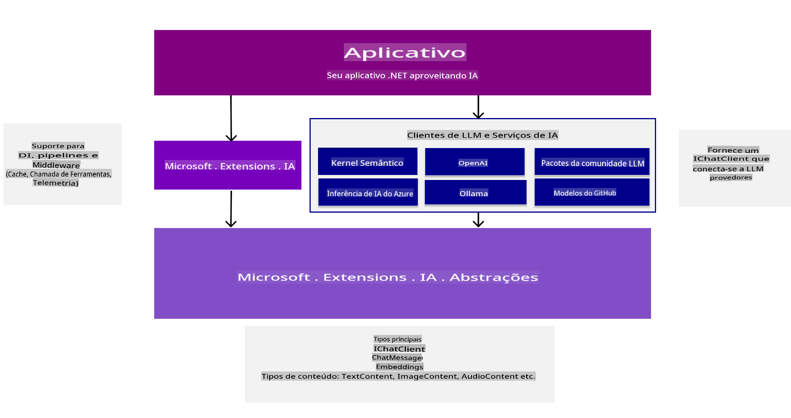
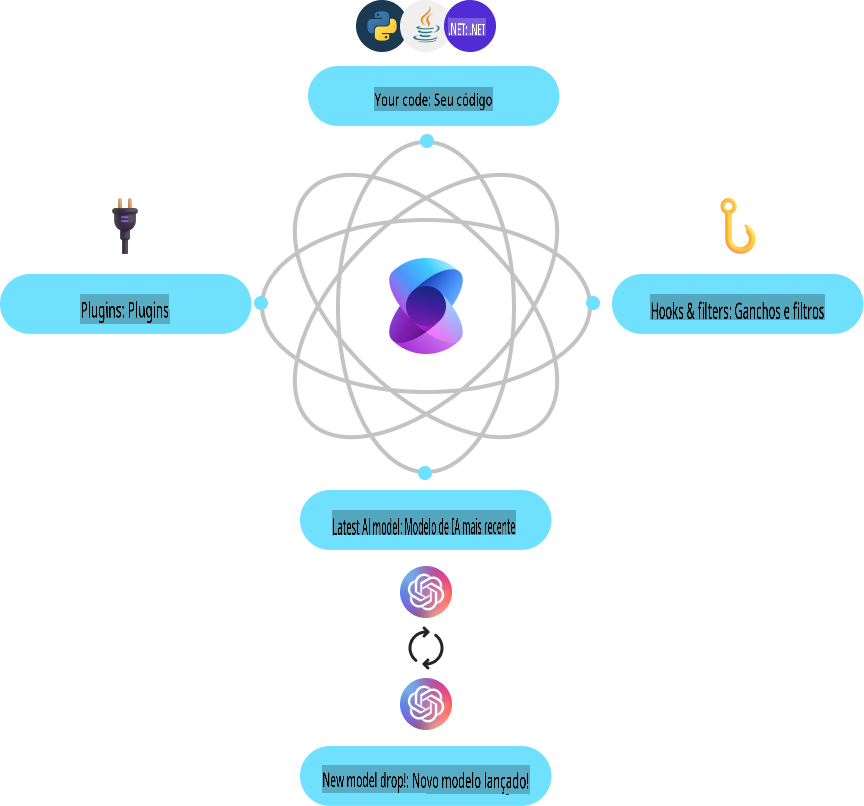
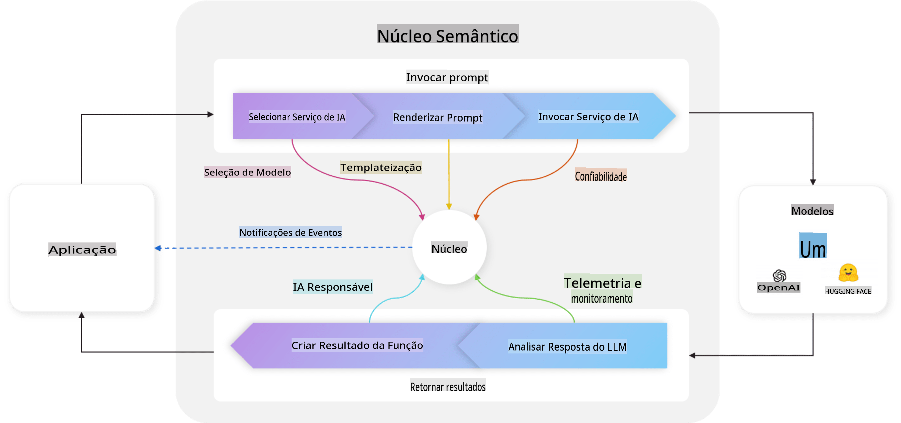
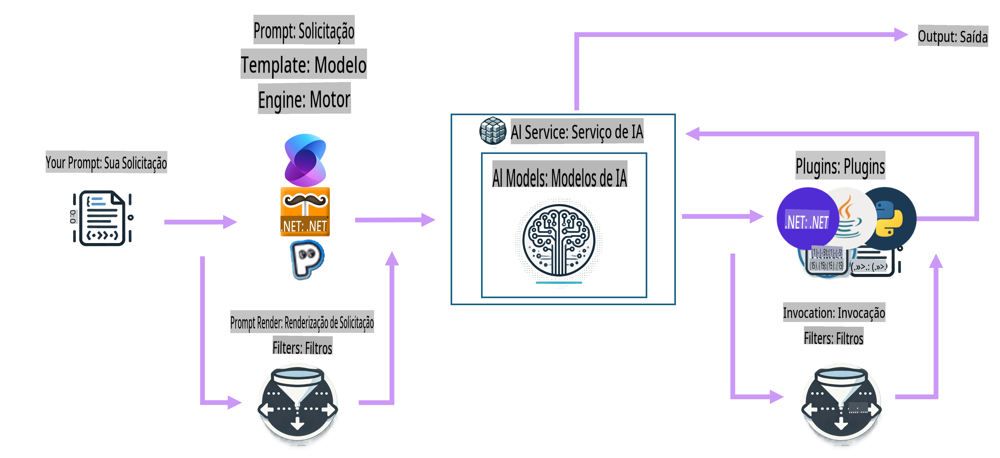

# Introdução às Ferramentas de Desenvolvimento de IA

Atualize seus conhecimentos sobre IA generativa e entenda as ferramentas do .NET disponíveis para ajudar você a desenvolver aplicações de IA generativa.

---

[](http://www.youtube.com/watch?v=SZvE_meBdvg)

_⬆️Clique na imagem para assistir ao vídeo⬆️_

## O que você aprenderá nesta lição:

- 🌟 Compreender os conceitos fundamentais de IA generativa e suas aplicações
- 🔍 Explorar as ferramentas do .NET para desenvolvimento de IA, incluindo MEAI, Semantic Kernel e Azure OpenAI

## Fundamentos de IA Generativa para .NET

Antes de mergulharmos no código, vamos tirar um momento para revisar alguns conceitos de IA generativa (GenAI). Nesta lição, **Fundamentos de IA Generativa para .NET**, revisaremos alguns conceitos fundamentais de GenAI para que você entenda por que certas coisas são feitas de determinadas maneiras. Também apresentaremos as ferramentas e SDKs que você usará para criar aplicativos, como **MEAI** (Microsoft.Extensions.AI), **Semantic Kernel** e a **Extensão AI Toolkit para VS Code**.

### Uma rápida revisão sobre os conceitos de IA Generativa

IA Generativa é um tipo de inteligência artificial que cria novos conteúdos, como texto, imagens ou código, com base em padrões e relacionamentos aprendidos a partir de dados. Os modelos de IA generativa podem gerar respostas semelhantes às humanas, entender contextos e, às vezes, até criar conteúdos que parecem humanos.

À medida que você desenvolve suas aplicações de IA em .NET, trabalhará com **modelos de IA generativa** para criar conteúdo. Algumas capacidades desses modelos incluem:

- **Geração de Texto**: Criar textos semelhantes aos humanos para chatbots, conteúdo e conclusão de textos.
- **Geração e Análise de Imagens**: Produzir imagens realistas, aprimorar fotos e detectar objetos.
- **Geração de Código**: Escrever trechos de código ou scripts.

Existem tipos específicos de modelos otimizados para diferentes tarefas. Por exemplo, **Modelos de Linguagem Pequenos (SLMs)** são ideais para geração de texto, enquanto **Modelos de Linguagem Grandes (LLMs)** são mais adequados para tarefas complexas, como geração de código ou análise de imagens. Além disso, diferentes empresas e grupos desenvolvem modelos, como Microsoft, OpenAI ou Anthropic. O modelo específico que você usará dependerá do seu caso de uso e das capacidades necessárias.

É claro que as respostas desses modelos nem sempre são perfeitas. Você provavelmente já ouviu falar de modelos "alucinando" ou gerando informações incorretas de forma convincente. No entanto, você pode ajudar a guiar o modelo para gerar melhores respostas fornecendo instruções claras e contexto. É aqui que entra a **engenharia de prompts**.

#### Revisão sobre engenharia de prompts

Engenharia de prompts é a prática de criar entradas eficazes para guiar os modelos de IA em direção aos resultados desejados. Isso envolve:

- **Clareza**: Tornar as instruções claras e sem ambiguidades.
- **Contexto**: Fornecer as informações de fundo necessárias.
- **Restrições**: Especificar quaisquer limitações ou formatos.

Algumas boas práticas para engenharia de prompts incluem design de prompts, instruções claras, divisão de tarefas, aprendizado com poucos exemplos (few-shot) e ajuste de prompts. Além disso, é essencial experimentar e testar diferentes prompts para descobrir o que funciona melhor para o seu caso de uso específico.

É importante notar que existem diferentes tipos de prompts ao desenvolver aplicações. Por exemplo, você será responsável por definir **prompts do sistema**, que estabelecem as regras e o contexto base para a resposta do modelo. Os dados que o usuário da sua aplicação insere no modelo são conhecidos como **prompts do usuário**. E **prompts do assistente** são as respostas geradas pelo modelo com base nos prompts do sistema e do usuário.

> 🧑‍🏫 **Saiba mais**: Saiba mais sobre engenharia de prompts no [capítulo sobre Engenharia de Prompts do curso GenAI para Iniciantes](https://github.com/microsoft/generative-ai-for-beginners/tree/main/04-prompt-engineering-fundamentals)

#### Tokens, embeddings e agentes - o que são?

Ao trabalhar com modelos de IA generativa, você encontrará termos como **tokens**, **embeddings** e **agentes**. Aqui está um resumo rápido desses conceitos:

- **Tokens**: Tokens são a menor unidade de texto em um modelo. Podem ser palavras, caracteres ou subpalavras. Tokens são usados para representar dados textuais em um formato que o modelo pode entender.
- **Embeddings**: Embeddings são representações vetoriais de tokens. Eles capturam o significado semântico de palavras e frases, permitindo que os modelos compreendam os relacionamentos entre palavras e gerem respostas contextualmente relevantes.
- **Bancos de dados vetoriais**: Bancos de dados vetoriais são coleções de embeddings que podem ser usados para comparar e analisar dados textuais. Eles permitem que os modelos gerem respostas com base no contexto dos dados de entrada.
- **Agentes**: Agentes são componentes de IA que interagem com modelos para gerar respostas. Podem ser chatbots, assistentes virtuais ou outras aplicações que utilizam modelos de IA generativa para criar conteúdo.

Ao desenvolver aplicações de IA em .NET, você trabalhará com tokens, embeddings e agentes para criar chatbots, geradores de conteúdo e outras aplicações com suporte de IA. Compreender esses conceitos ajudará você a construir aplicações de IA mais eficazes e eficientes.

### Ferramentas e Bibliotecas de Desenvolvimento de IA para .NET

O .NET oferece uma gama de ferramentas para desenvolvimento de IA. Vamos tirar um momento para entender algumas dessas ferramentas e bibliotecas disponíveis.

#### Microsoft.Extensions.AI (MEAI)

A biblioteca Microsoft.Extensions.AI (MEAI) fornece abstrações unificadas e middleware para simplificar a integração de serviços de IA em aplicações .NET.

Ao oferecer uma API consistente, o MEAI permite que desenvolvedores interajam com diferentes serviços de IA, como modelos pequenos e grandes de linguagem, embeddings e até mesmo middleware por meio de uma interface comum. Isso reduz a complexidade de construir uma aplicação de IA em .NET, já que você desenvolverá contra a mesma API para diferentes serviços.

Por exemplo, aqui está a interface que você usaria para criar um cliente de chat com MEAI, independentemente do serviço de IA que está utilizando:

```csharp
public interface IChatClient : IDisposable 
{ 
    Task<ChatCompletion> CompleteAsync(...); 
    IAsyncEnumerable<StreamingChatCompletionUpdate> CompleteStreamingAsync(...); 
    ChatClientMetadata Metadata { get; } 
    TService? GetService<TService>(object? key = null) where TService : class; 
}
```

Dessa forma, ao usar o MEAI para criar uma aplicação de chat, você desenvolverá contra a mesma superfície de API para obter uma conclusão de chat ou transmitir a conclusão, obter metadados ou acessar o serviço de IA subjacente. Isso facilita a troca de serviços de IA ou a adição de novos conforme necessário.

Além disso, a biblioteca suporta componentes de middleware para funcionalidades como registro de logs, cache e telemetria, facilitando o desenvolvimento de aplicações de IA robustas.



Usando uma API unificada, o MEAI permite que desenvolvedores trabalhem com diferentes serviços de IA, como Azure AI Inference, Ollama e OpenAI, de maneira consistente. Isso simplifica a integração de modelos de IA em aplicações .NET, oferecendo flexibilidade para os desenvolvedores escolherem os melhores serviços de IA para seus projetos e requisitos específicos.

> 🏎️ **Início rápido**: Para um início rápido com o MEAI, [confira o post no blog](https://devblogs.microsoft.com/dotnet/introducing-microsoft-extensions-ai-preview/).
>
> 📖 **Documentação**: Saiba mais sobre Microsoft.Extensions.AI (MEAI) na [documentação do MEAI](https://learn.microsoft.com/dotnet/ai/ai-extensions)
 

#### Semantic Kernel (SK)

Semantic Kernel é um SDK de código aberto que permite que desenvolvedores integrem modelos de linguagem de IA generativa em suas aplicações .NET. Ele fornece abstrações para serviços de IA e armazenamentos de memória (vetores), permitindo a criação de plugins que podem ser automaticamente orquestrados pela IA. Ele até utiliza o padrão OpenAPI, possibilitando que desenvolvedores criem agentes de IA para interagir com APIs externas.



Semantic Kernel suporta .NET, bem como outras linguagens como Java e Python, oferecendo uma variedade de conectores, funções e plugins para integração. Alguns dos principais recursos do Semantic Kernel incluem:

- **Kernel Core**: Fornece a funcionalidade central para o Semantic Kernel, incluindo conectores, funções e plugins para interagir com serviços e modelos de IA. O kernel é o núcleo do Semantic Kernel, disponível para serviços e plugins, recuperando-os quando necessário, monitorando agentes e atuando como middleware ativo para sua aplicação.

    Por exemplo, ele pode escolher o melhor serviço de IA para uma tarefa específica, construir e enviar o prompt para o serviço e retornar a resposta para a aplicação. Abaixo, um diagrama do Kernel Core em ação:

    

- **Conectores de Serviços de IA**: Fornece uma camada de abstração para expor serviços de IA de vários provedores, com uma interface comum e consistente. Exemplos incluem conclusão de chat, texto para imagem, texto para fala e áudio para texto.

- **Conectores de Armazenamento Vetorial**: Expõe armazenamentos vetoriais de vários provedores, por meio de uma interface comum e consistente, permitindo que desenvolvedores trabalhem com embeddings, vetores e outras representações de dados.

- **Funções e Plugins**: Oferece uma gama de funções e plugins para tarefas comuns de IA, como processamento de funções, criação de prompts, busca textual e mais. Conectando isso ao serviço/modelo de IA, criando implementações para RAG e agentes, por exemplo.

- **Criação de Prompts**: Fornece ferramentas para engenharia de prompts, incluindo design, teste e otimização de prompts, para melhorar o desempenho e a precisão do modelo de IA. Permite que desenvolvedores criem e testem prompts, otimizando-os para tarefas específicas.

- **Filtros**: Controles sobre quando e como as funções são executadas para melhorar a segurança e as práticas de IA responsável.

No Semantic Kernel, um ciclo completo seria como o diagrama abaixo:



> 📖 **Documentação**: Saiba mais sobre Semantic Kernel na [documentação do Semantic Kernel](https://learn.microsoft.com/semantic-kernel/overview/)

## Conclusão

A IA generativa oferece um mundo de possibilidades para desenvolvedores, permitindo criar aplicações inovadoras que geram conteúdo, entendem contextos e fornecem respostas semelhantes às humanas. O ecossistema .NET fornece uma gama de ferramentas e bibliotecas para simplificar o desenvolvimento de IA, tornando mais fácil integrar capacidades de IA em aplicações .NET.

## Próximos Passos

Nos próximos capítulos, exploraremos esses cenários em detalhes, fornecendo exemplos práticos, trechos de código e melhores práticas para ajudar você a construir soluções reais de IA usando .NET!

A seguir, vamos configurar seu ambiente de desenvolvimento! Assim, você estará pronto para mergulhar no mundo da IA generativa com .NET!

👉 [Configure seu ambiente de desenvolvimento de IA](/02-SetupDevEnvironment/readme.md)

**Aviso Legal**:  
Este documento foi traduzido usando serviços de tradução automática por IA. Embora nos esforcemos para garantir a precisão, esteja ciente de que traduções automatizadas podem conter erros ou imprecisões. O documento original em seu idioma nativo deve ser considerado a fonte oficial. Para informações críticas, recomenda-se a tradução profissional realizada por humanos. Não nos responsabilizamos por mal-entendidos ou interpretações equivocadas decorrentes do uso desta tradução.