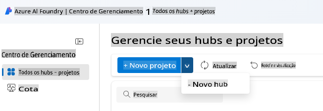
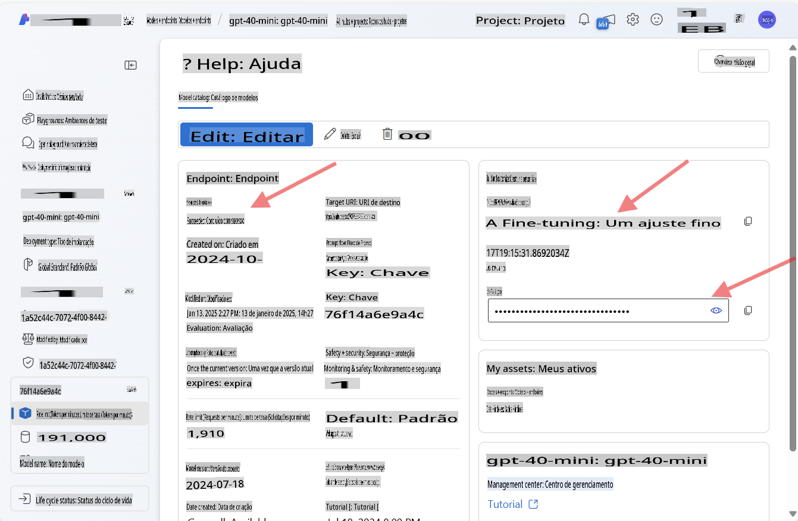
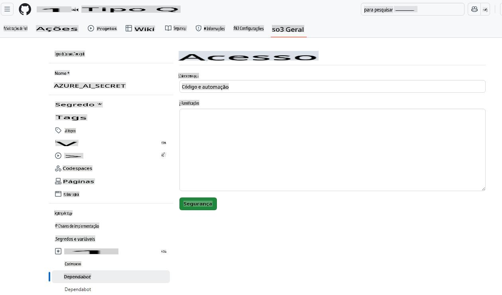

# Configurando o Ambiente de Desenvolvimento para Azure OpenAI

Se você deseja usar os modelos do Azure AI Foundry para seus aplicativos de IA .NET neste curso, siga os passos deste guia.

Não quer usar o Azure OpenAI?

👉 [Para usar os modelos do GitHub, este é o guia para você](README.md)  
👉 [Aqui estão os passos para o Ollama](getting-started-ollama.md)

## Criar os recursos do Azure AI Foundry

Para usar os modelos do Azure AI Foundry, você precisará criar um hub e um projeto no portal do Azure AI Foundry. Depois, será necessário implantar um modelo. Esta seção mostrará como fazer isso.

### Criar um Hub e um Projeto no Azure AI Foundry

1. Acesse o [Portal do Azure AI Foundry](https://ai.azure.com/).
1. Faça login com sua conta do Azure.
1. No menu à esquerda, selecione **Todos os hubs + projetos** e, em seguida, clique em **+ Novo hub** no menu suspenso. (Nota: Talvez você precise clicar em **+ Novo projeto** primeiro para ver a opção **+ Novo hub**).  
    
1. Uma nova janela será aberta. Preencha os detalhes do seu hub:
    - Dê um nome ao seu hub (por exemplo, "MeuHubIA").
    - Escolha uma região mais próxima de você.
    - Selecione a assinatura e o grupo de recursos apropriados.
    - Você pode deixar o restante das configurações como estão.
    - Clique em **Avançar**.
    - Revise os detalhes e clique em **Criar**.
1. Assim que o hub for criado, o portal abrirá a página de detalhes dele. Clique no botão **Criar Projeto**.
    - Dê um nome ao seu projeto (por exemplo, "GenAINET") ou aceite o padrão.
    - Clique em **Criar**.

🎉 **Feito!** Você acabou de criar seu primeiro projeto no Azure AI Foundry.

### Implantar um Modelo de Linguagem no Azure AI Foundry

Agora, vamos implantar um modelo **gpt-4o-mini** no seu projeto:

1. No portal do Azure AI Foundry, navegue até o seu projeto (ele deve abrir automaticamente após ser criado).
1. Clique em **Modelos e Endpoints** no menu à esquerda e, em seguida, no botão **Implantar Modelo**.
1. Selecione **Implantar modelo base** no menu suspenso.
1. Procure por **gpt-4o-mini** no catálogo de modelos.
1. Selecione o modelo e clique no botão **Confirmar**.
1. Especifique um nome de implantação (por exemplo, "gpt-4o-mini"). Você pode deixar as outras opções como estão.
1. Clique em **Implantar** e aguarde a provisão do modelo.
1. Após a implantação, anote o **Nome do Modelo**, **URI de Destino** e **Chave da API** na página de detalhes do modelo.

🎉 **Feito!** Você implantou seu primeiro Modelo de Linguagem de Grande Porte no Azure AI Foundry.



> 📝 **Nota:** O endpoint pode ser semelhante a `https://< your hub name>.openai.azure.com/openai/deployments/gpt-4o-mini/chat/completions?api-version=2024-08-01-preview`. O nome do endpoint que precisamos é apenas `https://< your hub name >.openai.azure.com/`*.

## Adicionando a Chave da API do Azure AI aos Segredos do seu Codespace

Para manter a segurança, vamos adicionar a chave da API que você acabou de criar aos segredos do seu Codespace.

1. Certifique-se de que você fez um fork deste repositório para sua conta no GitHub.
1. Vá até a aba **Settings** do repositório que você fez o fork, expanda **Secrets and variables** no menu à esquerda e selecione **Codespaces**.

    
1. Nomeie seu segredo como **AZURE_AI_KEY**.
1. Cole a chave da API que você copiou do portal do Azure AI Foundry no campo **Secret**.

## Criando um Codespace no GitHub

Vamos criar um Codespace no GitHub para usar durante o restante deste curso.

1. Abra a página principal deste repositório em uma nova janela [clicando com o botão direito aqui](https://github.com/microsoft/Generative-AI-for-beginners-dotnet) e selecionando **Abrir em nova janela** no menu de contexto.
1. Faça o fork deste repositório para sua conta no GitHub clicando no botão **Fork** no canto superior direito da página.
1. Clique no botão **Code** e, em seguida, selecione a aba **Codespaces**.
1. Selecione a opção **...** (os três pontos) e escolha **Novo com opções...**


### Escolhendo seu contêiner de desenvolvimento

No menu suspenso **Dev container configuration**, selecione uma das seguintes opções:

**Opção 1: C# (.NET)**: Esta é a opção que você deve usar se planeja utilizar os modelos do GitHub ou Azure OpenAI. Ela contém todas as ferramentas essenciais de desenvolvimento .NET necessárias para o restante do curso e possui um tempo de inicialização rápido.

**Opção 2: C# (.NET) - Ollama**: Ollama permite executar os exemplos sem precisar se conectar aos modelos do GitHub ou Azure OpenAI. Inclui todas as ferramentas essenciais de desenvolvimento .NET, além do Ollama, mas tem um tempo de inicialização mais lento, em média cinco minutos. [Siga este guia](getting-started-ollama.md) se você deseja usar o Ollama.

Você pode deixar o restante das configurações como estão. Clique no botão **Criar codespace** para iniciar o processo de criação do Codespace.


## Atualizando o código de exemplo para usar Azure OpenAI e seu novo modelo

Agora, vamos atualizar o código para usar o modelo recém-implantado. Primeiro, precisamos adicionar alguns pacotes NuGet para trabalhar com o Azure OpenAI.

1. Abra o terminal e navegue até o diretório do projeto:

    ```bash
    cd 02-SetupDevEnvironment/src/BasicChat-01MEAI/
    ```

1. Execute os seguintes comandos para adicionar o pacote necessário:

    ```bash
    dotnet add package Azure.AI.OpenAI
    dotnet add package Microsoft.Extensions.AI.OpenAI --version 9.1.0-preview.1.25064.3
    ```

[Mais informações sobre Azure.AI.OpenAI](https://www.nuget.org/packages/Azure.AI.OpenAI/2.1.0#show-readme-container).

1. Abra `/workspaces/Generative-AI-for-beginners-dotnet/02-SettingUp.NETDev/src/BasicChat-01MEAI/Program.cs`.

    Adicione as seguintes instruções `using` no topo do arquivo:

    ```csharp
    using System.ClientModel;
    using Azure.AI.OpenAI;
    using Microsoft.Extensions.AI;

1. Create new variables to hold the model name, endpoint, and API key:

    ```csharp
    var deploymentName = "< deployment name > "; // por exemplo, "gpt-4o-mini"
    var endpoint = new Uri("< endpoint >"); // por exemplo, "https://< seu nome do hub >.openai.azure.com/"
    var apiKey = new ApiKeyCredential(Environment.GetEnvironmentVariable("AZURE_AI_SECRET"));
    ```

    Making sure to replace `< deployment name >`, and `< endpoint >` with the values you noted above.

1. Replace the `IChatClient` creation with the following code:

    ```csharp
    IChatClient client = new AzureOpenAIClient(
        endpoint,
        apiKey)
    .AsChatClient(deploymentName);
    ```

1. Run the following command in the terminal:

    ```bash
    dotnet run
    ```

1. You should see output similar to the following:

    ```bash
    Artificial Intelligence (IA) refere-se à simulação da inteligência humana em máquinas que são programadas para pensar e aprender como humanos. A IA abrange uma variedade de tecnologias e abordagens que permitem que computadores e sistemas realizem tarefas que normalmente exigem inteligência humana. Essas tarefas incluem:

    1. **Aprendizado**: A capacidade de melhorar o desempenho com base na experiência, geralmente por meio de algoritmos que analisam dados.
    
    ...
    ```

> 🙋 **Precisa de ajuda?**: Algo não está funcionando? [Abra uma issue](https://github.com/microsoft/Generative-AI-for-beginners-dotnet/issues/new?template=Blank+issue) e nós ajudaremos você.

## Resumo

Nesta lição, você aprendeu como configurar seu ambiente de desenvolvimento para o restante do curso. Você criou um Codespace no GitHub e o configurou para usar o Azure OpenAI. Também atualizou o código de exemplo para usar o modelo recém-implantado no Azure AI Foundry.

### Recursos adicionais

- [Documentação do Azure AI Foundry](https://learn.microsoft.com/azure/ai-services/)
- [Trabalhando com Codespaces no GitHub](https://docs.github.com/en/codespaces/getting-started)
- [Como Implantar Modelos no Azure AI Foundry](https://learn.microsoft.com/azure/ai-services/deploy/)
- [Pacote NuGet Azure.AI.OpenAI](https://www.nuget.org/packages/Azure.AI.OpenAI)

## Próximos Passos

A seguir, vamos explorar como criar sua primeira aplicação de IA! 🚀

👉 [Técnicas Centrais de IA Generativa](../03-CoreGenerativeAITechniques/readme.md)

**Aviso Legal**:  
Este documento foi traduzido utilizando serviços de tradução automática baseados em IA. Embora nos esforcemos para garantir a precisão, esteja ciente de que traduções automáticas podem conter erros ou imprecisões. O documento original em seu idioma nativo deve ser considerado a fonte oficial. Para informações críticas, recomenda-se a tradução profissional realizada por humanos. Não nos responsabilizamos por quaisquer mal-entendidos ou interpretações equivocadas decorrentes do uso desta tradução.