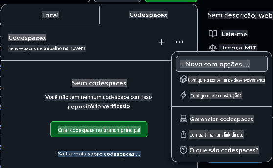
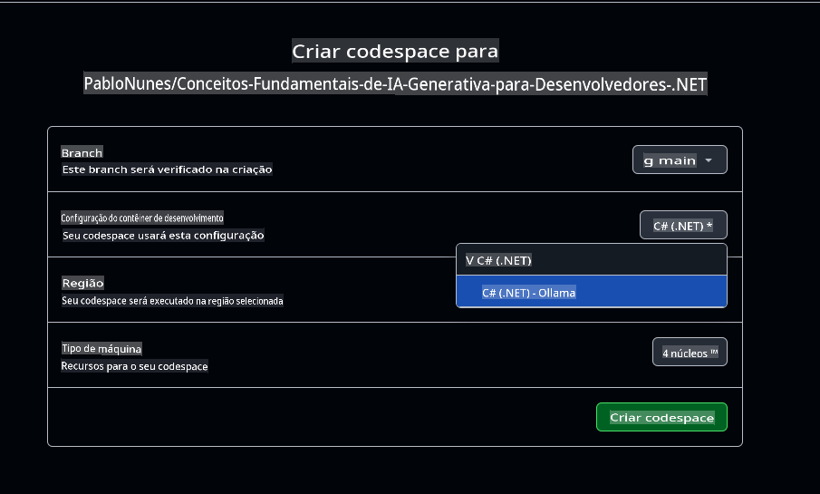

# Configurando o Ambiente de Desenvolvimento com Ollama

Se você deseja usar o Ollama para executar modelos localmente neste curso, siga os passos deste guia.

Não quer usar o Azure OpenAI?

👉 [Para usar os Modelos do GitHub, este é o guia para você](README.md)  
👉 [Aqui estão os passos para o Ollama](getting-started-ollama.md)

## Criando um Codespace no GitHub

Vamos criar um Codespace no GitHub para desenvolvermos ao longo deste curso.

1. Abra a página principal deste repositório em uma nova janela clicando com o botão direito [aqui](https://github.com/microsoft/Generative-AI-for-beginners-dotnet) e selecionando **Abrir em nova janela** no menu de contexto.
1. Faça um fork deste repositório para sua conta do GitHub clicando no botão **Fork** no canto superior direito da página.
1. Clique no botão suspenso **Code** e, em seguida, selecione a aba **Codespaces**.
1. Selecione a opção **...** (os três pontos) e escolha **New with options...**.



### Escolhendo seu container de desenvolvimento

No menu suspenso **Dev container configuration**, selecione uma das seguintes opções:

**Opção 1: C# (.NET)**: Esta é a opção que você deve usar se planeja trabalhar com os Modelos do GitHub ou Azure OpenAI, sendo a forma recomendada para completar este curso. Inclui todas as ferramentas principais de desenvolvimento .NET necessárias para o restante do curso e tem um tempo de inicialização rápido.

**Opção 2: C# (.NET) - Ollama**: Escolha esta opção se quiser executar modelos localmente com o Ollama. Inclui todas as ferramentas principais de desenvolvimento .NET, além do Ollama, mas tem um tempo de inicialização mais lento, em média cinco minutos. [Siga este guia](getting-started-ollama.md) se quiser usar o Ollama.

Você pode deixar as demais configurações como estão. Clique no botão **Create codespace** para iniciar o processo de criação do Codespace.



## Verificando se seu Codespace está funcionando corretamente com o Ollama

Depois que seu Codespace estiver totalmente carregado e configurado, vamos executar um aplicativo de exemplo para verificar se tudo está funcionando corretamente:

1. Abra o terminal. Você pode abrir uma janela do terminal pressionando **Ctrl+\`** (backtick) on Windows or **Cmd+`** no macOS.

1. Navegue para o diretório correto executando o seguinte comando:

    ```bash
    cd 02-SetupDevEnvironment/src/BasicChat-03Ollama/
    ```

1. Em seguida, execute o aplicativo com o comando:

    ```bash
    dotnet run
    ```

1. Pode levar alguns segundos, mas eventualmente o aplicativo deve exibir uma mensagem semelhante à seguinte:

    ```bash
    AI, or Artificial Intelligence, refers to the development of computer systems that can perform tasks that typically require human intelligence, such as:

    1. Learning: AI systems can learn from data and improve their performance over time.
    2. Reasoning: AI systems can draw conclusions and make decisions based on the data they have been trained on.
    
    ...
    ```

> 🙋 **Precisa de ajuda?**: Algo não está funcionando? [Abra uma issue](https://github.com/microsoft/Generative-AI-for-beginners-dotnet/issues/new?template=Blank+issue) e nós ajudaremos você.

## Alterando o modelo no Ollama

Uma das coisas legais do Ollama é que é fácil trocar de modelo. O aplicativo atual usa o modelo "**llama3.2**". Vamos mudar e experimentar o modelo "**phi3.5**".

1. Baixe o modelo Phi3.5 executando o comando no terminal:

    ```bash
    ollama pull phi3.5
    ```

    Você pode saber mais sobre o [Phi3.5](https://ollama.com/library/phi3.5) e outros modelos disponíveis na [biblioteca do Ollama](https://ollama.com/library/).

1. Edite a inicialização do cliente de chat no arquivo `Program.cs` para usar o novo modelo:

    ```csharp
    IChatClient client = new OllamaChatClient(new Uri("http://localhost:11434/"), "phi3.5");
    ```

1. Por fim, execute o aplicativo com o comando:

    ```bash
    dotnet run
    ```

1. Você acabou de trocar para um novo modelo. Note como a resposta agora é mais longa e detalhada.

    ```bash
    Artificial Intelligence (AI) refers to the simulation of human intelligence processes by machines, especially computer systems. These processes include learning (the acquisition of information and accumulation of knowledge), reasoning (using the acquired knowledge to make deductions or decisions), and self-correction. AI can manifest in various forms:

    1. **Narrow AI** – Designed for specific tasks, such as facial recognition software, voice assistants like Siri or Alexa, autonomous vehicles, etc., which operate under a limited preprogrammed set of behaviors and rules but excel within their domain when compared to humans in these specialized areas.

    2. **General AI** – Capable of understanding, learning, and applying intelligence broadly across various domains like human beings do (natural language processing, problem-solving at a high level). General AIs are still largely theoretical as we haven't yet achieved this form to the extent necessary for practical applications beyond narrow tasks.
    
    ...
    ```

> 🙋 **Precisa de ajuda?**: Algo não está funcionando? [Abra uma issue](https://github.com/microsoft/Generative-AI-for-beginners-dotnet/issues/new?template=Blank+issue) e nós ajudaremos você.

## Resumo

Nesta lição, você aprendeu a configurar seu ambiente de desenvolvimento para o restante do curso. Você criou um Codespace no GitHub e o configurou para usar o Ollama. Também atualizou o código de exemplo para trocar modelos com facilidade.

### Recursos Adicionais

- [Modelos Ollama](https://ollama.com/search)  
- [Trabalhando com Codespaces do GitHub](https://docs.github.com/en/codespaces/getting-started)  
- [Documentação de Extensões da Microsoft para IA](https://learn.microsoft.com/dotnet/)

## Próximos Passos

Em seguida, vamos explorar como criar sua primeira aplicação de IA! 🚀

👉 [Técnicas Centrais de IA Generativa](../03-CoreGenerativeAITechniques/readme.md)

**Aviso Legal**:  
Este documento foi traduzido utilizando serviços de tradução automática baseados em IA. Embora nos esforcemos para garantir a precisão, esteja ciente de que traduções automáticas podem conter erros ou imprecisões. O documento original em seu idioma nativo deve ser considerado a fonte autoritativa. Para informações críticas, recomenda-se a tradução profissional feita por humanos. Não nos responsabilizamos por quaisquer mal-entendidos ou interpretações incorretas decorrentes do uso desta tradução.