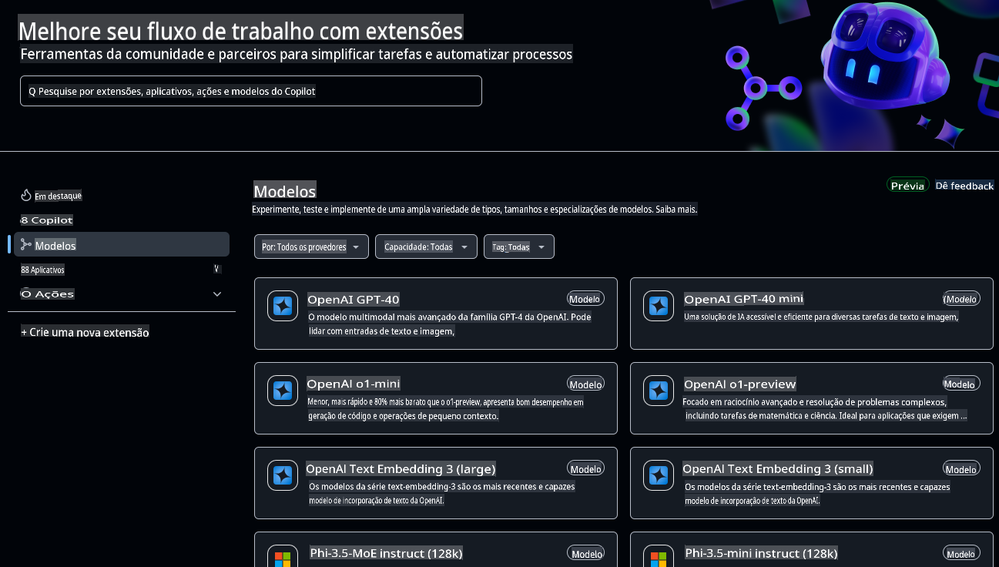
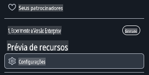
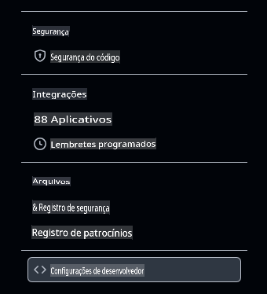
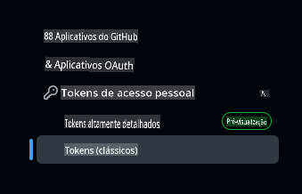

# Configurando o Ambiente de Desenvolvimento para Este Curso

Esta lição vai te guiar na configuração do ambiente de desenvolvimento para este curso. Para garantir seu sucesso, preparamos uma configuração de devcontainer que fornecerá todas as ferramentas necessárias para concluir o curso. Você pode executar o devcontainer no GitHub Codespaces (recomendado) ou localmente na sua máquina. Além disso, mostramos como configurar seus tokens de acesso do GitHub para interagir com os Modelos do GitHub.

*Temos guias para configurar [Azure OpenAI](getting-started-azure-openai.md) e [Ollama](getting-started-ollama.md), se preferir.*

---

## O que você vai aprender nesta lição:

- ⚡ Como configurar um ambiente de desenvolvimento com GitHub Codespaces
- 🤖 Configurar seu ambiente de desenvolvimento para acessar LLMs via GitHub Models, Azure OpenAI ou Ollama
- 🛠️ Ferramentas padrão da indústria configuradas com .devcontainer
- 🎯 Finalmente, tudo estará pronto para completar o restante do curso

Vamos começar e configurar seu ambiente de desenvolvimento! 🏃‍♂️

[](https://youtu.be/7kYoVRNQXyA?feature=shared)

_⬆️Clique na imagem para assistir ao vídeo⬆️_

## Qual serviço de IA devo usar para este curso?

Fornecemos instruções para configurar seu ambiente de desenvolvimento com GitHub Models, Azure OpenAI e Ollama. Você pode escolher o que melhor se adapta às suas necessidades. Recomendamos usar GitHub Models para este curso, mas você pode usar qualquer um dos três serviços.

Aqui está um resumo rápido dos serviços:

- **GitHub Models**: Um serviço gratuito para começar, que permite testar e interagir com vários modelos de IA diretamente no seu ambiente de desenvolvimento. É fácil de usar no Codespaces e uma ótima maneira de experimentar diferentes modelos e entender suas capacidades antes da implementação.
- **Azure OpenAI**: Um serviço pago que oferece acesso a uma ampla gama de modelos de IA. Inclui todos os benefícios esperados do Azure, como segurança robusta e escalabilidade. Esta é uma ótima opção para este curso se você já tiver acesso a uma assinatura do Azure.
- **Ollama**: Ollama permite executar modelos de IA localmente na sua máquina ou em um Codespace ou devcontainer gratuitamente. É uma ótima opção se você preferir executar os modelos localmente, mas requer mais recursos de hardware e pode ser mais lento do que as opções baseadas na nuvem.

> Se **GitHub Models** for sua escolha, siga o restante deste documento para configurar seu ambiente de desenvolvimento com GitHub Models.
> - Interessado no **Azure OpenAI**? [Este é o documento para você](getting-started-azure-openai.md).
> - **Ollama** é sua escolha? [Este guia tem as informações que você precisa](getting-started-ollama.md).

## Aprenda e teste modelos de IA com GitHub Models

**GitHub Models** oferece uma maneira intuitiva de experimentar vários modelos de IA diretamente no seu ambiente de desenvolvimento. Este recurso permite que desenvolvedores testem e interajam com diferentes modelos, compreendendo suas capacidades e limitações antes da implementação. Por meio de uma interface simples, você pode explorar respostas dos modelos, avaliar o desempenho e determinar a melhor opção para os requisitos do seu aplicativo. Hospedados na infraestrutura do GitHub, esses modelos oferecem acesso confiável e desempenho consistente, tornando-os ideais para fases de desenvolvimento e teste. O melhor de tudo é que há um plano gratuito para começar sua exploração sem custo.



## Checklist inicial: Configurando Tokens de Acesso do GitHub

Antes de qualquer outra coisa, precisamos configurar credenciais de segurança essenciais que permitirão que nosso Codespace interaja com GitHub Models e execute nossas aplicações de forma segura.

### Criando um Token de Acesso Pessoal para acesso ao GitHub Models

1. Acesse [Configurações do GitHub](https://github.com/settings/profile):

    - Clique na sua foto de perfil no canto superior direito
    - Selecione **Settings** no menu suspenso

    

1. Acesse [Configurações de Desenvolvedor](https://github.com/settings/apps):

    - Role a barra lateral esquerda para baixo
    - Clique em **Developer settings** (geralmente no final)

    

1. Gere um Novo Token:

    - Selecione **Personal access tokens** → **Tokens (classic)**

        

    - No menu suspenso no meio da página, clique em **Generate new token (classic)**

        

    - Em "Note", forneça um nome descritivo (ex.: `GenAI-DotNet-Course-Token`)
    - Defina uma data de expiração (recomendado: 7 dias para boas práticas de segurança)
    - Não é necessário adicionar permissões a este token.

> 💡 **Dica de Segurança**: Sempre use o escopo mínimo necessário e o menor tempo prático de expiração para seus tokens de acesso. Isso segue o princípio do menor privilégio e ajuda a manter os tokens da sua conta seguros.

## Criando um GitHub Codespace

Vamos criar um GitHub Codespace para usar no restante deste curso.

1. Abra a página principal deste repositório em uma nova janela clicando com o botão direito [aqui](https://github.com/microsoft/Generative-AI-for-beginners-dotnet) e selecionando **Abrir em nova janela** no menu de contexto
1. Faça um fork deste repositório na sua conta do GitHub clicando no botão **Fork** no canto superior direito da página
1. Clique no botão **Code** e, em seguida, selecione a aba **Codespaces**
1. Selecione a opção **...** (os três pontos) e escolha **New with options...**


### Escolhendo Seu Container de Desenvolvimento

No menu suspenso **Dev container configuration**, selecione uma das seguintes opções:

**Opção 1: C# (.NET)**: Esta é a opção que você deve usar se planeja utilizar GitHub Models e é a maneira recomendada para concluir este curso. Inclui todas as ferramentas principais de desenvolvimento .NET necessárias para o restante do curso e tem um tempo de inicialização rápido.

**Opção 2: C# (.NET) - Ollama**: Ollama permite executar as demonstrações sem precisar se conectar ao GitHub Models ou Azure OpenAI. Inclui todas as ferramentas principais de desenvolvimento .NET, além do Ollama, mas tem um tempo de inicialização mais lento, em média cinco minutos. [Siga este guia](getting-started-ollama.md) se quiser usar Ollama.

> 💡**Dica**: Ao criar seu codespace, use a região mais próxima de você, se tiver essa opção no menu. Usar uma região distante pode causar erros na criação.

Clique no botão **Create codespace** para iniciar o processo de criação do Codespace.


## Verificando se seu Codespace está funcionando corretamente com GitHub Models

Depois que seu Codespace estiver totalmente carregado e configurado, vamos executar um aplicativo de exemplo para verificar se tudo está funcionando corretamente:

1. Abra o terminal. Você pode abrir uma janela do terminal pressionando **Ctrl+\`** (backtick) on Windows or **Cmd+`** no macOS.

1. Mude para o diretório correto executando o seguinte comando:

    ```bash
    cd 02-SetupDevEnvironment\src\BasicChat-01MEAI
    ```

1. Em seguida, execute o aplicativo com o seguinte comando:

    ```bash
    dotnet run
    ```

1. Pode levar alguns segundos, mas eventualmente o aplicativo deve exibir uma mensagem semelhante à seguinte:

    ```bash
    AI, or artificial intelligence, refers to the simulation of human intelligence in machines that are programmed to think and learn like humans. It is a broad field of computer science that focuses on creating systems and algorithms capable of performing tasks that typically require human intelligence. These tasks include problem-solving,

    ...
    ```

> 🙋 **Precisa de ajuda?**: Algo não está funcionando? [Abra um issue](https://github.com/microsoft/Generative-AI-for-beginners-dotnet/issues/new?template=Blank+issue) e nós te ajudaremos.

## Resumo

Nesta lição, você aprendeu como configurar seu ambiente de desenvolvimento para o restante do curso. Você criou um GitHub Codespace e o configurou para usar GitHub Models, Azure OpenAI ou Ollama. Também aprendeu a criar um token de acesso pessoal para GitHub Models e como executar um aplicativo de exemplo para verificar se tudo está funcionando corretamente.

### Recursos Adicionais

- Teste este guia com outros provedores de hospedagem!
    - [Azure OpenAI](getting-started-azure-openai.md)
    - [Ollama](getting-started-ollama.md)
- [Documentação do GitHub Codespaces](https://docs.github.com/en/codespaces)
- [Documentação do GitHub Models](https://docs.github.com/en/github-models/prototyping-with-ai-models)

## Próximos Passos

A seguir, vamos explorar como criar sua primeira aplicação de IA! 🚀

👉 [Técnicas Fundamentais de IA Generativa](../03-CoreGenerativeAITechniques/readme.md)

**Aviso Legal**:  
Este documento foi traduzido utilizando serviços de tradução baseados em IA. Embora nos esforcemos para garantir a precisão, esteja ciente de que traduções automatizadas podem conter erros ou imprecisões. O documento original em seu idioma nativo deve ser considerado a fonte autoritativa. Para informações críticas, recomenda-se a tradução profissional humana. Não nos responsabilizamos por quaisquer mal-entendidos ou interpretações incorretas decorrentes do uso desta tradução.