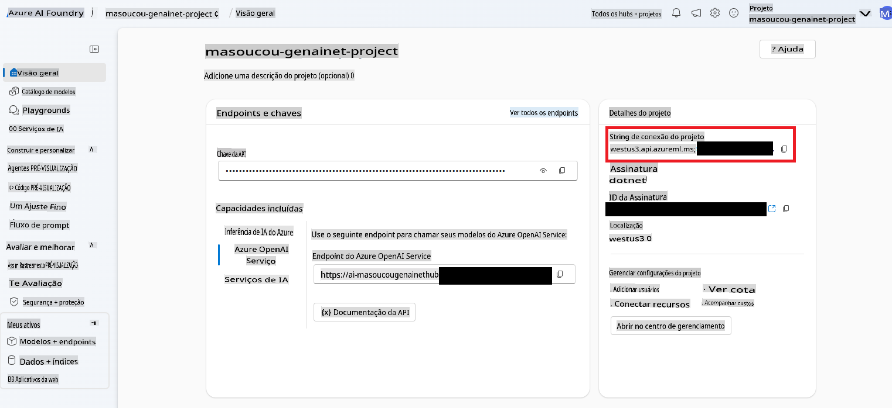

# Agentes de IA

Nesta lição, você aprenderá a criar uma entidade de IA que... toma decisões e executa ações sem interação humana contínua? Isso mesmo, agentes de IA são capazes de realizar tarefas específicas de forma independente.

---

[](https://youtu.be/Btkmw1Bosh0?feature=shared)

_⬆️Clique na imagem para assistir ao vídeo⬆️_

Agentes de IA permitem que os LLMs evoluam de assistentes para entidades capazes de realizar ações em nome dos usuários. Os agentes podem até mesmo interagir com outros agentes para realizar tarefas. Algumas das principais características de um agente incluem um nível de **autonomia**, permitindo que ele inicie ações com base em sua programação, o que leva à capacidade de **tomada de decisão** com base em objetivos predefinidos. Eles também são **adaptáveis**, pois aprendem e ajustam-se para melhorar o desempenho ao longo do tempo.

Um ponto importante a lembrar ao criar agentes é que eles devem ser focados em apenas uma tarefa. Você deve restringir o propósito deles o máximo possível.

> 🧑‍🏫**Saiba mais**: Aprenda mais sobre os fundamentos dos Agentes de IA em [Inteligência Artificial Generativa para Iniciantes: Agentes de IA](https://github.com/microsoft/generative-ai-for-beginners/tree/main/17-ai-agents).

## Criando um Agente de IA

Trabalharemos com alguns conceitos novos para construir um agente de IA em .NET. Utilizaremos um novo SDK e será necessário realizar uma configuração adicional no Azure AI Foundry para começar.

> 🧑‍💻**Código de exemplo**: Usaremos o [exemplo AgentLabs-01-Simple](../../../03-CoreGenerativeAITechniques/src/AgentLabs-01-Simple) para esta lição.
>
> Também incluímos alguns exemplos mais avançados na pasta `/src/`. Você pode consultar os README's de [AgentLabs-02-Functions](../../../03-CoreGenerativeAITechniques/src/AgentLabs-02-Functions), [AgentLabs-03-OpenAPIs](../../../03-CoreGenerativeAITechniques/src/AgentLabs-03-OpenAPIs) ou [AgentLabs-03-PythonParksInformationServer](../../../03-CoreGenerativeAITechniques/src/AgentLabs-03-PythonParksInformationServer) para mais informações.

### Serviço de Agentes do Azure AI

Vamos apresentar um novo serviço do Azure que nos ajudará a criar agentes, o apropriadamente chamado [Azure AI Agent Service](https://learn.microsoft.com/azure/ai-services/agents/overview).

Para executar os exemplos de código incluídos nesta lição, será necessário realizar uma configuração adicional no Azure AI Foundry. Você pode seguir [estas instruções para configurar um **Agente Básico**](https://learn.microsoft.com/azure/ai-services/agents/quickstart?pivots=programming-language-csharp).

### Biblioteca Azure AI Projects

Os agentes são compostos por 3 partes. O **LLM** ou modelo, o **Estado** ou contexto (semelhante a uma conversa) que ajuda a orientar decisões com base em resultados anteriores, e as **Ferramentas**, que são como [funções que aprendemos anteriormente](./01-lm-completions-functions.md#function-calling), permitindo uma ponte entre o modelo e sistemas externos.

Portanto, em teoria, você poderia criar agentes de IA com o que já aprendeu até agora. Mas a biblioteca **Azure AI Projects para .NET** facilita o desenvolvimento de agentes ao fornecer uma API que simplifica muitas das tarefas típicas.

Existem alguns conceitos (que correspondem a classes) importantes para entender ao trabalhar com a biblioteca Azure AI Projects:

- `AgentClient`: O cliente principal que cria e hospeda os agentes, gerencia as threads em que eles executam e cuida da conexão com a nuvem.
- `Agent`: O agente que contém instruções sobre o que deve fazer, bem como definições das ferramentas às quais ele tem acesso.
- `ThreadMessage`: São mensagens - quase como os prompts que aprendemos anteriormente - que são enviadas ao agente. Os agentes também criam objetos `ThreadMessage` para se comunicar.
- `ThreadRun`: Uma thread na qual as mensagens são enviadas ao agente. A thread é iniciada e pode receber instruções adicionais, além de ser consultada quanto ao seu status.

Vamos ver um exemplo simples disso em ação!

### Construindo um agente de matemática

Vamos construir um agente com um único propósito: atuar como tutor de estudantes de matemática. Seu único objetivo será resolver e explicar problemas matemáticos que o usuário solicitar.

1. Para começar, precisamos criar um objeto `AgentsClient`, que será responsável por gerenciar a conexão com o Azure, o próprio agente, as threads, as mensagens, entre outros.

    ```csharp
    string projectConnectionString = "< YOU GET THIS FROM THE PROJECT IN AI FOUNDRY >";
    AgentsClient client = new(projectConnectionString, new DefaultAzureCredential());
    ```

    Você pode encontrar a string de conexão do projeto no AI Foundry, abrindo o Hub que você criou e depois o projeto. Ela estará no lado direito.

    

2. Em seguida, queremos criar o agente tutor. Lembre-se de que ele deve ser focado em apenas uma tarefa.

    ```csharp
    Agent tutorAgent = (await client.CreateAgentAsync(
    model: "gpt-4o",
    name: "Math Tutor",
    instructions: "You are a personal math tutor. Write and run code to answer math questions.",
    tools: [new CodeInterpreterToolDefinition()])).Value;
    ```

    Alguns pontos importantes aqui. O primeiro é o uso de `tools` parameter. We're creating a `CodeInterpreterToolDefinition` object (that is apart of the **Azure.AI.Projects** SDK) that will allow the agent to create and execute code.

    > 🗒️**Note**: You can create your own tools too. See the [Functions](../../../03-CoreGenerativeAITechniques/src/AgentLabs-02-Functions) to learn more.

    Second note the `instructions` that are being sent along. It's a prompt and we're limiting it to answer math questions. Then last creating the agent is an async operation. That's because it's creating an object within Azure AI Foundry Agents service. So we both `await` the `CreateAgentAsync` function and then grab the `Value` para acessar o objeto `Agent` real. Você verá esse padrão se repetir diversas vezes ao criar objetos com o SDK **Azure.AI.Projects**.

3. Um `AgentThread` é um objeto que gerencia a comunicação entre agentes individuais, o usuário, entre outros. Precisaremos criar isso para adicionar um `ThreadMessage`. Neste caso, será a primeira pergunta do usuário.

    ```csharp
    AgentThread thread = (await client.CreateThreadAsync()).Value;

    // Creating the first user message to AN agent - notice how we're putting it on a thread
    ThreadMessage userMessage = (await client.CreateMessageAsync(
        thread.Id,
        MessageRole.User,
        "Hello, I need to solve the equation `3x + 11 = 14`. Can you help me?")
    ).Value;
    ```

    Note que o `ThreadMessage` tem um tipo `MessageRole.User`. E perceba que não estamos enviando a mensagem para um agente específico, mas apenas colocando-a em uma thread.

4. Em seguida, faremos com que o agente forneça uma resposta inicial, colocaremos essa resposta na thread e, então, iniciaremos a thread. Ao iniciar a thread, forneceremos o ID inicial do agente a ser executado e quaisquer instruções adicionais.

    ```csharp
    ThreadMessage agentMessage =  await client.CreateMessageAsync(
        thread.Id,
        MessageRole.Agent,
        "Please address the user as their name. The user has a basic account, so just share the answer to the question.")
    ).Value;

    ThreadRun run = (await client.CreateRunAsync(
        thread.Id,
        assistantId: agentMathTutor.Id, 
        additionalInstructions: "You are working in FREE TIER EXPERIENCE mode`, every user has premium account for a short period of time. Explain detailed the steps to answer the user questions")
    ).Value;
    ```

5. Tudo o que resta é verificar o status da execução.

    ```csharp
    do
    {
        await Task.Delay(Timespan.FromMilliseconds(100));
        run = (await client.GetRunAsync(thread.Id, run.Id)).Value;

        Console.WriteLine($"Run Status: {run.Status}");
    }
    while (run.Status == RunStatus.Queued || run.Status == RunStatus.InProgress);
    ```

6. E, por fim, exibir as mensagens dos resultados.

    ```csharp
    Response<PageableList<ThreadMessage>> afterRunMessagesResponse = await client.GetMessagesAsync(thread.Id);
    IReadOnlyList<ThreadMessage> messages = afterRunMessagesResponse.Value.Data;

    // sort by creation date
    messages = messages.OrderBy(m => m.CreatedAt).ToList();

    foreach (ThreadMessage msg in messages)
    {
        Console.Write($"{msg.CreatedAt:yyyy-MM-dd HH:mm:ss} - {msg.Role,10}: ");

        foreach (MessageContent contentItem in msg.ContentItems)
        {
            if (contentItem is MessageTextContent textItem)
                Console.Write(textItem.Text);
        }
        Console.WriteLine();
    }
    ```

> 🙋 **Precisa de ajuda?**: Se você encontrar algum problema, [abra uma issue no repositório](https://github.com/microsoft/Generative-AI-for-beginners-dotnet/issues/new).

O próximo passo lógico é começar a usar múltiplos agentes para criar um sistema autônomo. Um próximo passo pode ser ter um agente que verifica se o usuário possui uma conta premium ou não.

## Resumo

Agentes de IA são entidades autônomas de IA que vão além de interações simples de bate-papo - eles podem:

- Tomar decisões independentes: Executar tarefas sem intervenção humana constante
- Manter contexto: Guardar estado e lembrar interações anteriores
- Usar ferramentas: Acessar sistemas externos e APIs para realizar tarefas
- Colaborar: Trabalhar com outros agentes para resolver problemas complexos

E você aprendeu a usar o serviço **Azure AI Agents** com o SDK **Azure AI Project** para criar um agente rudimentar.

Pense nos agentes como assistentes de IA com autonomia - eles não apenas respondem, mas agem com base em sua programação e objetivos.

## Recursos adicionais

- [Crie um agente mínimo com .NET](https://learn.microsoft.com/dotnet/ai/quickstarts/quickstart-assistants?pivots=openai)
- [Orquestração de múltiplos agentes](https://techcommunity.microsoft.com/blog/educatordeveloperblog/using-azure-ai-agent-service-with-autogen--semantic-kernel-to-build-a-multi-agen/4363121)
- [Framework de Agentes do Semantic Kernel](https://learn.microsoft.com/semantic-kernel/frameworks/agent/?pivots=programming-language-csharp)
- [Agentes de IA - Série para Iniciantes em GenAI](https://github.com/microsoft/generative-ai-for-beginners/tree/main/17-ai-agents)

## Próximos passos

Você percorreu um longo caminho! Desde aprender sobre simples conclusões de texto até construir agentes!

👉 [Na próxima lição, veja alguns exemplos práticos](../04-PracticalSamples/readme.md) de como usar tudo isso em conjunto.

**Aviso Legal**:  
Este documento foi traduzido utilizando serviços de tradução baseados em IA. Embora nos esforcemos para garantir a precisão, esteja ciente de que traduções automáticas podem conter erros ou imprecisões. O documento original em seu idioma nativo deve ser considerado a fonte oficial. Para informações críticas, recomenda-se a tradução profissional humana. Não nos responsabilizamos por quaisquer mal-entendidos ou interpretações equivocadas decorrentes do uso desta tradução.