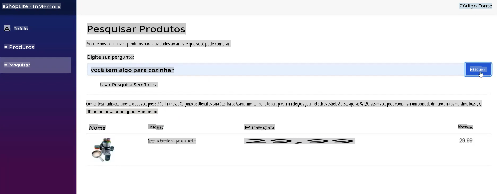
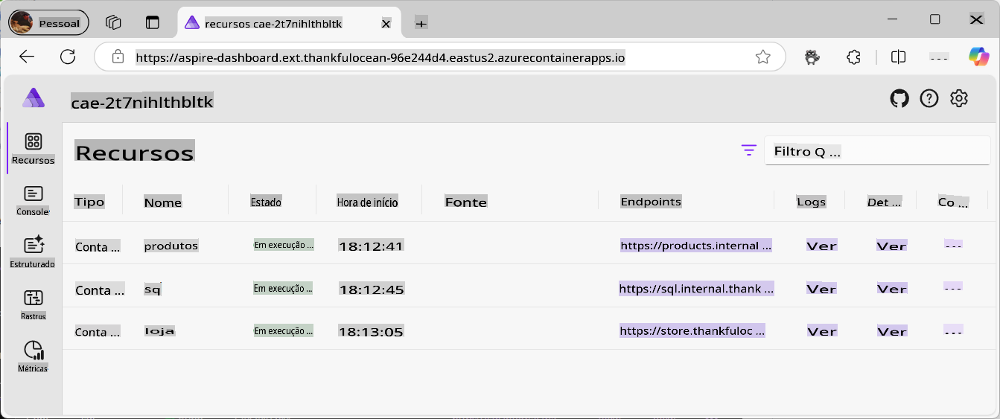
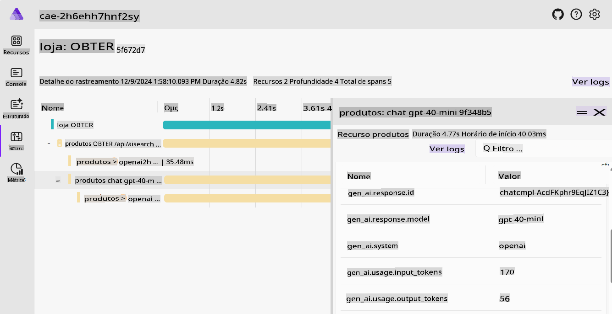
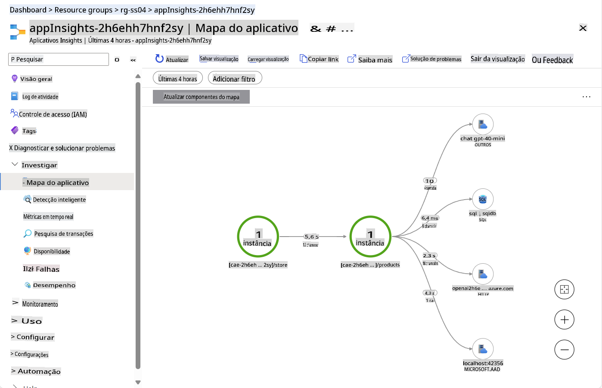
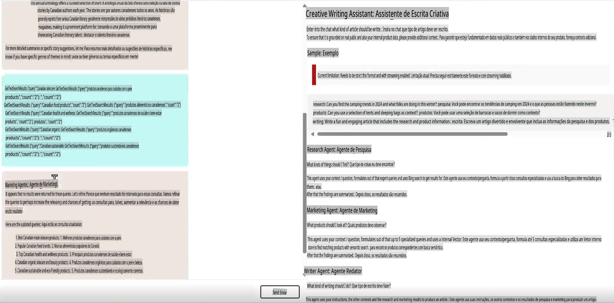
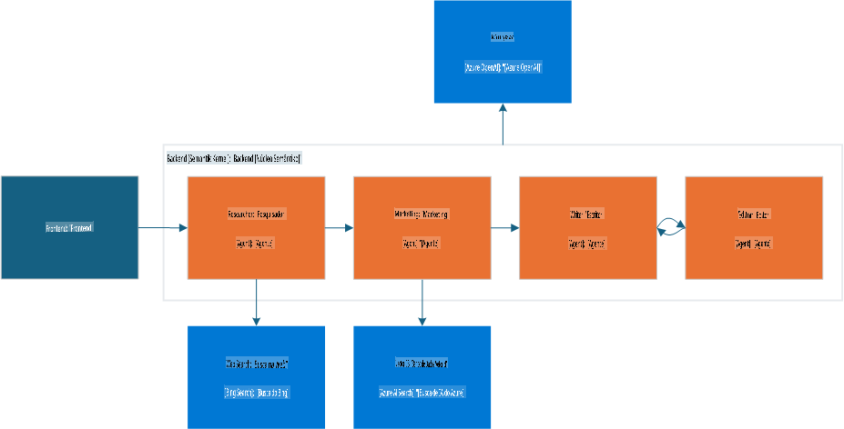
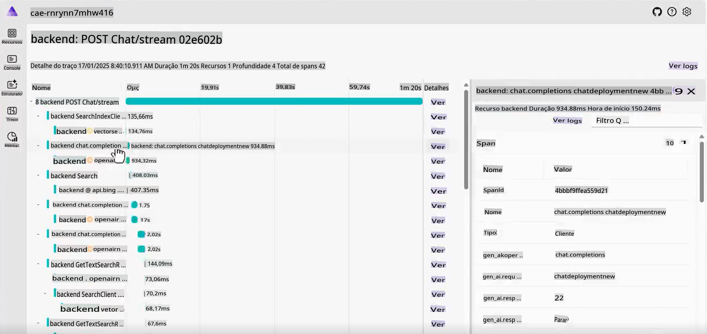
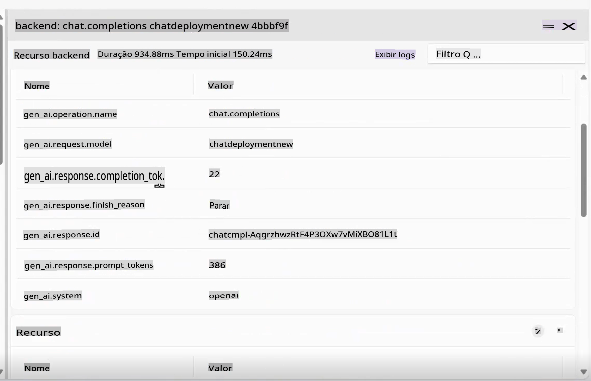

# Exemplos Canônicos de IA Generativa

Veja todos os conceitos que você aprendeu em ação nesses exemplos práticos e do mundo real.

---

## O que você irá alcançar

- Entender como a IA Generativa pode ser integrada em aplicações existentes.
- Compreender como os Agentes funcionam em cenários complexos.

## Exemplos incluídos
- [Exemplos Canônicos de IA Generativa](../../../04-PracticalSamples)
  - [O que você irá alcançar](../../../04-PracticalSamples)
  - [Exemplos incluídos](../../../04-PracticalSamples)
  - [Demonstrações do eShopLite](../../../04-PracticalSamples)
    - [eShopLite com busca semântica - Em Memória](../../../04-PracticalSamples)
    - [eShopLite com busca semântica - Azure AI Search](../../../04-PracticalSamples)
    - [eShopLite com áudio em tempo real](../../../04-PracticalSamples)
  - [Agente Escritor Criativo](../../../04-PracticalSamples)
  - [Resumo](../../../04-PracticalSamples)
    - [Recursos adicionais](../../../04-PracticalSamples)
    - [Próximos passos](../../../04-PracticalSamples)

[](https://youtu.be/Ky4CACXJqR8?feature=shared)

_⬆️Clique na imagem para assistir ao vídeo⬆️_

## Demonstrações do eShopLite

Nas primeiras demonstrações, exploraremos os projetos do **eShopLite**. O **eShopLite** é uma aplicação simples de e-commerce voltada para entusiastas de atividades ao ar livre e camping, aprimorada com recursos de IA Generativa, como otimização de busca, suporte ao cliente e análise de áudio em tempo real.

Essas demonstrações utilizam [Azure OpenAI](https://azure.microsoft.com/products/ai-services/openai-service) e [Modelos do Azure AI Foundry](https://ai.azure.com/) para realizar inferências (ou a parte de IA generativa) nas aplicações.

Na primeira demonstração, mostramos como usar o Semantic Kernel para melhorar as capacidades de busca, permitindo entender o contexto das consultas dos usuários e fornecer resultados mais precisos.

### eShopLite com busca semântica

[](https://youtu.be/FlkruF6USro?feature=shared)

_⬆️Clique na imagem para assistir ao vídeo⬆️_

No eShopLite com busca semântica, utilizamos o Semantic Kernel para aprimorar as funcionalidades de busca da aplicação de e-commerce. O Semantic Kernel nos ajuda a criar um mecanismo de busca mais robusto, capaz de entender o contexto das consultas dos usuários e fornecer resultados mais relevantes.

Por exemplo, se um usuário busca por "você tem algo para cozinhar", o mecanismo de busca pode entender que o usuário está procurando utensílios de cozinha e exibir os produtos mais relevantes. No contexto do nosso exemplo, ele retorna utensílios de cozinha para camping.

> 🧑‍💻**Exemplo**: Confira o [exemplo de busca semântica no eShopLite](https://aka.ms/netaieshoplitesemanticsearch)



A busca semântica pode ajudar os usuários a encontrar os produtos que precisam de forma mais fácil, proporcionando uma experiência de compra melhor e aumentando as vendas. Para implementar esse recurso, precisamos de um vetor de dados com os produtos, um índice de busca e um modelo de linguagem. A ferramenta [.NET Aspire](https://learn.microsoft.com/dotnet/aspire/get-started/aspire-overview) ajuda a coordenar todos os processos no backend.



No dashboard do .NET Aspire, podemos ver os produtos, SQL e contêineres de armazenamento, que podem interagir com o modelo de linguagem. Ao examinar mais a fundo o Aspire App Host, temos o seguinte:

```csharp
if (builder.ExecutionContext.IsPublishMode)
{
    // Add the Azure Application Insights for monitoring
    var appInsights = builder.AddAzureApplicationInsights("appInsights");
    // Add the Azure OpenAI for the chat and embeddings deployments, the embedding is used for the vector entities
    var chatDeploymentName = "gpt-4o-mini";
    var embeddingsDeploymentName = "text-embedding-ada-002";
    var aoai = builder.AddAzureOpenAI("openai")
        .AddDeployment(new AzureOpenAIDeployment(chatDeploymentName,
        "gpt-4o-mini",
        "2024-07-18",
        "GlobalStandard",
        10))
        .AddDeployment(new AzureOpenAIDeployment(embeddingsDeploymentName,
        "text-embedding-ada-002",
        "2"));

    products.WithReference(appInsights)
        .WithReference(aoai)
        .WithEnvironment("AI_ChatDeploymentName", chatDeploymentName)
        .WithEnvironment("AI_embeddingsDeploymentName", embeddingsDeploymentName);

    store.WithReference(appInsights)
        .WithExternalHttpEndpoints();
}
```

O código acima demonstra como adicionar o Azure Application Insights para monitoramento, o Azure OpenAI para os deployments de chat e embeddings, e o embedding usado para as entidades vetoriais.

Para a criação de embeddings e Azure OpenAI, isso pode ser encontrado no contêiner de produtos, como mostrado a seguir:

```csharp
var azureOpenAiClientName = "openai";
builder.AddAzureOpenAIClient(azureOpenAiClientName);

// get azure openai client and create Chat client from aspire hosting configuration
builder.Services.AddSingleton<ChatClient>(serviceProvider =>
{
    var chatDeploymentName = "gpt-4o-mini";
    var logger = serviceProvider.GetService<ILogger<Program>>()!;
    logger.LogInformation($"Chat client configuration, modelId: {chatDeploymentName}");
    ChatClient chatClient = null;
    try
    {
        OpenAIClient client = serviceProvider.GetRequiredService<OpenAIClient>();
        chatClient = client.GetChatClient(chatDeploymentName);
    }...
}
```

O código acima demonstra como obter o cliente Azure OpenAI e criar o cliente de Chat a partir da configuração do hosting Aspire. O `chatDeploymentName` é o nome do deployment usado na aplicação. O mesmo processo é usado para criar o cliente de Embedding, como segue:

```csharp
// get azure openai client and create embedding client from aspire hosting configuration
builder.Services.AddSingleton<EmbeddingClient>(serviceProvider =>
{
    var embeddingsDeploymentName = "text-embedding-ada-002";
    var logger = serviceProvider.GetService<ILogger<Program>>()!;
    logger.LogInformation($"Embeddings client configuration, modelId: {embeddingsDeploymentName}");
    EmbeddingClient embeddingsClient = null;
    try
    {
        OpenAIClient client = serviceProvider.GetRequiredService<OpenAIClient>();
        embeddingsClient = client.GetEmbeddingClient(embeddingsDeploymentName);
    }...
});
```

Com isso, podemos criar o `MemoryContext`, que será nosso armazenamento vetorial para comparar com a consulta do usuário e retornar os produtos mais relevantes, como segue:

```csharp
// Iterate over the products and add them to the memory
_logger.LogInformation("Adding product to memory: {Product}", product.Name);
var productInfo = $"[{product.Name}] is a product that costs [{product.Price}] and is described as [{product.Description}]";

// Create a new product vector
var productVector = new ProductVector
{
    Id = product.Id,
    Name = product.Name,
    Description = product.Description,
    Price = product.Price,
    ImageUrl = product.ImageUrl
};

// Generate the embedding for the product information
var result = await _embeddingClient.GenerateEmbeddingAsync(productInfo);

// Convert the embedding result to a float array and assign it to the product vector
productVector.Vector = result.Value.ToFloats();
var recordId = await _productsCollection.UpsertAsync(productVector);
_logger.LogInformation("Product added to memory: {Product} with recordId: {RecordId}", product.Name, recordId);
```

O código acima demonstra como iterar sobre os produtos e adicioná-los à memória.

Depois de criar um novo vetor de produto, usamos ele para gerar embeddings para as informações do produto, converter o resultado do embedding para um array de floats e atribuí-lo ao vetor do produto.

Observe `_productsCollection`, que é uma referência ao contêiner onde os produtos estão armazenados, utilizando uma chamada CosmosDB para obter a resposta para o recordId. Nesse caso, para fins de registro.

O produto é então adicionado à memória, repetindo o processo para cada produto na coleção.

Depois disso, quando o usuário busca por um produto, podemos comparar a consulta do usuário com os vetores de produtos e retornar os produtos mais relevantes.

```csharp
try
{
    // Generate embedding for the search query
    var result = await _embeddingClient.GenerateEmbeddingAsync(search);
    var vectorSearchQuery = result.Value.ToFloats();

    var searchOptions = new VectorSearchOptions()
    {
        Top = 1, // Retrieve the top 1 result
        VectorPropertyName = "Vector"
    };

    // Search the vector database for the most similar product
    var searchResults = await _productsCollection.VectorizedSearchAsync(vectorSearchQuery, searchOptions);
    double searchScore = 0.0;
    await foreach (var searchItem in searchResults.Results)
    {
        if (searchItem.Score > 0.5)
        {
            // Product found, retrieve the product details
            firstProduct = new Product
            {
                Id = searchItem.Record.Id,
                Name = searchItem.Record.Name,
                Description = searchItem.Record.Description,
                Price = searchItem.Record.Price,
                ImageUrl = searchItem.Record.ImageUrl
            };

            searchScore = searchItem.Score.Value;
            responseText = $"The product [{firstProduct.Name}] fits with the search criteria [{search}][{searchItem.Score.Value.ToString("0.00")}]";
            _logger.LogInformation($"Search Response: {responseText}");
        }
    }

    // Generate a friendly response message using the found product information
    var prompt = @$"You are an intelligent assistant helping clients with their search about outdoor products. Generate a catchy and friendly message using the following information:
    - User Question: {search}
    - Found Product Name: {firstProduct.Name}
    - Found Product Description: {firstProduct.Description}
    - Found Product Price: {firstProduct.Price}
    Include the found product information in the response to the user question.";

    var messages = new List<ChatMessage>
    {
        new SystemChatMessage(_systemPrompt),
        new UserChatMessage(prompt)
    };

    _logger.LogInformation("{ChatHistory}", JsonConvert.SerializeObject(messages));

    var resultPrompt = await _chatClient.CompleteChatAsync(messages);
}
```

Com o código acima, geramos o embedding para a consulta de busca, pesquisamos no banco de dados vetorial pelo produto mais similar e obtemos uma mensagem de resposta utilizando as informações do produto encontrado.

Isso ajuda o usuário a encontrar os produtos que ele precisa de forma mais fácil, proporcionando uma experiência de compra melhor e aumentando as vendas.

Além disso, à medida que a IA generativa evolui, precisamos de telemetria e monitoramento para entender o comportamento do usuário e melhorar o mecanismo de busca. É aqui que entram o Azure Application Insights e o .NET Aspire.



O .NET Aspire fornece um conjunto poderoso de ferramentas para monitorar e rastrear o comportamento da aplicação, incluindo as interações dos usuários com o mecanismo de busca, serviços de backend e os modelos de IA. As capacidades de rastreamento podem nos ajudar a identificar gargalos, erros e problemas de desempenho, permitindo otimizar a aplicação e oferecer uma melhor experiência ao usuário.



Como a telemetria é essencial para entender o comportamento do usuário e melhorar os serviços, introduzimos o Azure Application Insights para monitorar o desempenho da aplicação e as interações dos usuários.

O Application Insights fornece um conjunto abrangente de dados de telemetria, ajudando-nos a entender como nossos serviços estão funcionando, como os usuários estão interagindo com a aplicação e o uso da nuvem.

Na imagem, podemos ver o painel do Application Insights, mostrando como os serviços estão performando, como chamadas ao nosso banco de dados, número de requisições e o tempo de resposta.

> 💡 **Dica Pro**: Para mais informações sobre o eShopLite com Busca Semântica, confira o repositório para aprender mais: https://aka.ms/netaieshoplitesemanticsearch

### eShopLite com busca semântica usando Azure AI Search

Na demonstração de ponta a ponta do eShopLite, usamos o **Azure AI Search** para melhorar as capacidades de busca da aplicação de e-commerce. O Azure AI Search nos ajuda a criar um mecanismo de busca mais robusto, capaz de entender o contexto das consultas dos usuários e fornecer resultados mais precisos.

Ele também fornece um mecanismo de busca mais escalável e confiável, capaz de lidar com grandes volumes de dados e consultas de usuários. O Azure AI Search permite que a solução persista os índices de busca, garantindo que as informações estejam disponíveis mesmo que a aplicação seja reiniciada.

- [eShopLite com Azure AI Search](https://aka.ms/netaieshoplitesemanticsearchazureaisearch)

### eShopLite com áudio em tempo real

[](https://youtu.be/bx0hRNdr_bQ?feature=shared)

_⬆️Clique na imagem para assistir ao vídeo⬆️_

No eShopLite com áudio em tempo real, utilizamos as capacidades de áudio em tempo real do GPT-4o para analisar as conversas entre o cliente e o chatbot, proporcionando uma experiência mais personalizada e envolvente. Por exemplo, se um cliente pedir uma recomendação de produto, o chatbot pode analisar a solicitação em tempo real e fornecer uma resposta mais precisa e relevante.

> 🧑‍💻**Exemplo**: Confira o [exemplo de busca semântica no eShopLite](https://aka.ms/netaieshopliterealtimechat)


Para implementar esse recurso, precisamos criar novos endpoints para a Análise em Tempo Real, encontrados na implementação `StoreRealtime\ConversationManager.cs`.

```csharp
public async Task RunAsync(
    Stream audioInput, 
    Speaker audioOutput, 
    Func<string, Task> addMessageAsync, 
    Func<string, bool, Task> addChatMessageAsync, 
    CancellationToken cancellationToken)
{
    // Define the initial prompt for the assistant
    var prompt = $"""
        You are a useful assistant.
        Respond as succinctly as possible, in just a few words.
        Check the product database and external sources for information.
        The current date is {DateTime.Now.ToLongDateString()}
        """;
```

Primeiro, definimos o prompt inicial para o assistente, fornecendo instruções claras ao usuário sobre como interagir com o chatbot. É importante usar prompts que sejam claros e objetivos, pois a engenharia de prompts é essencial para obter resultados precisos dos modelos de IA.

```csharp
// Notify the user that the connection is being established
await addMessageAsync("Connecting...");

// Send an initial greeting message
await addChatMessageAsync("Hello, how can I help?", false);

// Create AI functions for semantic search and product name search
var contosoSemanticSearchTool = AIFunctionFactory.Create(_contosoProductContext.SemanticSearchOutdoorProductsAsync);
var contosoSearchByProductNameTool = AIFunctionFactory.Create(_contosoProductContext.SearchOutdoorProductsByNameAsync);

// Add the AI functions to a list of tools
List<AIFunction> tools = new List<AIFunction> { contosoSemanticSearchTool, contosoSearchByProductNameTool };
```

Em seguida, notificamos o usuário de que o chat está pronto para começar e enviamos uma mensagem de saudação inicial. Depois, funções de IA para busca de produtos, busca semântica e busca por nome de produto são criadas e adicionadas a uma lista de ferramentas, que podem ser usadas para fornecer informações relevantes às consultas dos usuários.

```csharp
// Configure the conversation session options
var sessionOptions = new ConversationSessionOptions()
{
    Instructions = prompt,
    Voice = ConversationVoice.Shimmer,
    InputTranscriptionOptions = new() { Model = "whisper-1" },
};

// Add each tool to the session options
foreach (var tool in tools)
{
    sessionOptions.Tools.Add(tool.ToConversationFunctionTool());
}

// Start the conversation session with the configured options
session = await client.StartConversationSessionAsync(cancellationToken);
await session.ConfigureSessionAsync(sessionOptions);

// Initialize a StringBuilder to store the output transcription
var outputTranscription = new StringBuilder();
```

As opções de sessão de conversa são configuradas, incluindo instruções, voz e opções de transcrição de entrada, utilizando o modelo `Whisper-1` para a transcrição.

Cada ferramenta é adicionada às opções da sessão, e a sessão de conversa é iniciada com as opções configuradas. Essas opções podem ser ajustadas para atender às necessidades do usuário.

> 🧑‍💻**Exemplo**: Confira o [exemplo de busca semântica no eShopLite](https://aka.ms/netaieshopliterealtimechat)

## Agente Escritor Criativo

[](https://youtu.be/ZjZWilI_5z8?feature=shared)

_⬆️Clique na imagem para assistir ao vídeo⬆️_

Os agentes são um tópico importante no cenário atual de IA. Para demonstrar suas capacidades, utilizaremos o Agente Escritor Criativo, uma ferramenta que pode gerar textos criativos e envolventes com base na entrada do usuário, ajudando a escrever conteúdos pesquisados, específicos e atrativos.

> 🧑‍💻**Exemplo**: Confira o [código de exemplo do Agente Escritor Criativo](https://aka.ms/netaicreativewriter)



Essa solução é centrada em quatro módulos dedicados que se combinam para gerar conteúdo de alta qualidade:

- Pesquisador: Usa o Bing Search para reunir contexto, tópicos e dados, resumindo tudo de forma concisa.
- Marketing: Interpreta a intenção do usuário, constrói perguntas relevantes e utiliza o Banco de Vetores para resultados precisos.
- Escritor: Sintetiza as descobertas do Pesquisador e do Marketing, produzindo um texto coeso.
- Editor: Avalia o rascunho, oferece correções e decide se está pronto para publicação.

O fluxo de trabalho integra dados relevantes, mensagens eficazes e revisão, sendo orquestrado pelo Semantic Kernel, Microsoft AI Extension e .NET Aspire.



Entender como os componentes interagem pode ser uma referência para criar suas próprias aplicações com agentes. Veja o código abaixo para entender essas interações, começando pela chamada no ChatController.cs para o Escritor Criativo:

```csharp
var userInput = request.Messages.Last();

// Deserialize the user input content into a CreateWriterRequest object
CreateWriterRequest createWriterRequest = _yamlDeserializer.Deserialize<CreateWriterRequest>(userInput.Content);

// Create a new session for the Creative Writer application
var session = await _creativeWriterApp.CreateSessionAsync(Response);

// Process the streaming request and write the response in real-time
await foreach (var delta in session.ProcessStreamingRequest(createWriterRequest))
{
    // Serialize the delta and write it to the response stream and flush
    await response.WriteAsync($"{JsonSerializer.Serialize(delta)}\r\n");
    await response.Body.FlushAsync();
}
```

O tipo `CreateWriterRequest` needs to have three properties: `Research`, `Products`, and `Writing`. After getting them setted by processing the request, it calls the `CreateSessionAsync` se parece com isto:

```csharp
internal async Task<CreativeWriterSession> CreateSessionAsync(HttpResponse response)
{
    // Add custom function invocation filters to handle response modifications
    defaultKernel.FunctionInvocationFilters.Add(new FunctionInvocationFilter(response));

    // Create a separate kernel for Bing search integration and intialize the Bing service, and create a plugin for Bing search
    Kernel bingKernel = defaultKernel.Clone();
    BingTextSearch textSearch = new(apiKey: configuration["BingAPIKey"]!);
    KernelPlugin searchPlugin = textSearch.CreateWithSearch("BingSearchPlugin");
    bingKernel.Plugins.Add(searchPlugin);

    // Clone the default kernel to set up the vector search capabilities, and create the vector search kernel
    Kernel vectorSearchKernel = defaultKernel.Clone();
    await ConfigureVectorSearchKernel(vectorSearchKernel);

    // Return a new session encapsulating all configured kernels for comprehensive AI functionalities
    return new CreativeWriterSession(defaultKernel, bingKernel, vectorSearchKernel);
}
```

Agora, podemos ver os componentes `CreativeWriterSession` class for the `ProcessStreamingRequest` function, to understand how the components interact with each other, first look at the `Research` and `Marketing`:

```csharp
// Initialize the Researcher Agent with a specific prompt template.
// This agent leverages the Bing Kernel for enhanced semantic search capabilities.
ChatCompletionAgent researcherAgent = new(ReadFileForPromptTemplateConfig("./Agents/Prompts/researcher.yaml"))
{
    Name = ResearcherName,
    Kernel = bingKernel,
    Arguments = CreateFunctionChoiceAutoBehavior(),
    LoggerFactory = bingKernel.LoggerFactory
};

// Initialize the Marketing Agent with its own prompt template.
// This agent utilizes the Vector Search Kernel to handle product-related queries efficiently.
ChatCompletionAgent marketingAgent = new(ReadFileForPromptTemplateConfig("./Agents/Prompts/marketing.yaml"))
{
    Name = MarketingName,
    Kernel = vectorSearchKernel,
    Arguments = CreateFunctionChoiceAutoBehavior(),
    LoggerFactory = vectorSearchKernel.LoggerFactory
};

// ...

// Invoke the Researcher Agent asynchronously with the provided research context.
await foreach (ChatMessageContent response in researcherAgent.InvokeAsync(
    new object[] { }, 
    new Dictionary<string, string> { { "research_context", createWriterRequest.Research } }))
{
    // Aggregate the research results for further processing or display.
    sbResearchResults.AppendLine(response.Content);
    
    yield return new AIChatCompletionDelta(Delta: new AIChatMessageDelta
    {
        Role = AIChatRole.Assistant,
        Context = new AIChatAgentInfo(ResearcherName),
        Content = response.Content,
    });
}

// ...

// Invoke the Marketing Agent with the provided product context.
await foreach (ChatMessageContent response in marketingAgent.InvokeAsync(
    new object[] { },
    new Dictionary<string, string> { { "product_context", createWriterRequest.Products } }))
{
    // Consolidate the product-related results for use in marketing strategies or user feedback.
    sbProductResults.AppendLine(response.Content);
    
    yield return new AIChatCompletionDelta(Delta: new AIChatMessageDelta
    {
        Role = AIChatRole.Assistant,
        Context = new AIChatAgentInfo(MarketingName),
        Content = response.Content,
    });
}
```

Em seguida, inicializamos e configuramos os agentes `Writer` and `Editor`. Veja o código:

```csharp
// Initialize the Writer Agent with its specific prompt configuration
ChatCompletionAgent writerAgent = new(ReadFileForPromptTemplateConfig("./Agents/Prompts/writer.yaml"))
{
    Name = WriterName, 
    Kernel = kernel, /
    Arguments = new Dictionary<string, string>(), 
    LoggerFactory = kernel.LoggerFactory 
};

// Initialize the Editor Agent with its specific prompt configuration
ChatCompletionAgent editorAgent = new(ReadFileForPromptTemplateConfig("./Agents/Prompts/editor.yaml"))
{
    Name = EditorName, 
    Kernel = kernel, 
    LoggerFactory = kernel.LoggerFactory
};

// Populate the Writer Agent with contextual data required for generating content, gathered from the User, Researcher and Marketing Agents
writerAgent.Arguments["research_context"] = createWriterRequest.Research;
writerAgent.Arguments["research_results"] = sbResearchResults.ToString();
writerAgent.Arguments["product_context"] = createWriterRequest.Products;
writerAgent.Arguments["product_results"] = sbProductResults.ToString();
writerAgent.Arguments["assignment"] = createWriterRequest.Writing;

// Configure the Agent Group Chat to manage interactions between Writer and Editor
AgentGroupChat chat = new(writerAgent, editorAgent)
{
    LoggerFactory = kernel.LoggerFactory,
    ExecutionSettings = new AgentGroupChatSettings
    {
        // Define the strategy for selecting which agent interacts next
        SelectionStrategy = new SequentialSelectionStrategy() 
        { 
            InitialAgent = writerAgent // Start the conversation with the Writer Agent
        },
        // Define the termination condition for the agent interactions, in this case, the Editor Agent will terminate the conversation
        TerminationStrategy = new NoFeedbackLeftTerminationStrategy()
    }
};
```

No .NET Aspire, podemos observar como os componentes são orquestrados para criar uma experiência fluida para o usuário. A funcionalidade de rastreamento permite monitorar as interações entre os agentes, enquanto a telemetria fornece insights sobre o comportamento do usuário e o desempenho dos modelos de IA.




> 🧑‍💻**Exemplo**: Confira o [código de exemplo do Agente de Escrita Criativa](https://aka.ms/netaicreativewriter)

## Resumo

Estes são apenas alguns exemplos de como você pode usar o GenAI em suas aplicações. As possibilidades são infinitas, e a tecnologia está evoluindo rapidamente. Dê uma olhada em alguns dos nossos recursos para aprender mais sobre o GenAI e como você pode utilizá-lo em seus projetos.

> 🙋 **Precisa de ajuda?**: Caso encontre algum problema, abra uma issue no repositório.

### Recursos adicionais

- [eShopLite com DeepSeek](https://aka.ms/netaieshoplitedeepseekr1)
- [eShopLite com Azure AI Search](https://aka.ms/netaieshoplitesemanticsearchazureaisearch)

### Próximos passos

Aprenda sobre práticas de IA responsável e como garantir que seus modelos de IA sejam éticos e causem um impacto positivo!

👉 [IA Responsável](../05-ResponsibleGenAI/readme.md)

**Aviso Legal**:  
Este documento foi traduzido utilizando serviços de tradução automatizada por IA. Embora nos esforcemos para garantir a precisão, esteja ciente de que traduções automáticas podem conter erros ou imprecisões. O documento original em seu idioma nativo deve ser considerado a fonte autoritativa. Para informações críticas, recomenda-se a tradução profissional feita por humanos. Não nos responsabilizamos por quaisquer mal-entendidos ou interpretações incorretas decorrentes do uso desta tradução.