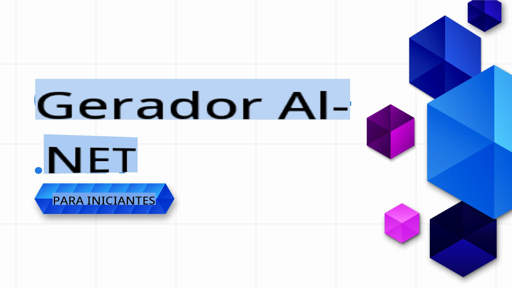

# IA Generativa para Iniciantes .NET - Um Curso

### Aulas práticas ensinando como construir aplicações de IA Generativa em .NET

Bem-vindo ao **IA Generativa para Iniciantes .NET**, o curso prático para desenvolvedores .NET que querem explorar o mundo da IA Generativa!

Este não é um curso típico de "aqui está a teoria, boa sorte". Este repositório é focado em **aplicações do mundo real** e **codificação ao vivo** para capacitar desenvolvedores .NET a aproveitarem ao máximo a IA Generativa.

É **prático**, **mão na massa** e projetado para ser **divertido**!

Não se esqueça de [dar uma estrela (🌟) neste repositório](https://docs.github.com/en/get-started/exploring-projects-on-github/saving-repositories-with-stars) para encontrá-lo mais facilmente depois.

➡️ Obtenha sua própria cópia [fazendo um fork deste repositório](https://github.com/microsoft/Generative-AI-for-beginners-dotnet/fork) e encontre-o em seus próprios repositórios.

## 🚀 Introdução

A IA Generativa está transformando o desenvolvimento de software, e o .NET não é exceção. Este curso busca simplificar a jornada, oferecendo:

- Vídeos curtos de 5-10 minutos para cada aula.
- Exemplos de código .NET totalmente funcionais para você executar e explorar.
- Integração com ferramentas como **GitHub Codespaces** e **GitHub Models** para uma configuração rápida e fácil. Mas, se preferir rodar os exemplos localmente com seus próprios modelos, isso também é possível.

Você aprenderá como implementar IA Generativa em projetos .NET, desde geração básica de texto até a construção de soluções completas usando **GitHub Models**, **Azure OpenAI Services** e **modelos locais com Ollama**.

## 📦 Cada Aula Inclui

- **Vídeo Curto**: Uma visão geral rápida da aula (5-10 minutos).
- **Exemplos de Código Completos**: Totalmente funcionais e prontos para rodar.
- **Orientação Passo a Passo**: Instruções simples para ajudar você a aprender e implementar os conceitos.
- **Referências para Exploração Mais Profunda**: Este curso foca na implementação prática da IA Generativa. Para aprofundar na teoria, também fornecemos links para explicações no [IA Generativa para Iniciantes - Um Curso](https://github.com/microsoft/generative-ai-for-beginners), conforme necessário.

## 🗃️ Aulas

| #   | **Link da Aula** | **Descrição** |
| --- | --- | --- |
| 01  | [**Introdução aos Fundamentos de IA Generativa para Desenvolvedores .NET**](./01-IntroToGenAI/readme.md) | <ul><li>Visão geral dos modelos generativos e suas aplicações no .NET</li></ul> |
| 02  | [**Configurando o Ambiente para Desenvolvimento .NET com IA Generativa**](./02-SetupDevEnvironment/readme.md) | <ul><li>Usando bibliotecas como **Microsoft.Extensions.AI** e **Semantic Kernel**.</li><li>Configurando provedores como GitHub Models, Azure AI Foundry e desenvolvimento local com Ollama.</li></ul> |
| 03  | [**Técnicas Essenciais de IA Generativa com .NET**](./03-CoreGenerativeAITechniques/readme.md) | <ul><li>Geração de texto e fluxos conversacionais.</li><li> Capacidades multimodais (visão e áudio).</li><li>Agentes</li></ul> |
| 04  | [**Exemplos Práticos de IA Generativa com .NET**](./04-PracticalSamples/readme.md) | <ul><li>Exemplos completos demonstrando IA Generativa em cenários do dia a dia</li><li>Aplicações de busca semântica.</li><li>Aplicações com múltiplos agentes</li></ul> |
| 05  | [**Uso Responsável de IA Generativa em Aplicações .NET**](./05-ResponsibleGenAI/readme.md) | <ul><li>Considerações éticas, mitigação de vieses e implementações seguras.</li></ul> |

## 🌐 Suporte a Múltiplos Idiomas

| Idioma               | Código | Link para o README Traduzido                          | Última Atualização |
|----------------------|--------|-----------------------------------------------------|--------------------|
| Chinês (Simplificado)| zh     | [Tradução em Chinês](../zh/README.md)    | 2025-02-19         |
| Chinês (Tradicional) | tw     | [Tradução em Chinês](../tw/README.md)    | 2025-02-19         |
| Francês              | fr     | [Tradução em Francês](../fr/README.md)   | 2025-02-19         |
| Japonês              | ja     | [Tradução em Japonês](../ja/README.md)   | 2025-02-19         |
| Coreano              | ko     | [Tradução em Coreano](../ko/README.md)   | 2025-02-19         |
| Português            | pt     | [Tradução em Português](./README.md) | 2025-02-19         |
| Espanhol             | es     | [Tradução em Espanhol](../es/README.md)  | 2025-02-19         |
| Alemão               | de     | [Tradução em Alemão](../de/README.md)    | 2025-02-19         |

## 🛠️ O Que Você Precisa

Para começar, você vai precisar de:

1. Uma **conta no GitHub** (gratuita serve!) para [fazer um fork deste repositório](https://github.com/microsoft/generative-ai-for-beginners-dotnet/fork) para sua própria conta do GitHub.

1. **GitHub Codespaces habilitado** para criar ambientes de codificação instantâneos. Você pode habilitar o GitHub Codespaces nas configurações do seu repositório. Saiba mais sobre o GitHub Codespaces [aqui](https://docs.github.com/en/codespaces).

1. Crie sua cópia [fazendo um fork deste repositório](https://github.com/microsoft/Generative-AI-for-beginners-dotnet/fork), ou use o botão `Fork` no topo desta página.

1. Uma compreensão básica de **desenvolvimento .NET**. Saiba mais sobre .NET [aqui](https://dotnet.microsoft.com/learn/dotnet/what-is-dotnet).

E é isso.

Projetamos este curso para ser o mais simples e direto possível. Usamos as seguintes ferramentas para ajudar você a começar rapidamente:

- **Execute no GitHub Codespaces**: Com um clique, você terá um ambiente pré-configurado para testar e explorar as aulas.
- **Aproveite os Modelos do GitHub**: Experimente demonstrações impulsionadas por IA hospedadas diretamente neste repositório. Explicamos mais nas lições ao longo do caminho. *(Se você quiser saber mais sobre os Modelos do GitHub, clique [aqui](https://docs.github.com/github-models))*

Quando estiver pronto para expandir, também temos guias para:

- Atualizar para os **Serviços do Azure OpenAI** para soluções escaláveis e prontas para empresas.
- Usar o **Ollama** para executar modelos localmente no seu hardware, garantindo maior privacidade e controle.

## 🤝 Quer Ajudar?

Contribuições são bem-vindas! Veja como você pode ajudar:

- [Relate problemas](https://github.com/microsoft/Generative-AI-for-beginners-dotnet/issues/new) ou bugs neste repositório.

- Melhore os exemplos de código existentes ou adicione novos, faça um fork deste repositório e proponha algumas alterações!
- Sugira lições adicionais ou melhorias.
- Tem sugestões ou encontrou erros de ortografia ou código? [Crie um pull request](https://github.com/microsoft/Generative-AI-for-beginners-dotnet/compare).

Confira o arquivo [CONTRIBUTING.md](CONTRIBUTING.md) para mais detalhes sobre como se envolver.

## 📄 Licença

Este projeto está licenciado sob a Licença MIT - veja o arquivo [LICENSE](../../LICENSE) para detalhes.

## 🌐 Outros Cursos

Temos muito mais conteúdo para ajudar na sua jornada de aprendizado. Confira:

- [IA Generativa para Iniciantes](https://aka.ms/genai-beginners)
- [IA Generativa para Iniciantes .NET](https://github.com/microsoft/Generative-AI-for-beginners-dotnet)
- [IA Generativa com JavaScript](https://github.com/microsoft/generative-ai-with-javascript)
- [IA para Iniciantes](https://aka.ms/ai-beginners)
- [Agentes de IA para Iniciantes - Um Curso](https://github.com/microsoft/ai-agents-for-beginners)
- [Ciência de Dados para Iniciantes](https://aka.ms/datascience-beginners)
- [ML para Iniciantes](https://aka.ms/ml-beginners)
- [Cibersegurança para Iniciantes](https://github.com/microsoft/Security-101) 
- [Desenvolvimento Web para Iniciantes](https://aka.ms/webdev-beginners)
- [IoT para Iniciantes](https://aka.ms/iot-beginners)
- [Desenvolvimento XR para Iniciantes](https://github.com/microsoft/xr-development-for-beginners)
- [Dominando o GitHub Copilot para Programação em Dupla](https://github.com/microsoft/Mastering-GitHub-Copilot-for-Paired-Programming)
- [Dominando o GitHub Copilot para Desenvolvedores C#/.NET](https://github.com/microsoft/mastering-github-copilot-for-dotnet-csharp-developers)
- [Escolha Sua Própria Aventura com o Copilot](https://github.com/microsoft/CopilotAdventures)

[Vamos começar a aprender IA Generativa e .NET!](02-SetupDevEnvironment/readme.md) 🚀

**Aviso Legal**:  
Este documento foi traduzido usando serviços de tradução baseados em IA. Embora nos esforcemos para garantir a precisão, esteja ciente de que traduções automatizadas podem conter erros ou imprecisões. O documento original em seu idioma nativo deve ser considerado a fonte oficial. Para informações críticas, recomenda-se a tradução profissional humana. Não nos responsabilizamos por quaisquer mal-entendidos ou interpretações incorretas decorrentes do uso desta tradução.