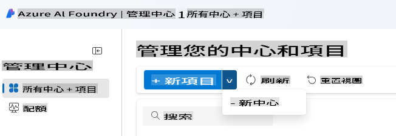
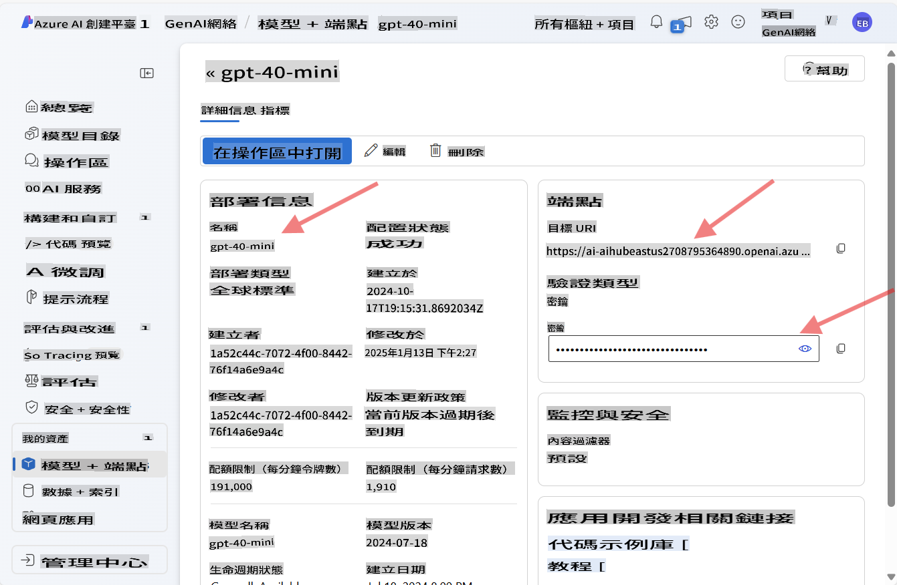
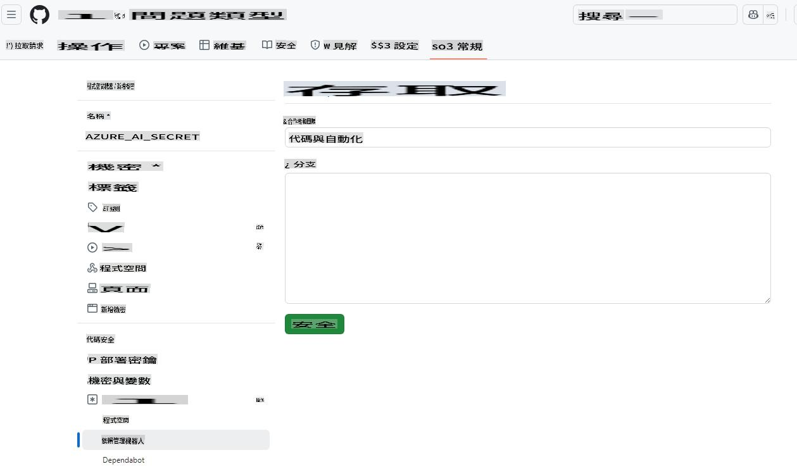
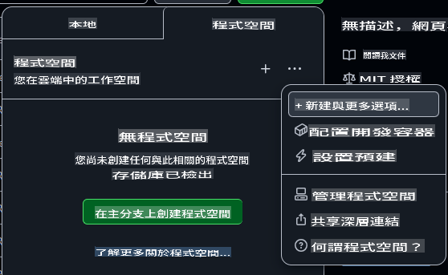
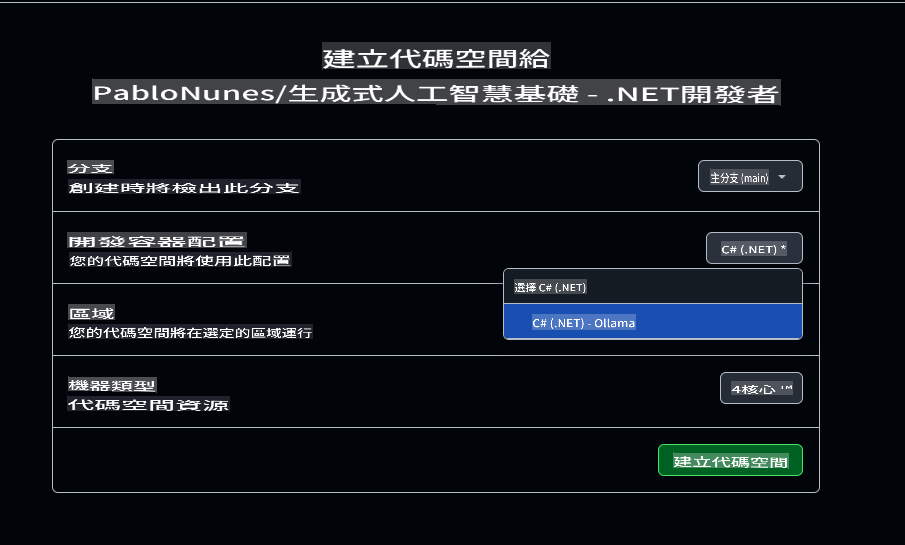

# 設置 Azure OpenAI 開發環境

如果你想在本課程中使用 Azure AI Foundry 模型來開發 .NET AI 應用，請按照本指南的步驟進行。

不想使用 Azure OpenAI？

👉 [如果你想使用 GitHub 模型，請參考這份指南](README.md)  
👉 [這是 Ollama 的步驟指南](getting-started-ollama.md)

## 建立 Azure AI Foundry 資源

要使用 Azure AI Foundry 模型，你需要在 Azure AI Foundry 入口網站中建立一個 Hub 和 Project，然後部署模型。本節將指導你如何完成這些步驟。

### 在 Azure AI Foundry 中建立 Hub 和 Project

1. 前往 [Azure AI Foundry Portal](https://ai.azure.com/)。  
1. 使用你的 Azure 帳戶登入。  
1. 從左側選單中選擇 **All hubs + projects**，然後點擊下拉選單中的 **+ New hub**。（注意：你可能需要先點擊 **+ New project** 才能看到 **+ New hub** 選項）。  
      
1. 新視窗將打開，填寫你的 Hub 詳細資訊：  
    - 給你的 Hub 起個名字（例如 "MyAIHub"）。  
    - 選擇離你最近的地區。  
    - 選擇適合的訂閱和資源群組。  
    - 其他設定可保持默認。  
    - 點擊 **Next**。  
    - 檢查詳細資訊，然後點擊 **Create**。  
1. Hub 建立完成後，入口網站將打開其詳細資訊頁面。點擊 **Create Project** 按鈕：  
    - 為你的 Project 命名（例如 "GenAINET"），或者接受默認名稱。  
    - 點擊 **Create**。  

🎉 **完成！** 你已經在 Azure AI Foundry 中創建了第一個 Project。

### 在 Azure AI Foundry 中部署語言模型

現在，讓我們將 **gpt-4o-mini** 模型部署到你的 Project 中：

1. 在 Azure AI Foundry 入口網站中，導航到你的 Project（創建完成後應該會自動打開）。  
1. 從左側選單中點擊 **Models and Endpoints**，然後點擊 **Deploy Model** 按鈕。  
1. 從下拉選單中選擇 **Deploy base model**。  
1. 在模型目錄中搜尋 **gpt-4o-mini**。  
1. 選擇模型並點擊 **Confirm** 按鈕。  
1. 指定一個部署名稱（例如 "gpt-4o-mini"）。其他選項可保持默認。  
1. 點擊 **Deploy**，等待模型部署完成。  
1. 部署完成後，從模型詳細資訊頁面記下 **Model Name**、**Target URI** 和 **API Key**。  

🎉 **完成！** 你已經在 Azure AI Foundry 中部署了第一個大型語言模型。



> 📝 **注意：** 端點可能類似於 `https://< your hub name>.openai.azure.com/openai/deployments/gpt-4o-mini/chat/completions?api-version=2024-08-01-preview`。我們需要的端點名稱僅為 `https://< your hub name >.openai.azure.com/`*。

## 將 Azure AI API Key 添加到 Codespace 的 Secrets

為了安全起見，讓我們將剛才創建的 API Key 添加到 Codespace 的 Secrets 中。

1. 確保你已經將此存儲庫 Fork 到你的 GitHub 帳戶中。  
1. 前往 Fork 後存儲庫的 **Settings** 標籤，然後在左側選單中展開 **Secrets and variables**，選擇 **Codespaces**。  

      
1. 將 Secret 命名為 **AZURE_AI_KEY**。  
1. 將你從 Azure AI Foundry 入口網站複製的 API Key 粘貼到 **Secret** 欄位中。

## 創建 GitHub Codespace

現在讓我們創建一個 GitHub Codespace，作為本課程的開發環境。

1. 在新窗口中打開此存儲庫的主頁面，方法是[右鍵點擊這裡](https://github.com/microsoft/Generative-AI-for-beginners-dotnet)並選擇 **Open in new window**。  
1. 點擊頁面右上角的 **Fork** 按鈕，將存儲庫 Fork 到你的 GitHub 帳戶中。  
1. 點擊 **Code** 下拉按鈕，然後選擇 **Codespaces** 標籤。  
1. 選擇 **...** 選項（三個點），然後選擇 **New with options...**。  



### 選擇你的開發容器

在 **Dev container configuration** 下拉選單中，選擇以下選項之一：

**選項 1: C# (.NET)**：如果你計劃使用 GitHub 模型或 Azure OpenAI，應選擇此選項。它包含本課程所需的核心 .NET 開發工具，啟動速度快。  

**選項 2: C# (.NET) - Ollama**：Ollama 允許你在不連接 GitHub 模型或 Azure OpenAI 的情況下運行演示。此選項包含所有核心 .NET 開發工具以及 Ollama，但啟動速度較慢，平均需五分鐘。[參考這份指南](getting-started-ollama.md) 如果你想使用 Ollama。  

其他設置可以保持默認。點擊 **Create codespace** 按鈕開始創建 Codespace。



## 更新範例代碼以使用 Azure OpenAI 和你的新模型

現在讓我們更新代碼以使用剛部署的模型。首先，我們需要添加一些 NuGet 套件來支持 Azure OpenAI。

1. 打開終端並切換到項目目錄：

    ```bash
    cd 02-SetupDevEnvironment/src/BasicChat-01MEAI/
    ```

1. 運行以下命令以添加所需的套件：

    ```bash
    dotnet add package Azure.AI.OpenAI
    dotnet add package Microsoft.Extensions.AI.OpenAI --version 9.1.0-preview.1.25064.3
    ```

[更多關於 Azure.AI.OpenAI 的資訊](https://www.nuget.org/packages/Azure.AI.OpenAI/2.1.0#show-readme-container)。

1. 打開 `/workspaces/Generative-AI-for-beginners-dotnet/02-SettingUp.NETDev/src/BasicChat-01MEAI/Program.cs`。

    在文件頂部添加以下 using 語句：

    ```csharp
    using System.ClientModel;
    using Azure.AI.OpenAI;
    using Microsoft.Extensions.AI;

1. Create new variables to hold the model name, endpoint, and API key:

    ```csharp
    var deploymentName = "< deployment name > "; // 例如 "gpt-4o-mini"
    var endpoint = new Uri("< endpoint >"); // 例如 "https://< your hub name >.openai.azure.com/"
    var apiKey = new ApiKeyCredential(Environment.GetEnvironmentVariable("AZURE_AI_SECRET"));
    ```

    Making sure to replace `< deployment name >`, and `< endpoint >` with the values you noted above.

1. Replace the `IChatClient` creation with the following code:

    ```csharp
    IChatClient client = new AzureOpenAIClient(
        endpoint,
        apiKey)
    .AsChatClient(deploymentName);
    ```

1. Run the following command in the terminal:

    ```bash
    dotnet run
    ```

1. You should see output similar to the following:

    ```bash
    Artificial Intelligence (AI) 是指機器模擬人類智能的能力，使其能像人類一樣思考和學習。AI 涵蓋了多種技術和方法，使計算機和系統能執行通常需要人類智能的任務，包括：

    1. **學習**：基於經驗改進性能，通常通過分析數據的算法實現。
    
    ...
    ```

> 🙋 **需要幫助？**：有問題無法解決？[提交一個 issue](https://github.com/microsoft/Generative-AI-for-beginners-dotnet/issues/new?template=Blank+issue)，我們將協助你。

## 總結

在本課程中，你學會了如何為接下來的課程設置開發環境。你創建了一個 GitHub Codespace 並配置它以使用 Azure OpenAI。你還更新了範例代碼以使用在 Azure AI Foundry 中部署的新模型。

### 更多資源

- [Azure AI Foundry 文件](https://learn.microsoft.com/azure/ai-services/)  
- [使用 GitHub Codespaces](https://docs.github.com/en/codespaces/getting-started)  
- [如何在 Azure AI Foundry 中部署模型](https://learn.microsoft.com/azure/ai-services/deploy/)  
- [Azure.AI.OpenAI NuGet 套件](https://www.nuget.org/packages/Azure.AI.OpenAI)

## 下一步

接下來，我們將探索如何創建你的第一個 AI 應用！🚀

👉 [核心生成式 AI 技術](../03-CoreGenerativeAITechniques/readme.md)

**免責聲明**：  
本文件是使用機器翻譯AI服務進行翻譯的。儘管我們努力確保準確性，但請注意，自動翻譯可能會包含錯誤或不準確之處。應以原語言的原始文件作為權威來源。對於關鍵信息，建議尋求專業人工翻譯。我們對因使用本翻譯而引起的任何誤解或誤讀不承擔責任。