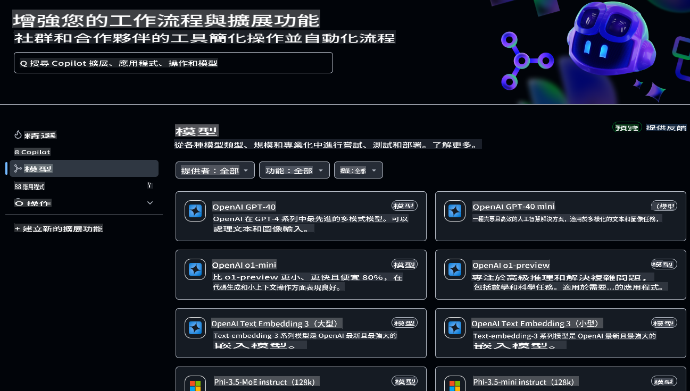
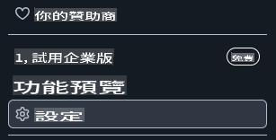
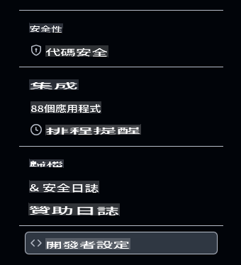
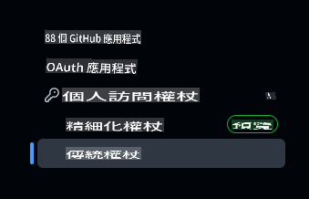
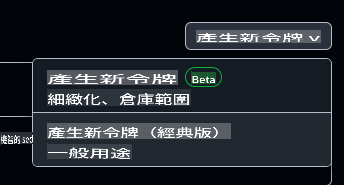

# 為本課程設定開發環境

這節課將指導你如何為本課程設定開發環境。為了確保你順利完成課程，我們準備了一個 devcontainer 配置，提供你完成課程所需的所有工具。你可以在 GitHub Codespaces（推薦）或本地電腦上執行 devcontainer。此外，我們還會示範如何設置 GitHub 訪問權杖以與 GitHub Models 互動。

*如果有需要，我們也提供了[Azure OpenAI](getting-started-azure-openai.md)和[Ollama](getting-started-ollama.md)的設定指南。*

---

## 你將在這節課學到：

- ⚡ 如何使用 GitHub Codespaces 設定開發環境
- 🤖 配置開發環境以通過 GitHub Models、Azure OpenAI 或 Ollama 訪問 LLMs
- 🛠️ 使用 .devcontainer 配置業界標準工具
- 🎯 最後，一切準備就緒，開始完成接下來的課程

讓我們一起動手，設置你的開發環境吧！🏃‍♂️

[](https://youtu.be/7kYoVRNQXyA?feature=shared)

_⬆️點擊圖片觀看影片⬆️_

## 本課程應選擇哪個 AI 服務？

我們提供了使用 GitHub Models、Azure OpenAI 和 Ollama 設定開發環境的指南。你可以選擇最適合你的選項。我們推薦使用 GitHub Models，但你可以選擇其中任意一個服務。

以下是這些服務的簡要介紹：

- **GitHub Models**：一個免費的入門服務，允許你直接在開發環境中測試和互動各種 AI 模型。它在 Codespaces 中非常容易使用，是在實施前了解模型能力的好方法。
- **Azure OpenAI**：一個付費服務，提供多樣化的 AI 模型訪問。它具備 Azure 的安全性與擴展性，是一個很好的選擇，特別是如果你已經有 Azure 訂閱的話。
- **Ollama**：允許你在本地電腦或 Codespace/devcontainer 中運行 AI 模型，且免費使用。如果你更喜歡本地運行模型，這是個不錯的選擇，但需要更多硬體資源，且速度可能比雲端選項慢。

> 如果你選擇 **GitHub Models**，請按照本文檔的其餘部分設置你的開發環境。
> - 想選擇 **Azure OpenAI**？[點此查看指南](getting-started-azure-openai.md)。
> - 偏好 **Ollama**？[點此查看指導](getting-started-ollama.md)。

## 使用 GitHub Models 學習和測試 AI 模型

**GitHub Models** 提供了一個直觀的方式來在開發環境中試驗各種 AI 模型。它讓開發者可以測試和互動不同的模型，了解它們的能力和限制，並確定最適合應用需求的模型。通過簡單的介面，你可以探索模型的回應、評估效能，並選擇最佳的解決方案。在 GitHub 基礎設施內託管的這些模型提供了可靠的訪問和一致的性能，非常適合開發和測試階段。而且，還有免費層級供你開始探索，無需任何費用。



## 起步檢查：設置 GitHub 訪問權杖

在進行其他操作之前，我們需要配置必要的安全憑證，以便 Codespace 可以與 GitHub Models 互動並安全執行應用程序。

### 為 GitHub Models 訪問創建個人訪問權杖

1. 前往 [GitHub 設定](https://github.com/settings/profile)：

    - 點擊右上角的個人頭像
    - 從下拉菜單中選擇 **Settings**

    

1. 訪問 [開發者設定](https://github.com/settings/apps)：

    - 向左側邊欄滾動至底部
    - 點擊 **Developer settings**

    

1. 生成新權杖：

    - 選擇 **Personal access tokens** → **Tokens (classic)**

        

    - 在頁面中間的下拉菜單中點擊 **Generate new token (classic)**

        

    - 在「Note」下提供一個描述性名稱（例如：`GenAI-DotNet-Course-Token`）
    - 設置過期日期（建議：7 天以符合安全最佳實踐）
    - 無需為此權杖添加任何權限。

> 💡 **安全提示**：始終使用最低必要範圍和最短可行的過期時間來設置訪問權杖。這遵循最小權限原則，有助於保持你的帳戶權杖安全。

## 創建 GitHub Codespace

現在我們來創建一個 GitHub Codespace，作為完成本課程的開發環境。

1. 在新窗口中打開此儲存庫的主頁：[右鍵點擊此處](https://github.com/microsoft/Generative-AI-for-beginners-dotnet)，並從上下文菜單中選擇 **Open in new window**
1. 點擊頁面右上角的 **Fork** 按鈕，將此儲存庫 Fork 到你的 GitHub 帳戶
1. 點擊 **Code** 下拉按鈕，然後選擇 **Codespaces** 標籤
1. 選擇 **...** 選項（三個點），然後選擇 **New with options...**


### 選擇你的開發容器

在 **Dev container configuration** 下拉菜單中，選擇以下選項之一：

**選項 1: C# (.NET)** ：如果你計劃使用 GitHub Models，這是我們建議完成本課程的選項。它包含了完成課程所需的所有核心 .NET 開發工具，啟動速度快。

**選項 2: C# (.NET) - Ollama**：Ollama 允許你運行演示而無需連接到 GitHub Models 或 Azure OpenAI。它包含所有核心 .NET 開發工具以及 Ollama，但啟動速度較慢，平均需時五分鐘。[按照此指南](getting-started-ollama.md)來使用 Ollama。

> 💡**提示**：在創建 Codespace 時，請選擇離你最近的區域（如果菜單中有選項）。選擇距離較遠的區域可能會導致創建過程出現錯誤。

點擊 **Create codespace** 按鈕開始創建 Codespace。


## 驗證你的 Codespace 是否正確運行並支持 GitHub Models

當你的 Codespace 完全加載並配置完成後，讓我們運行一個示例應用程序來驗證一切是否正常運行：

1. 打開終端。你可以通過在 macOS 上輸入 **Ctrl+\`** (backtick) on Windows or **Cmd+`** 來打開終端窗口。

1. 通過運行以下命令切換到正確的目錄：

    ```bash
    cd 02-SetupDevEnvironment\src\BasicChat-01MEAI
    ```

1. 然後使用以下命令運行應用程序：

    ```bash
    dotnet run
    ```

1. 可能需要幾秒鐘，但最終應用程序應輸出類似以下的消息：

    ```bash
    AI, or artificial intelligence, refers to the simulation of human intelligence in machines that are programmed to think and learn like humans. It is a broad field of computer science that focuses on creating systems and algorithms capable of performing tasks that typically require human intelligence. These tasks include problem-solving,

    ...
    ```

> 🙋 **需要幫助？**：遇到問題？[提交問題](https://github.com/microsoft/Generative-AI-for-beginners-dotnet/issues/new?template=Blank+issue)，我們會協助你。

## 總結

在這節課中，你學會了如何為接下來的課程設置開發環境。你創建了一個 GitHub Codespace，並配置它以使用 GitHub Models、Azure OpenAI 或 Ollama。你還學會了如何為 GitHub Models 創建個人訪問權杖，以及如何運行示例應用程序來驗證一切是否正常運行。

### 其他資源

- 嘗試用其他託管提供商測試本指南！
    - [Azure OpenAI](getting-started-azure-openai.md)
    - [Ollama](getting-started-ollama.md)
- [GitHub Codespaces 文件](https://docs.github.com/en/codespaces)
- [GitHub Models 文件](https://docs.github.com/en/github-models/prototyping-with-ai-models)

## 下一步

接下來，我們將探索如何創建你的第一個 AI 應用程序！🚀

👉 [生成式 AI 核心技術](../03-CoreGenerativeAITechniques/readme.md)

**免責聲明**：  
本文件是使用機器翻譯AI服務進行翻譯的。我們雖然致力於追求準確性，但請注意，自動翻譯可能會包含錯誤或不精確之處。應以原文作為權威來源。對於關鍵資訊，建議使用專業人工翻譯。我們對因使用此翻譯而產生的任何誤解或誤讀概不負責。