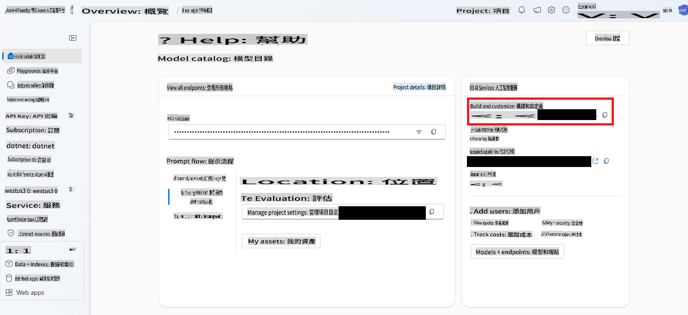

# AI Agents

在這堂課中，你將學習如何建立一個能夠...自行決策並執行操作，而不需要持續的人工干預的 AI 實體？沒錯，AI Agents 能夠獨立完成特定任務。

---

[](https://youtu.be/Btkmw1Bosh0?feature=shared)

_⬆️點擊圖片觀看影片⬆️_

AI Agents 讓 LLMs 從助理進化為能夠代表使用者採取行動的實體。這些代理甚至能夠與其他代理互動以完成任務。一個代理的關鍵特徵包括一定程度的**自主性**，允許代理根據其程式設計來啟動行動，進而實現基於預定目標的**決策能力**。此外，它們還具有**適應性**，能夠通過學習和調整來隨時間提升表現。

在構建代理時需要記住的一個關鍵點是，它們專注於執行單一任務。你需要儘可能縮小它們的用途範圍。

> 🧑‍🏫**深入了解**: 想了解更多 AI Agents 的基本概念，可以參考 [Generative AI for Beginners: AI Agents](https://github.com/microsoft/generative-ai-for-beginners/tree/main/17-ai-agents)。

## 建立一個 AI Agent

我們將引入一些新概念來在 .NET 中構建 AI Agent。我們會使用一個新的 SDK，並需要在 Azure AI Foundry 中進行一些額外的設定來啟動項目。

> 🧑‍💻**範例程式碼**: 本課程將使用 [AgentLabs-01-Simple sample](../../../03-CoreGenerativeAITechniques/src/AgentLabs-01-Simple) 作為範例。
>
> 我們也提供了一些進階範例，位於 `/src/` 資料夾中。你可以查看 [AgentLabs-02-Functions](../../../03-CoreGenerativeAITechniques/src/AgentLabs-02-Functions)、[AgentLabs-03-OpenAPIs](../../../03-CoreGenerativeAITechniques/src/AgentLabs-03-OpenAPIs) 或 [AgentLabs-03-PythonParksInformationServer](../../../03-CoreGenerativeAITechniques/src/AgentLabs-03-PythonParksInformationServer) 的 README 以獲取更多資訊。

### Azure AI Agent Service

我們將介紹一個新的 Azure 服務來幫助我們構建代理，也就是命名恰當的 [Azure AI Agent Service](https://learn.microsoft.com/azure/ai-services/agents/overview)。

要運行本課程中的範例程式碼，你需要在 Azure AI Foundry 中進行一些額外的設定。你可以參考 [這些指引來設定一個 **基本代理**](https://learn.microsoft.com/azure/ai-services/agents/quickstart?pivots=programming-language-csharp)。

### Azure AI Projects library

代理由三個部分組成：**LLM** 或模型、**State** 或上下文（類似於對話，用於根據過去的結果引導決策），以及 **Tools**，這些工具類似於我們之前學到的 [函數](./01-lm-completions-functions.md#function-calling)，用來在模型和外部系統之間建立橋樑。

理論上，你可以用之前學到的知識來構建 AI Agents。但 **Azure AI Projects for .NET** library 提供了一個 API，可以簡化許多常見任務，讓開發代理變得更加容易。

在使用 Azure AI Projects library 時，需要了解幾個概念（對應到類別）：

- `AgentClient`：負責創建並託管代理的整體客戶端，管理代理運行的線程，並處理與雲端的連接。
- `Agent`：包含代理要執行的指令以及它可以使用的工具定義。
- `ThreadMessage`：這些是消息——類似於我們之前學到的提示——用來傳遞給代理。代理也會創建 `ThreadMessage` 對象來進行交流。
- `ThreadRun`：一個線程，用於將消息傳遞給代理。線程啟動後，可以提供額外指令，並且可以輪詢其狀態。

讓我們看看一個簡單的範例！

### 建立一個數學代理

我們將構建一個單一用途的代理，作為數學學生的輔導員。它的唯一目標是解決並解釋使用者提出的數學問題。

1. 首先，我們需要創建一個 `AgentsClient` 對象，負責管理與 Azure 的連接、代理本身、線程、消息等。

    ```csharp
    string projectConnectionString = "< YOU GET THIS FROM THE PROJECT IN AI FOUNDRY >";
    AgentsClient client = new(projectConnectionString, new DefaultAzureCredential());
    ```

    你可以在 AI Foundry 中打開你創建的 Hub，然後選擇專案，在右側找到專案連接字串。

    

2. 接下來，我們需要創建這個輔導代理。記住，它應該只專注於一件事。
   
    ```csharp
    Agent tutorAgent = (await client.CreateAgentAsync(
    model: "gpt-4o",
    name: "Math Tutor",
    instructions: "You are a personal math tutor. Write and run code to answer math questions.",
    tools: [new CodeInterpreterToolDefinition()])).Value;
    ```

    這裡需要注意幾點。首先是 `tools` parameter. We're creating a `CodeInterpreterToolDefinition` object (that is apart of the **Azure.AI.Projects** SDK) that will allow the agent to create and execute code.

    > 🗒️**Note**: You can create your own tools too. See the [Functions](../../../03-CoreGenerativeAITechniques/src/AgentLabs-02-Functions) to learn more.

    Second note the `instructions` that are being sent along. It's a prompt and we're limiting it to answer math questions. Then last creating the agent is an async operation. That's because it's creating an object within Azure AI Foundry Agents service. So we both `await` the `CreateAgentAsync` function and then grab the `Value` 的返回值來獲取實際的 `Agent` 對象。在使用 **Azure.AI.Projects** SDK 創建對象時，你會多次看到這樣的模式。

3. `AgentThread` 是處理個別代理與使用者之間通信的對象。我們需要創建它，然後在上面添加一個 `ThreadMessage`。在這種情況下，這是使用者的第一個問題。

    ```csharp
    AgentThread thread = (await client.CreateThreadAsync()).Value;

    // Creating the first user message to AN agent - notice how we're putting it on a thread
    ThreadMessage userMessage = (await client.CreateMessageAsync(
        thread.Id,
        MessageRole.User,
        "Hello, I need to solve the equation `3x + 11 = 14`. Can you help me?")
    ).Value;
    ```

    注意 `ThreadMessage` 的類型是 `MessageRole.User`。並且我們並不是將消息發送給特定代理，而是將其放到一個線程上。

4. 接下來，我們讓代理提供一個初始回應，將其放到線程上，然後啟動線程。在啟動線程時，我們會提供初始代理的 id 來運行，以及任何額外指令。

    ```csharp
    ThreadMessage agentMessage =  await client.CreateMessageAsync(
        thread.Id,
        MessageRole.Agent,
        "Please address the user as their name. The user has a basic account, so just share the answer to the question.")
    ).Value;

    ThreadRun run = (await client.CreateRunAsync(
        thread.Id,
        assistantId: agentMathTutor.Id, 
        additionalInstructions: "You are working in FREE TIER EXPERIENCE mode`, every user has premium account for a short period of time. Explain detailed the steps to answer the user questions")
    ).Value;
    ```

5. 最後一步是檢查運行的狀態。

    ```csharp
    do
    {
        await Task.Delay(Timespan.FromMilliseconds(100));
        run = (await client.GetRunAsync(thread.Id, run.Id)).Value;

        Console.WriteLine($"Run Status: {run.Status}");
    }
    while (run.Status == RunStatus.Queued || run.Status == RunStatus.InProgress);
    ```

6. 然後顯示結果中的消息。

    ```csharp
    Response<PageableList<ThreadMessage>> afterRunMessagesResponse = await client.GetMessagesAsync(thread.Id);
    IReadOnlyList<ThreadMessage> messages = afterRunMessagesResponse.Value.Data;

    // sort by creation date
    messages = messages.OrderBy(m => m.CreatedAt).ToList();

    foreach (ThreadMessage msg in messages)
    {
        Console.Write($"{msg.CreatedAt:yyyy-MM-dd HH:mm:ss} - {msg.Role,10}: ");

        foreach (MessageContent contentItem in msg.ContentItems)
        {
            if (contentItem is MessageTextContent textItem)
                Console.Write(textItem.Text);
        }
        Console.WriteLine();
    }
    ```

> 🙋 **需要幫助嗎？**: 如果遇到任何問題，[在此倉庫中提交問題](https://github.com/microsoft/Generative-AI-for-beginners-dotnet/issues/new)。

下一步的邏輯可能是開始使用多個代理來創建一個自動化系統。例如，下一步可以構建一個檢查使用者是否擁有高級帳戶的代理。

## 總結

AI Agents 是自主的 AI 實體，不僅僅局限於簡單的聊天互動——它們可以：

- **獨立決策**：在無需持續人工輸入的情況下執行任務。
- **維持上下文**：保存狀態並記住先前的互動。
- **使用工具**：訪問外部系統和 API 完成任務。
- **協作**：與其他代理合作解決複雜問題。

你也學到了如何使用 **Azure AI Agents** 服務與 **Azure AI Project** SDK 來創建一個基礎代理。

將代理想像成具有行動能力的 AI 助手——它們不僅僅是回應，還會根據其程式設計和目標採取行動。

## 其他資源

- [使用 .NET 建立一個簡單代理](https://learn.microsoft.com/dotnet/ai/quickstarts/quickstart-assistants?pivots=openai)
- [多代理協作](https://techcommunity.microsoft.com/blog/educatordeveloperblog/using-azure-ai-agent-service-with-autogen--semantic-kernel-to-build-a-multi-agen/4363121)
- [Semantic Kernel Agent Framework](https://learn.microsoft.com/semantic-kernel/frameworks/agent/?pivots=programming-language-csharp)
- [AI Agents - 初學者生成式 AI 系列](https://github.com/microsoft/generative-ai-for-beginners/tree/main/17-ai-agents)

## 下一步

你已經學到了很多！從簡單的一次性文字補全到構建代理！

👉 [在下一課中，看看一些實際應用範例](../04-PracticalSamples/readme.md)，學習如何將所有內容結合在一起。

**免責聲明**：  
本文檔使用基於機器的人工智能翻譯服務進行翻譯。儘管我們努力確保準確性，但請注意，自動翻譯可能包含錯誤或不準確之處。應以原文檔的母語版本為權威來源。對於關鍵資訊，建議尋求專業的人類翻譯。我們對因使用此翻譯而產生的任何誤解或錯誤解釋不承擔責任。