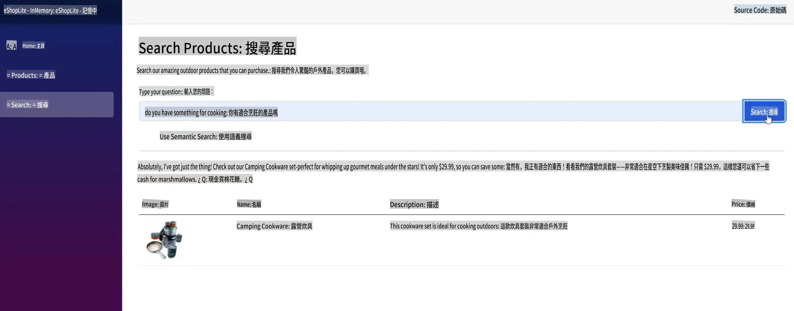
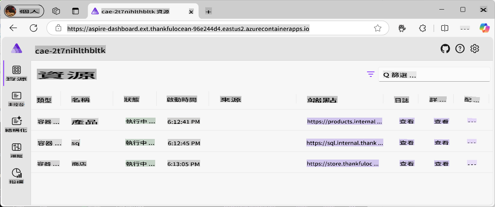
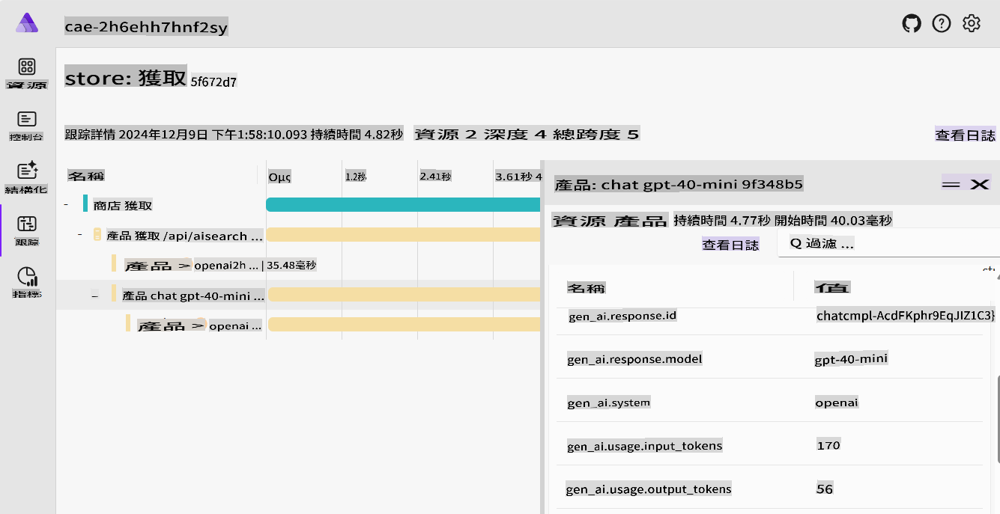
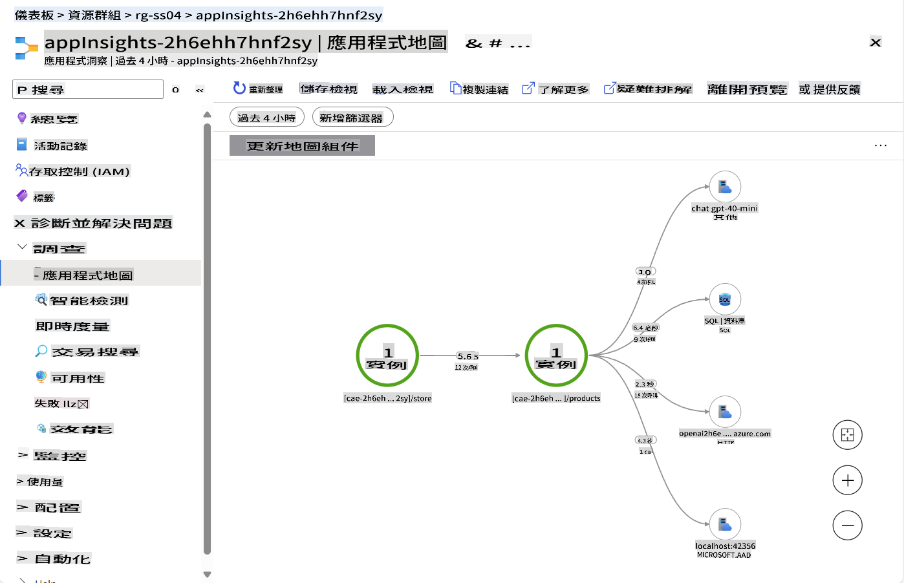
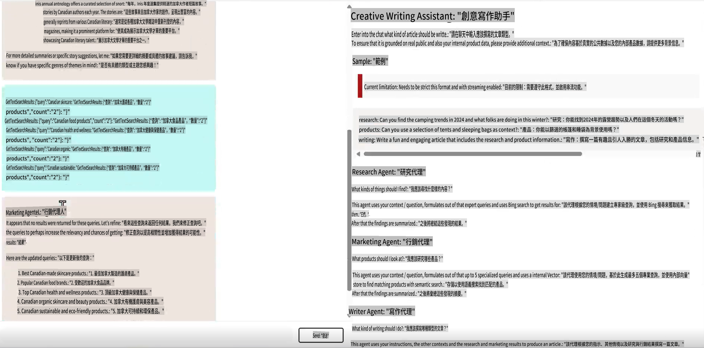
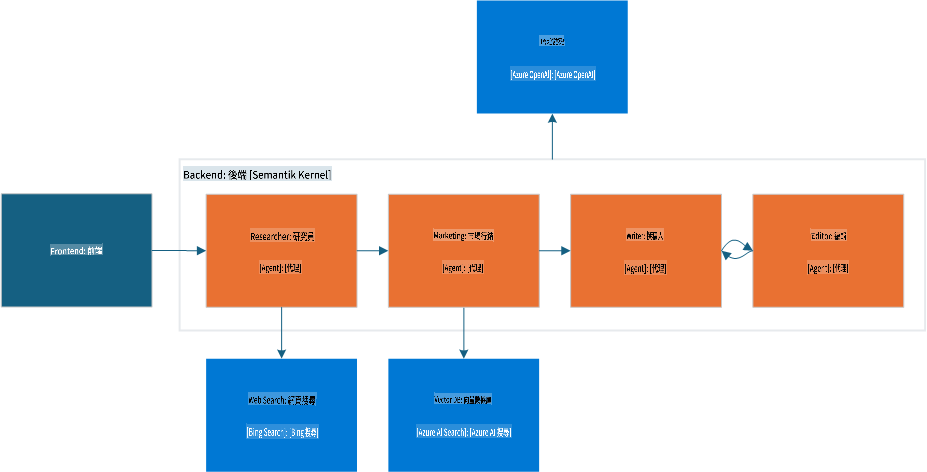
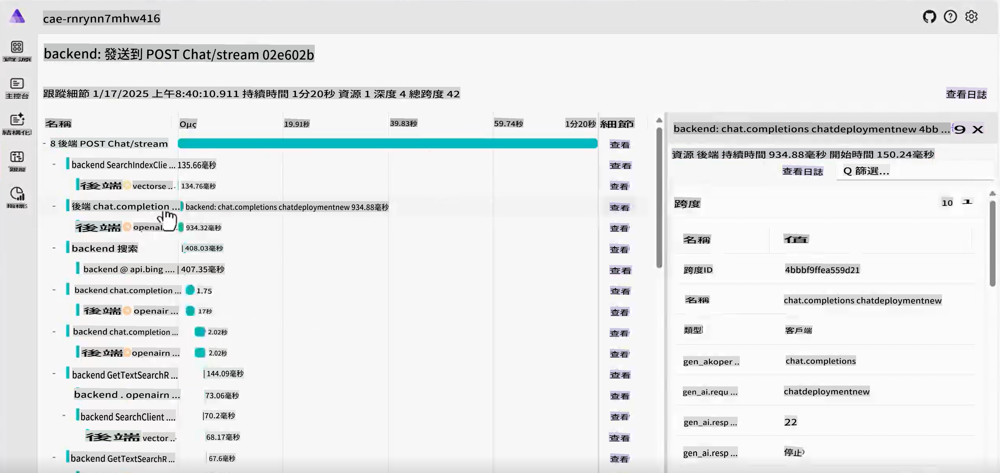
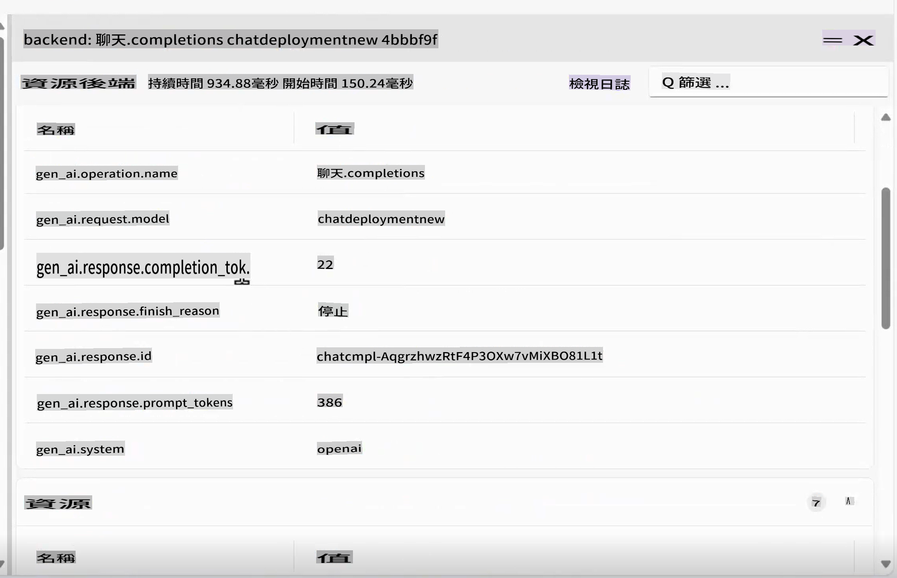

# 標準生成式 AI 範例

在這些真實且實用的範例中，看看您學到的概念如何實際應用。

---

## 您將達成的目標

- 瞭解生成式 AI 如何融入現有應用程式。
- 學習在複雜場景中代理 (Agents) 的運作方式。

## 包含的範例
- [標準生成式 AI 範例](../../../04-PracticalSamples)
  - [您將達成的目標](../../../04-PracticalSamples)
  - [包含的範例](../../../04-PracticalSamples)
  - [eShopLite 示範](../../../04-PracticalSamples)
    - [eShopLite 與語意搜尋 - In Memory](../../../04-PracticalSamples)
    - [eShopLite 與語意搜尋 - Azure AI Search](../../../04-PracticalSamples)
    - [eShopLite 與即時語音分析](../../../04-PracticalSamples)
  - [創意寫作代理](../../../04-PracticalSamples)
  - [總結](../../../04-PracticalSamples)
    - [其他資源](../../../04-PracticalSamples)
    - [下一步](../../../04-PracticalSamples)


[](https://youtu.be/Ky4CACXJqR8?feature=shared)

_⬆️點擊圖片觀看影片⬆️_

## eShopLite 示範

在我們的第一組示範中，我們將探索 **eShopLite** 專案。**eShopLite** 是一個專為戶外裝備與露營愛好者設計的簡單電商應用程式，並透過生成式 AI 功能進行增強，例如搜尋功能優化、客戶支持和即時語音分析。

這些示範使用 [Azure OpenAI](https://azure.microsoft.com/products/ai-services/openai-service) 和 [Azure AI Foundry Models](https://ai.azure.com/) 進行推論（即應用程式中的生成式 AI 部分）。

在第一個示範中，我們展示如何使用 Semantic Kernel 增強搜尋功能，使其能理解使用者查詢的上下文並提供準確的結果。

### eShopLite 與語意搜尋

[](https://youtu.be/FlkruF6USro?feature=shared)

_⬆️點擊圖片觀看影片⬆️_

在 eShopLite 的語意搜尋中，我們利用 Semantic Kernel 增強電商應用程式的搜尋功能。Semantic Kernel 幫助我們創建一個更強大的搜尋引擎，可以理解使用者查詢的上下文並提供更準確的結果。

例如，如果使用者搜尋「你有沒有什麼可以用來烹飪的東西」，搜尋引擎可以理解使用者正在尋找廚房用品，並顯示最相關的產品。在此範例中，它會回傳露營炊具。

> 🧑‍💻**範例**: 查看 [eShopLite 語意搜尋範例](https://aka.ms/netaieshoplitesemanticsearch)



語意搜尋可以幫助使用者更輕鬆地找到所需產品，提升購物體驗並增加銷售量。要實現此功能，我們需要有一個包含產品的向量存儲、一個搜尋索引和一個語言模型。[.NET Aspire](https://learn.microsoft.com/dotnet/aspire/get-started/aspire-overview) 工具協助在後端協調所有過程。



在 .NET Aspire 儀表板中，我們可以看到產品、SQL 和存儲容器，這些容器可以與語言模型互動。深入了解 Aspire App Host，我們有以下內容：

```csharp
if (builder.ExecutionContext.IsPublishMode)
{
    // Add the Azure Application Insights for monitoring
    var appInsights = builder.AddAzureApplicationInsights("appInsights");
    // Add the Azure OpenAI for the chat and embeddings deployments, the embedding is used for the vector entities
    var chatDeploymentName = "gpt-4o-mini";
    var embeddingsDeploymentName = "text-embedding-ada-002";
    var aoai = builder.AddAzureOpenAI("openai")
        .AddDeployment(new AzureOpenAIDeployment(chatDeploymentName,
        "gpt-4o-mini",
        "2024-07-18",
        "GlobalStandard",
        10))
        .AddDeployment(new AzureOpenAIDeployment(embeddingsDeploymentName,
        "text-embedding-ada-002",
        "2"));

    products.WithReference(appInsights)
        .WithReference(aoai)
        .WithEnvironment("AI_ChatDeploymentName", chatDeploymentName)
        .WithEnvironment("AI_embeddingsDeploymentName", embeddingsDeploymentName);

    store.WithReference(appInsights)
        .WithExternalHttpEndpoints();
}
```

上述程式碼展示了如何新增 Azure Application Insights 用於監控、Azure OpenAI 用於聊天和嵌入部署，以及用於向量實體的嵌入。

嵌入和 AOAI 的創建可以在產品容器中找到，如下所示：

```csharp
var azureOpenAiClientName = "openai";
builder.AddAzureOpenAIClient(azureOpenAiClientName);

// get azure openai client and create Chat client from aspire hosting configuration
builder.Services.AddSingleton<ChatClient>(serviceProvider =>
{
    var chatDeploymentName = "gpt-4o-mini";
    var logger = serviceProvider.GetService<ILogger<Program>>()!;
    logger.LogInformation($"Chat client configuration, modelId: {chatDeploymentName}");
    ChatClient chatClient = null;
    try
    {
        OpenAIClient client = serviceProvider.GetRequiredService<OpenAIClient>();
        chatClient = client.GetChatClient(chatDeploymentName);
    }...
}
```

上述程式碼展示了如何從 Aspire 託管配置中獲取 Azure OpenAI 客戶端並創建聊天客戶端。`chatDeploymentName` 是應用程式中使用的部署名稱。同樣的過程也適用於創建嵌入客戶端，如下所示：

```csharp
// get azure openai client and create embedding client from aspire hosting configuration
builder.Services.AddSingleton<EmbeddingClient>(serviceProvider =>
{
    var embeddingsDeploymentName = "text-embedding-ada-002";
    var logger = serviceProvider.GetService<ILogger<Program>>()!;
    logger.LogInformation($"Embeddings client configuration, modelId: {embeddingsDeploymentName}");
    EmbeddingClient embeddingsClient = null;
    try
    {
        OpenAIClient client = serviceProvider.GetRequiredService<OpenAIClient>();
        embeddingsClient = client.GetEmbeddingClient(embeddingsDeploymentName);
    }...
});
```

透過這些，我們可以創建 `MemoryContext` 作為向量存儲，用於比較使用者查詢並回傳最相關的產品，如下所示：

```csharp
// Iterate over the products and add them to the memory
_logger.LogInformation("Adding product to memory: {Product}", product.Name);
var productInfo = $"[{product.Name}] is a product that costs [{product.Price}] and is described as [{product.Description}]";

// Create a new product vector
var productVector = new ProductVector
{
    Id = product.Id,
    Name = product.Name,
    Description = product.Description,
    Price = product.Price,
    ImageUrl = product.ImageUrl
};

// Generate the embedding for the product information
var result = await _embeddingClient.GenerateEmbeddingAsync(productInfo);

// Convert the embedding result to a float array and assign it to the product vector
productVector.Vector = result.Value.ToFloats();
var recordId = await _productsCollection.UpsertAsync(productVector);
_logger.LogInformation("Product added to memory: {Product} with recordId: {RecordId}", product.Name, recordId);
```

上述程式碼展示了如何遍歷產品並將它們新增到記憶體中。

在創建新的產品向量後，我們使用它生成產品資訊的嵌入，將嵌入結果轉換為浮點數陣列，並分配給產品向量。

查看 `_productsCollection`，它是存儲產品的容器的參考，使用 CosmosDB 調用以獲取記錄 ID 的回應。在此情境中，用於記錄。

然後將產品新增到記憶體，對集合中的每個產品重複此過程。

之後，當使用者搜尋產品時，我們可以將使用者的查詢與產品向量進行比較，並回傳最相關的產品。

```csharp
try
{
    // Generate embedding for the search query
    var result = await _embeddingClient.GenerateEmbeddingAsync(search);
    var vectorSearchQuery = result.Value.ToFloats();

    var searchOptions = new VectorSearchOptions()
    {
        Top = 1, // Retrieve the top 1 result
        VectorPropertyName = "Vector"
    };

    // Search the vector database for the most similar product
    var searchResults = await _productsCollection.VectorizedSearchAsync(vectorSearchQuery, searchOptions);
    double searchScore = 0.0;
    await foreach (var searchItem in searchResults.Results)
    {
        if (searchItem.Score > 0.5)
        {
            // Product found, retrieve the product details
            firstProduct = new Product
            {
                Id = searchItem.Record.Id,
                Name = searchItem.Record.Name,
                Description = searchItem.Record.Description,
                Price = searchItem.Record.Price,
                ImageUrl = searchItem.Record.ImageUrl
            };

            searchScore = searchItem.Score.Value;
            responseText = $"The product [{firstProduct.Name}] fits with the search criteria [{search}][{searchItem.Score.Value.ToString("0.00")}]";
            _logger.LogInformation($"Search Response: {responseText}");
        }
    }

    // Generate a friendly response message using the found product information
    var prompt = @$"You are an intelligent assistant helping clients with their search about outdoor products. Generate a catchy and friendly message using the following information:
    - User Question: {search}
    - Found Product Name: {firstProduct.Name}
    - Found Product Description: {firstProduct.Description}
    - Found Product Price: {firstProduct.Price}
    Include the found product information in the response to the user question.";

    var messages = new List<ChatMessage>
    {
        new SystemChatMessage(_systemPrompt),
        new UserChatMessage(prompt)
    };

    _logger.LogInformation("{ChatHistory}", JsonConvert.SerializeObject(messages));

    var resultPrompt = await _chatClient.CompleteChatAsync(messages);
}
```

透過上述程式碼，我們為搜尋查詢生成嵌入，搜尋向量資料庫中最相似的產品，並使用找到的產品資訊生成回應訊息。

這樣可以幫助使用者更輕鬆地找到所需產品，提升購物體驗並增加銷售量。

此外，隨著生成式 AI 的發展，我們需要一些遙測和監控來瞭解使用者行為並改進搜尋引擎，這正是 Azure Application Insights 和 .NET Aspire 的用武之地。



.NET Aspire 提供了一套強大的工具來監控和追蹤應用程式的行為，包括使用者與搜尋引擎、後端服務以及 AI 模型的互動。追蹤功能可以幫助我們瞭解可能的瓶頸、錯誤和性能問題，從而優化應用程式並提供更好的使用者體驗。



由於遙測對於瞭解使用者行為和改進服務至關重要，我們引入了 Azure Application Insights 來監控應用程式的性能和使用者互動。

Application Insights 提供了一套完整的遙測數據，幫助我們瞭解服務的性能以及使用者如何與應用程式互動和雲端使用情況。

在圖片中，我們可以看到 Application Insights 儀表板，提供有關服務性能的資訊，例如資料庫調用次數、請求數量和回應時間。

> 💡 **專業提示**: 想了解更多關於 eShopLite 與語意搜尋的資訊，請查看此存儲庫：https://aka.ms/netaieshoplitesemanticsearch

### eShopLite 與語意搜尋使用 Azure AI Search

在 eShopLite 的端到端示範中，我們使用 **Azure AI Search** 增強電商應用程式的搜尋功能。Azure AI Search 幫助我們創建一個更強大的搜尋引擎，可以理解使用者查詢的上下文並提供更準確的結果。

它還提供了一個更具擴展性和可靠性的搜尋引擎，可以處理大量數據和使用者查詢。Azure AI Search 允許解決方案持久化搜尋索引，因此即使應用程式重新啟動，資訊也將可用。

- [eShopLite 與 Azure AI Search](https://aka.ms/netaieshoplitesemanticsearchazureaisearch)

### eShopLite 與即時語音分析

[](https://youtu.be/bx0hRNdr_bQ?feature=shared)

_⬆️點擊圖片觀看影片⬆️_

在 eShopLite 與即時語音分析中，我們利用 GPT-4o 的即時語音功能分析客戶與聊天機器人之間的對話，提供更個性化且有吸引力的體驗。例如，如果客戶請求產品推薦，聊天機器人可以即時分析客戶的需求並提供更準確且相關的回應。

> 🧑‍💻**範例**: 查看 [eShopLite 語意搜尋範例](https://aka.ms/netaieshopliterealtimechat)


要實現此功能，我們需要新增功能來創建即時分析的端點，這可以在 `StoreRealtime\ConversationManager.cs` 中找到。

```csharp
public async Task RunAsync(
    Stream audioInput, 
    Speaker audioOutput, 
    Func<string, Task> addMessageAsync, 
    Func<string, bool, Task> addChatMessageAsync, 
    CancellationToken cancellationToken)
{
    // Define the initial prompt for the assistant
    var prompt = $"""
        You are a useful assistant.
        Respond as succinctly as possible, in just a few words.
        Check the product database and external sources for information.
        The current date is {DateTime.Now.ToLongDateString()}
        """;
```

首先，我們為助理定義初始提示，向使用者提供如何與聊天機器人互動的指導。記住要使用清晰簡潔的提示，提示工程對於從 AI 模型獲取準確結果至關重要。

```csharp
// Notify the user that the connection is being established
await addMessageAsync("Connecting...");

// Send an initial greeting message
await addChatMessageAsync("Hello, how can I help?", false);

// Create AI functions for semantic search and product name search
var contosoSemanticSearchTool = AIFunctionFactory.Create(_contosoProductContext.SemanticSearchOutdoorProductsAsync);
var contosoSearchByProductNameTool = AIFunctionFactory.Create(_contosoProductContext.SearchOutdoorProductsByNameAsync);

// Add the AI functions to a list of tools
List<AIFunction> tools = new List<AIFunction> { contosoSemanticSearchTool, contosoSearchByProductNameTool };
```

接著，我們通知使用者聊天已準備就緒並發送初始問候訊息。然後，創建並新增搜尋產品、語意搜尋以及按產品名稱搜尋的 AI 功能到工具列表中，這些功能可以用來為使用者的查詢提供相關資訊。

```csharp
// Configure the conversation session options
var sessionOptions = new ConversationSessionOptions()
{
    Instructions = prompt,
    Voice = ConversationVoice.Shimmer,
    InputTranscriptionOptions = new() { Model = "whisper-1" },
};

// Add each tool to the session options
foreach (var tool in tools)
{
    sessionOptions.Tools.Add(tool.ToConversationFunctionTool());
}

// Start the conversation session with the configured options
session = await client.StartConversationSessionAsync(cancellationToken);
await session.ConfigureSessionAsync(sessionOptions);

// Initialize a StringBuilder to store the output transcription
var outputTranscription = new StringBuilder();
```

接著配置對話會話選項，包括指導、語音和輸入轉錄選項。使用 `Whisper-1` 模型進行輸入轉錄。

每個工具都被新增到會話選項中，並以配置的選項開始對話會話。這些選項可以根據使用者需求進行調整。

> 🧑‍💻**範例**: 查看 [eShopLite 語意搜尋範例](https://aka.ms/netaieshopliterealtimechat)

## 創意寫作代理

[](https://youtu.be/ZjZWilI_5z8?feature=shared)

_⬆️點擊圖片觀看影片⬆️_

代理 (Agents) 是目前 AI 領域中的熱門話題，為了展示其功能，我們將使用創意寫作代理，一個可以根據使用者輸入生成創意且吸引人的文字的工具，幫助撰寫經過研究、具體且吸引人的內容。

> 🧑‍💻**範例**: 查看 [創意寫作代理範例程式碼](https://aka.ms/netaicreativewriter)



此解決方案圍繞四個專門模組進行，結合生成高品質內容：

- **研究員 (Researcher)**：利用 Bing 搜尋收集上下文、主題和數據，並進行簡潔總結。
- **行銷 (Marketing)**：解讀使用者意圖，構建相關問題，並利用向量資料庫提供精確結果。
- **撰寫者 (Writer)**：綜合研究員和行銷的結果，生成連貫的文章。
- **編輯者 (Editor)**：評估草稿，提出修改建議，並決定是否可以發佈。

整個流程結合相關數據、有效訊息和審查，由 Semantic Kernel、Microsoft AI Extension 和 .NET Aspire 協同運作。



瞭解這些元件如何彼此交互，可以作為建立您自己的代理應用程式的參考。以下程式碼展示了元件如何互動，首先看看 `ChatController.cs` 中對創意寫作代理的調用：

```csharp
var userInput = request.Messages.Last();

// Deserialize the user input content into a CreateWriterRequest object
CreateWriterRequest createWriterRequest = _yamlDeserializer.Deserialize<CreateWriterRequest>(userInput.Content);

// Create a new session for the Creative Writer application
var session = await _creativeWriterApp.CreateSessionAsync(Response);

// Process the streaming request and write the response in real-time
await foreach (var delta in session.ProcessStreamingRequest(createWriterRequest))
{
    // Serialize the delta and write it to the response stream and flush
    await response.WriteAsync($"{JsonSerializer.Serialize(delta)}\r\n");
    await response.Body.FlushAsync();
}
```

`CreateWriterRequest` needs to have three properties: `Research`, `Products`, and `Writing`. After getting them setted by processing the request, it calls the `CreateSessionAsync` 方法如下所示：

```csharp
internal async Task<CreativeWriterSession> CreateSessionAsync(HttpResponse response)
{
    // Add custom function invocation filters to handle response modifications
    defaultKernel.FunctionInvocationFilters.Add(new FunctionInvocationFilter(response));

    // Create a separate kernel for Bing search integration and intialize the Bing service, and create a plugin for Bing search
    Kernel bingKernel = defaultKernel.Clone();
    BingTextSearch textSearch = new(apiKey: configuration["BingAPIKey"]!);
    KernelPlugin searchPlugin = textSearch.CreateWithSearch("BingSearchPlugin");
    bingKernel.Plugins.Add(searchPlugin);

    // Clone the default kernel to set up the vector search capabilities, and create the vector search kernel
    Kernel vectorSearchKernel = defaultKernel.Clone();
    await ConfigureVectorSearchKernel(vectorSearchKernel);

    // Return a new session encapsulating all configured kernels for comprehensive AI functionalities
    return new CreativeWriterSession(defaultKernel, bingKernel, vectorSearchKernel);
}
```

接著，我們可以看到 `CreativeWriterSession` class for the `ProcessStreamingRequest` function, to understand how the components interact with each other, first look at the `Research` and `Marketing` 元件：

```csharp
// Initialize the Researcher Agent with a specific prompt template.
// This agent leverages the Bing Kernel for enhanced semantic search capabilities.
ChatCompletionAgent researcherAgent = new(ReadFileForPromptTemplateConfig("./Agents/Prompts/researcher.yaml"))
{
    Name = ResearcherName,
    Kernel = bingKernel,
    Arguments = CreateFunctionChoiceAutoBehavior(),
    LoggerFactory = bingKernel.LoggerFactory
};

// Initialize the Marketing Agent with its own prompt template.
// This agent utilizes the Vector Search Kernel to handle product-related queries efficiently.
ChatCompletionAgent marketingAgent = new(ReadFileForPromptTemplateConfig("./Agents/Prompts/marketing.yaml"))
{
    Name = MarketingName,
    Kernel = vectorSearchKernel,
    Arguments = CreateFunctionChoiceAutoBehavior(),
    LoggerFactory = vectorSearchKernel.LoggerFactory
};

// ...

// Invoke the Researcher Agent asynchronously with the provided research context.
await foreach (ChatMessageContent response in researcherAgent.InvokeAsync(
    new object[] { }, 
    new Dictionary<string, string> { { "research_context", createWriterRequest.Research } }))
{
    // Aggregate the research results for further processing or display.
    sbResearchResults.AppendLine(response.Content);
    
    yield return new AIChatCompletionDelta(Delta: new AIChatMessageDelta
    {
        Role = AIChatRole.Assistant,
        Context = new AIChatAgentInfo(ResearcherName),
        Content = response.Content,
    });
}

// ...

// Invoke the Marketing Agent with the provided product context.
await foreach (ChatMessageContent response in marketingAgent.InvokeAsync(
    new object[] { },
    new Dictionary<string, string> { { "product_context", createWriterRequest.Products } }))
{
    // Consolidate the product-related results for use in marketing strategies or user feedback.
    sbProductResults.AppendLine(response.Content);
    
    yield return new AIChatCompletionDelta(Delta: new AIChatMessageDelta
    {
        Role = AIChatRole.Assistant,
        Context = new AIChatAgentInfo(MarketingName),
        Content = response.Content,
    });
}
```

最後，我們初始化並配置 `Writer` and `Editor` 代理。請參考以下程式碼：

```csharp
// Initialize the Writer Agent with its specific prompt configuration
ChatCompletionAgent writerAgent = new(ReadFileForPromptTemplateConfig("./Agents/Prompts/writer.yaml"))
{
    Name = WriterName, 
    Kernel = kernel, /
    Arguments = new Dictionary<string, string>(), 
    LoggerFactory = kernel.LoggerFactory 
};

// Initialize the Editor Agent with its specific prompt configuration
ChatCompletionAgent editorAgent = new(ReadFileForPromptTemplateConfig("./Agents/Prompts/editor.yaml"))
{
    Name = EditorName, 
    Kernel = kernel, 
    LoggerFactory = kernel.LoggerFactory
};

// Populate the Writer Agent with contextual data required for generating content, gathered from the User, Researcher and Marketing Agents
writerAgent.Arguments["research_context"] = createWriterRequest.Research;
writerAgent.Arguments["research_results"] = sbResearchResults.ToString();
writerAgent.Arguments["product_context"] = createWriterRequest.Products;
writerAgent.Arguments["product_results"] = sbProductResults.ToString();
writerAgent.Arguments["assignment"] = createWriterRequest.Writing;

// Configure the Agent Group Chat to manage interactions between Writer and Editor
AgentGroupChat chat = new(writerAgent, editorAgent)
{
    LoggerFactory = kernel.LoggerFactory,
    ExecutionSettings = new AgentGroupChatSettings
    {
        // Define the strategy for selecting which agent interacts next
        SelectionStrategy = new SequentialSelectionStrategy() 
        { 
            InitialAgent = writerAgent // Start the conversation with the Writer Agent
        },
        // Define the termination condition for the agent interactions, in this case, the Editor Agent will terminate the conversation
        TerminationStrategy = new NoFeedbackLeftTerminationStrategy()
    }
};
```

在 .NET Aspire 中，我們可以看到元件如何被協調以創建無縫的使用者體驗。追蹤功能允許我們監控代理之間的互動，而遙測功能提供使用者行為和 AI 模型性能的洞察。




> 🧑‍💻**範例**: 查看 [Creative Writing Agent 範例程式碼](https://aka.ms/netaicreativewriter)

## 摘要

這些只是展示如何在應用程式中使用 GenAI 的幾個例子。可能性是無窮無盡的，而且這項技術正在迅速發展。查看我們的一些資源來深入了解 GenAI，並學習如何在您的專案中應用它。

> 🙋 **需要幫助嗎？**: 如果您遇到任何問題，請在 repository 中提交 issue。

### 其他資源

- [eShopLite 與 DeepSeek](https://aka.ms/netaieshoplitedeepseekr1)
- [eShopLite 與 Azure AI Search](https://aka.ms/netaieshoplitesemanticsearchazureaisearch)

### 下一步

學習有關負責任的 AI 實踐，並了解如何確保您的 AI 模型符合道德規範並帶來正面影響！

👉 [Responsible AI](../05-ResponsibleGenAI/readme.md)

**免責聲明**：  
本文件使用基於機器的人工智能翻譯服務進行翻譯。我們雖然致力於提供準確的翻譯，但請注意，自動翻譯可能包含錯誤或不準確之處。應以原文的母語版本作為權威來源。對於關鍵信息，建議尋求專業人工翻譯。我們對因使用此翻譯而引起的任何誤解或誤讀不承擔責任。