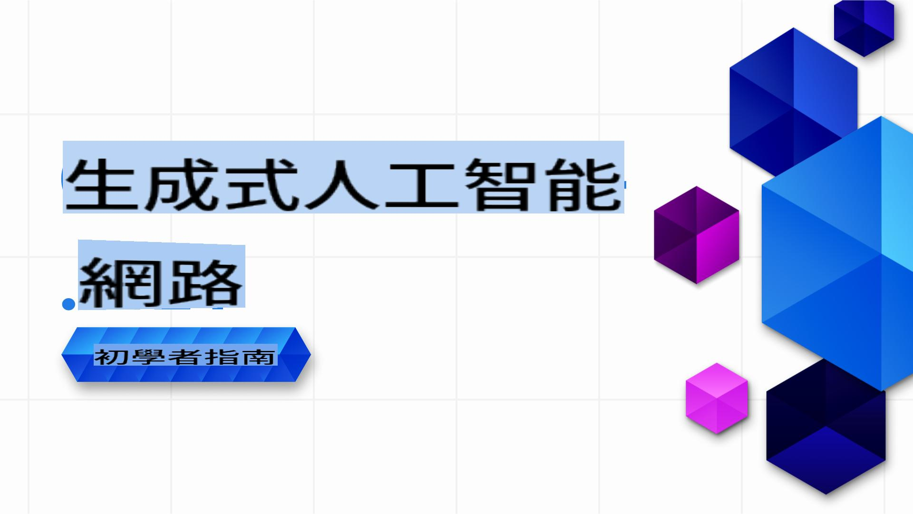

# 初學者的生成式 AI .NET 課程

### 實作課程，教你如何在 .NET 中構建生成式 AI 應用程式

歡迎來到 **初學者的生成式 AI .NET 課程**，這是一門專為 .NET 開發者設計的實作課程，帶你進入生成式 AI 的世界！

這不是一門單純介紹理論的課程，而是專注於 **實際應用** 和 **即時程式編寫**，讓 .NET 開發者能夠充分發揮生成式 AI 的潛力。

這是一個 **實作導向**、**實用性強**，而且設計得 **充滿趣味** 的課程！

別忘了 [給這個 repo 加顆星 (🌟)](https://docs.github.com/en/get-started/exploring-projects-on-github/saving-repositories-with-stars)，以便日後更方便找到它。

➡️ [Fork 這個 repo](https://github.com/microsoft/Generative-AI-for-beginners-dotnet/fork) 取得你的副本，然後在你的 GitHub 資料庫中找到它。

## ✨ 最新消息！

我們持續改進這個課程，加入最新的 AI 工具、模型和實作範例：

- **新功能：Foundry Local 示範！**
  - 第3課現在包含 [Foundry Local 模型](https://github.com/microsoft/Foundry-Local/tree/main) 的實作示範。
  - 查看官方文件：[Foundry Local 文件](https://learn.microsoft.com/azure/ai-foundry/foundry-local/)
  - **完整說明和程式碼範例請參見 [03-CoreGenerativeAITechniques/06-LocalModelRunners.md](../../03-CoreGenerativeAITechniques/06-LocalModelRunners.md)**

- **新功能：Azure OpenAI Sora 影片產生示範！**
  - 第3課現在包含實作示範，展示如何使用新的 [Sora 影片產生模型](https://learn.microsoft.com/azure/ai-services/openai/concepts/video-generation) 在 Azure OpenAI 中從文字提示生成影片。
  - 這個範例展示如何：
    - 使用創意提示提交影片產生工作。
    - 輪詢工作狀態並自動下載產生的影片檔案。
    - 將產生的影片儲存到桌面以便輕鬆檢視。
  - 查看官方文件：[Azure OpenAI Sora 影片產生](https://learn.microsoft.com/azure/ai-services/openai/concepts/video-generation)
  - 在這裡找到範例：[第3課：核心生成式 AI 技術 /src/VideoGeneration-AzureSora-01/Program.cs](../../03-CoreGenerativeAITechniques/src/VideoGeneration-AzureSora-01/Program.cs)

- **新功能：Azure OpenAI 圖像產生模型 (`gpt-image-1`)**：第3課現在包含使用新的 Azure OpenAI 圖像產生模型 `gpt-image-1` 的程式碼範例。學習如何使用最新的 Azure OpenAI 功能從 .NET 產生圖像。
  - 查看官方文件：[如何使用 Azure OpenAI 圖像產生模型](https://learn.microsoft.com/azure/ai-services/openai/how-to/dall-e?tabs=gpt-image-1) 和 [openai-dotnet 圖像產生指南](https://github.com/openai/openai-dotnet?tab=readme-ov-file#how-to-generate-images) 了解更多詳情。
  - 在這裡找到範例：[第3課：核心生成式 AI 技術 .. /src/ImageGeneration-01.csproj](../../03-CoreGenerativeAITechniques/src/ImageGeneration-01/ImageGeneration-01.csproj)。

- **新情境：eShopLite 中的並發代理協調**：[eShopLite 存放庫](https://github.com/Azure-Samples/eShopLite/tree/main/scenarios/07-AgentsConcurrent) 現在提供一個情境，展示如何使用 Semantic Kernel 進行並發代理協調。這個情境展示了多個代理如何並行工作來分析使用者查詢並為未來分析提供有價值的洞察。

[在我們的最新消息部分查看所有先前的更新](./10-WhatsNew/readme.md)

## 🚀 課程簡介

生成式 AI 正在改變軟體開發的面貌，.NET 也不例外。本課程旨在透過以下方式簡化學習過程：

- 每節課包含 5-10 分鐘的短影片。
- 完整的 .NET 程式碼範例，可直接執行與探索。
- 支援工具如 **GitHub Codespaces** 和 **GitHub Models**，讓你快速上手。如果你想在本地端使用自己的模型來運行範例，也完全可以做到。

你將學會如何將生成式 AI 整合到 .NET 專案中，從基本的文字生成到利用 **GitHub Models**、**Azure OpenAI Services** 和 **Ollama 的本地模型** 構建完整的解決方案。

## 📦 每節課包含的內容

- **短影片**：快速概覽課程重點（5-10 分鐘）。
- **完整程式碼範例**：功能完整，隨時可以運行。
- **逐步指導**：簡單易懂的說明，幫助你學習並實作概念。
- **深入參考**：課程著重於生成式 AI 的實作，若需深入了解理論部分，亦提供連結至 [Generative AI for Beginners - A Course](https://github.com/microsoft/generative-ai-for-beginners)。

## 🗃️ 課程章節

| #   | **課程連結** | **內容簡介** |
| --- | --- | --- |
| 01  | [**.NET 開發者的生成式 AI 基礎介紹**](./01-IntroToGenAI/readme.md) | <ul><li>生成模型的概述及其在 .NET 中的應用</li></ul> |
| 02  | [**生成式 AI 的 .NET 開發環境設定**](./02-SetupDevEnvironment/readme.md) | <ul><li>使用 **Microsoft.Extensions.AI** 和 **Semantic Kernel** 等函式庫。</li><li>設定 GitHub Models、Azure AI Foundry，以及本地開發（如 Ollama）。</li></ul> |
| 03  | [**.NET 的核心生成式 AI 技術**](./03-CoreGenerativeAITechniques/readme.md) | <ul><li>文字生成與對話流程。</li><li>多模態能力（視覺與音訊）。</li><li>代理（Agents）。</li></ul> |
| 04  | [**實用的 .NET 生成式 AI 範例**](./04-PracticalSamples/readme.md) | <ul><li>展示生成式 AI 在實際場景中的完整範例。</li><li>語意搜尋應用。</li><li>多代理應用。</li></ul> |
| 05  | [**在 .NET 應用程式中負責任地使用生成式 AI**](./05-ResponsibleGenAI/readme.md) | <ul><li>倫理考量、偏差減少與安全實作。</li></ul> |

## 🌐 多語言支援

| 語言                | 語言代碼 | 翻譯後的 README 連結                                   | 最後更新日期 |
|----------------------|----------|-------------------------------------------------------|--------------|
| 簡體中文            | zh       | [簡體中文翻譯](../zh/README.md)           | 2025-06-11   |
| 繁體中文            | tw       | [繁體中文翻譯](./README.md)           | 2025-06-11   |
| 法文                | fr       | [法文翻譯](../fr/README.md)               | 2025-06-11   |
| 日文                | ja       | [日文翻譯](../ja/README.md)               | 2025-06-11   |
| 韓文                | ko       | [韓文翻譯](../ko/README.md)               | 2025-06-11   |
| 葡萄牙文            | pt       | [葡萄牙文翻譯](../pt/README.md)           | 2025-06-11   |
| 西班牙文            | es       | [西班牙文翻譯](../es/README.md)           | 2025-06-11   |
| 德文                | de       | [德文翻譯](../de/README.md)               | 2025-06-11   |

## 🛠️ 所需條件

開始之前，你需要：

1. 一個 **GitHub 帳號**（免費版本即可！），以便 [fork 整個 repo](https://github.com/microsoft/generative-ai-for-beginners-dotnet/fork) 到你的 GitHub 帳號。

1. 啟用 **GitHub Codespaces**，以快速建立開發環境。你可以在儲存庫設定中啟用 GitHub Codespaces。更多關於 GitHub Codespaces 的資訊請參考 [這裡](https://docs.github.com/en/codespaces)。

1. 透過 [Fork 這個 repo](https://github.com/microsoft/Generative-AI-for-beginners-dotnet/fork) 建立副本，或使用 `Fork` 按鈕。

1. 基本的 **.NET 開發知識**。了解更多關於 .NET 的資訊，請參考 [這裡](https://dotnet.microsoft.com/learn/dotnet/what-is-dotnet)。

就這麼簡單。

我們設計這門課程時，盡量降低學習門檻。我們使用以下方式幫助你快速入門：

- **在 GitHub Codespaces 中運行**：只需點擊一次，即可獲得預先配置的環境，方便測試與探索課程內容。
- **利用 GitHub Models**：試試看直接在這個倉庫中提供的 AI 驅動示範，我們會在課程中逐步解釋更多內容。*(如果你想了解更多關於 GitHub Models 的資訊，請點擊[這裡](https://docs.github.com/github-models))*

當你準備好進一步探索時，我們還提供以下指南：

- 升級到 **Azure OpenAI Services**，以獲得可擴展且適合企業的解決方案。
- 使用 **Ollama** 在本地硬體上執行模型，提升隱私與控制權。

## 🤝 想要幫忙嗎？

非常歡迎你的貢獻！以下是你可以幫助的方式：

- [回報問題](https://github.com/microsoft/Generative-AI-for-beginners-dotnet/issues/new) 或倉庫中的錯誤。

- 改進現有的程式碼範例或新增新的範例，fork 這個倉庫並提出一些修改建議！
- 提議額外的課程或增強功能。
- 有任何建議或發現拼寫或程式碼錯誤？[建立一個 pull request](https://github.com/microsoft/Generative-AI-for-beginners-dotnet/compare)

查看 [CONTRIBUTING.md](CONTRIBUTING.md) 文件，了解如何參與。

## 📄 授權

此專案採用 MIT 授權條款 - 詳情請參考 [LICENSE](../../LICENSE) 文件。

## 🌐 其他課程

我們還提供了許多其他內容，助你學習之旅更加順利。快來看看：

- [生成式 AI 初學者課程](https://aka.ms/genai-beginners)
- [生成式 AI 初學者課程 .NET](https://aka.ms/genainet)
- [使用 JavaScript 的生成式 AI](https://aka.ms/genai-js-course)
- [AI 初學者課程](https://aka.ms/ai-beginners)
- [AI Agents 初學者課程](https://aka.ms/ai-agents-beginners)
- [資料科學初學者課程](https://aka.ms/datascience-beginners)
- [機器學習初學者課程](https://aka.ms/ml-beginners)
- [網路安全初學者課程](https://github.com/microsoft/Security-101)
- [Web 開發初學者課程](https://aka.ms/webdev-beginners)
- [物聯網初學者課程](https://aka.ms/iot-beginners)
- [XR 開發初學者課程](https://github.com/microsoft/xr-development-for-beginners)
- [精通 GitHub Copilot 進行協作編程](https://github.com/microsoft/Mastering-GitHub-Copilot-for-Paired-Programming)
- [精通 GitHub Copilot for C#/.NET 開發者](https://github.com/microsoft/mastering-github-copilot-for-dotnet-csharp-developers)
- [選擇你的 Copilot 冒險之旅](https://github.com/microsoft/CopilotAdventures)
- [Phi Cookbook: 微軟 Phi 模型實作範例](https://aka.ms/phicookbook)

[讓我們開始學習生成式 AI 和 .NET 吧！](02-SetupDevEnvironment/readme.md) 🚀
本文件使用基於機器的人工智能翻譯服務進行翻譯。我們雖然努力確保準確性，但請注意，自動翻譯可能會包含錯誤或不準確之處。應以原文文件為權威來源。如需關鍵信息，建議尋求專業人工翻譯。我們對因使用此翻譯而引起的任何誤解或誤讀不承擔責任。