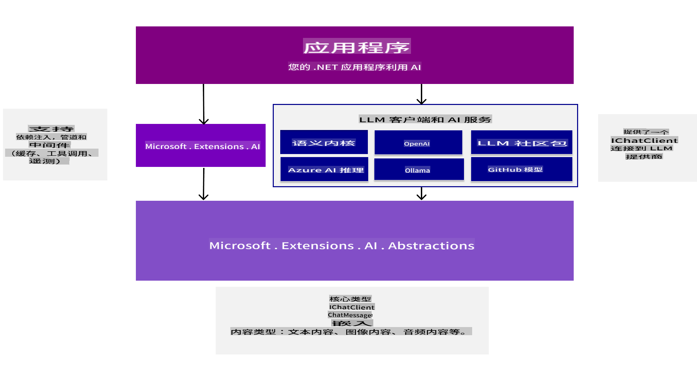
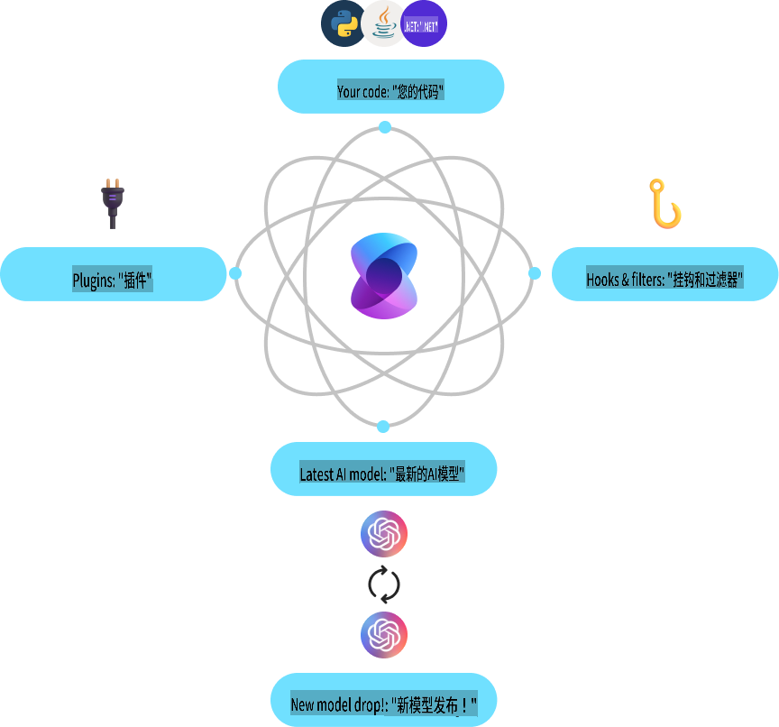
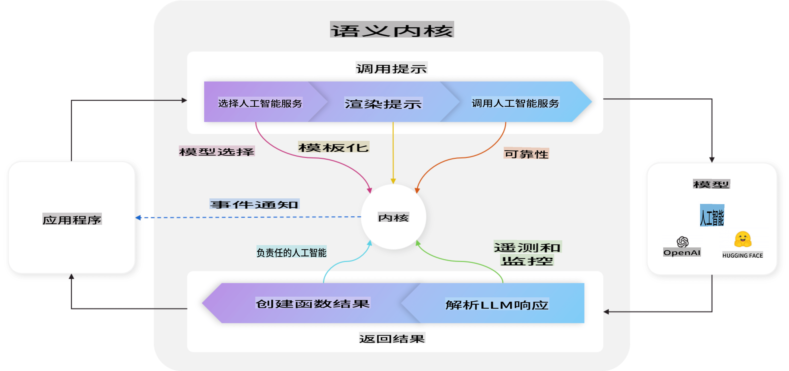
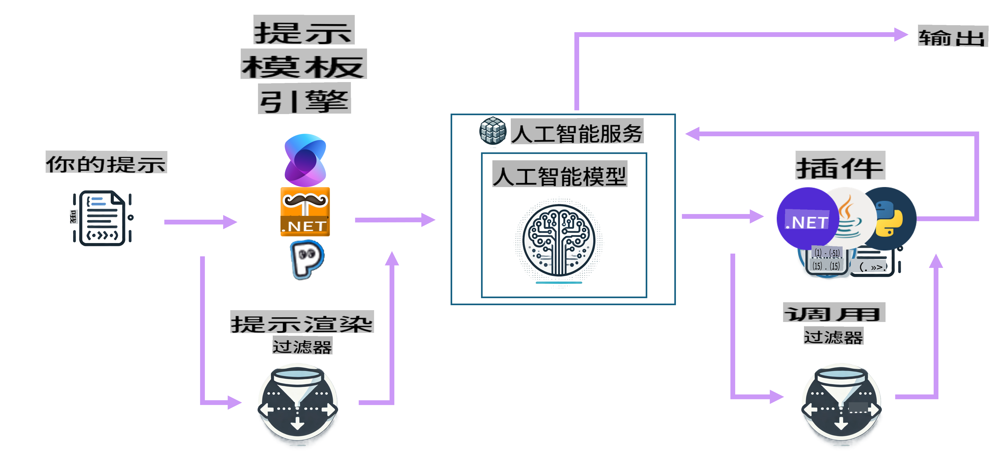

# 开始使用 AI 开发工具

更新您的生成式 AI 知识，并了解可帮助您开发生成式 AI 应用的 .NET 工具。

---

[](http://www.youtube.com/watch?v=SZvE_meBdvg)

_⬆️点击图片观看视频⬆️_

## 本课您将学到：

- 🌟 理解生成式 AI 的基本概念及其应用
- 🔍 探索用于 AI 开发的 .NET 工具，包括 MEAI、Semantic Kernel 和 Azure OpenAI

## 面向 .NET 的生成式 AI 基础

在我们开始编写代码之前，先花点时间回顾一些生成式 AI（GenAI）的概念。在本课 **面向 .NET 的生成式 AI 基础** 中，我们将刷新一些基本的 GenAI 概念，帮助您理解为什么某些操作是以这种方式完成的。我们还会介绍用于构建应用的工具和 SDK，例如 **MEAI**（Microsoft.Extensions.AI）、**Semantic Kernel** 和 **VS Code 的 AI 工具包扩展**。

### 生成式 AI 概念快速回顾

生成式 AI 是一种能够基于从数据中学习的模式和关系生成新内容（如文本、图像或代码）的人工智能类型。生成式 AI 模型可以生成类似人类的响应、理解上下文，有时甚至能生成看起来像人类创作的内容。

在开发 .NET AI 应用时，您将使用 **生成式 AI 模型** 来创建内容。这些模型的一些能力包括：

- **文本生成**：为聊天机器人、内容创作和文本补全生成类似人类的文本。
- **图像生成与分析**：生成逼真的图像、增强照片以及检测对象。
- **代码生成**：编写代码片段或脚本。

不同的模型针对不同任务进行了优化。例如，**小型语言模型（SLMs）** 适合文本生成，而 **大型语言模型（LLMs）** 更适合复杂任务，如代码生成或图像分析。不同公司和组织（如 Microsoft、OpenAI 或 Anthropic）开发了各自的模型，具体使用哪种模型取决于您的用例和所需功能。

当然，这些模型的响应并非总是完美的。您可能听说过模型“幻觉”现象，即以权威的方式生成错误信息。但您可以通过提供清晰的指令和上下文来引导模型生成更好的响应，这就是 **提示工程** 的作用。

#### 提示工程回顾

提示工程是设计有效输入以引导 AI 模型生成期望输出的实践。其核心要素包括：

- **清晰性**：确保指令清晰且无歧义。
- **上下文**：提供必要的背景信息。
- **约束条件**：指定任何限制或格式要求。

提示工程的一些最佳实践包括提示设计、清晰指令、任务分解、单样本学习与少样本学习以及提示调优。此外，尝试和测试不同的提示以找到最适合您具体用例的方式也非常重要。

需要注意的是，在开发应用时存在不同类型的提示。例如，您需要设置 **系统提示** 来定义模型响应的基本规则和上下文。用户输入到模型的数据称为 **用户提示**。而 **助手提示** 是模型基于系统提示和用户提示生成的响应。

> 🧑‍🏫 **了解更多**：在 [生成式 AI 初学者课程的提示工程章节](https://github.com/microsoft/generative-ai-for-beginners/tree/main/04-prompt-engineering-fundamentals) 中了解更多提示工程知识。

#### Tokens、Embeddings 和 Agents - 快速了解！

在使用生成式 AI 模型时，您可能会遇到 **tokens**、**embeddings** 和 **agents** 这样的术语。以下是这些概念的快速概述：

- **Tokens**：Tokens 是模型中的最小文本单元，可以是单词、字符或子词。它们用于将文本数据表示为模型可以理解的格式。
- **Embeddings**：Embeddings 是 tokens 的向量表示，捕获单词和短语的语义含义，使模型能够理解单词之间的关系并生成上下文相关的响应。
- **向量数据库**：向量数据库是 embeddings 的集合，可用于比较和分析文本数据。它们使模型能够根据输入数据的上下文生成响应。
- **Agents**：Agents 是与模型交互以生成响应的 AI 组件。它们可以是聊天机器人、虚拟助手或其他使用生成式 AI 模型创建内容的应用。

在开发 .NET AI 应用时，您将使用 tokens、embeddings 和 agents 来创建聊天机器人、内容生成器以及其他 AI 驱动的应用。理解这些概念将帮助您构建更高效的 AI 应用。

### 面向 .NET 的 AI 开发工具和库

.NET 提供了一系列用于 AI 开发的工具。让我们花点时间了解一些可用的工具和库。

#### Microsoft.Extensions.AI (MEAI)

Microsoft.Extensions.AI (MEAI) 库提供了统一的抽象和中间件，简化了将 AI 服务集成到 .NET 应用中的过程。

通过提供一致的 API，MEAI 使开发人员能够通过通用接口与不同的 AI 服务（如小型和大型语言模型、embeddings 甚至中间件）交互。这降低了构建 .NET AI 应用的复杂性，因为无论使用何种服务，您都可以对同一个 API 进行开发。

例如，无论使用哪种 AI 服务，以下是您用 MEAI 创建聊天客户端时的接口：

```csharp
public interface IChatClient : IDisposable 
{ 
    Task<ChatCompletion> CompleteAsync(...); 
    IAsyncEnumerable<StreamingChatCompletionUpdate> CompleteStreamingAsync(...); 
    ChatClientMetadata Metadata { get; } 
    TService? GetService<TService>(object? key = null) where TService : class; 
}
```

通过这种方式，使用 MEAI 构建聊天应用时，您将针对相同的 API 接口进行开发，无论是获取聊天补全、流式补全、获取元数据还是访问底层 AI 服务。这使得在需要时更换 AI 服务或添加新服务变得更加容易。

此外，该库还支持日志记录、缓存和遥测等中间件组件，帮助您更轻松地开发健壮的 AI 应用。



通过统一的 API，MEAI 允许开发人员以一致的方式使用不同的 AI 服务（如 Azure AI Inference、Ollama 和 OpenAI）。这简化了将 AI 模型集成到 .NET 应用中的过程，并为开发人员提供了根据项目和具体需求选择最佳 AI 服务的灵活性。

> 🏎️ **快速入门**：要快速开始使用 MEAI，[请查看这篇博客](https://devblogs.microsoft.com/dotnet/introducing-microsoft-extensions-ai-preview/)。
>
> 📖 **文档**：在 [MEAI 文档](https://learn.microsoft.com/dotnet/ai/ai-extensions) 中了解更多关于 Microsoft.Extensions.AI (MEAI) 的信息。

#### Semantic Kernel (SK)

Semantic Kernel 是一个开源 SDK，使开发人员能够将生成式 AI 语言模型集成到其 .NET 应用中。它为 AI 服务和内存（向量）存储提供了抽象，支持创建可以由 AI 自动编排的插件。它甚至使用 OpenAPI 标准，允许开发人员创建与外部 API 交互的 AI agents。



Semantic Kernel 支持 .NET 以及其他语言（如 Java 和 Python），并提供丰富的连接器、功能和插件以便集成。Semantic Kernel 的一些主要功能包括：

- **Kernel 核心**：提供 Semantic Kernel 的核心功能，包括连接器、功能和插件，用于与 AI 服务和模型交互。Kernel 是 Semantic Kernel 的核心，它可供服务和插件使用，在需要时检索它们，监控 Agents，并作为应用的活跃中间件。

    例如，它可以为特定任务选择最佳 AI 服务，构建并发送提示到服务，并将响应返回给应用。以下是 Kernel 核心运行时的示意图：

    

- **AI 服务连接器**：为多个提供商提供一个抽象层，通过通用且一致的接口暴露 AI 服务，例如聊天补全、文本转图像、文本转语音和音频转文本。

- **向量存储连接器**：通过通用且一致的接口暴露向量存储，允许开发人员处理 embeddings、向量和其他数据表示。

- **功能和插件**：提供了一系列用于常见 AI 任务的功能和插件，例如功能处理、提示模板、文本搜索等。可以连接到 AI 服务/模型，创建 RAG 和 agents 的实现。

- **提示模板**：为提示工程提供工具，包括提示设计、测试和优化，以提高 AI 模型的性能和准确性。允许开发人员创建、测试提示并针对特定任务优化它们。

- **过滤器**：控制功能运行的时机和方式，以提高安全性并支持负责任的 AI 实践。

在 Semantic Kernel 中，一个完整的循环流程如下图所示：



> 📖 **文档**：在 [Semantic Kernel 文档](https://learn.microsoft.com/semantic-kernel/overview/) 中了解更多关于 Semantic Kernel 的信息。

## 总结

生成式 AI 为开发人员提供了广阔的可能性，使他们能够创建生成内容、理解上下文并提供类似人类响应的创新应用。.NET 生态系统提供了一系列工具和库，简化了 AI 开发过程，使 AI 功能更易于集成到 .NET 应用中。

## 下一步

在接下来的章节中，我们将详细探索这些场景，提供实践示例、代码片段和最佳实践，帮助您使用 .NET 构建真实世界的 AI 解决方案！

接下来，我们将设置您的开发环境！这样您就可以准备好进入生成式 AI 与 .NET 的世界了！

👉 [设置您的 AI 开发环境](/02-SetupDevEnvironment/readme.md)

**免责声明**：  
本文件使用基于机器的人工智能翻译服务进行翻译。尽管我们尽力确保准确性，但请注意，自动翻译可能包含错误或不准确之处。应以原文的母语版本作为权威来源。对于关键信息，建议寻求专业人工翻译。因使用本翻译而引起的任何误解或误读，我们概不负责。