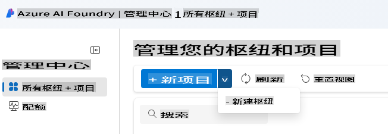
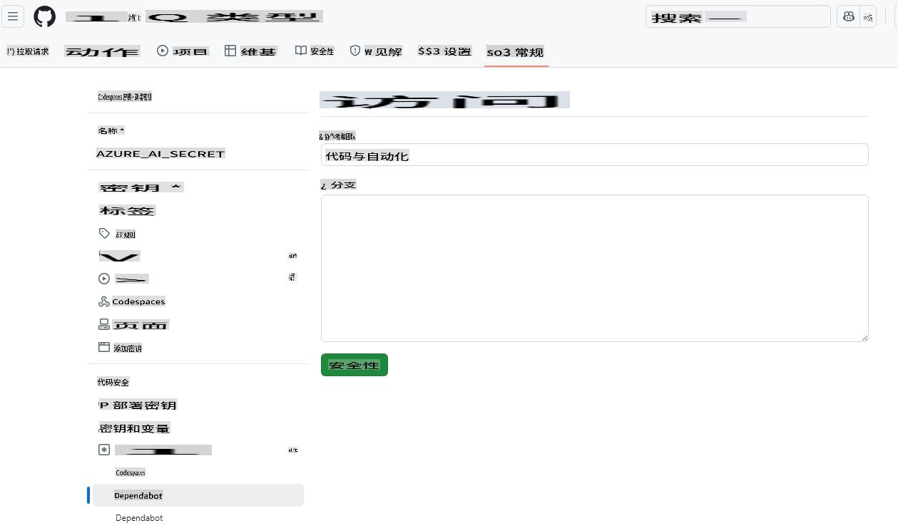
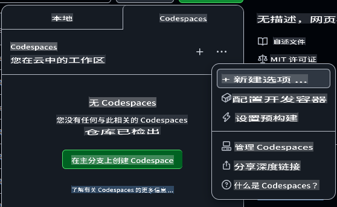
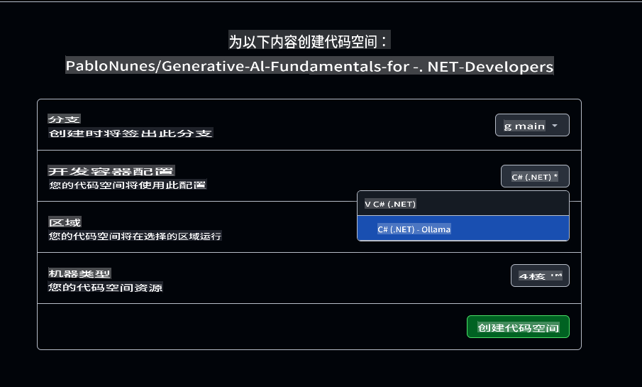

# 为 Azure OpenAI 设置开发环境

如果你想在本课程中使用 Azure AI Foundry 模型开发 .NET AI 应用程序，请按照本指南中的步骤操作。

不想使用 Azure OpenAI？

👉 [如果你想使用 GitHub 模型，请查看这个指南](README.md)  
👉 [如果你想使用 Ollama，请查看这个步骤](getting-started-ollama.md)

## 创建 Azure AI Foundry 资源

要使用 Azure AI Foundry 模型，你需要在 Azure AI Foundry 门户中创建一个 Hub 和一个项目。然后，你需要部署一个模型。本节将向你展示如何完成这些步骤。

### 在 Azure AI Foundry 中创建 Hub 和项目

1. 打开 [Azure AI Foundry 门户](https://ai.azure.com/)。
2. 使用你的 Azure 帐户登录。
3. 从左侧菜单中选择 **All hubs + projects**，然后点击下拉菜单中的 **+ New hub**。（注意：你可能需要先点击 **+ New project** 才能看到 **+ New hub** 选项）。  
    
4. 一个新窗口会弹出，填写你的 Hub 详细信息：
    - 给你的 Hub 取一个名称（例如："MyAIHub"）。
    - 选择离你最近的区域。
    - 选择适当的订阅和资源组。
    - 其他设置可以保持默认。
    - 点击 **Next**。
    - 审核详情后，点击 **Create**。
5. 当你的 Hub 创建完成后，门户会打开其详情页面。点击 **Create Project** 按钮。
    - 给你的项目取一个名称（例如："GenAINET"）或者接受默认名称。
    - 点击 **Create**。

🎉 **完成！** 你已经在 Azure AI Foundry 中创建了你的第一个项目。

### 在 Azure AI Foundry 中部署语言模型

接下来，我们将向项目中部署一个 **gpt-4o-mini** 模型：

1. 在 Azure AI Foundry 门户中，导航到你的项目（创建完成后会自动打开）。
2. 从左侧菜单中点击 **Models and Endpoints**，然后点击 **Deploy Model** 按钮。
3. 从下拉菜单中选择 **Deploy base model**。
4. 在模型目录中搜索 **gpt-4o-mini**。
5. 选择模型并点击 **Confirm** 按钮。
6. 指定一个部署名称（例如："gpt-4o-mini"）。其他选项可以保持默认。
7. 点击 **Deploy** 并等待模型被配置完成。
8. 部署完成后，从模型详情页面记录下 **Model Name**、**Target URI** 和 **API Key**。

🎉 **完成！** 你已经在 Azure AI Foundry 中部署了你的第一个大型语言模型。


> 📝 **注意：** 端点可能类似于 `https://< your hub name>.openai.azure.com/openai/deployments/gpt-4o-mini/chat/completions?api-version=2024-08-01-preview`。我们需要的端点名称仅为 `https://< your hub name >.openai.azure.com/`*。

## 将 Azure AI API 密钥添加到你的 Codespace Secrets

为了安全起见，我们将刚才创建的 API 密钥添加到你的 Codespace Secrets 中。

1. 确保你已经将此仓库 fork 到你的 GitHub 帐户中。
2. 转到 fork 仓库的 **Settings** 标签页，从左侧菜单中展开 **Secrets and variables**，然后选择 **Codespaces**。

    
3. 将你的 Secret 命名为 **AZURE_AI_KEY**。
4. 将你从 Azure AI Foundry 门户复制的 API 密钥粘贴到 **Secret** 字段中。

## 创建一个 GitHub Codespace

接下来，我们创建一个 GitHub Codespace，供本课程后续开发使用。

1. 在新窗口中打开此仓库的主页，[点击这里右键打开](https://github.com/microsoft/Generative-AI-for-beginners-dotnet) 并选择 **Open in new window**。
2. 点击页面右上角的 **Fork** 按钮，将此仓库 fork 到你的 GitHub 帐户中。
3. 点击 **Code** 下拉按钮，然后选择 **Codespaces** 标签页。
4. 选择 **...** 选项（三个点），然后选择 **New with options...**。



### 选择开发容器

从 **Dev container configuration** 下拉菜单中选择以下选项之一：

**选项 1: C# (.NET)**：如果你计划使用 GitHub 模型或 Azure OpenAI，这是推荐选项。它包含本课程所需的所有核心 .NET 开发工具，启动速度快。

**选项 2: C# (.NET) - Ollama**：如果你希望无需连接 GitHub 模型或 Azure OpenAI 就能运行示例，可以选择 Ollama。它在核心 .NET 开发工具的基础上额外包含 Ollama，但启动时间较慢，平均需要五分钟。[查看此指南](getting-started-ollama.md) 以了解如何使用 Ollama。

保持其他设置默认，点击 **Create codespace** 按钮开始创建 Codespace。



## 更新示例代码以使用 Azure OpenAI 和你的新模型

现在让我们更新代码以使用新部署的模型。首先，我们需要添加一些 NuGet 包来支持 Azure OpenAI。

1. 打开终端并切换到项目目录：

    ```bash
    cd 02-SetupDevEnvironment/src/BasicChat-01MEAI/
    ```

2. 运行以下命令以添加所需的包：

    ```bash
    dotnet add package Azure.AI.OpenAI
    dotnet add package Microsoft.Extensions.AI.OpenAI --version 9.1.0-preview.1.25064.3
    ```

[更多关于 Azure.AI.OpenAI 的信息](https://www.nuget.org/packages/Azure.AI.OpenAI/2.1.0#show-readme-container)。

3. 打开 `/workspaces/Generative-AI-for-beginners-dotnet/02-SettingUp.NETDev/src/BasicChat-01MEAI/Program.cs`。

    在文件顶部添加以下 using 语句：

    ```csharp
    using System.ClientModel;
    using Azure.AI.OpenAI;
    using Microsoft.Extensions.AI;

1. Create new variables to hold the model name, endpoint, and API key:

    ```csharp
    var deploymentName = "< deployment name > "; // 例如 "gpt-4o-mini"
    var endpoint = new Uri("< endpoint >"); // 例如 "https://< your hub name >.openai.azure.com/"
    var apiKey = new ApiKeyCredential(Environment.GetEnvironmentVariable("AZURE_AI_SECRET"));
    ```

    Making sure to replace `< deployment name >`, and `< endpoint >` with the values you noted above.

1. Replace the `IChatClient` creation with the following code:

    ```csharp
    IChatClient client = new AzureOpenAIClient(
        endpoint,
        apiKey)
    .AsChatClient(deploymentName);
    ```

1. Run the following command in the terminal:

    ```bash
    dotnet run
    ```

1. You should see output similar to the following:

    ```bash
    人工智能（AI）是指在机器中模拟人类智能的技术，这些机器被编程为能够像人类一样思考和学习。AI 包括多种技术和方法，使计算机和系统能够执行通常需要人类智能的任务。这些任务包括：

    1. **学习**：基于经验提高性能，通常通过分析数据的算法。
    
    ...
    ```

> 🙋 **需要帮助？**：有问题无法解决？[打开一个 issue](https://github.com/microsoft/Generative-AI-for-beginners-dotnet/issues/new?template=Blank+issue)，我们会协助你。

## 总结

在本课中，你学习了如何为本课程设置开发环境。你创建了一个 GitHub Codespace 并配置它以使用 Azure OpenAI。你还更新了示例代码以使用在 Azure AI Foundry 中新部署的模型。

### 其他资源

- [Azure AI Foundry 文档](https://learn.microsoft.com/azure/ai-services/)
- [使用 GitHub Codespaces](https://docs.github.com/en/codespaces/getting-started)
- [如何在 Azure AI Foundry 中部署模型](https://learn.microsoft.com/azure/ai-services/deploy/)
- [Azure.AI.OpenAI NuGet 包](https://www.nuget.org/packages/Azure.AI.OpenAI)

## 下一步

接下来，我们将探索如何创建你的第一个 AI 应用程序！🚀

👉 [核心生成式 AI 技术](../03-CoreGenerativeAITechniques/readme.md)

**免责声明**：  
本文档使用基于机器的人工智能翻译服务进行翻译。尽管我们努力确保翻译的准确性，但请注意，自动翻译可能包含错误或不准确之处。应以原文的母语版本作为权威来源。对于关键信息，建议寻求专业人工翻译。因使用本翻译而引起的任何误解或误读，我们概不负责。