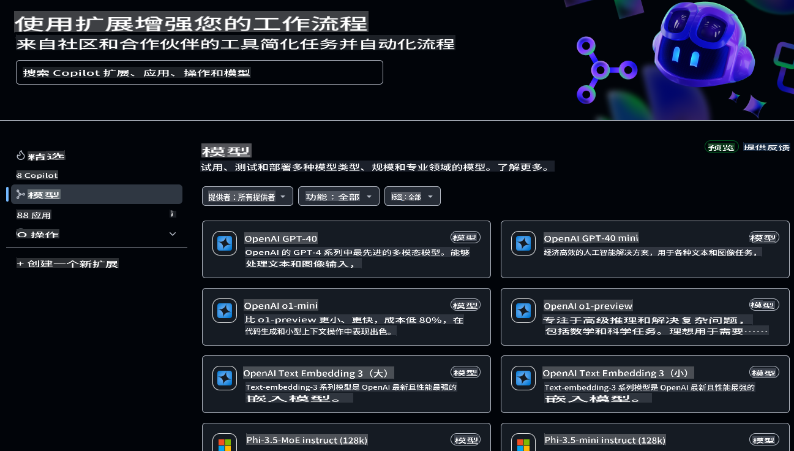
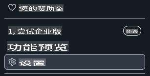
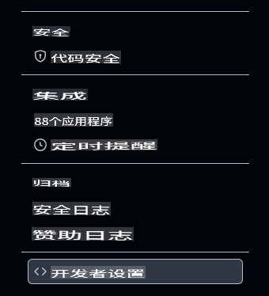
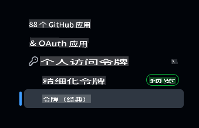

# 为本课程设置开发环境

本课程将指导您完成开发环境的设置。为了确保您的学习顺利，我们已经为您准备了一个 `.devcontainer` 配置，它将提供完成本课程所需的所有工具。您可以选择在 GitHub Codespaces（推荐）中运行该 devcontainer，或者在本地机器上运行。此外，我们还会演示如何设置 GitHub 访问令牌，以便与 GitHub Models 交互。

*如果需要，我们还为您准备了 [Azure OpenAI](getting-started-azure-openai.md) 和 [Ollama](getting-started-ollama.md) 的设置指南。*

---

## 本课您将学到：

- ⚡ 如何使用 GitHub Codespaces 设置开发环境  
- 🤖 配置开发环境以通过 GitHub Models、Azure OpenAI 或 Ollama 访问 LLMs  
- 🛠️ 使用 `.devcontainer` 配置行业标准工具  
- 🎯 最终完成所有设置，准备好学习本课程的其他内容  

让我们开始设置您的开发环境吧！🏃‍♂️

[](https://youtu.be/7kYoVRNQXyA?feature=shared)

_⬆️点击图片观看视频⬆️_

## 本课程应该选择哪个 AI 服务？

我们提供了关于如何使用 GitHub Models、Azure OpenAI 和 Ollama 设置开发环境的说明。您可以根据自己的需求选择最适合的服务。我们推荐使用 GitHub Models，但您也可以选择其他两种服务。

以下是这些服务的简要介绍：

- **GitHub Models**：一个免费的入门服务，允许您直接在开发环境中测试和交互各种 AI 模型。它易于从 Codespaces 使用，是探索模型功能并在实施前了解其能力的绝佳方式。
- **Azure OpenAI**：一项付费服务，提供对各种 AI 模型的访问。它包括 Azure 的所有优势，例如强大的安全性和可扩展性。如果您已经有 Azure 订阅，这是本课程的一个很好的选择。
- **Ollama**：Ollama 允许您在本地机器、Codespace 或 devcontainer 中免费运行 AI 模型。如果您倾向于本地运行模型，这是一个不错的选择，但它需要更多硬件资源，并且可能比云端选项更慢。

> 如果您选择 **GitHub Models**，请继续阅读本文档以完成设置。
> - 对 **Azure OpenAI** 感兴趣？[请查看此文档](getting-started-azure-openai.md)。  
> - 如果选择 **Ollama**，[请参考此指南](getting-started-ollama.md)。  

## 使用 GitHub Models 学习和测试 AI 模型

**GitHub Models** 提供了一种直观的方式，可以直接在开发环境中试验各种 AI 模型。开发者可以通过简单的界面探索模型响应、评估性能，并确定最适合其应用需求的模型。在实现之前，您可以了解模型的功能和局限性。托管于 GitHub 的基础设施之上，这些模型提供可靠的访问和一致的性能，非常适合开发和测试阶段。更棒的是，它提供了一个免费层，您可以无成本开始探索。



## 准备工作：设置 GitHub 访问令牌

在开始之前，我们需要配置一些关键的安全凭据，以便我们的 Codespace 能够安全地与 GitHub Models 交互并运行应用程序。

### 创建用于访问 GitHub Models 的个人访问令牌

1. 前往 [GitHub 设置页面](https://github.com/settings/profile)：

    - 点击右上角的个人头像  
    - 从下拉菜单中选择 **Settings**  

    

1. 进入 [开发者设置页面](https://github.com/settings/apps)：

    - 向左侧边栏底部滚动  
    - 点击 **Developer settings**（通常位于底部）  

    

1. 生成新的令牌：

    - 选择 **Personal access tokens** → **Tokens (classic)**  

        

    - 点击页面中间的 **Generate new token (classic)**  

        

    - 在“Note”字段中，输入一个描述性名称（例如 `GenAI-DotNet-Course-Token`）  
    - 设置一个过期日期（推荐：7 天，以遵循安全最佳实践）  
    - 无需为此令牌添加任何权限。  

> 💡 **安全提示**：始终使用最低必要的权限范围和最短的有效期来管理访问令牌。这符合最小权限原则，有助于保护您的账户安全。

## 创建 GitHub Codespace

接下来，让我们创建一个 GitHub Codespace 来完成本课程的学习。

1. 在新窗口中打开此仓库的主页：[右键点击这里](https://github.com/microsoft/Generative-AI-for-beginners-dotnet)，然后从上下文菜单中选择 **Open in new window**  
1. 点击页面右上角的 **Fork** 按钮，将此仓库复制到您的 GitHub 账户  
1. 点击 **Code** 下拉按钮，然后选择 **Codespaces** 标签  
1. 点击 **...**（三点选项）并选择 **New with options...**  


### 选择您的开发容器

在 **Dev container configuration** 下拉菜单中，选择以下选项之一：

**选项 1：C# (.NET)**：如果您计划使用 GitHub Models，这是推荐选项。它包含完成本课程所需的所有核心 .NET 开发工具，并具有快速的启动时间。

**选项 2：C# (.NET) - Ollama**：如果您不想连接到 GitHub Models 或 Azure OpenAI，Ollama 可以让您运行演示。它除了包含所有核心 .NET 开发工具，还支持 Ollama，但启动时间稍慢，平均约五分钟。[请参考此指南](getting-started-ollama.md) 了解更多。

> 💡**提示**：创建 Codespace 时，请选择菜单中离您最近的区域。如果选择了较远的区域，可能会导致创建过程中出现错误。

点击 **Create codespace** 按钮，开始创建 Codespace。


## 验证 Codespace 是否正确运行并连接到 GitHub Models

当 Codespace 加载并配置完成后，让我们运行一个示例应用程序，确保一切正常：

1. 打开终端。您可以通过按下 **Ctrl+\`** (backtick) on Windows or **Cmd+`**（macOS）打开终端窗口。  

1. 使用以下命令切换到正确的目录：  

    ```bash
    cd 02-SetupDevEnvironment\src\BasicChat-01MEAI
    ```

1. 使用以下命令运行应用程序：  

    ```bash
    dotnet run
    ```

1. 可能需要几秒钟，但最终应用程序会输出类似以下的消息：  

    ```bash
    AI, or artificial intelligence, refers to the simulation of human intelligence in machines that are programmed to think and learn like humans. It is a broad field of computer science that focuses on creating systems and algorithms capable of performing tasks that typically require human intelligence. These tasks include problem-solving,

    ...
    ```

> 🙋 **需要帮助？**：如果遇到问题，[提交一个 Issue](https://github.com/microsoft/Generative-AI-for-beginners-dotnet/issues/new?template=Blank+issue)，我们会为您提供支持。

## 总结

在本课中，您学习了如何为本课程设置开发环境。您创建了一个 GitHub Codespace，并将其配置为使用 GitHub Models、Azure OpenAI 或 Ollama。您还学习了如何为 GitHub Models 创建个人访问令牌，并运行示例应用程序以验证设置是否正确。

### 额外资源

- 使用其他托管服务测试本指南！  
    - [Azure OpenAI](getting-started-azure-openai.md)  
    - [Ollama](getting-started-ollama.md)  
- [GitHub Codespaces 文档](https://docs.github.com/en/codespaces)  
- [GitHub Models 文档](https://docs.github.com/en/github-models/prototyping-with-ai-models)  

## 下一步

接下来，我们将探索如何创建您的第一个 AI 应用程序！🚀  

👉 [核心生成式 AI 技术](../03-CoreGenerativeAITechniques/readme.md)  

**免责声明**：  
本文件使用基于机器的人工智能翻译服务进行翻译。尽管我们努力确保准确性，但请注意，自动翻译可能包含错误或不准确之处。应以原始语言的文件作为权威来源。对于关键信息，建议使用专业的人类翻译服务。因使用本翻译而导致的任何误解或误读，我们概不负责。