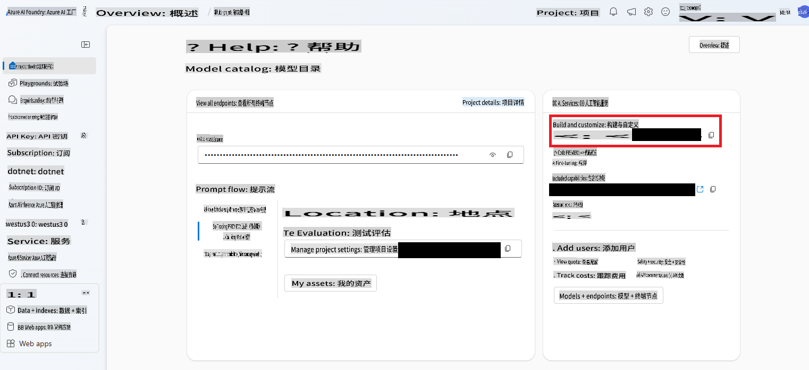

# AI 代理

在本课程中，学习如何创建一个无需持续人工干预就能自行决策和执行操作的 AI 实体？没错，AI 代理能够独立完成特定任务。

---

[](https://youtu.be/Btkmw1Bosh0?feature=shared)

_⬆️点击图片观看视频⬆️_

AI 代理使 LLM（大语言模型）从助手演变为能够代表用户采取行动的实体。代理甚至可以与其他代理互动以完成任务。一个代理的一些关键特性包括一定程度的**自主性**，允许代理根据其编程发起行动；这进一步带来了基于预定义目标的**决策能力**。它们还具有**适应性**，能够通过学习和调整来提升性能。

构建代理时需要牢记的一点是，它们的目标应该专注于单一任务。你需要尽可能明确地缩小它们的用途。

> 🧑‍🏫**了解更多**：深入了解 AI 代理的基础知识，请访问 [Generative AI for Beginners: AI Agents](https://github.com/microsoft/generative-ai-for-beginners/tree/main/17-ai-agents)。

## 创建一个 AI 代理

为了在 .NET 中构建一个 AI 代理，我们将引入一些新概念。我们会使用一个新的 SDK，并需要在 Azure AI Foundry 中进行一些额外的设置来启动项目。

> 🧑‍💻**示例代码**：本课程将基于 [AgentLabs-01-Simple 示例](../../../03-CoreGenerativeAITechniques/src/AgentLabs-01-Simple)进行学习。
>
> 我们还包含了一些更高级的示例，可以在 `/src/` 文件夹中找到。你可以查看 [AgentLabs-02-Functions](../../../03-CoreGenerativeAITechniques/src/AgentLabs-02-Functions)、[AgentLabs-03-OpenAPIs](../../../03-CoreGenerativeAITechniques/src/AgentLabs-03-OpenAPIs) 或 [AgentLabs-03-PythonParksInformationServer](../../../03-CoreGenerativeAITechniques/src/AgentLabs-03-PythonParksInformationServer) 的 README 文件了解更多信息。

### Azure AI Agent 服务

我们将介绍一个新的 Azure 服务，它将帮助我们构建代理，这个服务名称十分贴切：[Azure AI Agent Service](https://learn.microsoft.com/azure/ai-services/agents/overview)。

要运行本课程中包含的代码示例，你需要在 Azure AI Foundry 中进行一些额外设置。可以按照[这些步骤设置一个**基础代理**](https://learn.microsoft.com/azure/ai-services/agents/quickstart?pivots=programming-language-csharp)。

### Azure AI Projects 库

代理由三个部分组成：**LLM**（模型）、**状态**（类似于对话上下文，用于基于过去的结果指导决策）以及**工具**（类似于我们之前学过的 [函数](./01-lm-completions-functions.md#function-calling)，它们充当模型与外部系统之间的桥梁）。

理论上，你可以用之前学到的知识构建 AI 代理。但 **Azure AI Projects for .NET** 库通过提供一个简化常规任务的 API，使开发代理更加轻松。

使用 Azure AI Projects 库时，需要理解几个概念（它们对应于类）：

- `AgentClient`：创建和托管代理的整体客户端，管理代理运行的线程，并处理与云的连接。
- `Agent`：包含代理执行任务的指令以及它可以访问的工具定义。
- `ThreadMessage`：这些是消息——类似于我们之前学过的提示——用于传递给代理。代理也会创建 `ThreadMessage` 对象进行通信。
- `ThreadRun`：消息传递给代理的线程。线程启动后可以提供额外的指令，并可轮询其状态。

让我们通过一个简单的示例来了解这些概念的实际应用！

### 构建一个数学代理

我们将构建一个专注于单一任务的代理，它的作用是充当数学学生的导师。它的唯一目标是解决并解释用户提出的数学问题。

1. 首先，我们需要创建一个 `AgentsClient` 对象，它负责管理与 Azure 的连接、代理本身、线程、消息等。

    ```csharp
    string projectConnectionString = "< YOU GET THIS FROM THE PROJECT IN AI FOUNDRY >";
    AgentsClient client = new(projectConnectionString, new DefaultAzureCredential());
    ```

    你可以在 AI Foundry 中打开已创建的 Hub，然后进入项目，找到项目连接字符串。它位于右侧。

    

2. 接下来，我们需要创建导师代理。记住，它应该专注于单一任务。
   
    ```csharp
    Agent tutorAgent = (await client.CreateAgentAsync(
    model: "gpt-4o",
    name: "Math Tutor",
    instructions: "You are a personal math tutor. Write and run code to answer math questions.",
    tools: [new CodeInterpreterToolDefinition()])).Value;
    ```

    这里有几点需要注意。首先是 `tools` parameter. We're creating a `CodeInterpreterToolDefinition` object (that is apart of the **Azure.AI.Projects** SDK) that will allow the agent to create and execute code.

    > 🗒️**Note**: You can create your own tools too. See the [Functions](../../../03-CoreGenerativeAITechniques/src/AgentLabs-02-Functions) to learn more.

    Second note the `instructions` that are being sent along. It's a prompt and we're limiting it to answer math questions. Then last creating the agent is an async operation. That's because it's creating an object within Azure AI Foundry Agents service. So we both `await` the `CreateAgentAsync` function and then grab the `Value` 的返回值用来获取实际的 `Agent` 对象。在使用 **Azure.AI.Projects** SDK 创建对象时，你会多次看到这种模式。

3. `AgentThread` 是一个对象，用于处理代理与用户之间的通信。我们需要创建一个线程并添加一个 `ThreadMessage` 到其中。在本例中，这是用户的第一个问题。

    ```csharp
    AgentThread thread = (await client.CreateThreadAsync()).Value;

    // Creating the first user message to AN agent - notice how we're putting it on a thread
    ThreadMessage userMessage = (await client.CreateMessageAsync(
        thread.Id,
        MessageRole.User,
        "Hello, I need to solve the equation `3x + 11 = 14`. Can you help me?")
    ).Value;
    ```

    注意 `ThreadMessage` 的类型是 `MessageRole.User`。另外，我们并不是将消息发送给特定代理，而是将其添加到线程中。

4. 接下来，我们让代理提供一个初始响应，将其放到线程中并启动线程。在启动线程时，我们需要提供初始代理的 ID 和任何附加指令。

    ```csharp
    ThreadMessage agentMessage =  await client.CreateMessageAsync(
        thread.Id,
        MessageRole.Agent,
        "Please address the user as their name. The user has a basic account, so just share the answer to the question.")
    ).Value;

    ThreadRun run = (await client.CreateRunAsync(
        thread.Id,
        assistantId: agentMathTutor.Id, 
        additionalInstructions: "You are working in FREE TIER EXPERIENCE mode`, every user has premium account for a short period of time. Explain detailed the steps to answer the user questions")
    ).Value;
    ```

5. 剩下的就是检查运行状态。

    ```csharp
    do
    {
        await Task.Delay(Timespan.FromMilliseconds(100));
        run = (await client.GetRunAsync(thread.Id, run.Id)).Value;

        Console.WriteLine($"Run Status: {run.Status}");
    }
    while (run.Status == RunStatus.Queued || run.Status == RunStatus.InProgress);
    ```

6. 然后显示结果中的消息。

    ```csharp
    Response<PageableList<ThreadMessage>> afterRunMessagesResponse = await client.GetMessagesAsync(thread.Id);
    IReadOnlyList<ThreadMessage> messages = afterRunMessagesResponse.Value.Data;

    // sort by creation date
    messages = messages.OrderBy(m => m.CreatedAt).ToList();

    foreach (ThreadMessage msg in messages)
    {
        Console.Write($"{msg.CreatedAt:yyyy-MM-dd HH:mm:ss} - {msg.Role,10}: ");

        foreach (MessageContent contentItem in msg.ContentItems)
        {
            if (contentItem is MessageTextContent textItem)
                Console.Write(textItem.Text);
        }
        Console.WriteLine();
    }
    ```

> 🙋 **需要帮助？**：如果遇到任何问题，请[在代码库中提交问题](https://github.com/microsoft/Generative-AI-for-beginners-dotnet/issues/new)。

接下来的逻辑步骤是开始使用多个代理来创建一个自主系统。下一步可能是创建一个代理，用于检查用户是否拥有高级账户。

## 总结

AI 代理是超越简单聊天交互的自主 AI 实体，它们可以：

- **独立决策**：无需持续人工输入即可执行任务
- **保持上下文**：保存状态并记住先前的交互
- **使用工具**：访问外部系统和 API 完成任务
- **协作**：与其他代理协作解决复杂问题

你还学习了如何使用 **Azure AI Agents** 服务和 **Azure AI Project** SDK 来创建一个基础代理。

可以将代理视为具有自主能力的 AI 助手——它们不仅仅是响应，而是基于其编程和目标采取行动。

## 更多资源

- [使用 .NET 构建一个最小化代理](https://learn.microsoft.com/dotnet/ai/quickstarts/quickstart-assistants?pivots=openai)
- [多代理协调](https://techcommunity.microsoft.com/blog/educatordeveloperblog/using-azure-ai-agent-service-with-autogen--semantic-kernel-to-build-a-multi-agen/4363121)
- [语义内核代理框架](https://learn.microsoft.com/semantic-kernel/frameworks/agent/?pivots=programming-language-csharp)
- [AI 代理 - 初学者生成式 AI 系列](https://github.com/microsoft/generative-ai-for-beginners/tree/main/17-ai-agents)

## 下一步

你已经取得了很大进步！从学习简单的一次性文本完成到构建代理！

👉 [下一课中，我们将看到一些实际的应用示例](../04-PracticalSamples/readme.md)，展示如何将所有内容结合在一起使用。

**免责声明**：  
本文件使用基于机器的人工智能翻译服务进行翻译。尽管我们努力确保准确性，但请注意，自动翻译可能包含错误或不准确之处。应以原文的母语版本作为权威来源。对于关键信息，建议寻求专业的人类翻译服务。我们对于因使用本翻译而导致的任何误解或误读不承担责任。