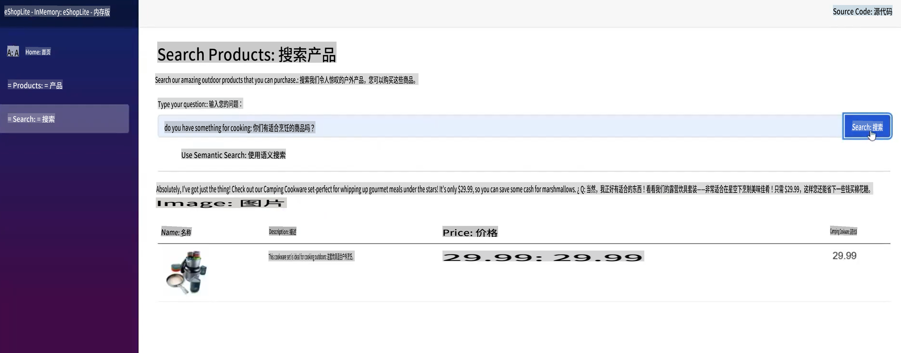
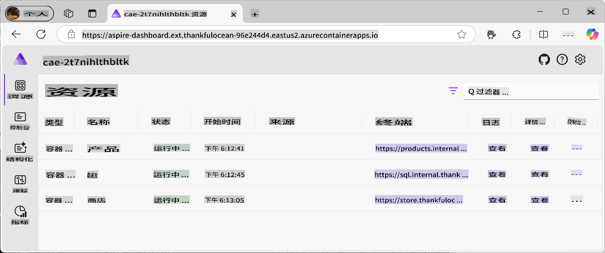
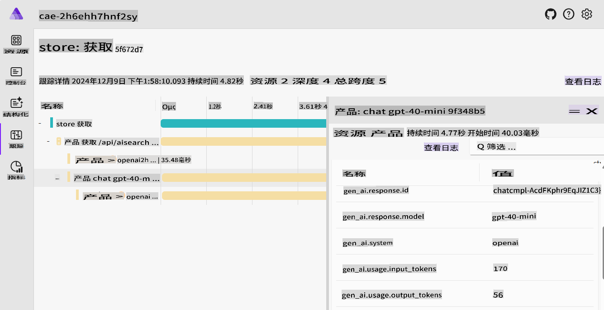
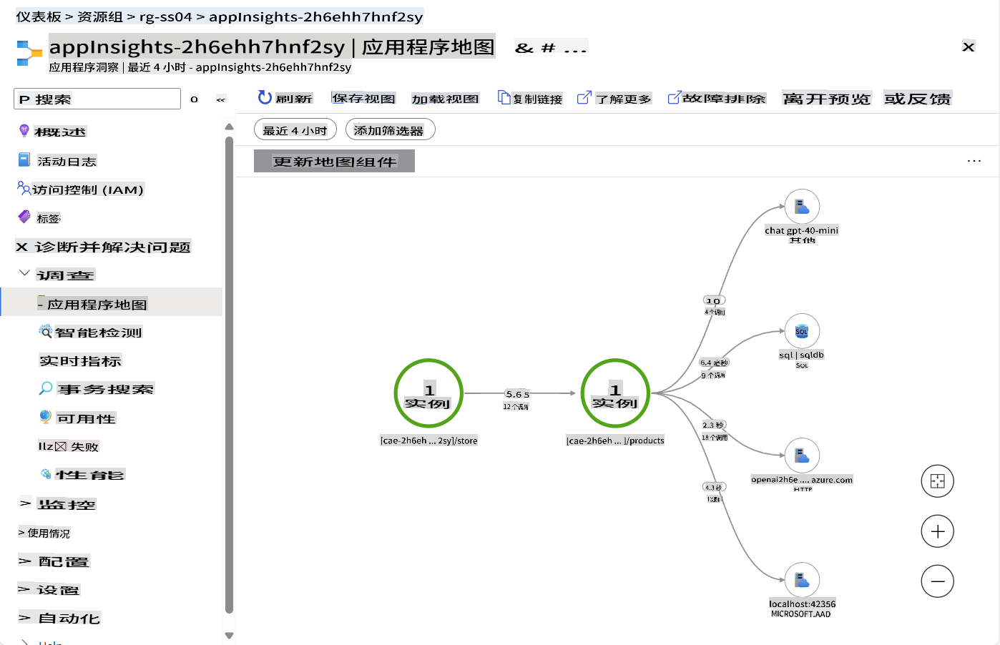
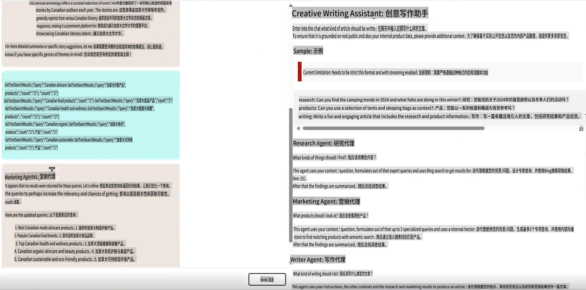
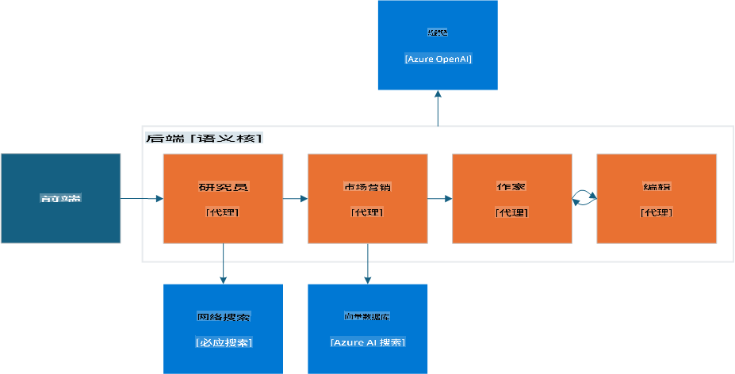
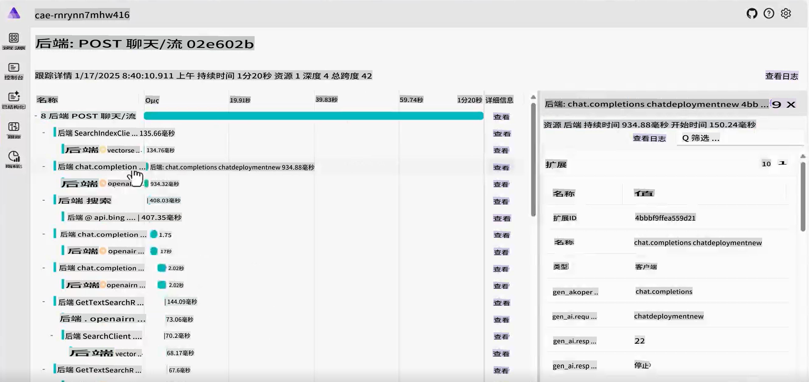
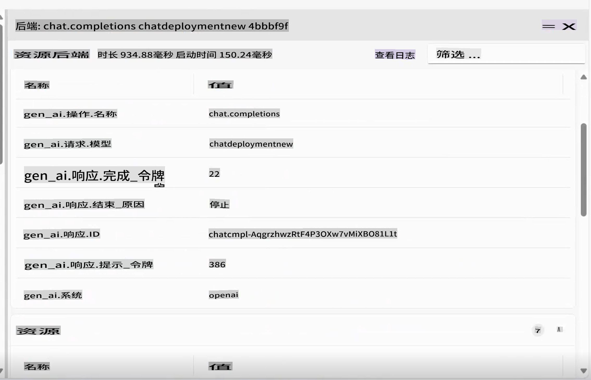

# 规范生成式 AI 示例

通过这些实际且贴近现实的示例，了解你所学的所有概念是如何应用的。

---

## 你将实现的目标

- 了解生成式 AI 如何融入现有应用程序。
- 理解代理在复杂场景中的工作原理。

## 包含的示例
- [规范生成式 AI 示例](../../../04-PracticalSamples)
  - [你将实现的目标](../../../04-PracticalSamples)
  - [包含的示例](../../../04-PracticalSamples)
  - [eShopLite 演示](../../../04-PracticalSamples)
    - [eShopLite 的语义搜索 - 内存实现](../../../04-PracticalSamples)
    - [eShopLite 的语义搜索 - Azure AI Search 实现](../../../04-PracticalSamples)
    - [eShopLite 的实时音频](../../../04-PracticalSamples)
  - [创意写作代理](../../../04-PracticalSamples)
  - [总结](../../../04-PracticalSamples)
    - [附加资源](../../../04-PracticalSamples)
    - [下一步](../../../04-PracticalSamples)

[](https://youtu.be/Ky4CACXJqR8?feature=shared)

_⬆️点击图片观看视频⬆️_

## eShopLite 演示

在我们的第一个演示中，我们将探索 **eShopLite** 项目。**eShopLite** 是一个面向户外装备和露营爱好者的简单电商应用程序，并通过生成式 AI 功能进行了增强，比如搜索功能优化、客户支持和实时音频分析。

这些演示使用 [Azure OpenAI](https://azure.microsoft.com/products/ai-services/openai-service) 和 [Azure AI Foundry Models](https://ai.azure.com/) 来完成推理任务（即应用程序中的生成式 AI 部分）。

在第一个演示中，我们展示了如何使用 Semantic Kernel 增强搜索功能，使其能够理解用户查询的上下文并提供准确的结果。

### eShopLite 的语义搜索

[](https://youtu.be/FlkruF6USro?feature=shared)

_⬆️点击图片观看视频⬆️_

在 eShopLite 的语义搜索中，我们使用 Semantic Kernel 增强了电商应用程序的搜索功能。Semantic Kernel 帮助我们创建一个更强大的搜索引擎，它能够理解用户查询的上下文并提供更准确的结果。

例如，如果用户搜索“你们有适合做饭的东西吗”，搜索引擎可以理解用户寻找的是厨房用具，并显示最相关的产品。在我们的示例中，它会返回露营炊具。

> 🧑‍💻**示例**：查看 [eShopLite 语义搜索示例](https://aka.ms/netaieshoplitesemanticsearch)



语义搜索可以帮助用户更轻松地找到所需的产品，从而改善购物体验并增加销售额。要实现此功能，我们需要拥有一个包含产品的向量存储、一个搜索索引以及一个语言模型。[.NET Aspire](https://learn.microsoft.com/dotnet/aspire/get-started/aspire-overview) 工具可帮助协调后台的所有流程。



在 .NET Aspire 仪表板中，我们可以看到产品、SQL 和存储容器，它们可以与语言模型交互。深入查看 Aspire 应用程序主机，我们有以下代码：

```csharp
if (builder.ExecutionContext.IsPublishMode)
{
    // Add the Azure Application Insights for monitoring
    var appInsights = builder.AddAzureApplicationInsights("appInsights");
    // Add the Azure OpenAI for the chat and embeddings deployments, the embedding is used for the vector entities
    var chatDeploymentName = "gpt-4o-mini";
    var embeddingsDeploymentName = "text-embedding-ada-002";
    var aoai = builder.AddAzureOpenAI("openai")
        .AddDeployment(new AzureOpenAIDeployment(chatDeploymentName,
        "gpt-4o-mini",
        "2024-07-18",
        "GlobalStandard",
        10))
        .AddDeployment(new AzureOpenAIDeployment(embeddingsDeploymentName,
        "text-embedding-ada-002",
        "2"));

    products.WithReference(appInsights)
        .WithReference(aoai)
        .WithEnvironment("AI_ChatDeploymentName", chatDeploymentName)
        .WithEnvironment("AI_embeddingsDeploymentName", embeddingsDeploymentName);

    store.WithReference(appInsights)
        .WithExternalHttpEndpoints();
}
```

上述代码展示了如何添加 Azure 应用程序洞察以进行监控，添加 Azure OpenAI 用于聊天和嵌入部署，以及用于向量实体的嵌入。

嵌入和 Azure OpenAI 的创建可以在产品容器中找到，如下所示：

```csharp
var azureOpenAiClientName = "openai";
builder.AddAzureOpenAIClient(azureOpenAiClientName);

// get azure openai client and create Chat client from aspire hosting configuration
builder.Services.AddSingleton<ChatClient>(serviceProvider =>
{
    var chatDeploymentName = "gpt-4o-mini";
    var logger = serviceProvider.GetService<ILogger<Program>>()!;
    logger.LogInformation($"Chat client configuration, modelId: {chatDeploymentName}");
    ChatClient chatClient = null;
    try
    {
        OpenAIClient client = serviceProvider.GetRequiredService<OpenAIClient>();
        chatClient = client.GetChatClient(chatDeploymentName);
    }...
}
```

上述代码展示了如何从 Aspire 托管配置中获取 Azure OpenAI 客户端并创建聊天客户端。`chatDeploymentName` 是应用程序中部署的名称。同样的过程也用于创建嵌入客户端，如下所示：

```csharp
// get azure openai client and create embedding client from aspire hosting configuration
builder.Services.AddSingleton<EmbeddingClient>(serviceProvider =>
{
    var embeddingsDeploymentName = "text-embedding-ada-002";
    var logger = serviceProvider.GetService<ILogger<Program>>()!;
    logger.LogInformation($"Embeddings client configuration, modelId: {embeddingsDeploymentName}");
    EmbeddingClient embeddingsClient = null;
    try
    {
        OpenAIClient client = serviceProvider.GetRequiredService<OpenAIClient>();
        embeddingsClient = client.GetEmbeddingClient(embeddingsDeploymentName);
    }...
});
```

通过这些，我们可以创建 `MemoryContext`，作为我们的向量存储，用于与用户查询进行比较并返回最相关的产品，如下所示：

```csharp
// Iterate over the products and add them to the memory
_logger.LogInformation("Adding product to memory: {Product}", product.Name);
var productInfo = $"[{product.Name}] is a product that costs [{product.Price}] and is described as [{product.Description}]";

// Create a new product vector
var productVector = new ProductVector
{
    Id = product.Id,
    Name = product.Name,
    Description = product.Description,
    Price = product.Price,
    ImageUrl = product.ImageUrl
};

// Generate the embedding for the product information
var result = await _embeddingClient.GenerateEmbeddingAsync(productInfo);

// Convert the embedding result to a float array and assign it to the product vector
productVector.Vector = result.Value.ToFloats();
var recordId = await _productsCollection.UpsertAsync(productVector);
_logger.LogInformation("Product added to memory: {Product} with recordId: {RecordId}", product.Name, recordId);
```

上述代码展示了如何遍历产品并将其添加到内存中。

在创建新的产品向量后，我们使用它为产品信息生成嵌入，将嵌入结果转换为浮点数组，并将其分配给产品向量。

查看 `_productsCollection`，它是存储产品的容器的引用，通过 CosmosDB 调用获取记录 ID 的响应。在这种情况下，用于日志记录。

然后将产品添加到内存中，对集合中的每个产品重复此过程。

之后，当用户搜索产品时，我们可以将用户的查询与产品向量进行比较，并返回最相关的产品。

```csharp
try
{
    // Generate embedding for the search query
    var result = await _embeddingClient.GenerateEmbeddingAsync(search);
    var vectorSearchQuery = result.Value.ToFloats();

    var searchOptions = new VectorSearchOptions()
    {
        Top = 1, // Retrieve the top 1 result
        VectorPropertyName = "Vector"
    };

    // Search the vector database for the most similar product
    var searchResults = await _productsCollection.VectorizedSearchAsync(vectorSearchQuery, searchOptions);
    double searchScore = 0.0;
    await foreach (var searchItem in searchResults.Results)
    {
        if (searchItem.Score > 0.5)
        {
            // Product found, retrieve the product details
            firstProduct = new Product
            {
                Id = searchItem.Record.Id,
                Name = searchItem.Record.Name,
                Description = searchItem.Record.Description,
                Price = searchItem.Record.Price,
                ImageUrl = searchItem.Record.ImageUrl
            };

            searchScore = searchItem.Score.Value;
            responseText = $"The product [{firstProduct.Name}] fits with the search criteria [{search}][{searchItem.Score.Value.ToString("0.00")}]";
            _logger.LogInformation($"Search Response: {responseText}");
        }
    }

    // Generate a friendly response message using the found product information
    var prompt = @$"You are an intelligent assistant helping clients with their search about outdoor products. Generate a catchy and friendly message using the following information:
    - User Question: {search}
    - Found Product Name: {firstProduct.Name}
    - Found Product Description: {firstProduct.Description}
    - Found Product Price: {firstProduct.Price}
    Include the found product information in the response to the user question.";

    var messages = new List<ChatMessage>
    {
        new SystemChatMessage(_systemPrompt),
        new UserChatMessage(prompt)
    };

    _logger.LogInformation("{ChatHistory}", JsonConvert.SerializeObject(messages));

    var resultPrompt = await _chatClient.CompleteChatAsync(messages);
}
```

通过上述代码，我们为搜索查询生成嵌入，在向量数据库中搜索最相似的产品，并使用找到的产品信息生成响应消息。

这有助于用户更轻松地找到所需的产品，从而改善购物体验并增加销售额。

此外，随着生成式 AI 的发展，我们需要一些遥测和监控来了解用户行为并改进搜索引擎，这就是 Azure 应用程序洞察和 .NET Aspire 的作用。



.NET Aspire 提供了一套强大的工具来监控和跟踪应用程序的行为，包括用户与搜索引擎、后台服务和 AI 模型的交互。跟踪功能可以帮助我们了解可能的瓶颈、错误和性能问题，从而优化应用程序并提供更好的用户体验。



由于遥测对于了解用户行为和改进服务至关重要，我们引入了 Azure 应用程序洞察来监控应用程序的性能和用户交互。

应用程序洞察提供了一整套全面的遥测数据，帮助我们了解服务的运行情况、用户如何与应用程序交互以及云端资源的使用情况。

在图片中，我们可以看到应用程序洞察仪表板，显示服务的运行情况，例如对数据库的调用次数、请求数量以及响应时间。

> 💡 **提示**：有关 eShopLite 语义搜索的更多信息，请查看此存储库以了解更多内容：https://aka.ms/netaieshoplitesemanticsearch

### eShopLite 的语义搜索使用 Azure AI Search

在 eShopLite 的端到端演示中，我们使用 **Azure AI Search** 增强了电商应用程序的搜索功能。Azure AI Search 帮助我们创建一个更强大的搜索引擎，它能够理解用户查询的上下文并提供更准确的结果。

它还提供了一个更具可扩展性和可靠性的搜索引擎，可以处理大量数据和用户查询。Azure AI Search 允许解决方案持久化搜索索引，因此即使应用程序重新启动，信息也会保持可用。

- [eShopLite 使用 Azure AI Search](https://aka.ms/netaieshoplitesemanticsearchazureaisearch)

### eShopLite 的实时音频

[](https://youtu.be/bx0hRNdr_bQ?feature=shared)

_⬆️点击图片观看视频⬆️_

在 eShopLite 的实时音频中，我们使用 GPT-4o 的实时音频功能分析客户与聊天机器人的对话，提供更个性化和互动的体验。例如，如果客户请求产品推荐，聊天机器人可以实时分析客户的请求并提供更准确和相关的响应。

> 🧑‍💻**示例**：查看 [eShopLite 实时聊天示例](https://aka.ms/netaieshopliterealtimechat)


要实现此功能，我们需要实现新功能来创建实时分析的端点，可以在 `StoreRealtime\ConversationManager.cs` 中找到实时分析的实现。

```csharp
public async Task RunAsync(
    Stream audioInput, 
    Speaker audioOutput, 
    Func<string, Task> addMessageAsync, 
    Func<string, bool, Task> addChatMessageAsync, 
    CancellationToken cancellationToken)
{
    // Define the initial prompt for the assistant
    var prompt = $"""
        You are a useful assistant.
        Respond as succinctly as possible, in just a few words.
        Check the product database and external sources for information.
        The current date is {DateTime.Now.ToLongDateString()}
        """;
```

首先，我们为助手定义初始提示，为用户提供与聊天机器人交互的指导。记住使用清晰简洁的提示，提示工程对于从 AI 模型中获得准确结果至关重要。

```csharp
// Notify the user that the connection is being established
await addMessageAsync("Connecting...");

// Send an initial greeting message
await addChatMessageAsync("Hello, how can I help?", false);

// Create AI functions for semantic search and product name search
var contosoSemanticSearchTool = AIFunctionFactory.Create(_contosoProductContext.SemanticSearchOutdoorProductsAsync);
var contosoSearchByProductNameTool = AIFunctionFactory.Create(_contosoProductContext.SearchOutdoorProductsByNameAsync);

// Add the AI functions to a list of tools
List<AIFunction> tools = new List<AIFunction> { contosoSemanticSearchTool, contosoSearchByProductNameTool };
```

接着，我们通知用户聊天已准备好开始，并发送初始问候消息。然后，创建用于搜索产品、语义搜索和按产品名称搜索的 AI 功能，并将其添加到工具列表中。这些工具可用于为用户的查询提供相关信息。

```csharp
// Configure the conversation session options
var sessionOptions = new ConversationSessionOptions()
{
    Instructions = prompt,
    Voice = ConversationVoice.Shimmer,
    InputTranscriptionOptions = new() { Model = "whisper-1" },
};

// Add each tool to the session options
foreach (var tool in tools)
{
    sessionOptions.Tools.Add(tool.ToConversationFunctionTool());
}

// Start the conversation session with the configured options
session = await client.StartConversationSessionAsync(cancellationToken);
await session.ConfigureSessionAsync(sessionOptions);

// Initialize a StringBuilder to store the output transcription
var outputTranscription = new StringBuilder();
```

配置对话会话选项，包括指令、语音和输入转录选项。使用 `Whisper-1` 模型进行输入转录。

将每个工具添加到会话选项中，并使用配置的选项启动对话会话。这些选项可以根据用户需求进行调整。

> 🧑‍💻**示例**：查看 [eShopLite 实时聊天示例](https://aka.ms/netaieshopliterealtimechat)

## 创意写作代理

[](https://youtu.be/ZjZWilI_5z8?feature=shared)

_⬆️点击图片观看视频⬆️_

代理是当前 AI 领域中的一个重要话题，为了展示其能力，我们将使用创意写作代理。这是一种工具，可以根据用户的输入生成创意且吸引人的文本，帮助撰写经过研究、具体且引人入胜的内容。

> 🧑‍💻**示例**：查看 [创意写作代理示例代码](https://aka.ms/netaicreativewriter)



该解决方案围绕四个专用模块展开，这些模块结合起来生成高质量内容：

- **研究员**：利用 Bing 搜索收集上下文、主题和数据，并简要总结。
- **市场营销**：解释用户意图，构建相关问题，并查询向量数据库以获取精确结果。
- **作者**：综合研究员和市场营销的发现，撰写连贯的文章。
- **编辑**：评估草稿，提供修改建议，并决定是否可以发布。

整个工作流整合了相关数据、有效的消息传递和审核功能，由 Semantic Kernel、Microsoft AI Extension 和 .NET Aspire 共同编排。



理解这些组件之间的交互方式可以为创建你自己的代理应用程序提供参考。查看以下代码以了解组件如何相互交互，首先查看 `ChatController.cs` 中对创意写作代理的调用：

```csharp
var userInput = request.Messages.Last();

// Deserialize the user input content into a CreateWriterRequest object
CreateWriterRequest createWriterRequest = _yamlDeserializer.Deserialize<CreateWriterRequest>(userInput.Content);

// Create a new session for the Creative Writer application
var session = await _creativeWriterApp.CreateSessionAsync(Response);

// Process the streaming request and write the response in real-time
await foreach (var delta in session.ProcessStreamingRequest(createWriterRequest))
{
    // Serialize the delta and write it to the response stream and flush
    await response.WriteAsync($"{JsonSerializer.Serialize(delta)}\r\n");
    await response.Body.FlushAsync();
}
```

类型 `CreateWriterRequest` needs to have three properties: `Research`, `Products`, and `Writing`. After getting them setted by processing the request, it calls the `CreateSessionAsync` 方法，看起来如下所示：

```csharp
internal async Task<CreativeWriterSession> CreateSessionAsync(HttpResponse response)
{
    // Add custom function invocation filters to handle response modifications
    defaultKernel.FunctionInvocationFilters.Add(new FunctionInvocationFilter(response));

    // Create a separate kernel for Bing search integration and intialize the Bing service, and create a plugin for Bing search
    Kernel bingKernel = defaultKernel.Clone();
    BingTextSearch textSearch = new(apiKey: configuration["BingAPIKey"]!);
    KernelPlugin searchPlugin = textSearch.CreateWithSearch("BingSearchPlugin");
    bingKernel.Plugins.Add(searchPlugin);

    // Clone the default kernel to set up the vector search capabilities, and create the vector search kernel
    Kernel vectorSearchKernel = defaultKernel.Clone();
    await ConfigureVectorSearchKernel(vectorSearchKernel);

    // Return a new session encapsulating all configured kernels for comprehensive AI functionalities
    return new CreativeWriterSession(defaultKernel, bingKernel, vectorSearchKernel);
}
```

接下来，我们可以看到 `CreativeWriterSession` class for the `ProcessStreamingRequest` function, to understand how the components interact with each other, first look at the `Research` and `Marketing` 组件：

```csharp
// Initialize the Researcher Agent with a specific prompt template.
// This agent leverages the Bing Kernel for enhanced semantic search capabilities.
ChatCompletionAgent researcherAgent = new(ReadFileForPromptTemplateConfig("./Agents/Prompts/researcher.yaml"))
{
    Name = ResearcherName,
    Kernel = bingKernel,
    Arguments = CreateFunctionChoiceAutoBehavior(),
    LoggerFactory = bingKernel.LoggerFactory
};

// Initialize the Marketing Agent with its own prompt template.
// This agent utilizes the Vector Search Kernel to handle product-related queries efficiently.
ChatCompletionAgent marketingAgent = new(ReadFileForPromptTemplateConfig("./Agents/Prompts/marketing.yaml"))
{
    Name = MarketingName,
    Kernel = vectorSearchKernel,
    Arguments = CreateFunctionChoiceAutoBehavior(),
    LoggerFactory = vectorSearchKernel.LoggerFactory
};

// ...

// Invoke the Researcher Agent asynchronously with the provided research context.
await foreach (ChatMessageContent response in researcherAgent.InvokeAsync(
    new object[] { }, 
    new Dictionary<string, string> { { "research_context", createWriterRequest.Research } }))
{
    // Aggregate the research results for further processing or display.
    sbResearchResults.AppendLine(response.Content);
    
    yield return new AIChatCompletionDelta(Delta: new AIChatMessageDelta
    {
        Role = AIChatRole.Assistant,
        Context = new AIChatAgentInfo(ResearcherName),
        Content = response.Content,
    });
}

// ...

// Invoke the Marketing Agent with the provided product context.
await foreach (ChatMessageContent response in marketingAgent.InvokeAsync(
    new object[] { },
    new Dictionary<string, string> { { "product_context", createWriterRequest.Products } }))
{
    // Consolidate the product-related results for use in marketing strategies or user feedback.
    sbProductResults.AppendLine(response.Content);
    
    yield return new AIChatCompletionDelta(Delta: new AIChatMessageDelta
    {
        Role = AIChatRole.Assistant,
        Context = new AIChatAgentInfo(MarketingName),
        Content = response.Content,
    });
}
```

现在，我们初始化并配置 `Writer` and `Editor` 代理。查看以下代码：

```csharp
// Initialize the Writer Agent with its specific prompt configuration
ChatCompletionAgent writerAgent = new(ReadFileForPromptTemplateConfig("./Agents/Prompts/writer.yaml"))
{
    Name = WriterName, 
    Kernel = kernel, /
    Arguments = new Dictionary<string, string>(), 
    LoggerFactory = kernel.LoggerFactory 
};

// Initialize the Editor Agent with its specific prompt configuration
ChatCompletionAgent editorAgent = new(ReadFileForPromptTemplateConfig("./Agents/Prompts/editor.yaml"))
{
    Name = EditorName, 
    Kernel = kernel, 
    LoggerFactory = kernel.LoggerFactory
};

// Populate the Writer Agent with contextual data required for generating content, gathered from the User, Researcher and Marketing Agents
writerAgent.Arguments["research_context"] = createWriterRequest.Research;
writerAgent.Arguments["research_results"] = sbResearchResults.ToString();
writerAgent.Arguments["product_context"] = createWriterRequest.Products;
writerAgent.Arguments["product_results"] = sbProductResults.ToString();
writerAgent.Arguments["assignment"] = createWriterRequest.Writing;

// Configure the Agent Group Chat to manage interactions between Writer and Editor
AgentGroupChat chat = new(writerAgent, editorAgent)
{
    LoggerFactory = kernel.LoggerFactory,
    ExecutionSettings = new AgentGroupChatSettings
    {
        // Define the strategy for selecting which agent interacts next
        SelectionStrategy = new SequentialSelectionStrategy() 
        { 
            InitialAgent = writerAgent // Start the conversation with the Writer Agent
        },
        // Define the termination condition for the agent interactions, in this case, the Editor Agent will terminate the conversation
        TerminationStrategy = new NoFeedbackLeftTerminationStrategy()
    }
};
```

在 .NET Aspire 中，我们可以注意到这些组件是如何编排的，为用户创造无缝体验。跟踪功能允许我们监控代理之间的交互，而遥测功能提供了关于用户行为和 AI 模型性能的洞察。




> 🧑‍💻**示例**: 查看 [Creative Writing Agent 示例代码](https://aka.ms/netaicreativewriter)

## 概要

这些只是一些在应用程序中使用生成式 AI (GenAI) 的例子。其潜力是无限的，而且技术正在快速发展。查看我们的资源，了解更多关于 GenAI 的信息，以及如何将它应用到你的项目中。

> 🙋 **需要帮助？**: 如果遇到任何问题，请在代码库中提交一个 issue。

### 其他资源

- [eShopLite 搭配 DeepSeek](https://aka.ms/netaieshoplitedeepseekr1)
- [eShopLite 搭配 Azure AI Search](https://aka.ms/netaieshoplitesemanticsearchazureaisearch)

### 后续步骤

了解负责任的 AI 实践，以及如何确保你的 AI 模型具有道德性并产生积极影响！

👉 [负责任的 AI](../05-ResponsibleGenAI/readme.md)

**免责声明**：  
本文档使用基于人工智能的机器翻译服务进行翻译。尽管我们尽力确保准确性，但请注意，自动翻译可能包含错误或不准确之处。应以原始语言的文档作为权威来源。对于关键信息，建议寻求专业人工翻译。因使用本翻译而引起的任何误解或误读，我们概不负责。